# 俄罗斯推特巨魔深度剖析

> 原文：<https://towardsdatascience.com/a-deep-analysis-of-russian-trolls-with-apache-pinot-and-superset-590c8c4d1843?source=collection_archive---------30----------------------->

俄罗斯虚假信息背后的历史是一个密集和不断发展的主题。世界上最好的研究似乎还没有触及主流，这使得这成为一个绝佳的机会，看看我是否可以使用一些开源工具来展示新的分析证据。

可供研究人员使用的首个数据集有很长的历史。来自克莱姆森大学的研究人员达伦·林威尔和 T2 的帕特里克·沃伦发布了一个数据集，其中包含来自爱尔兰共和军的 2848 个虚假账户网络的 2973371 条推文。这些年来，达伦和帕特里克在这个主题上增加了非凡的深度，以帮助监控和解决[在社交媒体平台上的外国恶意影响](https://www.law.cornell.edu/uscode/text/50/3059)。

> “本质上，如果整个民主世界的安全机构和政治行为者要在未来发现并阻止此类行动，关键是我们要了解此类战略性社交媒体活动的模式，并在它出现时开发出抵制它的工具。”
> 
> [*“俄罗斯人在黑我的大脑！”*](https://www.sciencedirect.com/science/article/pii/S074756321930202X?dgcid=coauthor)
> 
> *—达伦·林威尔、帕特里克·沃伦、布兰登·博特赖特和威尔·格兰特*

大数据集由克莱姆森的研究人员发布，并通过 GitHub 上的 [FiveThirtyEight](https://github.com/fivethirtyeight/russian-troll-tweets) 开源。您可以在 [git 存储库上阅读更多关于数据集背后的历史和模式信息。](https://github.com/fivethirtyeight/russian-troll-tweets)

## 开源仓库

在这篇博客文章中，我将向您展示如何使用 [Apache Pinot](https://pinot.apache.org) 和 [Superset](https://superset.apache.org/) 来分析由 FiveThirtyEight 开源的互联网研究机构(IRA)发布的 300 万条推文。

为了启动并运行我在这篇博文中讨论的示例项目，请访问我的开源存储库，获取引导程序配方。

[https://github.com/kbastani/russian-troll-analysis](https://github.com/kbastani/russian-troll-analysis)

# 分析数据集

要对数百万条推文进行高效的实时探索性分析，需要一个专门为此设计的快速数据存储。Apache Pinot 提供了后端查询功能，使我能够进行这项研究。更进一步，我需要一个工具在 Pinot 上创建图表和仪表板，Apache Superset 在这方面扮演了一个完美的角色。

我的分析始于一些基于我之前对这个主题的研究的基本假设。首先，我想从现有的观点后退一步，即巨魔利用策略来影响预期的选举结果。这种假设是臭名昭著的，可能导致了 2016 年后新闻媒体和国会议员政治化的复杂调查。

所以，我对自己说，如果利用社交媒体干预选举在技术上是不可能的呢？

## 探索数据

将原始数据加载到 Apache Pinot 后，第一步是验证最初由 FiveThirtyEight 于 2018 年提供的[分析。他们展示的第一个图表是一个简单的活动视图，试图显示 2016 年可能的选举干扰。](https://fivethirtyeight.com/features/why-were-sharing-3-million-russian-troll-tweets/)

图片由[达伦·林维尔](https://www.clemson.edu/cbshs/faculty-staff/profiles/darrenl)和[帕特里克·沃伦](http://pwarren.people.clemson.edu/)拍摄

为了验证我有相同的数据集，我使用 Pinot 和 Superset 生成了一个 SQL 查询和可视化。

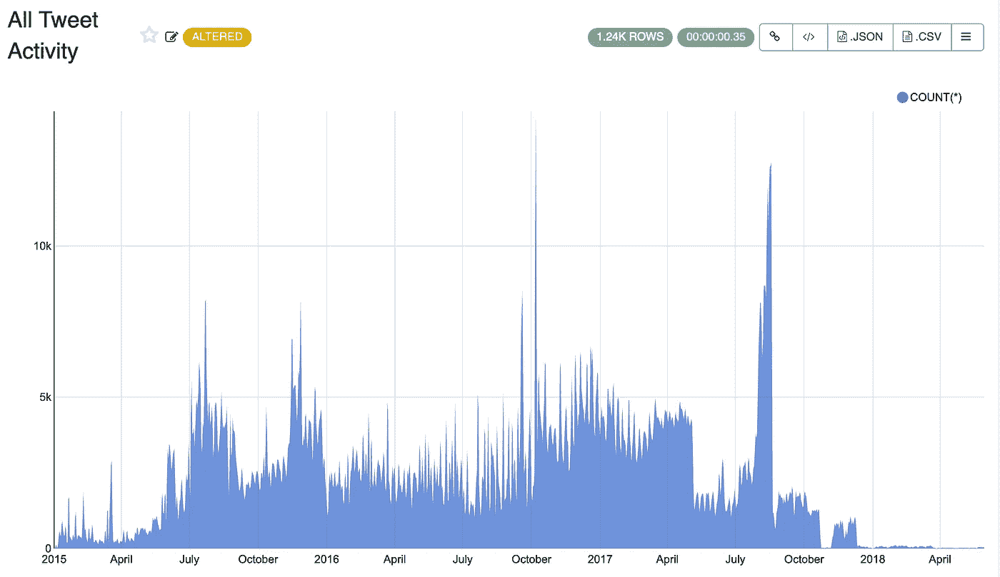

2015 年至 2018 年俄罗斯巨魔推文活动

在验证了我的查询与克莱姆森研究人员的图表匹配之后，我进一步了解了数据集中的其他特征。

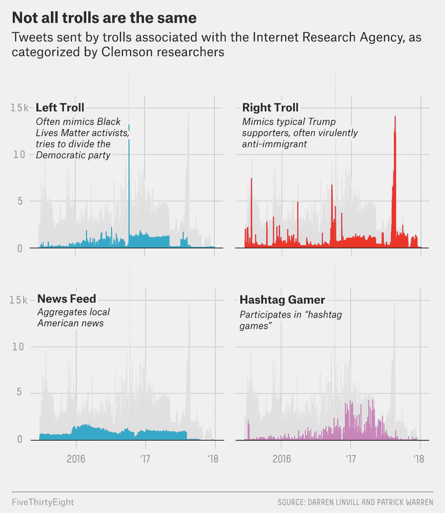

图片由[达伦·林威尔](https://www.clemson.edu/cbshs/faculty-staff/profiles/darrenl)和[帕特里克·沃伦](http://pwarren.people.clemson.edu/) |来自 [FiveThirtyEight](https://fivethirtyeight.com/features/why-were-sharing-3-million-russian-troll-tweets/)

上图显示了克莱姆森研究人员为分类虚假爱尔兰共和军账户的意图和行为所做的大量工作。对我来说，这种数据观点打破了选举干预的假设。Twitter 是一个复杂的行动和反应的动态系统，它发生得如此之快，以至于很难让这个系统达到任何预期的结果。

我决定开发一个图表，更容易地讲述数据集中不同类型 Twitter 账户的行为。

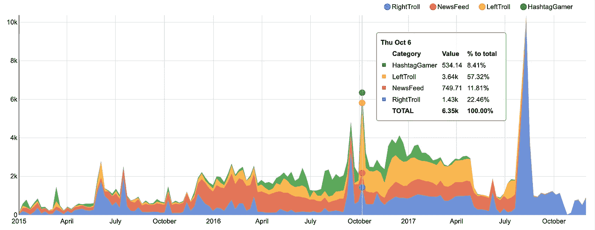

按标签账户类别分类的俄罗斯 Troll Twitter 活动

我想出的图表平滑了“五个三十八”可视化中显示的活动。这里我们看到，2015 年以来有尖峰活动，可能与选举干预无关。我需要看到的是每一个尖峰的叙述。我认为，看看主流新闻媒体中的特定话题或主题是否解释了这些飙升，可能会有所帮助。

俄罗斯巨魔与福克斯新闻频道有关的推特活动

上面的图表显示了与福克斯新闻频道相关的所有提及。这个查询显示了一些有趣的峰值活动，所以我决定查看 2015 年 6 月 10 日福克斯新闻频道的头条。

[https://web . archive . org/web/20150610010931/http://www . fox news . com/](https://web.archive.org/web/20150610010931/http://www.foxnews.com/)

这个结果让我震惊的是，它与 2020 年 5 月乔治·弗洛伊德(George Floyd)悲惨去世后的叙述惊人地相似。为了了解这个关于 Twitter 数据集的特别标题是否有什么意义，我决定将福克斯新闻频道与其他新闻媒体进行比较。

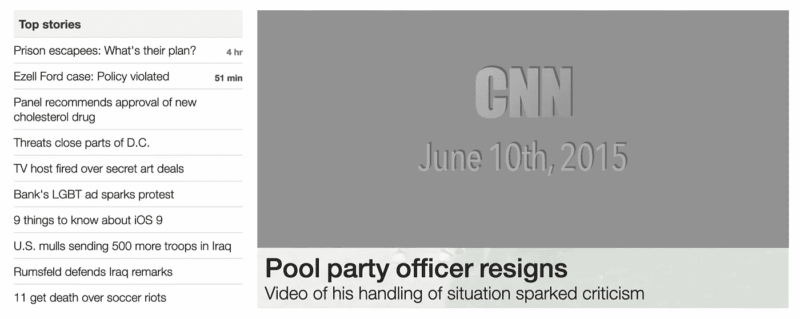

[https://web . archive . org/web/20150610080013/http://www . CNN . com/](https://web.archive.org/web/20150610080013/http://www.cnn.com/)

上面是 CNN 网站截图，几个小时前福克斯新闻频道报道了他们的标题。这两个网站在新闻报道上的最大区别是，福克斯新闻频道在爱尔兰共和军的推文中使用了叙述性术语，而 CNN 没有。虽然这只是一个数据点，但我需要了解叙事是否推动了新闻周期，反之亦然。哪个先出现，新闻报道是如何随着时间的推移而变化的？

下面的图表显示了警察和种族不公正作为一个叙事开始的起源事件。我用来过滤结果的查询是基于相关性的搜索，使用的是福克斯新闻频道网站 6 月 10 日头条中的关键词。Apache Pinot 有一个基于 Apache Lucene 的全文索引实现，它允许我返回与我的查询相关的结果。

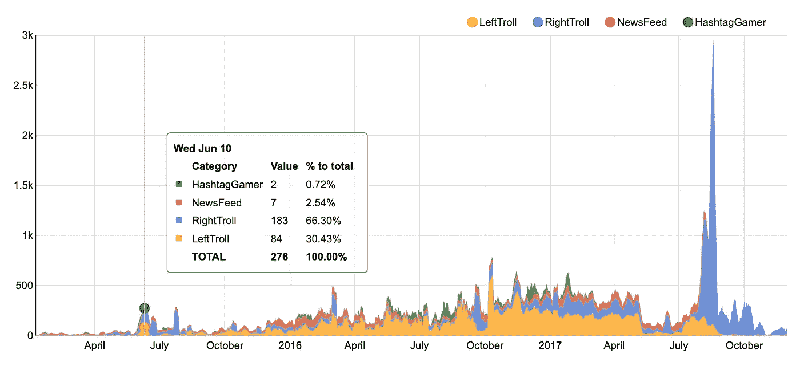

使用 FoxNews.com 标题的基于文本的搜索:“一个德克萨斯白人警察拍摄了摔跤…

在这里，我们看到了 2015 年 6 月 10 日围绕种族不公正和警察的叙事有一个明确的起源事件。故事从右翼巨魔控制的尖峰活动开始。在这些蓝色的尖峰之间，我们有左侧巨魔的持续活动。最后的尖峰，再次被右巨魔所控制。

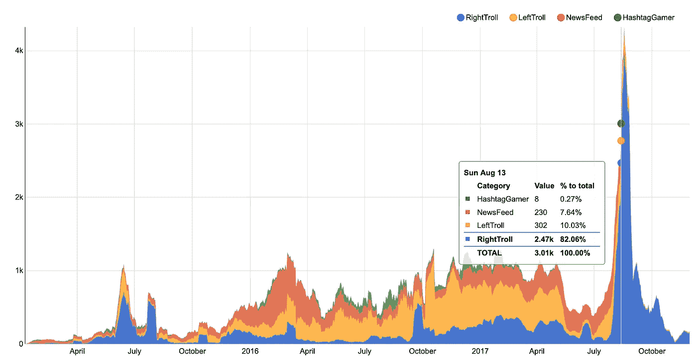

与白人至上和警察有关的 Twitter 巨魔活动

在对数据进行平滑处理后，我能够看到图表中最大的峰值是 2017 年 8 月的整个月。我使用 Wayback 机器检查了那个月的新闻标题，并将这些叙述与 2015 年 6 月的正确巨魔叙述进行了比较。

[https://web . archive . org/web/20170813011501/http://www . fox news . com/](https://web.archive.org/web/20170813011501/http://www.foxnews.com/)

新闻媒体的叙述现在与两年前的意识形态内容完全一致。一贯的主题？恐怖、恐惧、愤怒和愤慨。

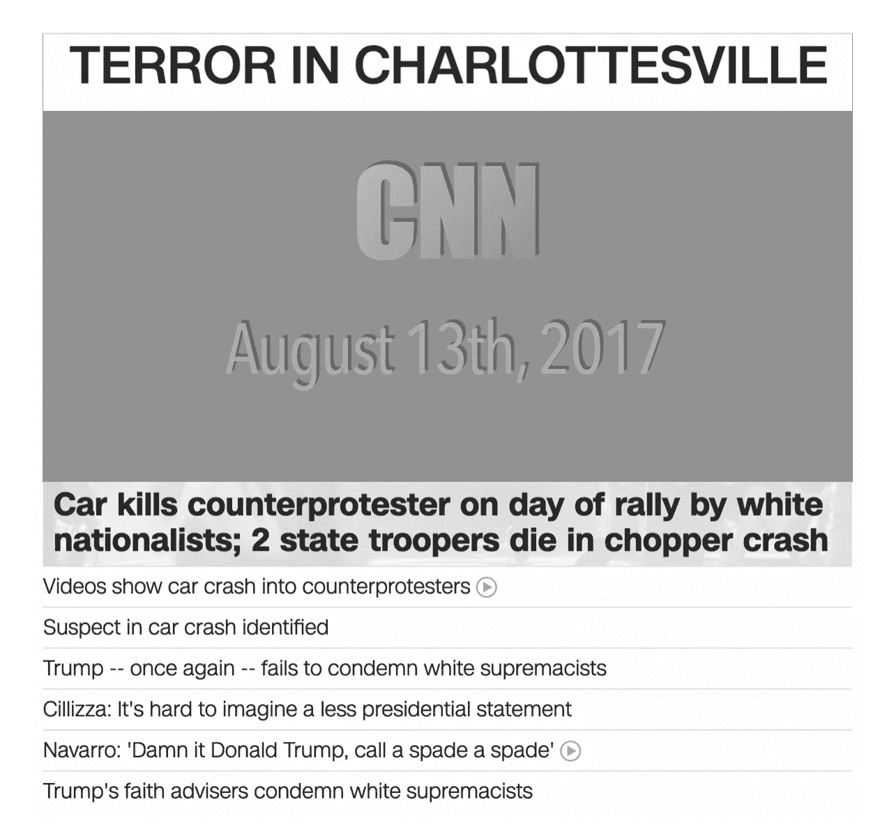

[https://web . archive . org/web/20170813011501/http://www . CNN . com/](https://web.archive.org/web/20170813011501/http://www.cnn.com/)

在这一点上，我的收获是，爱尔兰共和军数据集中的有毒意识形态和短语在最近的新闻媒体标题中变得普遍。为了理解意识形态和叙事是如何演变的，我决定使用来自开源的命名实体识别来丰富原始数据集[斯坦福 CoreNLP 库](https://stanfordnlp.github.io/CoreNLP/)。

# 命名实体识别

要进一步理解爱尔兰共和军推文的语义内容和叙述，需要基于时间序列的自然语言处理。理想情况下，我想避免将时间序列图表的内容与单个 tweet 相关联，而是与所有 tweet 中包含的文本实体相关联。

Stanford NLP 项目提供了一个基于 JDK 的库，用于执行[命名实体识别(NER)](https://nlp.stanford.edu/software/CRF-NER.html) 。我过去在 tweets 上使用过这个库，它运行得相当好。

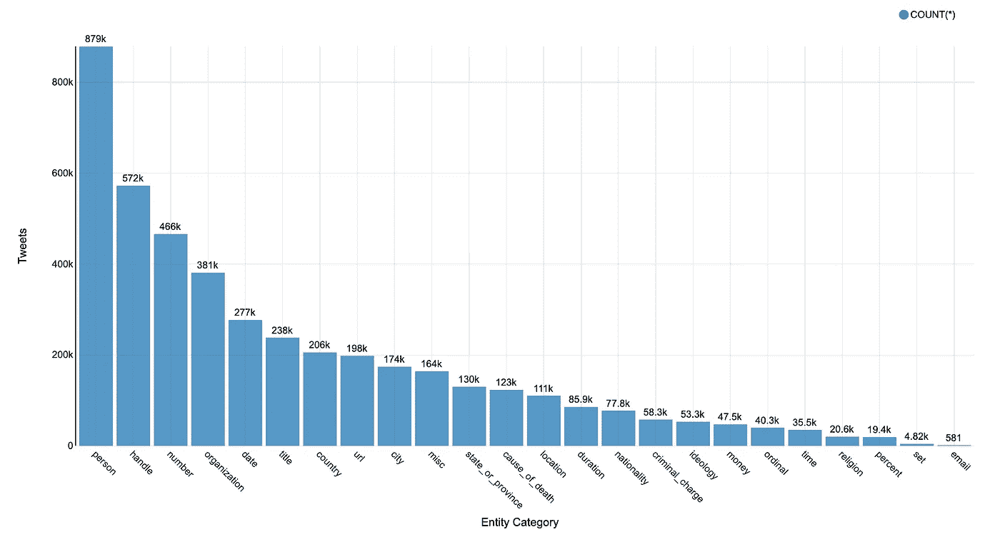

上面的图表显示了包含特定类别的命名实体的推文数量。

下一个图表显示了属于每个类别的不同实体名称的数量。对于这个图表，我已经过滤掉了`handle`和`url`，它们与理解假账背后的不同叙述无关。

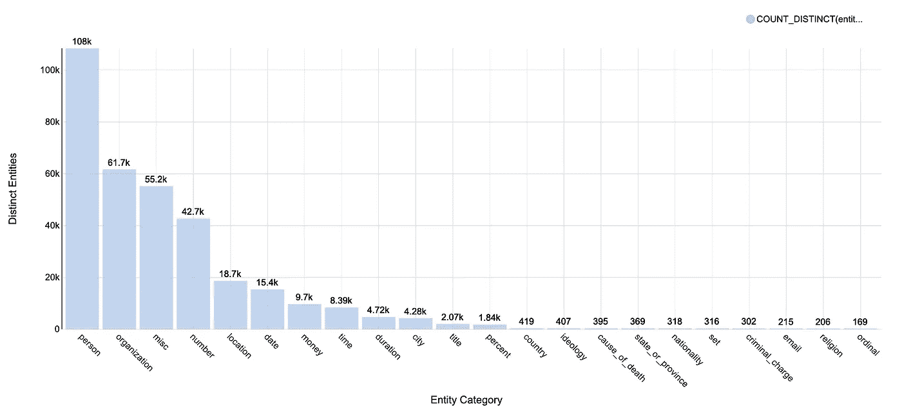

既然我们已经对实体和类别的分布有了相当好的理解，我们可以开始看看每个类别包含什么。具体来说，我们想看看对不同虚假账户的叙述进行分类的命名实体。

# 人

该图表包含了个人实体的虚假账户类别的推文数量。

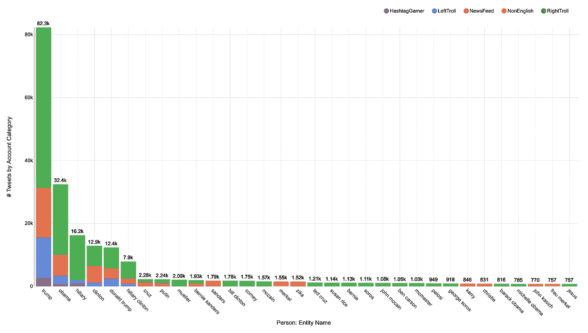

# 组织

该图表包含了组织实体的虚假账户类别的推文数量。

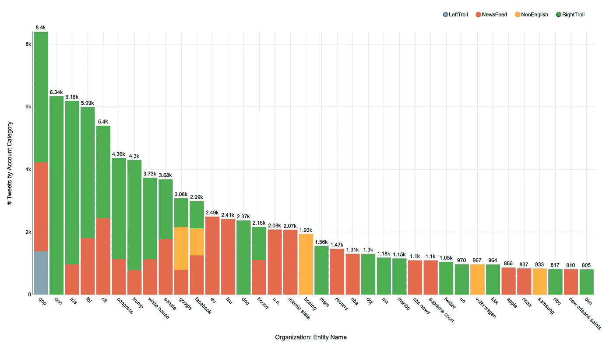

# 刑事指控

这张图表包含了因刑事指控而被分类的虚假账户的推文数量。

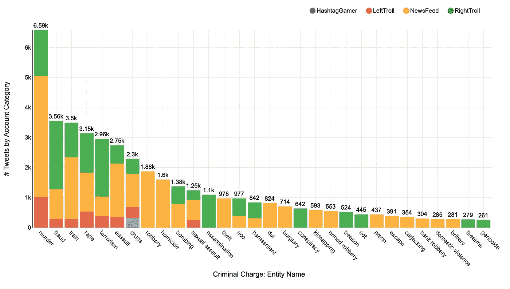

# 死亡原因

这张图表包含了死亡原因的虚假账户类别的推文数量。

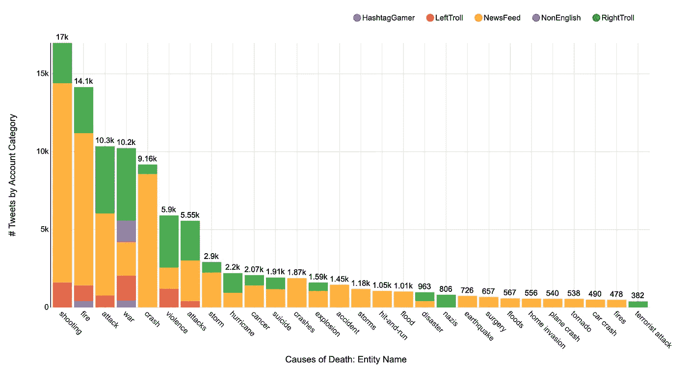

# 多方面的

这个图表包含了各种实体的虚假账户的推文数量。

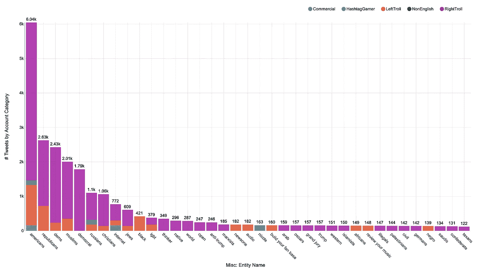

# 标题

该图表包含了代表不同头衔的实体的虚假账户类别的推文数量。

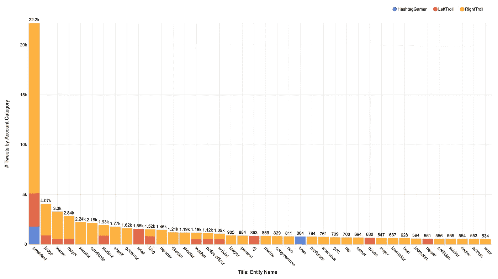

# 意识形态

这张图表包含了意识形态类虚假账户的推文数量。

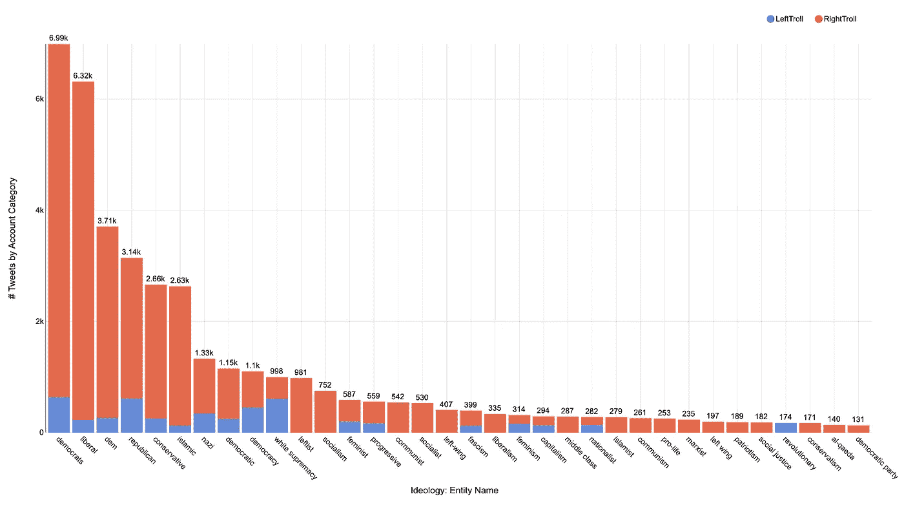

# 意识形态时间序列

这个图表是一个时间序列，显示了推文中提到的意识形态的平滑分布。

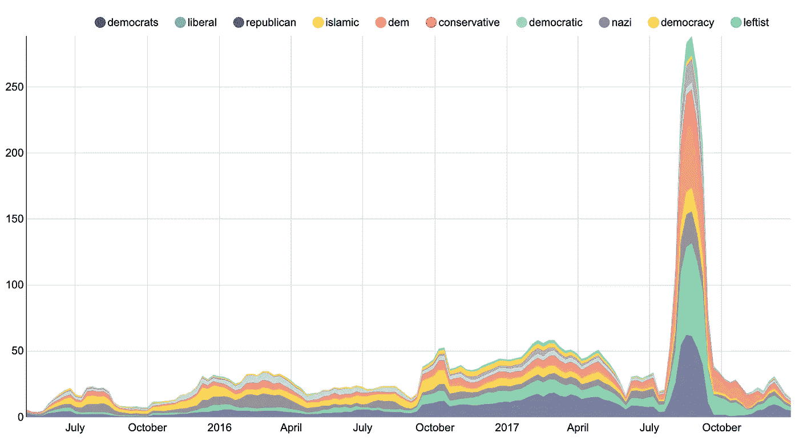

# 右翼巨魔意识形态

下一张图表显示了正确的巨魔账户所使用的意识形态。

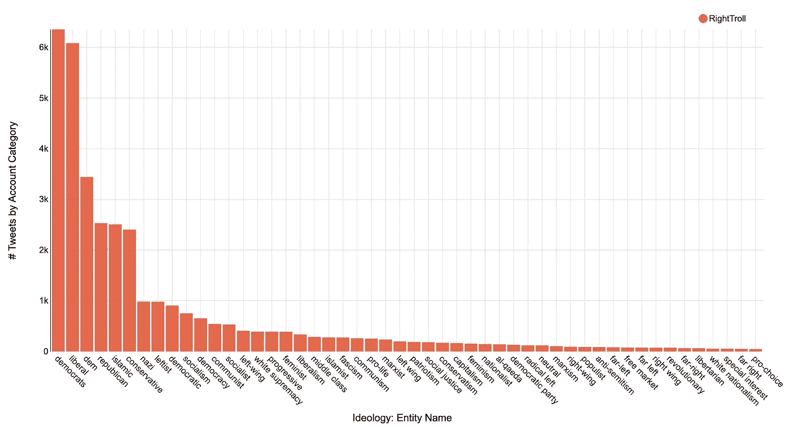

# 左翼巨魔意识形态

这张图表显示了左巨魔账户的意识形态。

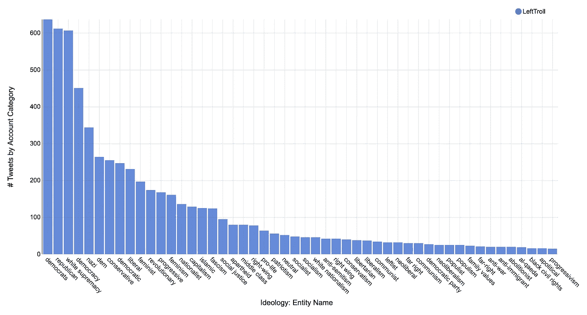

# 得出结论

爱尔兰共和军有没有可能成功干涉了美国的选举？要回答这个问题，我觉得有必要了解一下*选举干预*是什么意思。

## 什么是选举干预？

*选举干预*是一个模糊的政治术语，政客使用时几乎没有法律效力。[然而，外国恶意影响](https://www.law.cornell.edu/uscode/text/50/3059)是一个描述民族国家资助的用来影响选民舆论的活动的术语。当外国试图影响公众舆论，以及选举的选民时，这是一个国家安全问题。

现在， ***国内选举干涉*** 呢？

*国内选举干预*是一个完全虚构的术语，大致翻译为“*为政治候选人竞选*”只要政客们遵守竞选财务法，不参与任何形式的选举舞弊，他们就可以自由地干预选举，而无需承担国内的法律责任。我能找到的唯一例外是社交媒体上的政治言论对国家安全或公共安全构成威胁。

**爱尔兰共和军在推特上的活动是否干预了美国选举？**

当然，但不是因为大多数人认为的原因。在广泛分析这些推文后，我很清楚选举干预不是重点。相反，这三百万条推文的目的是放大恐怖、愤怒、恐惧，并在公共广场上制造不和。这些推文造成的损害是任何人都无法断定他们的最终目标是什么。仅仅通读这些推文就会向读者反映他们在练习前持有的任何偏见或结论。

社交媒体真正的危险是混乱的迷雾，让人相信没有人说真话。事实上，我认为可能没有简单的真相，或者对于那些知道真相的人来说，没有简单的解释。

政党成员之间确实存在美德信号，但这并不新鲜。Twitter 可能会放大这种效应，一些政治家可能会发现自己通过发出个人叙事信号而具有不成比例的影响力。政治家们应该明白，在激烈的政治竞选中，发出分裂的美德信号是有代价的。

Twitter 对信任其订阅源的用户有着过多的控制。毕竟，我们是群居动物。Twitter 给了我们空间，让我们更好地理解如何认同我们的群体，比如迷因和美德信号。美德信号往往会获得更多的喜欢、转发和追随者。

一个群体的行为会以这样或那样的方式影响每个人，在 Twitter 上，没有人能免受恶意影响。美德信号是保持群体内部界限的关键，这一观点似乎滋生了不良影响。通过引入在意识形态上与 Twitter 用户的内部群体对立的虚假外部群体，该群体的影响者屈服于更极端形式的美德，向他们的追随者发出信号。这是我认为 2015 年多米诺骨牌开始倒下的地方。

# 解决问题

那么，我们如何通过美德信号阻止恶意影响者传播有毒或极端的意识形态叙事呢？我认为如果不对数字美德信号背后的心理学进行更多的研究，我们就做不到。恶意的影响者只需要找到一种方法进入群体中善意成员的饲料中。转发和点赞都容易受到这种影响，只需要一个你信任的人就能在整个群体中传播恶意影响。

至于解决办法？

我认为在 Twitter 上解决这个问题需要减少转发量的放大，重新思考推荐算法。话题应该集中在美德信号的非政治来源，而不是建立在恐惧、愤怒或愤慨上的。这不是一个容易解决的问题，我希望随着 Twitter 的发展，看到更多的数据和研究。

## 最后的想法

我希望这篇文章有趣，对读者有帮助。如果您有任何反馈、意见、更正或建议，请随时在这里或通过 [Twitter](https://www.twitter.com/kennybastani) 联系我。我鼓励那些足够勇敢的人去探索我整理的开源项目，它将允许你复制我的发现，并对数据进行你自己的分析。

这对我来说是一个充满激情的话题，我希望对你也是如此。我不遗余力地让设置您自己的分析环境变得尽可能容易。

为了启动并运行我在这篇博文中讨论的示例项目，请访问我的开源存储库，获取引导程序配方。

https://github.com/kbastani/russian-troll-analysis

## 特别感谢

特别感谢 [Apache Pinot](https://pinot.apache.org) 社区的人们对本文的反馈。此外，感谢 [Darren Linvill](https://www.clemson.edu/cbshs/faculty-staff/profiles/darrenl) 和 [Patrick Warren、](http://pwarren.people.clemson.edu/)以及其他致力于让决策者了解外国对社交媒体的恶意影响的人。