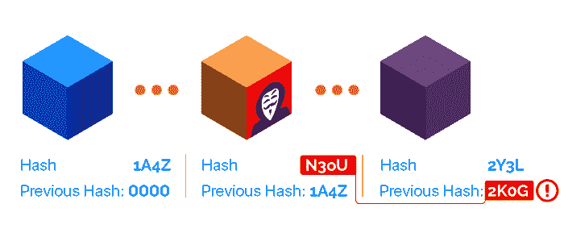
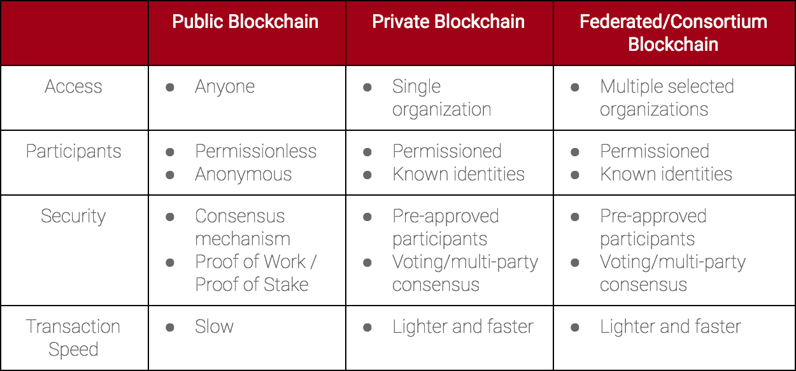

# 深入探究区块链

> 原文：<https://towardsdatascience.com/a-deep-dive-into-blockchain-d1eb753fb74c?source=collection_archive---------16----------------------->

## 你需要知道的关于这项成长中的技术的一切

# 你信任我吗？😈

我们整个社会都建立在信任之上。你相信你的老板会付你钱。你相信政府会保证你的安全。你相信你的银行不会偷你的钱然后逃跑。**我们盲目地信任如此多的机构和人，却毫不犹豫。**

但是如果发生了什么呢？你的老板不给你发工资。政府垮台了。你的银行把你所有的钱投入股市，股市崩盘，导致你失去所有的积蓄(咳咳…2008 年股市崩盘)。这些可怕的事情似乎不可能发生。但事实是，信任是支撑这些系统的唯一东西。信任让你变得脆弱，易受伤害，但你依赖这些系统。你必须信任政府、银行和机构，因为别无选择。嗯，在**区块链出现之前，一直没有替代方案，区块链旨在创建一个不依赖信任的系统。**所以你不必相信你的银行会卷走你的钱。你不必相信你的政府会垮台。

你可能会问自己，‘区块链似乎很神奇！它是如何工作的？这真的很神奇，但是**要深入了解区块链是如何运作的，以及如何被用来扰乱当前的系统，你首先必须了解当前的机构是如何运作的。**

# **集权的问题🌐**

假设你想给你在世界另一端的朋友寄钱。你不会给他们寄支票或现金。那会花太长时间。相反，你可以通过 Paypal 或银行的电子转账系统汇款。快速且易于访问…对吗？不对。您的银行需要确认从该账户中流出的钱是您的，并且您授权了支付。然后，他们需要确认你把钱汇给了一个可靠的来源，这可能需要你事先授权。但是在你知道之前，你的朋友刚刚收到了 100 美元，而你支付了额外的 10 美元手续费。

银行或机构促进转账的想法就是集中化的想法。所有的东西都经过它们，然后从两边出来。他们看到了一切，没有人可以访问你的文件。在很大程度上，这个系统是有效的，我们作为一个社会非常依赖它。但是，有几个问题出现了。

漏洞——由于所有东西都隐藏在一个“安全”的数据库中，这使得每个人的信息都很容易受到攻击。只需一次数据库泄露，你所有的信用卡信息就会被泄露。我们一次又一次地看到大公司突然遭到黑客攻击。这发生在易贝、Adobe、Canva 和其他著名的大公司身上。

费用和财务激励——和其他公司一样，促进转账的机构也想赚钱。他们通常通过在服务中增加手续费来做到这一点。你没有真正的选择，因为你可能会依赖这些机构。

权力不稳定——如果只有少数公司促进我们社会需要的所有转移，那么**就给了那些公司很大的权力。**他们可以改变系统，产生难以形容的影响。现在你的银行改变系统的可能性非常小。事实上，他们有能力做到这一点，这是非常可怕的。他们可以利用自己的地位，这一点以前已经做到了。

实施缓慢——如果公司服务的某一部分对一部分人产生了负面影响，那么解决这个问题最多需要几个月的时间**。**这是因为大公司内部漫长的官僚程序。重大的改变需要很长的时间，这真的伤害了那些需要立即改变的人。

所有，我是说所有这些问题都是用区块链的想法解决的。你可能已经猜到了，区块链运行在中央集权制度的对立面。区块链是分散的，拥有许多对人们非常有利的属性。区块链是这样工作的。

# **区块链的基础:转移的新观点💻**

区块链是一个分散的点对点传输系统。没有人控制区块链，但它无限期地运行着。一件事怎么去中心化？这意味着每个人都帮助运行区块链。技术上来说，你创造了区块链。区块链运行在一个单一的概念上，在一个区块中，这些区块被链接在一起，因此区块链。

## *块+链:*

块在其中存储一条信息或数据。这些可能是交易、信息或任何东西。该块与散列相关联，散列是由特殊加密函数创建的唯一字符串。每个散列都是唯一的，有点像块的 id。每个块还包含前一个块的散列，这就是被链接在一起的想法的来源。每个块引用最后一个散列，依此类推。

## *如何创建块:*

在将块添加到当前区块链之前，需要对其进行验证。交易需要被核实，以确保一切都检查出来。通常的做法是通过工作证明。人们需要通过解决一个非常难的数学问题来验证该块是合法的，通常是用计算机来完成。但是谁会愿意放弃他们宝贵的计算机能力去创造一个新的街区呢？这种激励通常是区块链会用少量的钱奖励验证该块的用户。这就是比特币和以太坊的工作方式，验证这些区块的人被称为矿工。他们被称为矿工，因为他们通过他们的计算机能力挖掘这些钱。大多数人第一次听说区块链和这个概念是通过采矿的概念，但这可能会产生误导。我将在文章的后面更多地讨论挖掘。

## *公共总账:*

任何人都可以访问区块链，任何人都可以查看任何特定的街区。这种透明性使得区块链与正常的中央集权体制如此不同。在集中式系统中，只有公司或机构有权访问分类账。通过公开账本，每个人都可以监控链条的健康状况，看看是否有人试图做什么见不得人的事。

## *哈希依赖:*

理解散列依赖于块的内容是很重要的。内容的微小变化都会极大地改变散列。由于这种依赖性以及每个人都有权查看区块链的事实，这使得系统不可攻击。这是因为如果有人为了自己的利益改变块的内容，它将改变散列，并且它前面的块将不会匹配相同的散列。这样，区块链可以很容易地识别变化。

## *块可以容纳什么数据？*

这个想法是任何东西都可以嵌入到这些块中。最大的例子是货币转移，其中一个块保存显示用户之间货币转移的信息。但更酷的应用包括不动产证明、某些物品的证明，甚至是药品。

## *通过协议自行运行:*

一旦区块链启动，它将永远自行运行。它不需要任何人看管。如果有足够多的矿工和事务，它将继续工作。这是因为它由一个协议运行，本质上存在于每个人的计算机上。除非互联网本身消亡，否则区块链也会消亡。

这些是每个区块链的基本属性。但是随着技术的发展，新的属性将会出现…

# **✔️区块链的额外(但有用)特性**

如果区块链的最低要求都能满足，那么任何额外的东西都可以添加进去。许多区块链大公司创造了很酷的功能，让更多的人使用他们的区块链。区块链的一些值得注意的额外属性包括:

## *智能合约:*

智能合约可能是区块链最受欢迎的功能之一，它允许人们之间进行几乎任何交易。它本质上就像一个真实的合同，但由协议强制执行，一旦创建，就不可逆转。它概述了协议验证和促进双方贸易的要求。例如，如果我想创建一个智能合同，为我向雇主提供的每一小时的工作支付报酬，我的雇主和我可以创建一个智能合同，并使用传感器来跟踪我的工作时间。我每做一个小时，协议就会自动从他的账户里取出 X 美元，放到我的账户里。智能合约可以做很多事情，这也是它们如此酷的原因。

## *分叉:*

区块链并不完全安全。有时候，黑客会在区块链上获取你的账户信息，然后偷走你所有的东西。这种情况时有发生，但通常是账户所有人的错。通常只是很小的一笔钱，但如果黑客窃取了数百万美元，那就太可怕了。谢天谢地，有办法找回钱。分叉区块链意味着返回到某个时间点的某个块，并从该块重新开始所有操作。就像什么都没发生过一样。但是分叉只有在区块链上 51%(或者大多数)的用户想要分叉的时候才会发生。这使得区块链的权力掌握在集体手中，使其成为一个更加民主化的体系。

## *物价稳定:*

一些有货币的区块链正在试验价格稳定系统，这实质上意味着他们的硬币的价值是不变的。公司通过创建一个协议来匹配流通中的硬币数量，并将其保存在一个私人银行账户中。任何时候硬币增值，他们可以立即添加更多的硬币，反之亦然。美元硬币是以美元为基础的，通常价值为 1 美元。这使得加密货币更加可靠和易于使用。

## 不同程度的权力下放:

许多公司正在创建区块链，它们的分权程度较低，而集权程度更高。例如，他们可能拥有除公共分类账之外的所有基本区块链属性，使其更像一个中央系统。有时，一个更加集权的区块链可能会更好，这取决于区块链的用途。

## *区块链的类型:*

有三种类型的区块链，都有其独特的优势和劣势。3 种类型的区块链是:公共，私人和财团。他们都以不同的方式工作，但或多或少仍然是分散的。

还有很多，但这些是最著名的一些。

# **区块链的应用**📝

区块链的应用是无穷无尽的。它几乎可以用于任何事情。以下是我想到的一些最酷的区块链应用。

## *加密货币*

我不能写一篇关于区块链的文章而不提到加密货币。第一个区块链是基于一种加密货币，也是其中最著名的区块链，比特币。加密货币是一种可以通过点对点区块链交易的货币。它使用了区块链的所有基本原理，理论上是最容易创建的区块链。有超过数千种加密货币。

## *太阳能币*

SolarCoin 是一种能源交易区块链与货币。人们可以根据商定的价格，用他们拥有的能量换取别人的太阳能硬币。它使用智能合约来促进贸易。

## *物品确认*

所有权证明也是区块链被使用的另一种令人兴奋的方式。人们可以拥有验证某个项目的 id。它可以代表一件珠宝，甚至是一所房子的契约。这些 id 可以在人与人之间交易，随后是物品本身。

## *Wifi 共享*

像 HotSpot 和 Helium 这样的公司正在创建区块链，在那里人们可以通过付费来共享 wifi。费率通常较低，并且在适用时使用智能合同。

# **区块链的挑战(及解决方案)**

即使区块链技术可以用于一些非常酷的应用，仍然有各种各样的事情阻止区块链成为最佳选择。

## *速度*

在促进用户之间的交易方面，区块链的速度是出了名的慢。比特币转账的平均时间为每笔交易 10 分钟左右。考虑到中央银行做同样的事情所花费的时间，这个速度慢得令人难以置信。

这个问题的解决方案是在用户之间创建一个照明网络。如果两个用户一致认为他们都是可信任的，他们可以在他们之间创建一个直接的链接，而不需要区块链来验证。比特币已经开始实现类似这样的东西了。

## *内存问题*

存储有关交易的所有信息会占用大量数据和空间。如果每个人都需要区块链的副本，那么使用该协议就不可行。

解决方案是在 X 年后自动删除链条中最老的部分。这样，链条就可以一直有一个固定的长度，并且会无限地运行下去。

## *非法使用*

由于许多区块链是匿名的，许多人使用加密货币和区块链作为转移非法物品资金的一种方式。黑暗网络专门使用区块链进行交易

解决这个问题的方法是创建不匿名的区块链。这些将被视为私人链，并会导致更大的透明度。

## 电力使用效率低下

当每个人在挖掘时都试图解决一个加密哈希函数时，有时多个用户会试图解决同一个函数，导致电力的低效使用。

这个问题的解决方案是为挖掘创建一个新的协议。有人提出了股权证明协议，人们出价硬币(但实际上不会输掉)来开采某个区块。

# 关键要点

*   区块链是一个分散的系统，而大多数机构是集中的
*   区块链由包含数据并链接在一起的块组成
*   哈希函数用于加密数据块
*   区块链可用于在两方或多方之间转移项目
*   区块链面临着许多挑战，但也有新的创新解决方案使这项技术更加可行。