# Hough 变换在车道检测中的应用

> 原文：<https://towardsdatascience.com/a-deep-dive-into-lane-detection-with-hough-transform-8f90fdd1322f?source=collection_archive---------7----------------------->

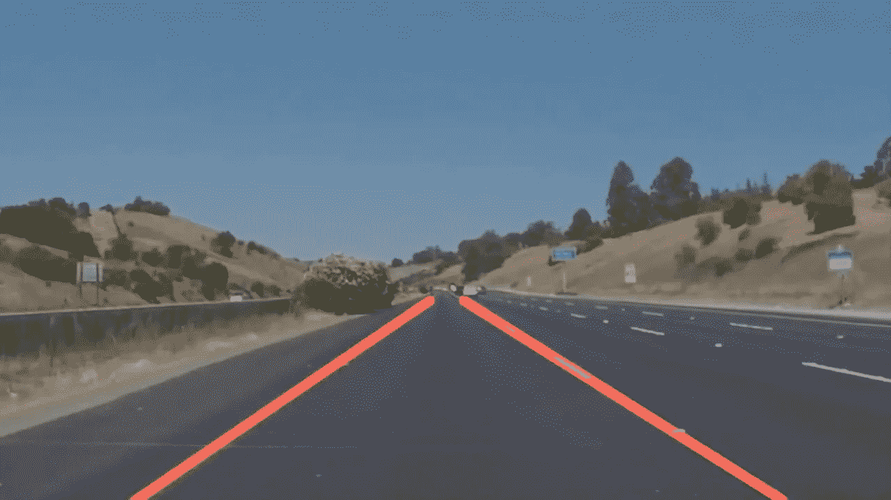

来源([此处](https://i.ytimg.com/vi/EZcHGsPX55Y/maxresdefault.jpg))

## 从零到英雄指南在 OpenCV 中构建车道线检测算法

车道线检测是自动驾驶汽车必不可少的组件之一。有许多方法可以做到这一点。在这里，我们将看看使用**霍夫变换的最简单的方法。**好吧，让我们开始吧！

# 准备

所以在我们开始之前，我们需要一个地方来写我们的代码。我推荐的 IDE(环境)是 Jupyter 笔记本。它有一个漂亮的，简约的界面，但同时又非常强大。此外，Jupyter 笔记本非常适合可视化数据。以下是下载链接:

 [## 安装- Anaconda 文档

### 在安装 Anaconda 个人版之前，请阅读下面列出的系统要求。如果你不想要…

docs.anaconda.com](https://docs.anaconda.com/anaconda/install/) 

现在您已经安装了 Anaconda 并且 Jupyter 正在工作，让我们获取一些数据吧！可以从我的 [Github repo](https://github.com/Nushaine/lane-detection/blob/master/Untitled33.ipynb) 下载算法的**测试图片**、**视频**和**源代码**。现在我们准备好构建算法了。

本文分为三个部分:

*   第 1 部分:高斯模糊+精明的边缘检测
*   第 2 部分:霍夫变换
*   第 3 部分:优化+显示线条

第 1 部分和第 3 部分侧重于编码，第 2 部分更侧重于理论。好吧，让我们开始第一部分。

# 第 1 部分:高斯模糊+ Canny 边缘检测

我们需要做的第一件事是导入所需的库。

```
import numpy as np
import cv2
import matplotlib.pyplot as plt
```

这里我们导入了 3 个库:

*   **第 1 行** : Numpy 用于进行数学计算。我们要用它来创建和操作数组
*   **第二行:** OpenCV 是一个库，用来让任何人都可以做计算机视觉(也称为简化初学者)。
*   **第 3 行:** Matplotlib 用于可视化图像。

接下来，让我们加载一张图片来测试我们的算法

```
image_path = r"D:\users\new owner\Desktop\TKS\Article Lane Detection\udacity\solidWhiteCurve.jpg"
image1 = cv2.imread(image_path)
plt.imshow(image1)
```

这里，我们在**第 4 行**将图像加载到笔记本中，然后我们将在**第 5 行和第 6 行读取图像并将其可视化。**

现在是处理图像的时候了。我们将特别做三件事:

```
def grey(image):
    return cv2.cvtColor(image, cv2.COLOR_RGB2GRAY)def gauss(image):
    return cv2.GaussianBlur(image, (5, 5), 0)def canny(image):
    edges = cv2.Canny(image,50,150)
    return edges
```

在最后一个代码块中，我们定义了 3 个函数:

**灰度图像**:这有助于增加颜色的对比度，更容易识别像素强度的变化。

**高斯滤波器:**高斯滤波器的目的是减少图像中的噪声。我们这样做是因为 Canny 中的梯度对噪声非常敏感，所以我们希望尽可能消除噪声。 *cv2。GaussianBlur* 函数有三个参数:

*   *img* 参数定义了我们将要归一化(减少噪声)的图像。
*   参数 *ksize* 定义了我们将要对图像进行卷积(传递)的内核的尺寸。这种核卷积就是降噪的方式。该函数使用一个名为*高斯内核*的内核，用于标准化图像。
*   *西格玛*参数定义沿 x 轴的标准偏差。标准差衡量图像中像素的分布。我们希望像素分布一致，因此标准偏差为 0。

**Canny** :这是我们检测图像边缘的地方。它的作用是计算图像中某一部分的像素强度变化(亮度变化)。幸运的是，OpenCV 使这变得非常简单。

*cv2。Canny* 函数有 3 个参数，(img，threshold-1，threshold-2)。

*   *img* 参数定义了我们将要检测边缘的图像。
*   *threshold-1* 参数过滤低于该数字的所有渐变(它们不被视为边缘)。
*   *threshold-2* 参数决定了一个边沿的有效值。
*   如果连接到高于*阈值-2* 的另一个梯度，则两个阈值之间的任何梯度都将被考虑。

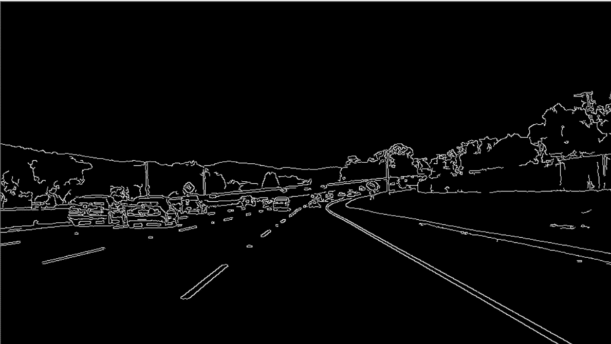

多么精明的形象啊

既然我们已经定义了图像中的所有边缘，我们需要隔离与车道线对应的边缘。这就是我们要做的

```
def region(image):
    height, width = image.shape
    triangle = np.array([
                       [(100, height), (475, 325), (width, height)]
                       ])
    mask = np.zeros_like(image)
    mask = cv2.fillPoly(mask, triangle, 255)
    mask = cv2.bitwise_and(image, mask)
    return mask
```

该功能将隔离图像中车道线所在的特定硬编码区域。它接受一个参数，Canny 图像，并输出隔离区域。

在**第 1 行，**我们将使用 *numpy.shape* 函数提取图像尺寸。在**第 2–4 行，**我们将定义一个三角形的尺寸，这是我们想要隔离的区域。

在**第 5 行和第 6 行，**我们将创建一个黑色平面，然后我们将定义一个白色三角形，其尺寸与我们在第 2 行中定义的尺寸相同。

在**第 7 行**中，我们将执行逐位运算，这允许我们隔离与车道线对应的边。让我们更深入地了解一下操作。

## 对按位 And 运算的深入解释

在我们的图像中，有两个像素的强度:黑色和白色。**黑色像素的值为 0** ，白色像素的值为 255 。在 8 位二进制中，0 转换为 00000000，255 转换为 1111111。对于按位 and 运算，我们将使用像素的二进制值。

现在，奇迹发生了。我们将在 img1 和 img2 上完全相同的位置乘以两个像素(我们将 img1 定义为具有边缘检测的平面，img2 定义为我们创建的遮罩)。

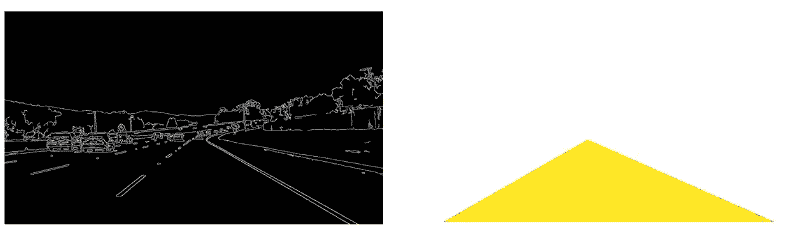

左:Img1。右图:Img2(实际上，它是白色的，但为了给你看，我把它做成黄色的)

例如，img1 上(0，0)处的像素将与 img2 中点(0，0)处的像素相乘(图像上每隔一个位置的每隔一个像素也是如此)。

如果 img1 中的(0，0)像素是白色的(意味着它是一条边)，而 img2 中的(0，0)像素是黑色的(意味着该点不是我们的车道线所在的隔离部分的一部分)，则操作看起来像 11111111* 0000000，这等于 000000(一个黑色像素)。

我们将对图像上的每个像素重复这一操作，从而只输出蒙版中的边缘。

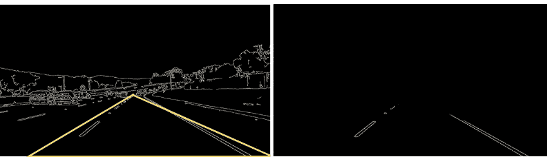

仅输出隔离区域中的边缘。其他的都被忽略了

现在我们已经定义了我们想要的边，让我们定义将这些边变成线的函数。

```
lines = cv2.HoughLinesP(isolated, rho=2, theta=np.pi/180, threshold=100, np.array([]), minLineLength=40, maxLineGap=5)
```

所以这一行发生了很多事情。这一行代码是整个算法的核心。它被称为**霍夫变换**，将孤立区域中的白色像素簇转化为实际线条的部分。

*   参数 1 *:* 孤立梯度
*   参数 2 和 3:定义面元大小，2 是ρ的值，np.pi/180 是θ的值
*   参数 4 *:* 每个箱被认为是一条线所需的最小交叉点(在我们的例子中，是 100 个交叉点)
*   参数 5:占位符数组
*   参数 6:最小线路长度
*   参数 7:最大线间隙

现在**如果这些看起来像是胡言乱语**，下一部分将深入算法背后的具体细节。所以你可以在读完第二部分后回到这一部分，希望这样会更有意义。

# 第 2 部分:霍夫线变换

快速注意一下，这部分只是理论。如果您想跳过这一部分，可以继续阅读第 3 部分，但是我鼓励您通读一遍。霍夫变换下的数学真的很壮观。不管怎样，这就是了！

我们来谈谈霍夫变换。在笛卡尔平面(x 和 y 轴)中，直线由公式 *y=mx+b，*定义，其中 *x* 和 *y* 对应于该直线上的一个**特定点**，而 *m* 和 *b* 对应于斜率和 y 截距。

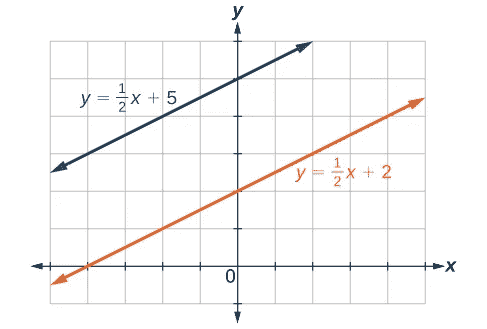

笛卡尔坐标空间中的直线([来源](https://s3-us-west-2.amazonaws.com/courses-images-archive-read-only/wp-content/uploads/sites/924/2015/09/25200328/CNX_CAT_Figure_02_02_007.jpg)

在笛卡尔平面中绘制的常规直线有两个参数( *m* 和 *b* ，意味着直线由这些值定义**。**此外，需要注意的是，笛卡尔平面中的线是作为它们的 *x* 和 *y* 值的函数绘制的，这意味着我们显示的线是关于有多少(x，y)对组成这条特定的线(有无限数量的 *x，y* 对组成任何线，因此线延伸到无穷大)。

然而，可以将线绘制成 m 和 b 值的函数。这是在一个叫做**霍夫空间**的平面上完成的。为了理解霍夫变换算法，我们需要理解霍夫空间是如何工作的。

## 霍夫空间的解释

在我们的用例中，我们可以将霍夫空间总结为两行

*   笛卡尔平面上的点变成霍夫空间中的线
*   笛卡尔平面中的线变成霍夫空间中的点

但是，为什么呢？

想想线的概念。一条线基本上是一组无限长的点，一个接一个地有序排列。由于在笛卡尔平面上，我们绘制了作为 *x* 和 *y* 的函数的线，线显示为无限长，因为有无限数量的(x，y)对组成这条线。

现在，在霍夫空间中，我们绘制直线作为它们的 *m* 和 *b* 值的函数。并且由于每条线在每条笛卡尔线中只有一个 *m* 和 *b* 值，所以这条线将被表示为一个点。

**例如**方程 y=2x+1 表示笛卡尔平面上的一条直线。它的 *m* 和 *b* 值分别为‘2’和‘1’，这是这个方程唯一可能的 *m* 和 *b* 值。另一方面，这个等式可能有许多值用于使这个等式实现的 *x* 和 *y* (左侧=右侧)。

所以如果我要用它的 *m* 和 *b* 值来画这个方程，我只会用点(2，1)。如果我用它的 *x* 和 *y* 值来画这个方程，我将有无限多的选项，因为有无限多的(x，y)对。

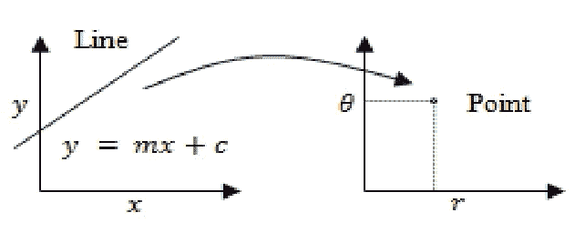

把 **θ** 想成 b，把 r 想成 m，我会在文章的后面解释 **θ** 和 r 的相关性([来源](https://www.researchgate.net/profile/Prabal_Patra/publication/335738299/figure/fig1/AS:801797773996033@1568174894886/A-line-in-cartesian-plane-is-represented-as-a-point-in-Hough-Space-or-space.png))。

那么，为什么霍夫空间中的线被表示为笛卡尔平面中的点呢(如果你从前面的解释中很好地理解了这个理论，我挑战你在不阅读解释的情况下找出这个问题。).

现在让我们考虑笛卡尔平面上的一个点。笛卡尔平面上的点只有**一个**可能的(x，y)对可以表示它，因此它是一个点并且不是无限长的。

关于一个点同样成立的是，有无限多条可能的线可以通过这个点。换句话说，这个点可以满足的方程(形式为 y=mx + b)有无穷多个(LS=RS)。

目前，在笛卡尔平面中，我们正在绘制这个点相对于它的 *x* 和 *y* 的值。但是在霍夫空间中，我们相对于它的 *m* 和 *b* 值来绘制这个点，由于有无限多条线穿过这个点，霍夫空间中的结果将是一条无限长的线。

**比如**，我们来取点(3，4)。可能通过该点的一些线是:y= -4x+16，y= -8/3x + 12 和 y= -4/3x + 8(有无限多条线，但为了简单起见，我使用 3)。

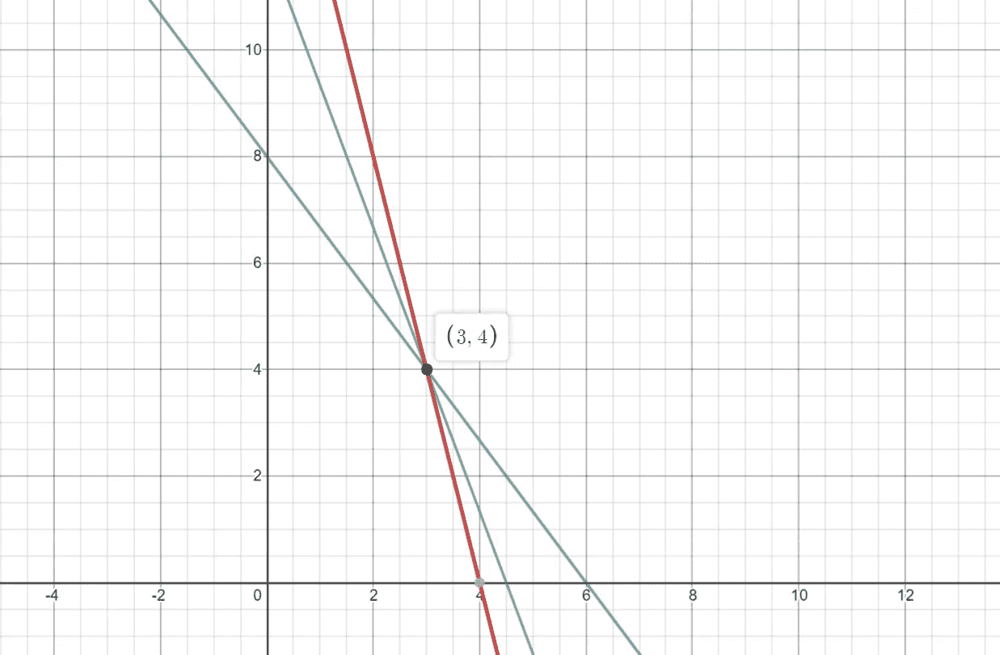

我之前提到的三行。它们都穿过点(3，4)

如果您将在霍夫空间([-4，16]，[-8/3，12]，[-4/3，8])中绘制这些线中的每一条线，那么在笛卡尔空间中表示每一条线的点将在霍夫空间中形成一条线(这是与点(3，4)相对应的线)。

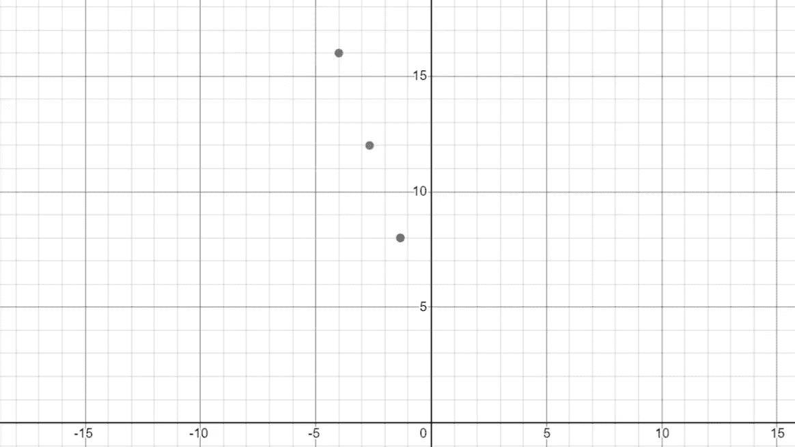

每个点代表之前显示的线条(匹配颜色)。注意这些点是如何形成一条线的。

很整洁，是吧？如果我们在笛卡尔平面上再放一个点呢？这在霍夫空间中会是什么结果呢？嗯，通过使用霍夫空间，我们实际上可以找到笛卡尔平面上这两点的最佳拟合线。

我们可以通过在霍夫空间中绘制与笛卡尔空间中的 2 个点相对应的线，并找到这 2 条线在霍夫空间中相交的点(也称为它们的 POI，交点)来做到这一点。

接下来，获取霍夫空间中两条线相交点的 *m* 和 *b* 坐标，并使用这些 *m* 和 *b* 值在笛卡尔平面中形成一条线。这条线将是最适合我们数据的线。

## 中间解释摘要

总结一下我们一直在谈论的事情，

*   笛卡尔平面中的线被表示为霍夫空间中的点
*   笛卡尔平面中的点被表示为霍夫空间中的线
*   您可以**通过在霍夫空间中找到与两点对应的两条线的 POI 的 *m* 和 *b* 坐标，然后根据这些 *m* 和 *b* 值形成一条线，来找到笛卡尔空间中两点的最佳拟合线**。

## 回到解释:)

虽然这些概念真的很酷，但它们为什么重要呢？还记得我之前提到的 Canny 边缘检测吗，它使用梯度来测量图像中的像素强度并输出边缘。

本质上，渐变只是图像上的点。所以我们能做的是找到每组点的最佳拟合线(图像左边的梯度簇和图像右边的梯度)。这些最适合的线就是我们的车道线。为了更好地理解这是如何工作的，让我们再深入研究一下！

所以我刚才解释了我们如何通过查看与霍夫空间中的点相对应的两条线的 POI 的 *m* 和 *b* 值来找到最佳拟合的线。然而，当我们的数据集增长时，并不总是有一条线完全符合我们的数据。

这就是为什么我们要使用**垃圾桶**来代替。当合并面元时，我们将把霍夫平面分成等间距的部分。每个部分称为一个容器。通过关注某个条块中 POI 的数量，我们可以确定一条与我们的数据具有良好相关性的线。

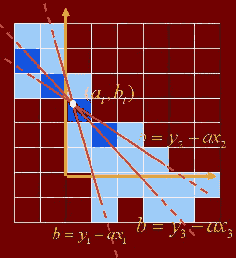

在此图像中，与最暗的蓝色条柱相对应的 m 和 b 值将是最佳拟合线

找到交集最多的容器后，您将使用与该容器对应的 *m* 和 *b* 值，并在笛卡尔空间中形成一条线。这条线将是最适合我们数据的线。

但是**撑得住！**不是这个。我们几乎忽略了一个巨大的错误！

在垂直线中，斜率是无穷大。我们无法在霍夫空间中表示无穷大。这将导致程序崩溃。所以我们不用 **y=mx+b** 来定义一条线的方程，而是用 *P* (rho)和θ (theta)来定义一条线。这也被称为**极坐标系统。**

在极坐标系中，直线用方程 **P=xsinθ + ysinθ表示。在我们深入探讨之前，让我们定义一下这些变量的含义:**

*   *P* 代表从垂直于直线的原点的距离。
*   θ表示从 x 轴正方向到直线的俯角。
*   *xcos* θ表示在 *x* 方向的距离。
*   *ysin* θ表示在 *y* 方向的距离。

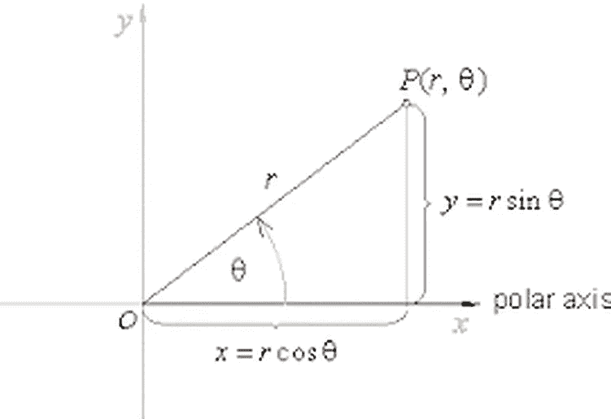

极坐标含义的直观解释

通过使用极坐标系统，不会有任何误差，即使我们有一条垂直线。比如我们取点(6，4)，代入方程 *P=xcos* θ *+ysin* θ。现在，让我们取一条穿过该点的垂直线，x=6，并将其代入直线的极坐标方程，*P = 6 cos(90)*+*4 sin(90)。*

*   对于垂直线来说，θ是 90 度，因为从正 x 轴到线本身的俯角是 90 度。θ的另一种表示方式是π/2(单位为弧度)。如果你想了解更多关于弧度的知识以及我们为什么使用它们，这里的[是一个很好的视频，然而，没有必要知道弧度是什么。](https://www.youtube.com/watch?v=VsN6UuBVmYY)
*   *X* 和 *Y* 取点(6，4)的值，因为这是我们在本例中使用的点。

现在让我们解出这个等式

```
P = 6cos(90) + 4sin(90)
P = 6(1) + 4(0)
P = 6
```

如你所见，我们最终没有出错。事实上，我们甚至不需要做这个计算，因为我们在开始之前就已经知道 P 是什么了。注意 *P* 如何等于 *x* 值。因为线是垂直的，所以唯一垂直于它的线是水平线。因为这条水平线是从原点开始的，这和说从原点在 x 轴上移动的距离是一样的。

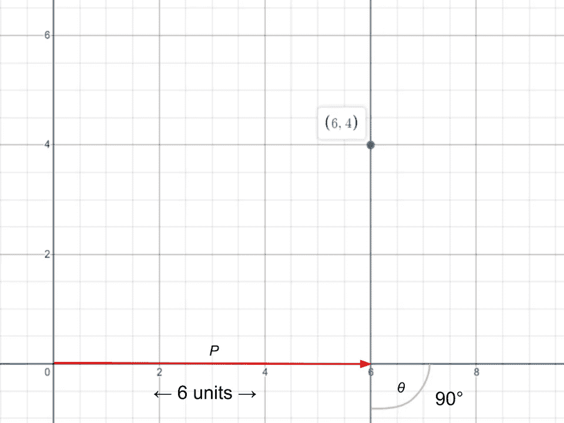

我想要解释的东西的图像。

那么现在这已经解决了，我们准备好继续编码了吗？还没有。还记得以前当我们在笛卡尔平面上绘制点时，我们会在霍夫空间中以线结束吗？当我们使用极坐标时，我们会得到一条曲线，而不是直线。

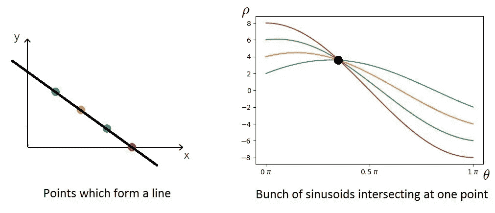

正弦曲线是指曲线的类型，正弦曲线。([来源](https://miro.medium.com/max/2022/0*VPVsLApWiEayRGdQ.jpg))

然而，概念是相同的。我们将找到具有最多交叉点的箱，并使用这些 *m* 和 *b* 值来确定最佳拟合线。

原来如此！我希望你喜欢深入研究霍夫变换背后的数学。现在，让我们回到编码上来！

# 第 3 部分:优化+显示线条

现在，这部分关于平均线的内容是为了优化算法。如果我们不平均线，他们显得非常起伏，因为 *cv2。HoughLinesP* 输出一串小线段，而不是一条大直线。

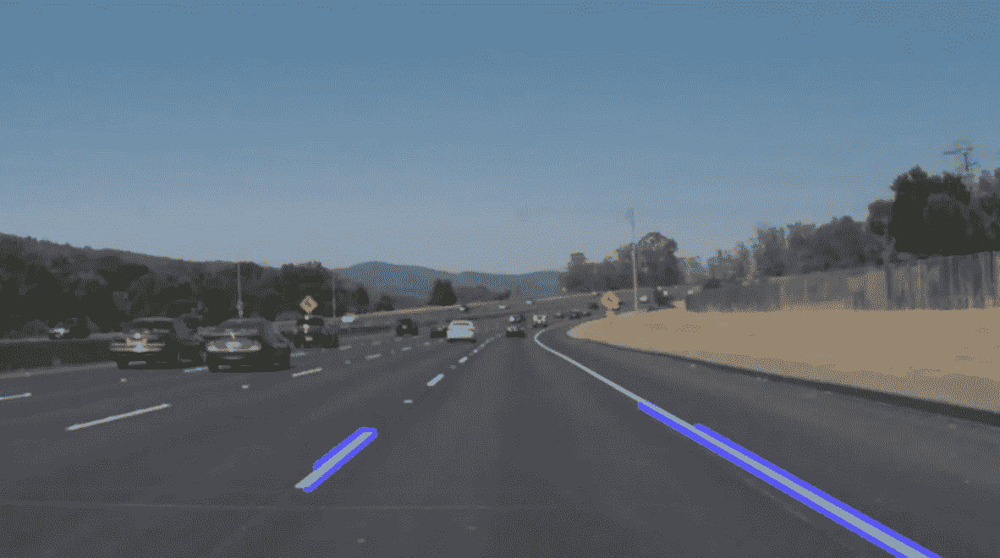

这是没有平均线。很不稳定，是吧。

为了平均这些线，我们将定义一个名为“平均”的函数。

```
def average(image, lines):
    left = []
    right = []
    for line in lines:
        print(line)
        x1, y1, x2, y2 = line.reshape(4)
        parameters = np.polyfit((x1, x2), (y1, y2), 1)
        slope = parameters[0]
        y_int = parameters[1]
        if slope < 0:
            left.append((slope, y_int))
        else:
            right.append((slope, y_int))
```

该功能对 *cv2 中的线进行平均。HoughLinesP* 功能。它将找到左边和右边线段的平均斜率和 y 截距，并输出两条实线(一条在左边，另一条在右边)。

在 *cv2 的输出中。HoughLinesP* 功能，每个线段有 2 个坐标:一个表示线的起点，另一个标记线的终点。使用这些坐标，我们将计算每条线段的斜率和 y 轴截距。

然后，我们将收集所有线段的斜率，并将每个线段分类到对应于左线或右线的列表中(负斜率=左线，正斜率=右线)。

*   第 4 行:循环遍历该行数组
*   第 5 行:从每个线段中提取 2 个点的(x，y)值
*   第 6–9 行:确定每条线段的斜率和 y 截距。
*   第 10–13 行:将负斜率添加到左侧线的列表中，将正斜率添加到右侧线的列表中。

注意:通常，正斜率=左线，负斜率=右线，但是在我们的例子中，图像的 y 轴是反转的，这就是斜率反转的原因(OpenCV 中的所有图像都有反转的 y 轴)。

接下来，我们必须从两个列表中取斜率和 y 截距的平均值。

```
 right_avg = np.average(right, axis=0)
    left_avg = np.average(left, axis=0)
    left_line = make_points(image, left_avg)
    right_line = make_points(image, right_avg)
    return np.array([left_line, right_line])
```

注意:不要将这段代码放在 for 循环中。

*   第 1–2 行:取两个列表(左侧和右侧)中所有线段的平均值。
*   第 3–4 行:计算每条线的起点和终点。(我们将在下一节定义 make_points 函数)
*   第 5 行:输出每行的 2 个坐标

现在我们有了两个列表的平均斜率和 y 轴截距，让我们定义两个列表的起点和终点。

```
def make_points(image, average): 
 slope, y_int = average 
 y1 = image.shape[0]
 y2 = int(y1 * (3/5))
 x1 = int((y1 — y_int) // slope)
 x2 = int((y2 — y_int) // slope)
 return np.array([x1, y1, x2, y2])
```

这个函数有两个参数，一个是车道线的图像，一个是车道线的平均斜率和 y_int 的列表，并输出每条车道线的起点和终点。

*   第 1 行:定义函数
*   第 2 行:获得平均斜率和 y 截距
*   第 3–4 行:定义线条的高度(左右两边都一样)
*   第 5–6 行:通过重新排列一条线的方程，从 *y=mx+b* 到 *x = (y-b) / m* 计算 *x* 坐标
*   第 7 行:输出坐标集

更详细地说，在第 1 行，我们使用 *y1* 值作为图像的高度。这是因为在 OpenCV 中，y 轴是反的，所以 0 在顶部，图像的高度在原点(参考下图)。

同样，在第 2 行，我们将 *y1* 乘以 3/5。这是因为我们希望直线从原点( *y1* )开始，在图像上方 2/5 处结束(因为 y 轴是 2/5，而不是从 0 向上 3/5，我们看到从最大高度向下 2/5)。


应用于左线的 make_points 函数的可视化示例

但是，该函数不显示线条，它只计算显示这些线条所需的点数。接下来，我们要创建一个函数，用这些点组成线条。

```
def display_lines(image, lines):
 lines_image = np.zeros_like(image)
 if lines is not None:
   for line in lines:
     x1, y1, x2, y2 = line
     cv2.line(lines_image, (x1, y1), (x2, y2), (255, 0, 0), 10)
 return lines_image
```

该函数接受两个参数:我们想要显示线条的图像和从*平均值*函数输出的车道线。

*   第 2 行:创建一个涂黑的图像，尺寸与原始图像相同
*   第 3 行:确保包含行点的列表不是空的
*   第 4–5 行:遍历列表，提取两对(x，y)坐标
*   第 6 行:创建线条并粘贴到涂黑的图像上
*   第 7 行:输出带有线条的黑色图像

你可能想知道，为什么我们不把这些线条附加到真实的图像上，而不是黑色的图像上。嗯，原始图像有点太亮了，所以如果我们将它变暗一点，以便更清楚地看到车道线就好了(是的，我知道，这没什么大不了的，但找到使算法更好的方法总是好的)


左:直接向图像添加行。右图:使用 cv2.addWeighted 函数

所以我们要做的就是调用 *cv2.addWeighted* 函数。

```
lanes = cv2.addWeighted(copy, 0.8, black_lines, 1, 1)
```

该函数为实际图像中的每个像素赋予 0.8 的权重，使它们略暗(每个像素乘以 0.8)。同样，我们将权重 1 赋予所有车道线的涂黑图像，因此其中的所有像素保持相同的强度，使其突出。

我们几乎走到了路的尽头。我们要做的就是调用这些函数，所以现在就开始吧:

```
copy = np.copy(image1)
grey = grey(copy)
gaus = gauss(grey)
edges = canny(gaus,50,150)
isolated = region(edges)lines = cv2.HoughLinesP(isolated, 2, np.pi/180, 100, np.array([]), minLineLength=40, maxLineGap=5)
averaged_lines = average(copy, lines)
black_lines = display_lines(copy, averaged_lines)
lanes = cv2.addWeighted(copy, 0.8, black_lines, 1, 1)
cv2.imshow("lanes", lanes)
cv2.waitKey(0)
```

在这里，我们简单地调用我们之前定义的所有函数，然后在第 12 行输出结果。 *cv2.waitKey* 函数用于告诉程序图像显示多长时间。我们将“0”传递给该函数，这意味着它将等待，直到按下一个键来关闭输出窗口。

下面是输出的样子

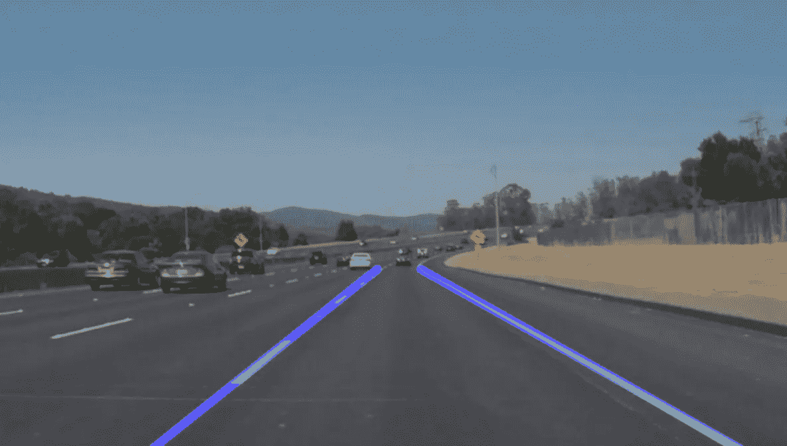

输出应该是什么样子

我们也可以将同样的算法应用于视频。

```
video = r”D:\users\new owner\Desktop\TKS\Article Lane Detection\test2_v2_Trim.mp4"
cap = cv2.VideoCapture(video)
while(cap.isOpened()): 
  ret, frame = cap.read()
  if ret == True:#----THE PREVIOUS ALGORITHM----#
    gaus = gauss(frame)
    edges = cv2.Canny(gaus,50,150)
    isolated = region(edges)
    lines = cv2.HoughLinesP(isolated, 2, np.pi/180, 50, np.array([]), minLineLength=40, maxLineGap=5)
    averaged_lines = average(frame, lines)
    black_lines = display_lines(frame, averaged_lines)
    lanes = cv2.ad1dWeighted(frame, 0.8, black_lines, 1, 1)
    cv2.imshow(“frame”, lanes)
#----THE PREVIOUS ALGORITHM----#

    if cv2.waitKey(10) & 0xFF == ord(‘q’): 
      break
  else:
    break
cap.release() 
cv2.destroyAllWindows()
```

这段代码将我们为图像创建的算法应用到视频中。请记住，视频只是一堆图片，一个接一个地快速出现。

*   第 1–2 行:定义视频的路径
*   第 3–4 行:捕获视频(使用 *cv2.videoCapture* )，并遍历所有帧
*   第 5–6 行:读取框架，如果有框架，继续
*   第 10–18 行:复制前面算法中的代码，将所有使用 *copy* 的地方替换为 *frame* ，因为我们要确保我们操作的是视频的帧，而不是前面函数中的图像。
*   第 22–23 行:显示每一帧 10 秒，如果按下按钮“q ”,退出循环。
*   第 24–25 行:它是第 5–6 行 if 语句的延续，但是它所做的就是如果没有任何框架，就退出循环。
*   第 26–27 行:关闭视频

好吧，你刚刚建立了一个算法，可以检测车道线！我希望你喜欢构建这个算法，但不要就此打住，这只是进入计算机视觉世界的一个介绍项目。尽管如此，你可以向你的朋友炫耀你的产品:)

# 关键要点

*   使用高斯模糊移除图像中的所有噪点
*   使用 canny 边缘检测来隔离图像中的边缘
*   使用按位 And 函数隔离对应于车道线的边
*   使用霍夫变换将边缘变成线条

# 关键词

如果你很好奇，这里有与这个算法相关的关键术语，你可以更深入地研究。

*   高斯模糊
*   按位和二进制
*   Canny 边缘检测
*   霍夫变换
*   梯度
*   极坐标
*   OpenCV 车道线检测

# 要考虑的其他资源

*   制作超级精良的 [youtube](https://www.youtube.com/watch?v=eLTLtUVuuy4) 视频。这是我了解车道检测的地方，事实上，我在这篇文章中的代码大部分来自这个视频。
*   我朋友写的一篇关于同一主题的[文章](https://medium.com/@kael.lascelle/lane-detection-how-cars-see-the-world-8ff3de8ddcc0)。

# 后续步骤

那么在这之后去哪里呢？在计算机视觉的世界里，有许多东西需要探索。以下是一些选择:

*   研究更先进的探测线路的方法。提示:查看 Udacity 自动驾驶汽车纳米学位教学大纲。
*   调查不同的计算机视觉算法，[这里有一个很棒的网站](https://madewithml.com/topics/)
*   看看 CNN 的，这里有我关于[理论](/a-simple-guide-to-convolutional-neural-networks-751789e7bd88)和[代码](/building-a-road-sign-classifier-in-keras-764df99fdd6a)的文章。
*   将其应用于 Arduino/RasperryPi 上的自动驾驶遥控汽车
*   还有更多…

# 这是一个总结！

感谢阅读我的文章，我真的希望你喜欢它，并从中获得一些价值。我是一名 16 岁的计算机视觉和自动驾驶汽车爱好者，喜欢构建各种机器学习和深度学习项目。如果你有任何问题，顾虑，对教程的要求，或者只是想打个招呼，你可以通过 [Linkedin](https://www.linkedin.com/in/nushaine-ferdinand-a2ba12177/) 或者 [Email](mailto:nushainef@gmail.com) me 联系我。