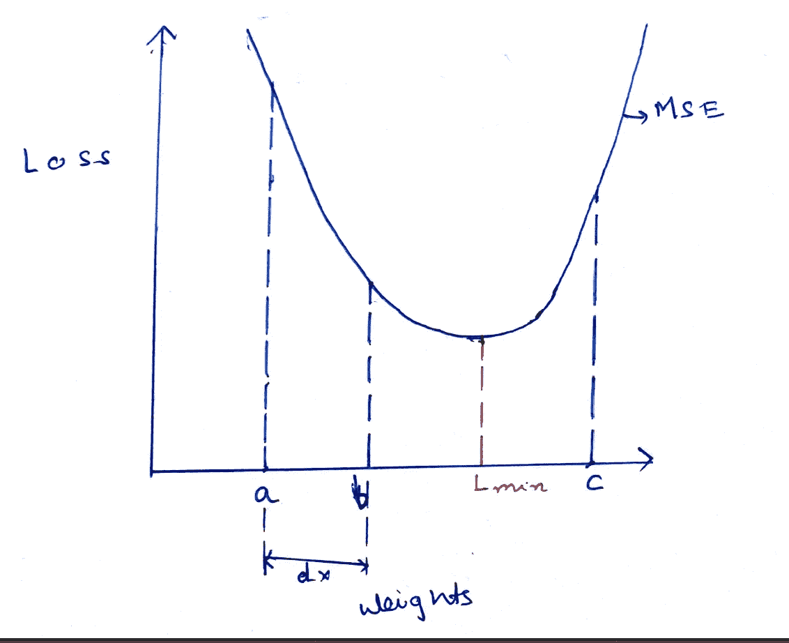
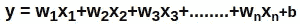

# 对回归概念的深入探究

> 原文：<https://towardsdatascience.com/a-deep-dive-into-the-concept-of-regression-fb912d427a2e?source=collection_archive---------33----------------------->

弗兰基·查马基在 [Unsplash](https://unsplash.com/s/photos/machine-learning?utm_source=unsplash&utm_medium=referral&utm_content=creditCopyText) 上拍摄的照片

## 回归背后的数学

回归是机器学习中最重要的概念之一。在这篇博客中，我们将讨论不同类型的回归和基本概念。

回归类型的变化如图所示:

回归的详细表示

我们将详细讨论所有要点。

## 线性回归

回归任务处理从一组独立变量(即提供的特征)中预测因变量的值。比方说，我们想预测一辆汽车的价格。因此，它成为一个因变量，比如 Y，而发动机容量、最高速度、级别和公司等特征成为自变量，这有助于构建方程以获得价格。

现在，如果有一个特征，比如说 x。如果因变量 y 线性依赖于 x，那么它可以由 y=mx+c 给出，其中 m 是方程中该特征的系数，c 是截距或偏差。M 和 C 都是模型参数。

说红叉是点。X1 是特征值，Y1 是预测值，Y_pred 1 是实际目标值。这里我们可以看到 X1 的预测值和实际值是相同的。但是，对 X2 来说，它们是不同的。因此，我们的工作是给出一条最佳拟合线，准确地描绘出因变量和目标变量之间的关系。现在，首先随机初始化模型参数 M 和 C，比如 M1 和 C1，如图中第 1 行所示。很明显，这条线不太合适。然后我们移到由参数 M2 和 C2 给出的第 2 行。这条线提供了一个更好的拟合，并作为我们的回归。它不会总是给出精确的拟合，但它给出了可能的最佳拟合。

那么，问题就来了，我们如何从第一行到达第二行？答案在于成本函数和梯度下降的概念。为了获得最佳拟合线，我们在一组给定值上训练模型，该给定值由特征值和相应的目标值(Y 实际值)组成。因此，我们在目标方程 y=Mx+C 中拟合特征值，我们获得 Y _ 预测值。我们的目标是减少 Y _ 预测值和 Y _ 实际值之间的差异。

为此，我们使用一个损失函数或成本函数，称为均方误差(MSE)。它由因变量的实际值和预测值之差的平方给出。

> MSE = 1/2m *(Y _ actual-Y _ pred)

如果我们观察这个函数，我们会看到它是一条抛物线，也就是说，这个函数本质上是凸的。这个凸函数就是梯度下降法中用来获得 M2 和 C2 值的原理。

## 梯度下降

这种方法是最小化损失函数和实现我们目标的关键，我们的目标是预测接近原始值。

在这张图中，我们看到了损失函数图。为了找到最小损失函数值，我们需要找到一个特定的全局最小值。因此，我们总是试图使用一个凸形的损失函数来得到一个合适的最小值。现在，我们看到预测结果取决于等式 Y=Mx +C 或 Y=Wx+C 中的权重/系数。图中 X 轴上的权重和 Y 轴上的相应损失值。最初，模型为特征分配随机权重。假设它初始化了权重=a，我们可以看到它产生了一个损失，这个损失远离最小点 L-min。

现在，我们可以看到，如果我们将权重更多地移向 x 轴的正方向，我们可以优化损失函数并实现最小值。但是，模型怎么知道呢？我们需要优化权重以最小化误差，因此，显然，我们需要检查误差如何随权重变化。为此，我们需要找到误差相对于重量的导数。这个导数叫做梯度。

> ***渐变= dE/dw***

其中 E 是误差，w 是重量。

让我们看看这是如何工作的。比方说，**如果损失随着重量的增加而增加，那么梯度将是正的，**那么我们基本上在 C 点，我们可以看到这个陈述是正确的。**如果损失随着重量的增加而减少，那么梯度将为负**。我们可以看到 A 点，对应着这样一种情况。现在，从 A 点我们需要向 x 轴的正方向移动，梯度是负的。从 C 点开始，我们需要向负 x 轴移动，但是梯度是正的。**因此，梯度的负值总是表示权重应该移动的方向，以便优化损失函数。**因此，梯度以这种方式指导模型是增加还是减少权重，以便优化损失函数。

模型找到了移动的方向，现在模型需要找到应该移动多少重量。这由称为**的参数决定，学习率由α**表示。我们看到的图表中，重量从 A 点移动到距离为 *dx 的 B 点。*

> ***dx = alpha * | dE/dw |***

因此，移动的距离是学习率参数α和误差变化幅度与该点权重变化的乘积。

现在，我们需要非常仔细地决定学习率。如果它很大，权值会有很大的变化，会超过最佳值。如果它非常低，它需要很小的步骤，需要很多步骤来优化。根据以下公式改变更新的权重。

> ***w = w—alpha * | dE/dw |***

其中 w 是之前的权重。

对于每个时期，模型根据梯度移动权重以找到最佳权重。

因此，使用该过程，我们获得了模型参数 M2 和 C2 的最终值，这给了我们实际的最佳拟合线。

## 回归的类型

1.  **单变量、双变量和多变量**

我们在上面的例子中看到，我们将因变量表示为单个自变量的函数，因此我们使用 y=wx+c。这种类型的回归称为**单变量**，因为只有一个自变量。

如果方程中有两个自变量，则变成:

> Y=w1x1+w2x2+c

这被称为双变量回归。

现在，如果有两个以上的独立变量，即因变量依赖于两个以上的特征，则相应地修改等式。

> Y=w1x1+w2x2+w3x3+…………..+wkxk+c

这叫做**多元**回归。

2.**线性和多项式**

到目前为止，我们已经看到了线性回归问题，即每个自变量的次数为 1。

现在，如果我们有一个如下所示的非线性曲线，我们就不能画了

非线性曲线

最佳拟合线，如果我们使用线性回归。在这种情况下，我们必须选择多项式回归。多项式回归将要素或独立变量提升到幂，并创建多项式方程而不是线性方程。它被给出为:

> Y=w1x1 +w2x2 + w3x3 +w4x4⁴ +………..+wkxk^k +c

现在，这里的 w1，w2，w3 …..wk 是模型的参数，幂是模型的超参数。所以，多项式的次数也是一个超参数。

假设 y=ut+1/2gt 是一个给定的方程，u 和 1/2g 是模型系数或参数。

这被称为**多项式回归**。

## 里脊回归

让我们考虑一种情况:

现在，这里的红点表示训练集的点，蓝点表示测试集的点。我们可以看到，如果我们使用红点进行训练，我们将获得红线(1)，作为回归直线，但是非常明显的是，线(1)将具有非常差的泛化能力，并且不会在测试数据上令人满意地执行。这种情况被认为具有导致过度拟合的高方差。这就是**岭回归**发挥作用的地方。它修改了成本函数并增加了正则项。如果我们仔细观察，我们会发现第(2)行是一个更好的概括，并且会执行得更好。线(1)对于以下等式具有非常高的权重和系数值:

> Y=w1x1+w2x2+……………..+wkxk。

这导致了过度拟合。岭回归背后的思想是惩罚权重或系数的平方和，以带来正则化效果。比方说，我们的等式是

> Y_pred=w1x1+w2x2

损失函数变成:

> 损耗= 1/2m。(Y _ actual—Y _ pred)+λ/2m。(w1 + w2)

第二部分是正则化部分，其集中于惩罚权重或系数，并防止它们达到高值。由于该函数是我们的损失函数，梯度下降也导致对权重的检查，因为权重的增加反过来增加了损失函数。

**λ**参数是通过交叉验证决定的，它是衡量我们在多大程度上专注于调整我们的权重的指标。λ的值越大，正则化程度越大。因此，lambda 解决了一个权衡问题。

这种技术也用于神经网络的 L2 正则化。

## 套索回归

Lasso 回归也解决了线性回归中同样的过度拟合问题。区别在于损失函数的修改方式。套索回归惩罚的是权重之和的绝对值，而不是权重的平方。

如果我们的等式是

> Y_pred=w1x1+w2x2

损失函数变成:

> 损耗= 1/2m。(Y _ actual—Y _ pred)+λ/2m。(|w1| + |w2|)

现在，如果权重值太小，它们几乎等于 0。如果 w2 等于 0，w2x2 变为 0，这表明特征 x2 对于 y 的预测不重要

因此，套索回归被用于特征选择机制。

相同的逻辑用于神经网络的 L1 正则化。

## 分类任务

任务的类型包括基于一组特征将实体分类到一些给定的类中。逻辑回归用于分类任务。

## 为什么不是线性回归？

线性回归通常基于构建最佳拟合线。让我们先看看如何使用线性回归进行分类。

如果我们观察上面的图像，“1”表示一个类，“0”表示另一个类。如果我们得到最佳拟合线和虚线边界(如图所示)，我们就可以很容易地用它来分类。当投影到最佳拟合线上时，蓝点或 0 级总是小于 0.5，这是由虚线提供的判定边界值。相应地，1 级或红点给出大于 0.4 的值。

现在，让我们来看看问题。

让我们考虑下面的情况:

在这里，我们可以看到由于异常值而导致的最佳拟合线偏移，这可能会在分类中产生错误，从而导致不令人满意的结果。同样，一些点将给出小于 0 和大于 1 的 y 值。因此，使用线性回归，y 可以取从-无穷大到+无穷大的值，但是对于分类问题，y 的范围必须从 0 到 1。

以上几点是线性回归不能用于分类任务的原因。

## 逻辑回归

我们知道，

> Y= w1x1+w2x2+w3x3……..wkxk

用作线性回归的方程式。

现在，RHS -infinity 到+infinity 的值。因此，我们必须将 LHS 变换到从-无穷到+无穷的范围内。

为了实现这一点，我们使用 log(Y/1-Y)作为 LHS。

> log(Y/1-Y)= w1x1+w2x2+w3x3……..wkxk
> 
> = > y = 1/1+e^-(**w1x 1+w2x 2+w3x 3……..wkxk)**
> 
> => Y= 1/(1+e^-transpose(theta).x)
> 
> 其中，转置(θ)。x=( **w1x1+w2x2+w3x3……..wkxk)**

现在，

> Y=1/(1+e^(-转置(θ)。x))

也称为 Sigmoid 函数，范围从 0 到 1。θ描述系数向量或矩阵的权重，x 是特征矩阵。

上图显示了 Sigmoid 函数。0.5 是函数的边界，不取小于 0 大于 1 的值。

现在，如果 sigmoid 函数由 Y 轴上的 h(x)给出，则是 g 的函数(transpose(theta)。X)在 X 轴上，那么，

> h(x)=g(转置(θ)。x)

我们可以得出以下结论，

> h(x)>0.5
> 
> =>g(转置(θ)。x)>0.5
> 
> = >转置(θ)。x>0

再说一遍，

> h(x) <0.5
> 
> => g(转置(θ)。x) <0.5
> 
> =>转置(theta)。x <0

So, if *转置(theta)。x，即* **w1x1+w2x2+w3x3……..wkxk > 0 如果 w1x1+w2x2+w3x3，则实体被分类为 1 类..wkxk < 0，实体归类为 0 类。**

决策边界如下所示:

绿线表示决策边界，等式表示该线的等式。现在，从线性代数中，我们知道，如果我们选择一个点(a，b，c，d)并将其拟合到方程中，如果它在线上，结果将大于 0，如果它在线下，结果将小于 0。这个类比和我们上面看到的非常相似，class 1 if **w1x1+w2x2+w3x3……..wkxk > 0** 和 class 0 if **w1x1+w2x2+w3x3……..wkxk < 0。**

这就是逻辑回归的工作原理。

## 损失函数

在线性回归的情况下，我们使用 MSE 或均方差。MSE 由下式给出:

> MSE =(Y _ actual-h(x))
> 
> h(x)= **w1x1+w2x2+w3x3……..wkxk**

在这种情况下，MSE 是一个抛物线函数，并且是一个具有明显最小值的纯凸函数。但是在这种情况下，

> h(x)= 1/(1+e^-(**w1x 1+w2x 2+w3x 3……..wkxk))**

现在，成本函数的修改扭曲了它的凸性，并且现在有多个最小值。除此之外，如果我们使用 MSE，误差的大小将非常小，最大值(1–0)= 1，因为 Y 可以取的最大值是 1，最小值是 0，惩罚也是如此。

由于该区域，我们使用对数损失或二元交叉熵进行逻辑回归。

比如说，Y_pred=h(x)，那么，**成本(h(x)，Y_actual)=**

> —Y _ actual = 1 时的 log(h(x))
> 
> -Y _ actual = 0 时的 log(1 — h(x))

将两者结合起来，该方程被构造为:

> 损失=—Y _ 实际。log(h(x))—(1—Y _ actual . log(1—h(x)))

如果 Y_actual=1，第一部分给出误差，否则第二部分给出误差。

上图显示了对数损失或二元交叉熵。如果实际标签为 0，而预测标签向 1 移动，则损失函数接近无穷大，反之亦然。所以，损失多了，罚款也多了。

## 逻辑回归的类型

有三种逻辑回归，

1.  二项式回归
2.  多项式回归
3.  有序回归

定义在开头的图表中给出。我们将讨论二项式和多项式逻辑回归。

二项式回归是对两个类别进行分类，比如猫和狗。它的行为方式与上面讨论的方式相同。

## 多项式逻辑回归或多类分类

在这种情况下，存在多个类别，一个实体可以被分类为。例如，有四个类，猫、狗和狮子。图像可以被分类为这三类中的任何一类。这是多项式分类的一个例子。需要注意的一点是，这三个类是相互独立的。

为了解决这些问题，我们主要是将多项逻辑回归转换为二项式回归。

有两种方法:

1.  **简单方法:**该方法为 K 个单独的类中的每一个创建 K 个单独的逻辑回归模型。每个模型都有一个 sigmoid 输出节点，表示该特定类的输出。对于我们的模型，将有 3 个乙状结肠节点，第一个用于猫，第二个用于狗，等等。现在，第一个节点给出图像是猫 P_c 的概率，第二个节点给出图像是 P_d 的概率，类似地，我们得到狮子的 P_l。现在，比较分数以获得最终答案。如果 P_c 在所有 3 个中具有最大值，则图像被预测为猫。
2.  **同步方法:**该方法创建 K-1 个独立的逻辑回归。每一个概率都被认为是一组独立的事件，即节点不是决定一幅图像是猫还是狮子(0/1)，而是决定这幅图像是猫还是狮子(A/B)。

现在，我们已经看到了逻辑回归:

> log(Y/1-Y)= w1x1+w2x2+w3x3……..wkxk

如果 Y = > 0.5 类 else 类所以，Y 可以说 P(A)，1-Y 等价于 P(C)。这被称为**赔率。**因此，对于第一个模型:

> log(P(A)/P(C))= w1 _ 1x1 _ 1+w2 _ 1x 2 _ 1+w3 _ 1x 3 _ 1……..wk_1xk_1+b_1
> 
> 比如说，R1 = w1 _ 1x 1 _ 1+w2 _ 1x 2 _ 1+w3 _ 1x 3 _ 1……..wk_1xk_1+b_1
> 
> P(A)/P(C)= exp(R _ 1)———1

再次对于第二个模型，

> log(P(B)/P(C))= w1 _ 2 x1 _ 2+w2 _ 2 x2 _ 2+w3 _ 2 x3 _ 2……..wk_2xk_2 + b_2
> 
> 比如说，R _ 2 = w1 _ 2 x1 _ 2+w2 _ 2 x2 _ 2+w3 _ 2 x3 _ 2……..wk_2xk_2 + b_2
> 
> P(B)/P(C)= exp(R _ 2)———2

现在，根据上面的等式 1 和 2:

> P(A)=P(C)*exp(R_1)
> 
> P(B)=P(C)*exp(R_2)

现在， **P(A)+P(B) +P(C) =1**

所以，P(C)* exp(R1)+P(C)* exp(R2)+P(C)= 1

> p(C)= 1/(1+exp(R1)+exp(R2))

因此，我们可以将它们联系起来。

## Softmax 回归

Softmax 回归由下式给出:

softmax 图层用作多类分类的最终图层或输出图层。该函数是一种指数方法。所有类别的概率之和等于 1。最大可能类作为输出给出。

## 结论

在本文中，我们已经讨论了与回归相关的所有概念。希望这有所帮助。