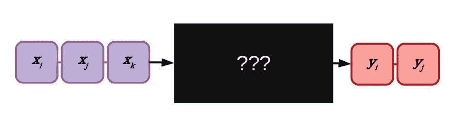
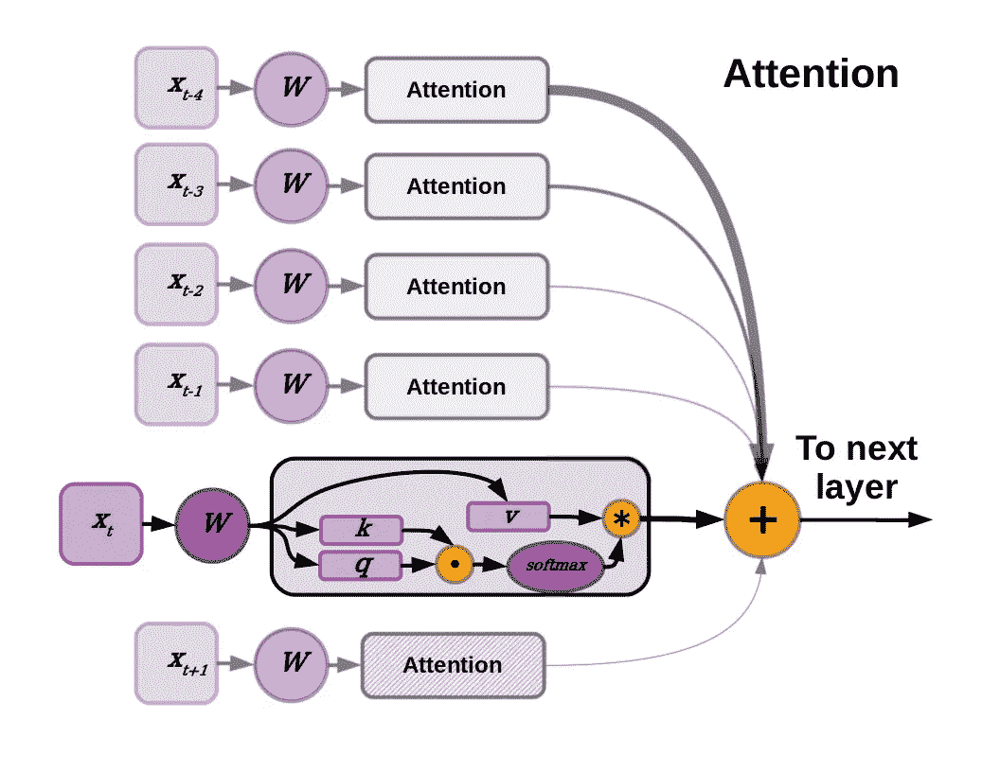
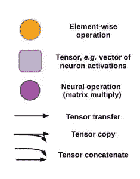
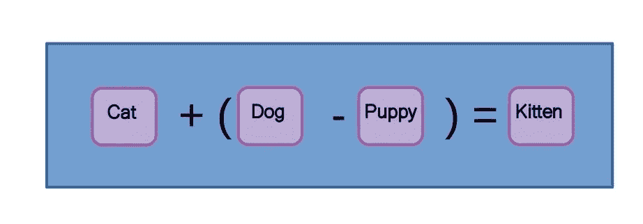
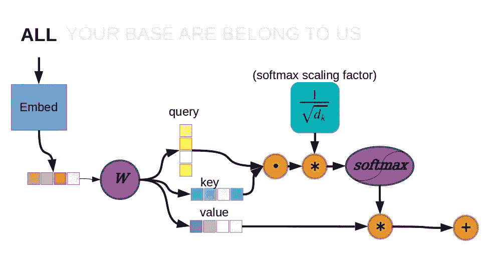
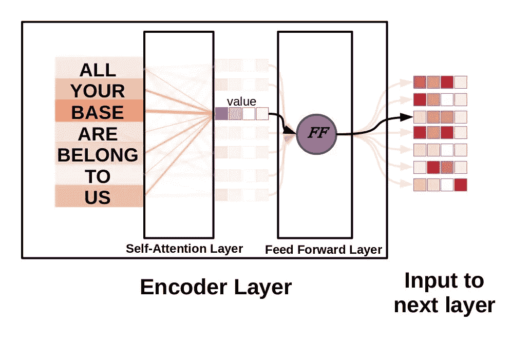
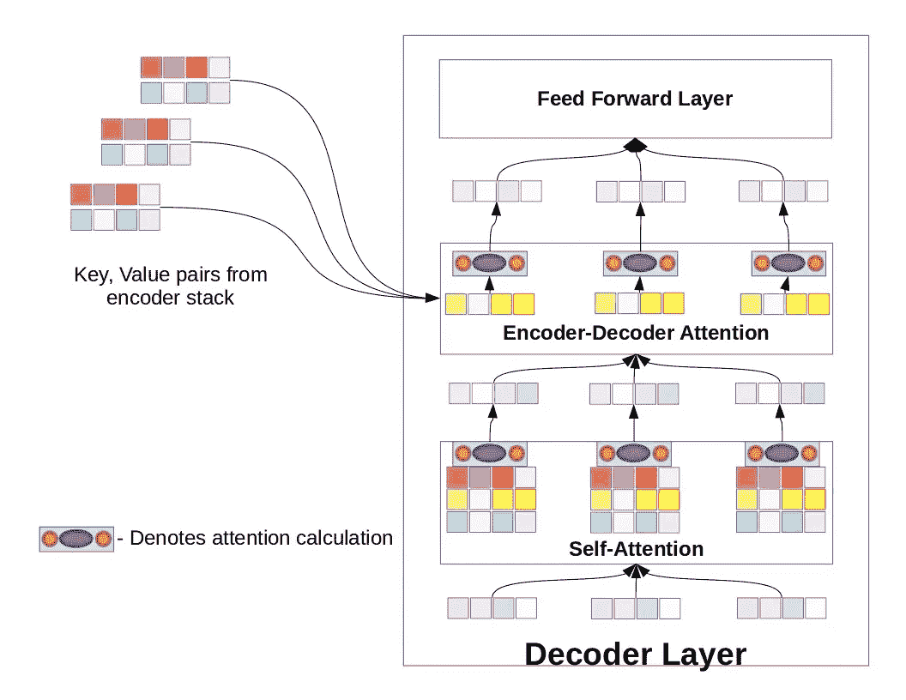
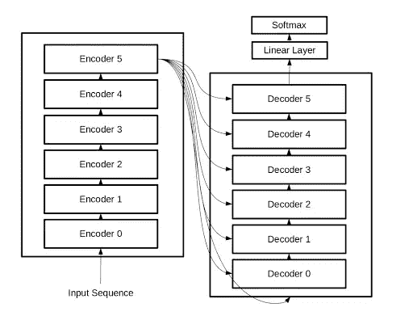
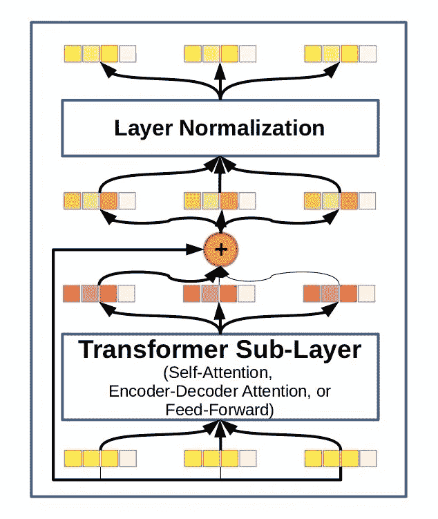

# 深入了解变压器架构—变压器模型的开发

> 原文：<https://towardsdatascience.com/a-deep-dive-into-the-transformer-architecture-the-development-of-transformer-models-acbdf7ca34e0?source=collection_archive---------11----------------------->

## 自然语言处理转换器

[来源](http://unsplash.com)

# 自然语言处理转换器

自从自然语言处理(NLP)的世界被*由[瓦斯瓦尼*等人*](https://arxiv.org/abs/1706.03762) 发表的开创性的“注意力是你所需要的”论文*所改变以来，似乎已经过去了很长时间，但事实上那还不到 3 年。变压器架构的引入相对较晚，并且它们已经颠覆了语言任务，这表明了机器学习和人工智能的快速发展。现在是深入了解变压器架构内部工作原理的最佳时机，尤其是变压器模型在各种新应用中取得巨大进展，如[预测化学反应](https://pubs.acs.org/doi/10.1021/acscentsci.9b00576)和[强化学习](https://arxiv.org/abs/1910.06764)。

无论您是老手还是第一次关注 transformer 风格的架构，本文都应该为您提供一些帮助。首先，我们将深入探讨用于构建最初的 2017 Transformer 的基本概念。然后，我们将触及后续 transformer 模型中实现的一些开发。在适当的地方，我们将指出一些限制，以及从原始变压器继承思想的现代模型如何试图克服各种缺点或提高性能。

# 变形金刚是做什么的？

变压器是当前处理序列的最先进的模型类型。也许这些模型最突出的应用是在文本处理任务中，其中最突出的是机器翻译。事实上，变形金刚及其概念后代已经渗透到自然语言处理(NLP)的几乎每一个基准排行榜[中，从问题回答到语法纠正。在许多方面，变压器架构正在经历发展的高潮，类似于我们在 2012 年 ImageNet 竞赛后看到的卷积神经网络，有好有坏。](https://nlpprogress.com/)

[来源](https://blog.exxactcorp.com/)

*变压器表示为一个黑匣子。整个序列(图中的 x)以前馈方式同时解析，产生变换的输出张量。在这个图中，输出序列比输入序列更简洁。对于实际的 NLP 任务，词序和句子长度可能会有很大的不同。*

不同于 NLP 的先前最先进的架构，例如 RNNs 和[lstm](https://blog.exxactcorp.com/5-types-lstm-recurrent-neural-network/)的许多变体，没有循环连接，因此没有先前状态的真实记忆。变形金刚通过同时感知整个序列来解决记忆缺失的问题。也许一个变形神经网络感知世界有点像电影[中的外星人*到来*](https://en.wikipedia.org/wiki/Arrival_(film)) *。严格地说，未来元素通常在训练期间被掩盖，但除此之外，该模型可以在整个序列中自由学习长期语义依赖性。*

[来源](https://blog.exxactcorp.com/)

*变形金刚去掉了循环连接，同时解析整个序列，有点像* Arrival 中的七足动物。*你可以使用 flxb 2(*[https://github.com/FlxB2/arrival_logograms](https://github.com/FlxB2/arrival_logograms)*)的开源 python2 库制作自己的 logograms。*

作为仅前馈模式，变压器对硬件的要求略有不同。变形金刚实际上更适合在现代机器学习加速器上运行，因为与递归网络不同，它没有顺序处理:模型不必处理一串元素来开发有用的隐藏细胞状态。转换程序在训练期间可能需要大量内存，但是以降低的精度运行训练或推理有助于减轻内存需求。

迁移学习是在给定的基于文本的任务中达到最先进水平的一个重要捷径，坦白地说，对于大多数预算有限的实践者来说是必要的。培训一台大型现代变压器的能源和财务成本很容易使单个研究人员的[年总能耗](https://arxiv.org/abs/1906.02243)相形见绌，如果使用云计算，成本将高达数千美元。幸运的是，类似于计算机视觉的深度学习，专门任务所需的新技能可以转移到大型预训练的变形金刚上，例如从[拥抱脸库](https://github.com/huggingface/transformers#model-architectures)下载。

# 变压器架构中的注意机制是什么？

变压器架构中的秘密酱料是纳入了某种注意力机制，2017 年的原版也不例外。为了避免混淆，我们将把瓦斯瓦尼*等人*演示的模型称为“变形金刚”或“普通变形金刚”，以区别于类似名称的继任者，如 Transformer-XL。我们将从关注机制开始，向外构建整个模型的高层次视图。

[来源](https://blog.exxactcorp.com/)

[来源](https://blog.exxactcorp.com/)

注意力是一种有选择地对输入数据中的不同元素进行加权的手段，这样它们将对下游层的隐藏状态产生调整后的影响。vanilla Transformer 通过将输入单词向量解析为键、查询和值向量来实现注意力。键和查询的点积提供了注意力权重，使用 softmax 函数对所有注意力权重进行压缩，使得总权重总和为 1。对应于每个元素的值向量在被馈送到后续层之前根据它们的注意力权重被求和。一下子理解这些可能有点复杂，所以让我们放大图片，一步一步地看一下。

# 词向量嵌入赋予语义

从构成句子的单词序列开始，序列中的每个元素(单词)首先被转换成称为单词向量的嵌入式表示。词向量嵌入是一种更微妙的表示，而不是像 Salakhutidinov 和 Hinton 在他们 2007 年的语义散列论文中使用的一次性编码词袋模型。

单词嵌入(有时也称为记号)是有用的，因为它们以神经网络可以理解的数字方式传递语义。习得的单词嵌入可以包含上下文和关系信息，例如，“dog”和“puppy”之间的语义关系大致相当于“cat”和“kitten”，因此我们可以像这样操作它们的单词嵌入:

[来源](https://blog.exxactcorp.com/)

# 点产品注意细节

[来源](https://blog.exxactcorp.com/)

*香草变压器注意机制详解。*

从上图的左上角开始，一个输入单词首先被一个嵌入函数标记化，用一个数字向量替换字符串“ALL ”,该向量将作为注意力层的输入。注意，唯一具有嵌入功能的层是第一编码器，每隔一层仅将前面的输出向量作为输入。关注层(图中的 **W** )根据输入计算三个向量，称为键、查询和值。键和查询的点积是一个标量，是给定位置的相对权重。

注意力机制并行应用于序列中的每个元素，因此每个其他元素也有一个注意力分数。这些注意力分数服从 softmax 函数，以确保总加权和为 1.0，然后乘以相应的值向量。所有元素的值，现在由它们的注意力分数加权，被加在一起。产生的矢量是构成输入序列的内部表示的矢量序列中的新值，该新值然后将被传递到前馈完全连接层。

到目前为止可能已经丢失的另一个重要细节是用于稳定 softmax 函数的缩放因子，*即*在将值输入到关注层使用的 softmax 函数之前，数字与关键向量中单元数量的平方根成反比。无论键和查询向量的大小如何，这对于让学习很好地工作是很重要的。在没有比例因子的情况下，当使用长键和查询向量时，点积将趋向于大值，将 softmax 函数的梯度推入相对平坦的区域，并且使得错误信息难以传播。

# 编码器层:6 种不同类型的普通变压器

如前所述，去除循环连接的一个有用的结果是，整个序列可以以前馈方式一次处理。当我们将上述自我关注层与密集前馈层结合时，我们得到一个编码器层。前馈层由两个线性层组成，其间有一个整流线性单元(ReLU)。也就是说，输入首先被线性层变换(矩阵乘法)，然后结果值被限幅为总是 0 或更大，最后结果被馈送到第二线性层以产生前馈层输出。

[来源](https://blog.exxactcorp.com/)

Vanilla Transformer 使用了其中的六个编码器层(自我关注层+前馈层)，然后是六个解码器层。Transformer 使用一种称为多头关注的自我关注的变体，因此事实上关注层将为每个序列元素计算 8 个不同的键、查询、值向量集。然后，这些将被连接成一个矩阵，并通过另一个矩阵乘法，产生适当大小的输出向量。

# 解码器层:6 种不同类型的香草变压器

解码器层拥有我们在编码器层中看到的许多功能，但增加了第二个关注层，即所谓的编码器-解码器关注层。与自我关注层不同，只有查询向量来自解码器层本身。键值向量取自编码器堆栈的输出。每个解码器层也包含一个自我关注层，就像我们在编码器中看到的那样，输入自我关注层的查询、键和值都是在解码器堆栈中生成的。

[来源](https://blog.exxactcorp.com/)

*解码器层，不同于编码器层，增加了一个编码器-解码器注意子层。这六个组成了香草变压器的解码器。*

现在我们有了编码器和解码器层的配方。要用这些组件构建转换器，我们只需制作两个堆栈，每个堆栈包含六个编码器层或六个解码器层。编码器堆栈的输出流入解码器堆栈，解码器堆栈中的每一层也可以访问编码器的输出。但是，要完全理解普通变压器是如何组装的，只剩下一些细节了。

[来源](https://blog.exxactcorp.com/)

*全变压器概述。*

# 最终部分:剩余连接、图层标准化和位置编码

像许多其他具有许多参数的极深度神经网络一样，当梯度没有像我们希望的那样从输入流向输出时，训练它们有时会很困难。在计算机视觉中，这导致了强大的 [ResNet](https://arxiv.org/abs/1512.03385) 风格的卷积神经网络。ResNets 是 residual networks 的缩写，它将最后一层的输入明确地添加到自己的输出中。通过这种方式，残差被保留在整个层堆栈中，梯度可以更容易地从输出处的损失函数一直流回输入。 [DenseNet](https://arxiv.org/abs/1608.06993) 架构旨在通过将输入张量和输出张量连接在一起，而不是相加，来解决相同的问题。在 vanilla Transformer 模型中，残差求和操作之后是[层归一化](https://arxiv.org/abs/1608.06993)，这是一种用于改进训练的方法，与批处理归一化不同，它对小批处理大小不敏感。

[来源](https://blog.exxactcorp.com/)

*残差连接和图层归一化图。vanilla Transformer 的编码器和解码器层中的每个子层都采用了这种方案。*

在 LSTMs 这样的递归体系结构中，模型可以在内部学习计数和测量序列距离。Vanilla Transformer 不使用递归连接，并同时感知整个序列，因此它如何了解哪个元素来自序列的哪个部分，尤其是当序列长度允许变化时？答案是基于衰减正弦函数的位置编码，它与序列元素嵌入连接。瓦斯瓦尼*等人*。还对学习的位置编码进行了实验，得到了几乎相同的结果，但推断使用正弦编码应该允许模型更好地概括训练期间看不到的序列长度。

# 变形金刚在深度学习中的影响和未来

2017 年推出的 vanilla Transformer 极大地破坏了基于序列的深度学习。通过完全去除循环连接，transformer 架构更适合在现代机器学习加速硬件上进行大规模并行计算。令人惊讶的是，vanilla Transformer 可以学习序列中的长期依赖性，事实上，vanilla Transformer 可以轻松学习关系的距离是有上限的。

Transformer-XL 是由[戴*等人于 2019 年*](https://arxiv.org/abs/1901.02860)推出的，旨在通过一种新的位置编码来解决这一问题，并且还引入了一种伪递归连接，其中键和值向量部分取决于先前的隐藏状态以及当前的隐藏状态。其他变压器变体包括仅解码器变压器(*例如* OpenAI 的 GPT 和 GPT-2)、添加双向(即基于 BERT 的变压器)等。变压器是为序列设计的，在自然语言处理中有着最突出的应用，但变压器架构也适用于[图像生成](https://arxiv.org/abs/1802.05751)、[强化学习](https://arxiv.org/abs/1910.06764)(通过修改 Transformer-XL)，以及[化学](https://pubs.acs.org/doi/10.1021/acscentsci.9b00576)。

# 有用的变压器架构资源

希望这篇文章已经帮助你建立了使用 NLP 和其他现代转换器架构的直觉。但是你不必为了尝试你自己的想法而成为一个英雄，从零开始建造和训练一个新的变形金刚。像 [HuggingFace](https://github.com/huggingface/transformers#model-architectures) 这样的开源库提供了预先训练好的模型，你可以对这些模型进行微调以支持你的 NLP 项目。谷歌提供了一个笔记本，你可以用它来修改 tensor2tensor 库中的变形金刚模型。当然你也可以和变形金刚对话或者玩一个基于文本的地牢冒险游戏，由 OpenAI 的 GPT 2 作为地牢主人。根据你喜欢的抽象层次，上面的资源可能已经足够了，但是如果你不把代码放到概念中就不会开心，你可能会对哈佛 NLP 实验室的亚历山大·拉什和其他人的论文的[代码注释版本](http://nlp.seas.harvard.edu/2018/04/03/attention.html)感兴趣。

快乐变身！