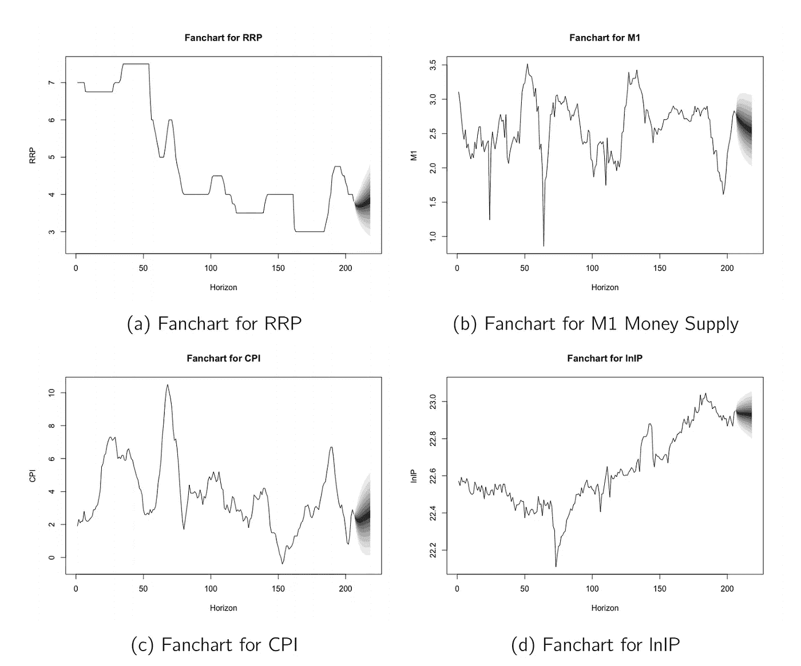
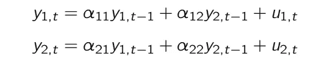
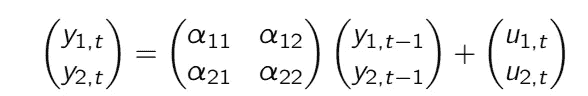
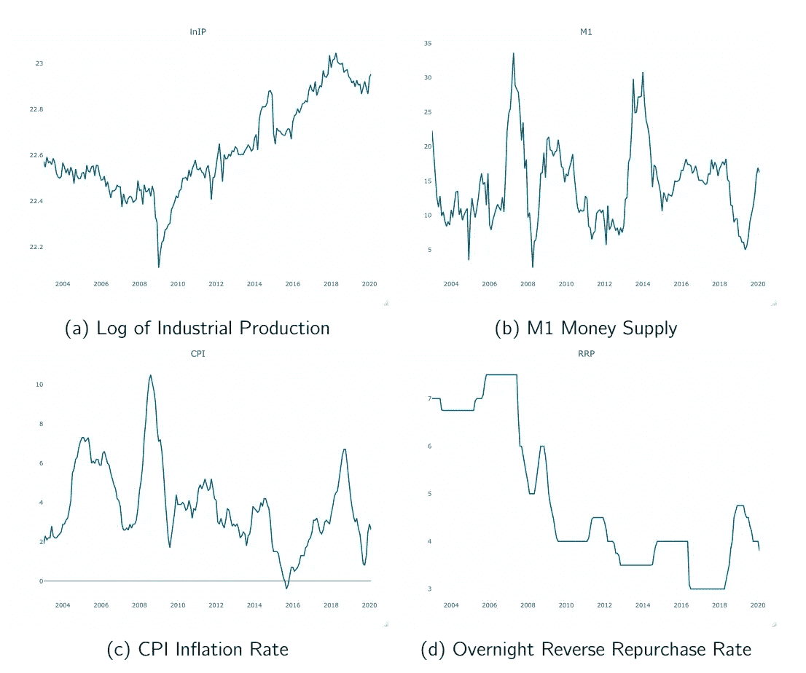
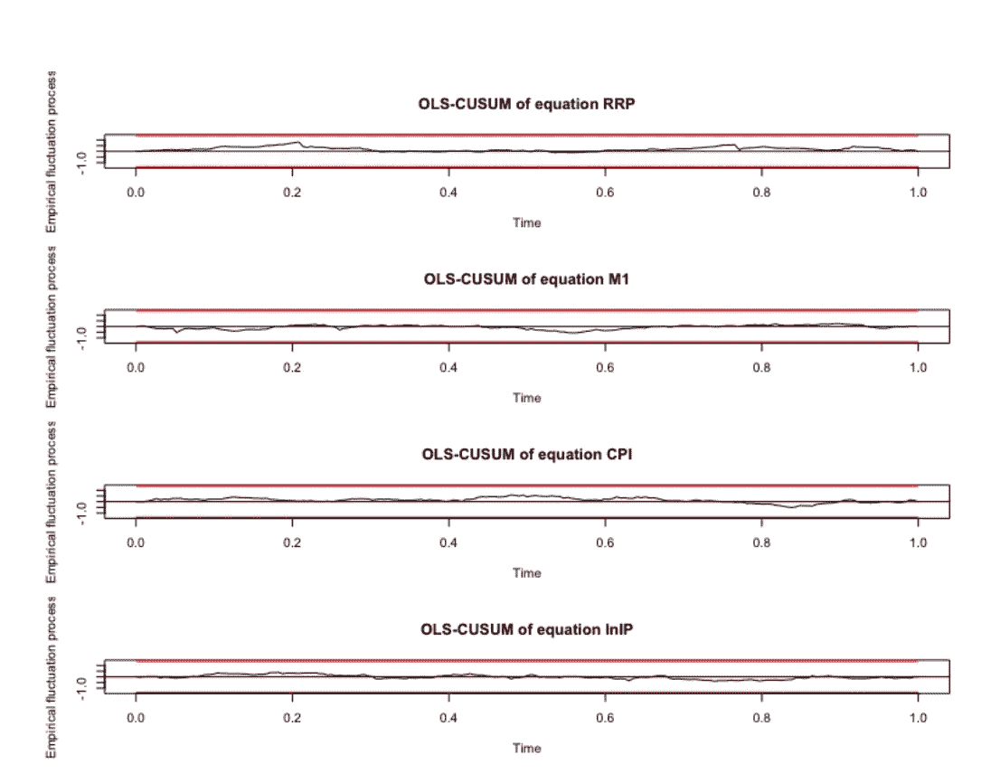
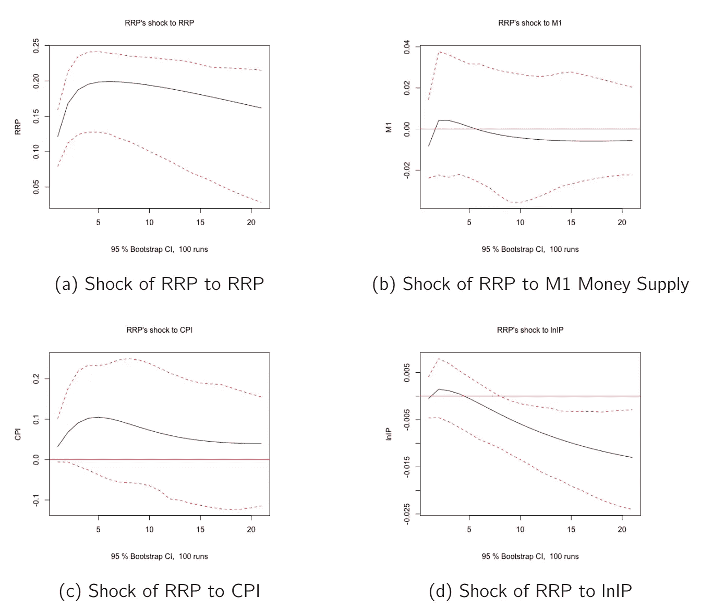
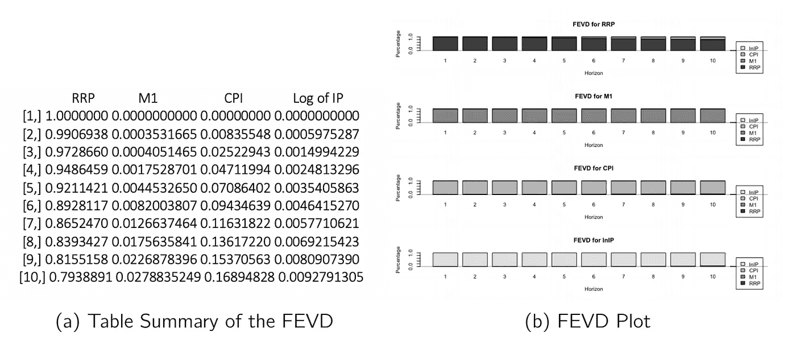

# R 中向量自回归的深入研究

> 原文：<https://towardsdatascience.com/a-deep-dive-on-vector-autoregression-in-r-58767ebb3f06?source=collection_archive---------1----------------------->

## 让数据说话！让我们抛弃先验的期望。



# 什么是 VAR？

Christopher Sims 提出了向量自回归模型，这是一个多元线性时间序列模型，其中系统中的内生变量是所有内生变量滞后值的函数。这为传统的结构方程系统提供了一种简单而灵活的替代方案。VAR 可以对宏观经济数据进行信息建模，而不会强加非常强的限制或关系。本质上，这是一个宏观经济模型，没有太多的先验预期。

# 风险值的用途

var 非常有用，尤其是在宏观经济学领域。它被广泛用于模拟对实体经济的宏观经济冲击，并被大量用于政策模拟和预测。这是向量自回归的主旨和主要用途。首先，它是一个复杂的*预测工具*。我们将展示 var 如何比标准的单变量预测模型更好，特别是在确定长期趋势方面。大多数关于预测的实证研究表明，VAR 已经超越了传统的单变量预测模型和基于理论的结构方程模型。

除了预测，var 也是*结构分析*的有用工具。我们注意到 var 可以研究对冲击的反应。它可以精确定位传统单变量模型无法解决的波动来源。此外，var 有助于区分相互竞争的理论模型。

# VAR 看起来怎么样

正如我们之前提到的，VAR 是一个多元线性时间序列模型，其中系统中的内生变量是所有内生变量的滞后值的函数。简单地说，VAR 本质上是一元自回归模型的推广。通常，我们将 VAR 记为 VAR(p ),其中 *p* 表示系统中自回归滞后的数量。考虑一个只有两个变量的 VAR 系统。



二元 VAR 系统

我们也可以把它写成矩阵形式



矩阵形式变量

VAR 的估计是一个由 OLS 方程得出的*方程。我们基本上在每个方程上运行 OLS。我们发现估计是一致的，因为只有内生变量的滞后值在等式的右边。此外，估计也是有效的，因为所有的方程都有相同的回归量，这使得每个方程的变化最小化。这样做表明它本质上等价于一个*广义最小二乘*。在这方面，无序列相关性的假设也成立。*

# 使用 Sims (1992)框架

我们现在将在一个实际的例子中应用在 VAR 中学到的许多概念。特别是，我们将使用 Sims (1992)利用菲律宾数据开发的框架。在这个模型中，我们将使用四个变量。这些是:

*隔夜逆回购利率*由菲律宾央行设定。从各方面来看，这是菲律宾央行控制的主要政策利率。

*M1 货币供应量*可从 BSP 网站获得

*CPI 通货膨胀率*由菲律宾统计局每月公布，根据拉斯佩里斯价格指数衡量价格的相对涨幅。

*工业生产*衡量工业部门所有商品的价值。

我们将首先估计一个反映关键经济反应的标准风险值。理论上和西姆斯都认为，对名义利率的冲击代表着货币政策冲击。对政策变量的冲击会同时影响所有其他变量。该变量受周期内所有其他变量的影响，并且排序在最后。最后，央行只观察具有滞后性的非政策变量。

# 预赛

我们从安装所需的包并使用 library()命令加载它们开始。对于这一部分，我们需要安装“VAR”包，该包将包含运行 VAR 和 SVAR 以及后续诊断测试和应用程序所需的大量命令。然后我们看到每个变量的图，并判断一些初始条件，如非平稳性。

如前所述，我们需要安装“vars”包。使用 install.packages("vars ")命令可以做到这一点。在此之后，我们将加载这个包以及我们的标准包和库套件，以便我们继续进行评估。

```
install.packages("vars")
library(vars)
library(mFilter)
library(tseries)
library(TSstudio)
library(forecast)
library(tidyverse)
```

安装和加载之后，是时候加载我们的数据集了。我们将使用 Sample_VAR.csv 文件，其中包含从 2003 年 1 月到 2020 年 2 月的所有变量的数据。该数据每月公布一次，可从 BSP 和 PSA 获得。我们使用 read_csv()命令读取数据集和 file.choose()命令打开一个对话框，供我们选择数据。在本例中，我们将数据集放在名为“mp”的对象下。如果你喜欢，随便你怎么命名。然后，我们使用 head()命令查看数据集的前几行，以检查它是否正确加载。文件和代码可以在这里找到:[https://drive . Google . com/drive/u/0/folders/11 max h0 trxjuf 1y _ yh-AJXgxulHQwcBEn](https://drive.google.com/drive/u/0/folders/11mAXh0trxjuf1y_yh-AJXgxulHQwcBEn)

```
mp <- read_csv(file.choose()) 
head(mp)
```

接下来，我们需要使用 ts()命令将数据集中的每个变量声明为一个时间序列。我们使用$符号从数据集中调用一个变量。所有变量都从 2003 年的同一天同一个月的 1 月 1 日开始。我们将频率设置为 12，因为我们要处理月度数据。

```
lnIP <- ts(mp$lnIP, start = c(2003,1,1), frequency = 12)
M1 <- ts(mp$M1, start = c(2003,1,1), frequency = 12)
CPI <- ts(mp$CPI, start = c(2003,1,1), frequency = 12)
RRP <- ts(mp$RRP, start = c(2003,1,1), frequency = 12)
```

我们也可以使用 autoplot()或 ts_plot()命令来可视化我们的系列。和以前一样，ts_plot()命令是一个更具交互性的版本，它使用 plot.ly 包作为基础。

```
ts_plot(lnIP)
ts_plot(M1)
ts_plot(CPI)
ts_plot(RRP)
```



时间序列图

同样，评估所研究的变量是否稳定也很重要。正如我们已经说过的，在我们的 VAR 中有稳定的变量是一个理想的情况，即使我们没有这些也能运行它。正如我们已经习惯的，让我们使用我们熟悉的测试。为简单起见，我们将使用 Phillips Perron，因此不需要指定滞后的数量。

```
pp.test(lnIP)
pp.test(M1)
pp.test(CPI)
pp.test(RRP)
```

在上面的估计中，我们发现所有的变量都是非平稳变量。请记住，拒绝零假设表明数据是稳定的。然而，我们仍然可以使用这些水平数据进行 VAR 估计。然而，你可以选择不同的数据，看看是否能提供更好的结果和预测。

# 正确估计

是时候正式评估我们的风险值了。我们首先需要将我们的 VAR 变量绑定在一起以创建系统。此后，我们将选择我们将使用的 VAR 后面的最佳滞后阶数。然后，我们将运行一个无限制的风险值估计，并看到结果。最后，我们将运行一些诊断，如自相关、稳定性和正态性测试。

第一步是建立 VAR 系统。这是通过 cbind()命令完成的，该命令实质上是对我们的时间序列进行分组。我们将按照我们认为合适的顺序来点这道菜。我们将把它存储在一个名为“v1”的对象中。然后，我们将使用 colnames()命令将变量重命名为下面的列表。

```
v1 <- cbind(RRP, lnM1, CPI, lnIP)
colnames(v1) <- cbind("RRP","M1","CPI", "lnIP")
```

在我们绑定变量并创建 VAR 系统后，我们将确定我们将使用的一些滞后顺序。为此，我们使用 VARselect()命令并使用我们刚刚创建的 v1 对象。我们将使用最大滞后阶数 15。该命令将根据 AIC、SBIC、HQIC 和 FPE 的多元迭代自动生成首选滞后阶数。

```
lagselect <- VARselect(v1, lag.max = 15, type = "const")
lagselect$selection
```

运行这些命令表明要使用的滞后阶数是 2。在西姆斯的研究中，他使用了 14 个滞后，这在美国数据中可能更为熟练，因为这些影响反映了更大的持久性。

我们现在将评估一个模型。我们使用 VAR()命令来估计 VAR。p 选项指的是使用的滞后数量。因为我们确定 2 lags 是最好的，所以我们把它设置为 2。我们让它成为一个典型的带有常数的无限制 VAR，我们将在系统中不指定任何外生变量。summary()命令列出了结果。

```
Model1 <- VAR(v1, p = 2, type = "const", season = NULL, exog = NULL) summary(Model1)
```

我们通常不解释 VAR 的系数，我们通常解释应用的结果。但是你会看到，我们在 VAR 中有每个滞后和每个方程的系数。每个等式代表 VAR 系统中的一个等式。

# 模型诊断

一个假设是残差应该尽可能地**不自相关**。这也是基于我们的假设，即残差是白噪声，因此与之前的周期不相关。为此，我们运行 serial.test()命令。我们将结果存储在对象 Serial1 中。

```
Serial1 <- serial.test(Model1, lags.pt = 5, type = "PT.asymptotic")Serial1
```

在这个测试中，我们看到残差没有显示自相关的迹象。然而，如果我们改变最大滞后阶数，有可能会出现自相关现象。因此，最好尝试多个滞后订单。

另一个要考虑的方面是**异方差**的存在。在时间序列中，我们称之为*拱形效应*，它本质上是时间序列中聚集的波动区域。这在一系列事件中很常见，比如当发布盈利电话时，股价可能会大幅上涨或下跌。在该区域或窗口中，可能会有过度的波动，从而改变残差的方差，远离我们的恒定方差假设。我们有模型来解释这些，这些模型是条件波动率模型，我们将在后面的章节中讨论。

```
Arch1 <- arch.test(Model1, lags.multi = 15, multivariate.only = TRUE)Arch1
```

同样，ARCH 检验的结果没有表明异方差的程度，因为我们没有拒绝零假设。因此，我们得出结论，在这个模型中没有拱效应。然而，像自相关测试一样，在后续的滞后阶数上记录滞后效应是可能的。

一个软的先决条件，但也是一个理想的条件是残差分布的正态性。为了测试残差的正态性，我们在 R 中使用 normality.test()命令，它引入了 Jarque-Bera 测试、峰度测试和偏斜度测试。

```
Norm1 <- normality.test(Model1, multivariate.only = TRUE)Norm1
```

基于所有三个结果，这一特定模型的残差似乎不是正态分布的。

稳定性测试是对结构断裂存在的一些测试。我们知道，如果我们不能测试结构突变，如果碰巧有一个，整个估计可能会被打乱。幸运的是，我们对此有一个简单的测试，它使用递归残差和的图。如果在图中的任何一点，总和超出红色临界界限，则可以看到该点的结构性断裂。

```
Stability1 <- stability(Model1, type = "OLS-CUSUM")plot(Stability1)
```



稳定性试验

根据测试结果，似乎没有明显的结构断裂。因此，我们的模型通过了这个特殊的测试

# 政策模拟

我们现在将转向常规 VAR 中的政策模拟。我们将做三个主要的，这是格兰杰因果关系，预测误差方差分解，以及脉冲响应函数。

我们将测试系统中每个变量与所有其他变量的总体格兰杰因果关系。我们说过，变量之间可能存在单向、双向或无因果关系。

```
GrangerRRP<- causality(Model1, cause = "RRP")
GrangerRRPGrangerM1 <- causality(Model1, cause = "M1")
GrangerM1GrangerCPI <- causality(Model1, cause = "CPI")
GrangerCPIGrangerlnIP <- causality(Model1, cause = "lnIP")
GrangerlnIP
```

所使用的命令适用于二元情况，但我们现在将在四元系统中使用它。你们中的一些人可能会尝试将 VARmodels 减少到两个变量，以查看更直接的解释。为了执行 Granger 因果关系测试，我们使用 causality()命令。根据研究结果，我们得出结论，CPI 格兰杰原因的其他变量，但没有看到相反的情况。也许粒度变量到变量的关系比变量到组的关系更有意义。

我们现在将转向脉冲响应函数。虽然我们可以获得比下面更多的脉冲响应函数，但我们将关注 RRP 中的冲击对系统中其他变量的影响

```
RRPirf <- irf(Model1, impulse = "RRP", response = "RRP", n.ahead = 20, boot = TRUE)
plot(RRPirf, ylab = "RRP", main = "RRP's shock to RRP")M1irf <- irf(Model1, impulse = "RRP", response = "M1", n.ahead = 20, boot = TRUE)
plot(M1irf, ylab = "M1", main = "RRP's shock to M1")CPIirf <- irf(Model1, impulse = "RRP", response = "CPI", n.ahead = 20, boot = TRUE)
plot(CPIirf, ylab = "CPI", main = "RRP's shock to CPI")lnIPirf <- irf(Model1, impulse = "RRP", response = "lnIP", n.ahead = 20, boot = TRUE)
plot(lnIPirf, ylab = "lnIP", main = "RRP's shock to lnIP")
```



脉冲响应函数

irf()命令生成 IRF，其中我们需要指定模型、脉冲序列和响应序列。我们还可以指定未来的周期数，以了解影响或冲击将如何随时间发展。然后，我们使用 plot()命令来绘制这个 IRF。IRF 的结果相当令人费解。请记住，RRP 中的这种增加不可能是 BSP 对其他变量所发生的事情的反应，因为它是首先订购的。如你所见，在(a)中，对 RRP 的冲击当然会增加 RRP，这将导致货币供应量(b)的轻微下降和产出(d)的下降。我们还发现，价格在短期内会上升，但之后会适度下降。克里斯托弗·西姆斯认为，这是一个令人困惑的结果。结果表明，上调存款准备金率后，价格会上涨。如果货币紧缩降低了总需求(lnIP ),从而降低了产出，那么它不可能与通胀联系在一起。他接着说，VAR 可能会被错误指定。例如，可能有一个 BSP 将达到的通胀领先指标，但它被错误地从 VAR 中忽略了。BSP 可以知道通胀压力即将到来，并通过提高利率来抵消通胀压力。

如果你回想一下基本的宏观经济学，像提高政策利率(利率)这样的紧缩性货币政策会导致产出下降。产出的下降通常会抑制通货膨胀，导致价格下降。然而，我们在这个模型中看到的是，在很大程度上，价格上涨了，这令人费解。据推测，在先前的估计中，政策利率的外生变动并不完全是外生的。换句话说，没有正确识别外部冲击。为了解决这个问题，西姆斯将商品价格加入其中。

我们现在把注意力转向预测误差方差分解。同样，我们可以追踪系统中冲击的发展来解释系统中所有变量的预测误差方差。为此，我们使用 fevd()命令。像 IRF 一样，我们也可以指定未来的周期数。在这种情况下，让我们只关注 RRP。

```
FEVD1 <- fevd(Model1, n.ahead = 10)
FEVD1
plot(FEVD1)
```



预测误差方差分解

我们可以在窗口(a)中清楚地看到，短期的 RRP(列 1)的预测误差是由于它本身。这是因为 RRP 在排序中被放在第一位，并且没有其他冲击同时影响 RRP。在更长的时间范围内，比如 10 个月，我们可以看到 CPI 现在约占 16%，货币供应量约占 2%。

# 使用 VAR 进行预测

正如我们已经说过的，我们也可以使用 VAR 进行预测。为此，我们使用 predict()命令并生成一个称为*扇形图*的东西，它通常用于以图形方式确定预测的置信度。我们将预测范围设定为未来 12 个月或全年预测。

```
forecast <- predict(Model1, n.ahead = 12, ci = 0.95)fanchart(forecast, names = "RRP", main = "Fanchart for RRP", xlab = "Horizon", ylab = "RRP")fanchart(forecast, names = "M1", main = "Fanchart for M1", xlab = "Horizon", ylab = "M1")fanchart(forecast, names = "CPI", main = "Fanchart for CPI", xlab = "Horizon", ylab = "CPI")fanchart(forecast, names = "lnIP", main = "Fanchart for lnIP", xlab = "Horizon", ylab = "lnIP")forecast
```


VAR 中的预测

该图显示，RRP 预计将略有下降，然后上升，M1 预计将下降，IP 也是如此。预计 CPI 将在最初几个月略有下降，然后温和反弹。请注意，这与 IRFs 不同，只是因为我们使用风险值作为预测工具，而不是政策工具。

# 结论

总之，我希望通过这个例子，你可以看到风险值方法的许多使用案例，以及为什么许多经济学家继续使用它的灵活性。除了纯粹的预测模型，它还有更多应用，如政策模拟、线性因果分析和预测误差分解。在 VAR 创立之前，经济学把一切都寄托在理论和实践上，认为经济变量必须遵循它们的规则。然而，在实践中，我们知道经济变量的行为方式可能与我们先入为主的观念不同。因此，预先设定预期可能会欺骗我们。

如果想要更实际的方法，可以考虑观看我在 YouTube 上上传的关于这个主题的视频。

# 参考

[1] Lütkepohl，H. *多重时间序列分析新入门*。(2005).斯普林格科学&商业媒体。

[2]恩德斯，W. *应用计量经济学时间序列*。约翰·威利的儿子们。