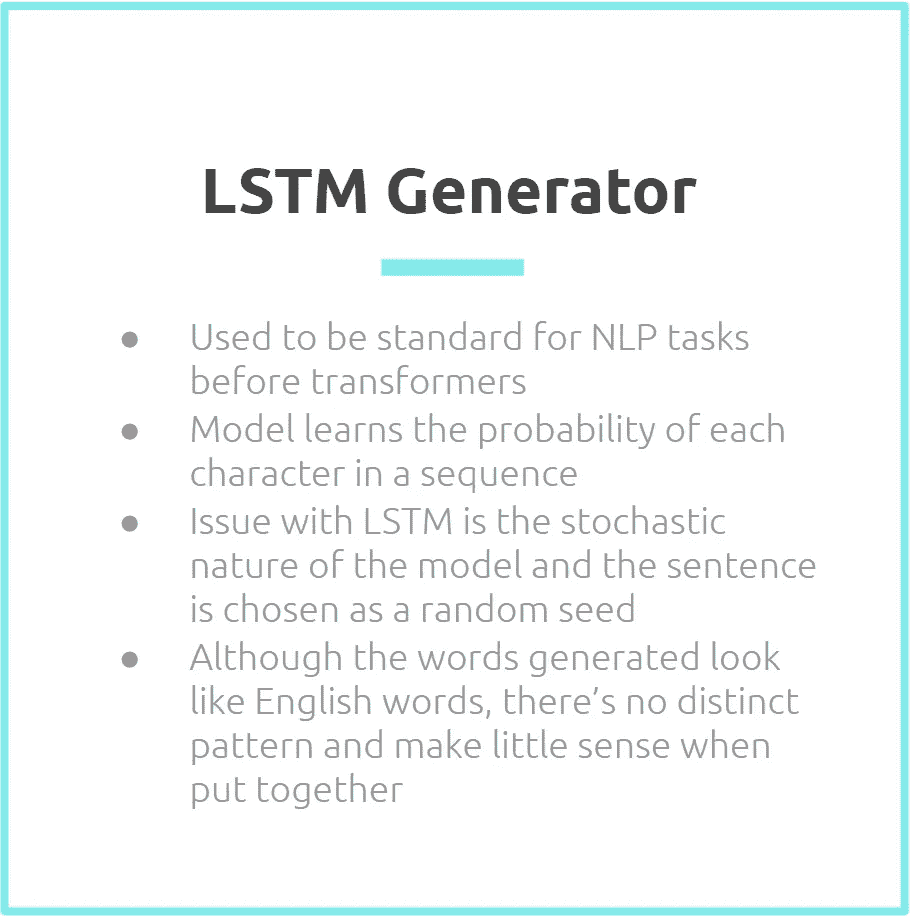
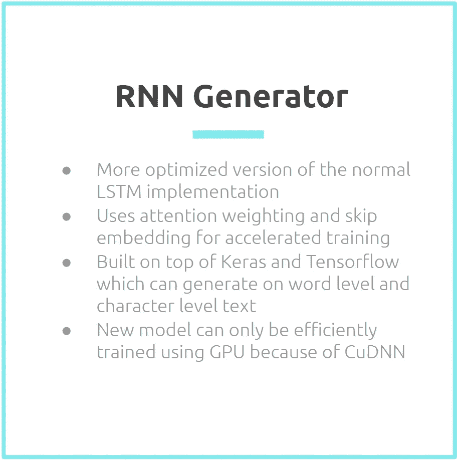
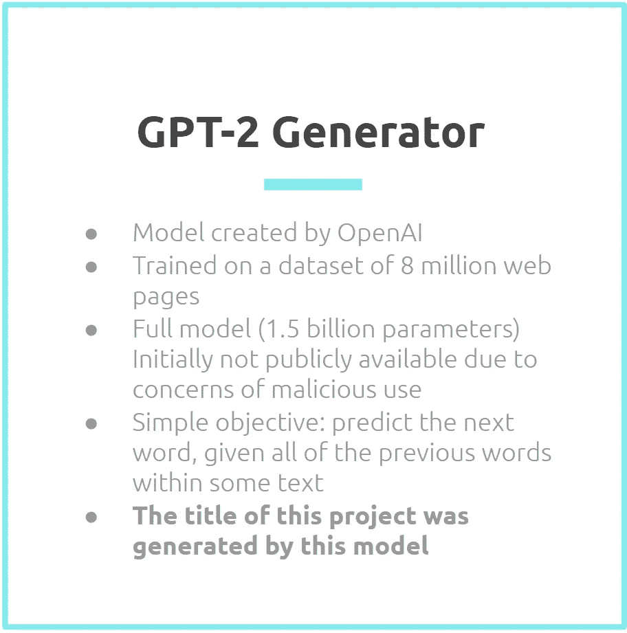
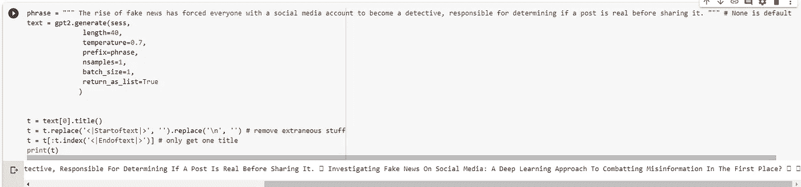
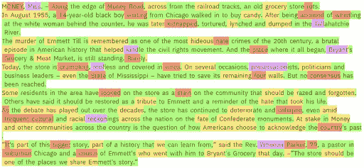
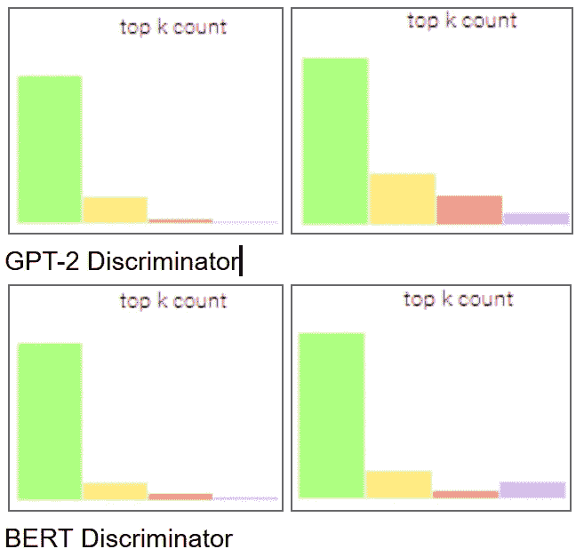

# 对抗错误信息的深度学习方法*

> 原文：<https://towardsdatascience.com/a-deep-learning-approach-to-combating-misinformation-a7cac00bde1c?source=collection_archive---------30----------------------->

*标题由人工智能生成

## 作者:[马丁·贝克](https://www.linkedin.com/in/martbeck/)、[蕾切尔·米德](https://www.linkedin.com/in/rachelmmeade/)、达拉西米·奥卢瓦尼伊、[萨沙·奥佩拉](https://www.linkedin.com/in/alexandra-opela/)、[塞巴斯蒂安·奥索里奥](https://www.linkedin.com/in/sebastianosorioagudelo/?locale=en_US)、[杰克森·罗斯](http://www.linkedin.com/in/jackson-r-ross)、[德罗夫·苏布拉曼尼安](http://www.linkedin.com/in/dhrov-s/)

假新闻的兴起迫使每个拥有社交媒体账户的人成为一名侦探，负责在分享之前确定一篇帖子是否真实。然而，假新闻仍然逃过我们的防线，在网上泛滥，由于真实用户的无知和粗心而被放大。正如 NBC 新闻的这篇文章所示，除了散布恐慌和错误信息，假新闻还有可能对公司和个人的声誉造成真正的损害。为了防止误传的直接和间接成本，需要更好的方法来检测假新闻。虽然一些假新闻是由真实的人写的，只是可信的虚构，但假新闻也可以通过深度学习模型大量生成，加剧了问题。到目前为止，计算机生成的文本很容易与真实的文字区分开来。然而，这个问题已经变得更加紧迫，因为这些自然语言生成模型的巨大改进意味着它们现在可以生成比以往任何时候都更可信的文本。

假新闻无处不在——问题是如何阻止它。

在过去的三年里，变形金刚席卷了自然语言处理任务。像长短期记忆架构这样的残余神经网络在几年前还是最先进的，但已经被 BERT(变形金刚的双向编码器表示)和 OpenAI 强大的新模型 GPT-2(生成式预训练变形金刚 2)等变形金刚超越。这些变形金刚现在以精确的分类和听起来像人类的文本生成引领着行业。作为一个例子，GPT-2 生成的样本如此逼真，以至于 OpenAI 最初拒绝发布完整的训练模型，理由是“担心该技术的恶意应用”

区分真假新闻很重要，但却是一个难以解决的问题，而且随着新模式的出现，这个问题变得更加困难。该项目旨在探索围绕假新闻的产生和检测的挑战性现实。

# 项目目标

*   通过比较来自长短期记忆(LSTM)残差神经网络和来自 OpenAI 的最新转换器(称为 GPT-2)的生成文本，创建自然语言生成模型改进的简要演示。
*   使用鉴别器来尝试准确地分类文本是由最先进的深度学习模型生成的还是由人类生成的。

# 项目概述

该项目分为两个主要部分，如上所述。第二部分——寻找、训练和使用鉴别器对生成的文本进行分类——预计将是一个重大挑战，因为计算机生成的文本已经变得非常难以与人类书写区分开来。

在这个过程的开始，研究和评估了许多模型。通常选择经过训练的模型版本，因为它们能够实现最先进的性能，而不需要几天的训练。LSTM 模型使用 Kaggle 数据集的子集进行了微调。用于微调的数据由来自纽约时报、布莱巴特、CNN、商业内幕、大西洋、福克斯新闻频道、谈话要点备忘录、Buzzfeed 新闻、国家评论、纽约邮报、卫报、NPR、路透社、Vox 和华盛顿邮报的文章组成。根据 Kaggle 上的文档，大多数文章来自 2016 年和 2017 年，少部分来自 2015 年及之前。OpenAI 在 GPT-2 的文档中写道，它应该在特定内容的任务上表现良好，如生成假新闻，无需微调或重新训练，因此使用了 GPT-2 的原始权重。

为了检测假新闻，GPT-2 模型被传递来自真实新闻文章的句子。从这个种子开始，模型生成了长达 500 多个标记的长文本。(记号可以认为是单词和标点符号。)结果，对于每一篇“真正的”文章，都有一个长格式的生成文本，它们共享一个共同的第一句话。每一个生成的文本和真实的文章都通过一个叫做 GLTR 的工具来比较它们的特征。最后，所有的文章被分成一个训练集或测试集，一个 BERT 二元分类器被训练来分类“假”文本。

# 第一部分:LSTM 与变形金刚

自从引入变形金刚以来，自然语言的生成已经有了很大的改进

## 模型选择和基本原理

该团队使用 LSTM(长短期记忆)架构和 transformer 架构探索了文本生成。在 2017 年推出变压器之前，LSTMs 一直被视为 NLP 任务的标准。这样可以进行比较，也可以检查该领域取得的进展。

LSTM(长短期记忆)是一种递归神经网络，它是一种试图对依赖于序列的行为进行建模的模型。这使得 LSTM 成为文本生成的可行候选。在 LSTM 架构中，有 LSTM 单元块来代替标准的神经网络层。这些单元由输入门、遗忘门和输出门组成。要深入了解 LSTM 的建筑(尤其是喀拉斯),可以在这里找到指南。

LSTM 模型最初是由德国计算机科学家于尔根·施密德胡伯和塞普·霍克瑞特尔于 1997 年提出的。他们的出版物描述了他们所做的研究，可以在这里阅读。自 1997 年以来，对 LSTM 进行了改进，例如增加了遗忘门以及在架构中从单元到门的连接。

该代码取自官方的 Keras 文档，最初用于[从尼采的著作中生成文本](https://keras.io/examples/lstm_text_generation/)。使用 LSTM 模型产生的一个问题是随机的，很难[每次固定随机种子以获得 100%可重复的结果](https://machinelearningmastery.com/text-generation-lstm-recurrent-neural-networks-python-keras/)。因此，尽管 LSTM 模型的结果很有趣，但对于项目的目标来说，它并不是非常有用。

除了使用 LSTM 检查文本生成，该团队还使用 OpenAI 的转换器 GPT-2 生成了文本。自 2017 年 Vaswani 等人发表学术论文[“注意力是你所需要的全部”以来，变压器架构通过使用一种称为注意力的技术，已经超越了以前模型的性能。米格尔·罗梅罗·卡尔沃在他写于 Medium 的文章](https://arxiv.org/abs/1706.03762)中很好地解释了注意力是如何在转换器的编码器部分工作的，以及编码器和解码器是如何组合在一起形成一个转换器的。如果您已经熟悉这些架构，或者您对了解它们如何工作的更多技术方面不感兴趣，请继续阅读本文。你不需要应用这些概念来理解项目或其结果。

OpenAI 的 GPT-2 是代表从变形金刚模型生成最先进文本的明显选择。该架构是为文本生成而设计的，不像谷歌人工智能语言研究人员的另一个著名转换器 BERT。GPT 2 号也因其类似人类的性能产生了大量新闻。

GPT-2 模型是使用变压器解码器模块构建的，并且像传统语言模型一样，一次输出一个令牌。它使用字节对编码在其词汇表中创建标记。这意味着标记通常是单词的一部分。

GPT-2 是在一个 800 万网页的数据集上训练的，[被认为是大约 40Gb 的互联网数据](https://openai.com/blog/better-language-models/)。根据 OpenAI 的说法，他们只使用由人类管理/过滤的页面——具体来说，他们使用来自 Reddit 的至少收到 3 个 karma 的出站链接。这给了模型一个自然书写的好主意。

这个语言模型有一个简单的目标:在给定某个文本中所有前面的单词的情况下，预测下一个单词。

GPT-2 至少有四个版本:

*   “小型”模型:1.24 亿个参数，500MB 磁盘空间
*   “中”:3.55 亿个参数，1.5GB 磁盘空间
*   【大】:7.74 亿个参数
*   “超大”:15.58 亿个参数，称为“完整”或“真实模型”，可能占用超过 6.5 GBs 的空间

在所有这些模型可用的情况下，需要进行权衡:较大的模型往往整体表现更好，这意味着当使用较大的模型时，它们会创建更可信的文本，但需要更长的时间来微调和生成文本。为了利用所谓的类似人类的性能，同时仍然有一个足够轻的模型来运行许多文本生成，GPT-2 的“中等”版本被选择来代表模型的变压器类。

## 比较性能

LSTM 示例生成的文本(种子文本以粗体显示):

****‘面对现实的本来面目，而不是本来的样子，或者如你所愿的样子’，说把 l*** *吃了，gadantural 就可以查斯而进入苏塞克斯和王子和萨门特的危局。最后一周的状态和比较和保护和病人的皇家剑桥的领导和帕特查尔斯和案件和地带第一次是从皇家和 raching 她是已知的和说的理由和条件根据免费的迪斯科舞厅，和接触的国家和一个和 retarry 报告君主和自我反省流浪的日子。以生为例，她说君主股自愿为天下之群而生。**

*给定文本，这种情况下的结果并不好。句子不连贯，有些词似乎没有意义。鉴于这是一个旧的 LSTM，一个基于 RNN 的生成器的新版本也被用来生成示例文本。这些改进的示范文本可以更好地比较 RNN 的性能。*

**

*RNN 示例生成的文本(种子文本以粗体显示):*

*****德克萨斯大学奥斯汀分校，*** *tex。而且，一群记者从俄罗斯运动员的名单中，也同样，因为特朗普先生说，他将无法让开，但这在过去五年中并不罕见。华盛顿大学的一组研究人员在一份声明中说:“我们不会让我去学校，告诉我们他们在老房子外面的一个小镇上。“我们不会把你送到大学或学校。”我不想这么做，”特朗普组织的律师迈克尔说，他说，“我觉得我可以把他留在公寓里，这座城市的房子，美国总统说，政府已经“超过”证据。特朗普曾是叙利亚恐怖袭击的目标。*这个国家大概有多少人口**

**这段文字虽然有点荒诞不经，不拘一格，但似乎更有条理，证明了基于 LSTM 的生成器可以很好地生成文本。相同的种子被传递给 GPT-2 生成器，以便更好地进行比较。**

****

**新 GPT 协议生成的文本样本(种子文本以粗体显示):**

**德克萨斯大学奥斯汀分校为想要帮助自己职业生涯的女性机器人学学生提供了一笔高达 6 万美元的奖学金。在该计划的在线部分，参与者将与该大学的一个研究团队合作，创建一个可以在物理空间导航的动画机器人。**

**普通大学生希望设计一个产品，实现一个想法，并有可能获得一份工作。提出“智能机器人实验室”概念的艺术家 Aritappa Chatterjee 说，这通常是不可能的，所以这种类型的项目创造了更多的就业机会。**

**奖学金提供给高中二年级、三年级或四年级的学生。**

***“学生们正在确定这些女性占主导地位的领域，所以我们…”***

**结果与预期相符:GPT-2 创造了可信的短文本，短文本越长，越偏离真实文本。虽然该模型能够保持一个连贯的结构，但仔细观察，其内容可能显得牵强。**

**该模型有一个“温度”设置，一个可以在 0 和 1 之间选择的超参数。温度越高，模型变得越“有创造性”，这意味着它不会添加最有可能的下一个单词，而是从更大的池中取样。因为使用了 0.7 的比较性能温度，这给出了看起来最一致的内容创建。**

**从例子中可以明显看出，GPT-2 在生成文本方面比基于 LSTM 的模型表现得更好。这里选择的例子可以被看作是“樱桃采摘”，但随机选择，通常代表了整体观察到的模式。**

## **正在使用的文本生成的玩具示例**

**这篇文章的标题是由 arxiv.org 过去 6 个月的机器学习相关文章标题微调的 GPT-2 模型生成的。**

****

**生成标题**

**种子短语是本文的第一段:“假新闻的兴起迫使每个拥有社交媒体账户的人都成为一名侦探，负责在分享之前确定一篇帖子是否真实……”**

**完整的输出是:“调查社交媒体上的假新闻:**首先打击错误信息的深度学习方法**？”，粗体文本被保留为标题(！).**

# **第二部分:假新闻检测**

****

## **鉴别器**

**鉴别器是一种深度学习模型，它对不同生成过程产生的样本进行分类(鉴别)。鉴别器通常用于生成对抗神经网络(GANs ),它与生成模型一起工作，以迭代地改进生成过程，使其输出越来越接近“真实”的例子。一种类似的鉴别器被用来鉴别 GPT-2 产生的文本，但所用的过程并不包括对发生器和鉴别器的迭代训练。此外，人类很难识别生成的文本，因此对这种模型的潜在性能有很多怀疑。**

**从另一个角度来看这个问题，如果生成的文本和真实的文章共享相同的主题，那么生成的文本和真实的对应文本之间的相似性的度量可能有助于了解生成的文本的特征。基于“相似性”比较文本的第一种方法是一种称为 bertScore 的改进度量，它计算两个句子中单词的余弦相似性。**

**这种实现虽然表面上看起来很有前途，但并没有说明所使用的生成模型所展示的“创造性”。虽然相似性确实可以计算和进一步分析，但生成的文本在内容上与原始文本有很大差异。从一条关于新奖学金获得者的新闻中提取的种子句子可能会导致关于一个年轻而聪明的策划者的珠宝抢劫案的生成文本。在完全不同的上下文中评估相似性被证明对提供洞察力没有帮助，因为度量标准只是报告生成的文本与原始文章非常不同。**

**在评估这种相似性度量时，观察到生成的文本倾向于使用不太复杂的词汇，并且经常依赖于重复的短语。相比之下，最初的新闻文章更倾向于通过逻辑故事线流动，沿途经过不同的主题和想法。这一观察刺激了对诸如巨型语言模型测试室等工具的进一步研究，这些工具似乎也依赖于生成文本的复杂性和多样性。**

****

**这个 **G** iant **L** 语言模型**T**est**R**oom([GLTR](http://gltr.io/dist/index.html))是由哈佛 NLP 和麻省理工学院-IBM 沃森人工智能实验室合作创建的。这个工具利用了一个模型，伯特或 GPT-2，它一个字一个字地查看这个词在句子中被选中的概率。在下面的图片中，绿色代表最有可能的前 10 个单词中的一个单词，黄色是前 100 个，红色是前 1000 个，紫色大于 1000 个。这意味着绿色单词是模型可能输出为下一个单词的单词，并且随着该单词变得不太可能被模型选择，它落入其他颜色箱中的一个。例如，下面的图片是一个人写的纽约时报文章的片段。这篇文章有几个可预测的词，但也包括许多生成模型不太可能选择的词。那是因为人类在书写时没有考虑到 ***最有可能是*** 的下一个单词；他们会考虑哪个词最适合文章的上下文以及他们想要表达的意思。**

****

**单词分布的差异显示在所示的四幅图像中。当使用带有 GPT-2 鉴别器的 GLTR 工具时，虚假文章(左上)比真实文章(右上)具有更高的高预测性单词分布。当对假文本(左下)和真文本(右下)使用 BERT 鉴别器时，发现了类似的模式。有了这两种鉴别器，在发电机和人类的词汇选择上就有了明显的区别。这支持了我们的直觉，即生成器只会基于单词的概率而不是基于上下文来构造文本。虽然这个项目没有开发一个数字度量来确定一个文本是否是计算机生成的，但是查看 GLTR 的输出可以提供一些见解。**

**针对上述限制，寻求第二种鉴别器。在研究假新闻鉴别器时，一些作者分享了他们使用 BERT 编码器结合某种分类器的成功经验。出于输出/输入兼容性的考虑，选择了 BERT 编码器和 BERT 二进制分类器的组合，并按照本例中的[用 Python 实现了分类器。尽管原始 Medium 文章的作者对这种分类器寄予厚望，但该模型的计算成本很高(运行一个时期估计需要 15-21 小时)，并且在该项目的实验运行中，无法以比简单猜测更好的速度对“真实”和生成的文本进行分类。有可能我们的实现过于简单，应该在传递到 BERT 编码器之前对输入进行额外的特性工程处理。或者，这种特征增强在 BERT 编码器和 BERT 二进制分类器之间可能是有用的。然而，为这个项目所做的工作没有提供任何有希望的迹象，表明这种额外的努力可能会产生预期的精度增益。](/fake-news-classification-with-bert-afbeee601f41)**

**BERT 分类器的缺点表明了最先进的自然语言生成模型的优异性能。依靠复杂性和创造性的措施，结合整体一致性的措施的鉴别器是有潜力的。像 GPT-2 这样的模型可以骗过一个鉴别器，它只是简单地设置一个阈值，看看单词不在最有可能被选择的前 10 名或前 100 名中的频率。人们可以通过提高模型的温度来做到这一点，给它更多的自由来探索鉴别者可能认为“不太可能”的单词和概念。但是如果鉴别者也可以测量整篇文章的连贯性，那么它将更容易识别出这些文本是生成的，因为更多“创造性”的文本往往对阅读它们的人来说最没有意义。**

## **未来工作的领域**

*   **创建一个侧重于复杂性/创造性的评分标准**
*   **创建一个使用此度量的虚假文本分类器**
*   **进一步考察“虚假”的特征**
*   **使用白盒对抗性攻击来观察哪些特征使文本更有可能是假的**

# **结论**

**这个项目展示了自然语言生成模型在过去三四年中的进展:从 LSTMs 的不连贯到现在由 OpenAI 开发的听起来很流畅的 GPT-2 模型。撇开发展生成模型的这些进展不谈，人们可以看到这可能留给我们的危险境地。生成文本模型没有“真实”或“虚假”之分，因此听起来真实的生成模型几乎肯定会产生可信的“假新闻”展望未来，人工智能研究人员、学者和行业领袖将面临越来越不可能的任务，即找到识别生成文本的方法。**

# **链接到 GitHub Repo**

**[认知计算 GitHub](https://github.com/stevenoluwaniyi/cognitive_computing)**