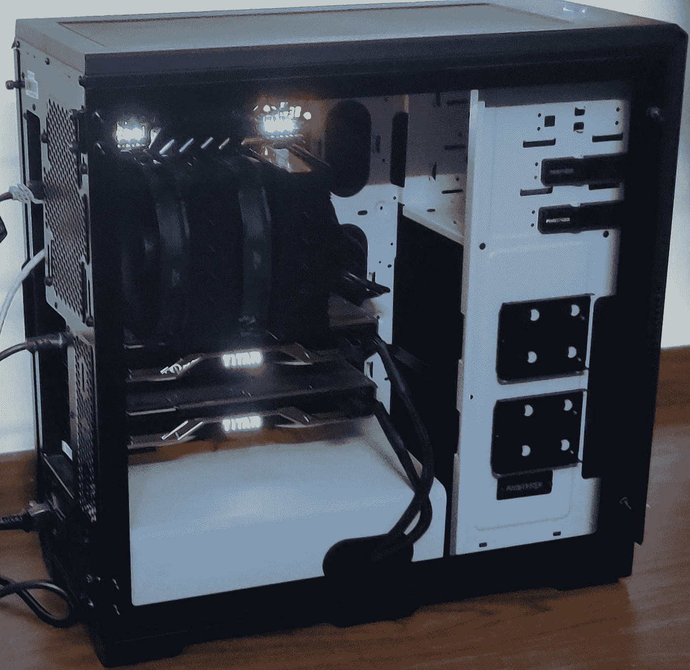
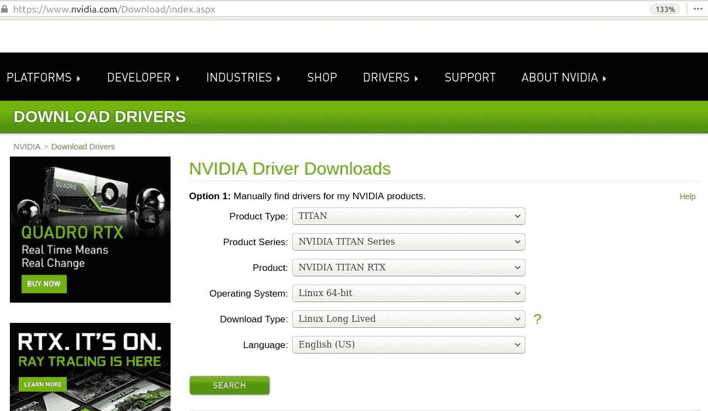
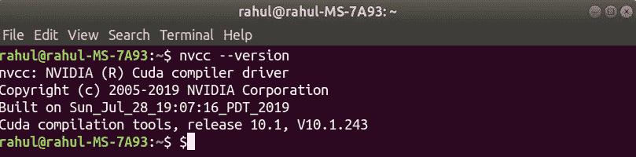
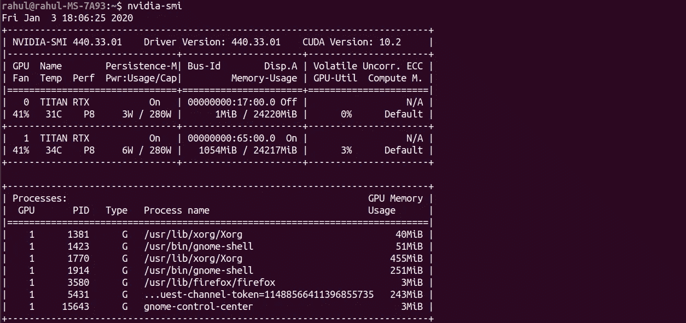
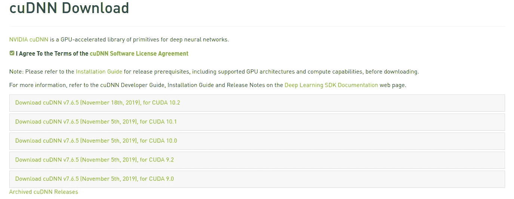
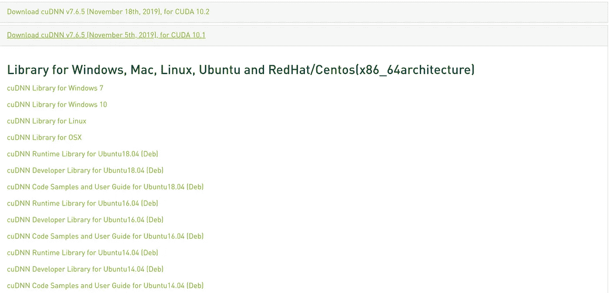
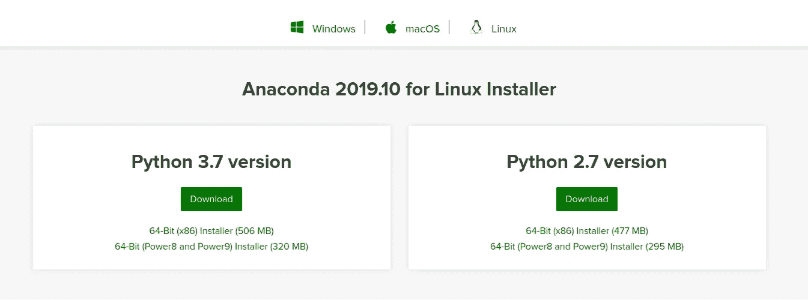
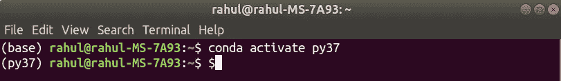
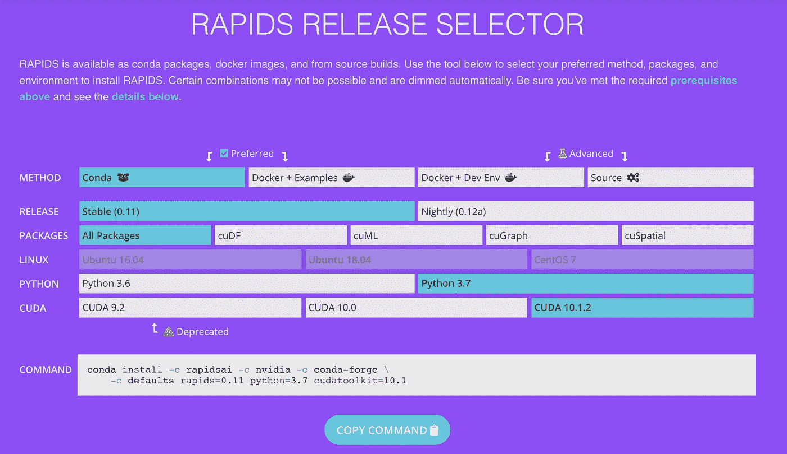

# 使用 Ubuntu 18.04 设置深度学习工作站的权威指南

> 原文：<https://towardsdatascience.com/a-definitive-guide-for-setting-up-a-deep-learning-workstation-with-ubuntu-18-04-5459d70e19c3?source=collection_archive---------2----------------------->



## DL 钻机

## CUDA，CuDNN，Python，Pytorch，Tensorflow，RAPIDS

Lambda 和其他供应商提供预建的[深度学习工作站](https://lambdalabs.com/gpu-workstations/vector?utm_source=medium-rahul-agarwal&utm_medium=blog-shout-out&utm_campaign=blogin)，配备新的安培 RTX 3090、3080 和 3070 GPU——但如果你有兴趣构建自己的工作站，请继续阅读。

创建自己的工作站至少是我的一个梦想。我知道这个过程，但不知何故，我从来没有去过。

但这次我不得不这么做。因此，我找了一些空闲时间，在 NVIDIA 的帮助下创建了一个深度学习平台，他们非常有帮助。在这方面，特别感谢[乔希·帕特森](https://medium.com/u/a994b4ad25d0?source=post_page-----5459d70e19c3--------------------------------)和迈克尔·库帕。

现在，每当我从安装角度创建整个深度学习设置时，我都会面临类似的挑战。这就像是带着各种各样的依赖和错误在兜圈子。这一次，我也不得不在整个配置没有错误的情况下尝试很多东西。

*所以这一次，在我自己的系统中安装所有需求和它们的依赖关系时，我特意记录了所有的东西。*

***这篇帖子是关于设置你自己的 Linux Ubuntu 18.04 系统，用于深度学习，拥有你可能需要的一切。***

*如果首选预建的深度学习系统，我可以推荐工作站和服务器的* [*Exxact 的 line*](https://www.exxactcorp.com/Deep-Learning-NVIDIA-GPU-Solutions?utm_source=web%20referral&utm_medium=backlink&utm_campaign=Rahul%20Agarwal) *。*

我假设你已经安装了新的 Ubuntu 18.04。我从 2017 年的[斯拉夫·伊万诺夫的](https://blog.slavv.com/@slavivanov?source=post_page-----148c5ebe6415----------------------)精彩[帖子中获得了关于创建深度学习盒子的灵感。从设置的角度来看，你可以将它称为同一篇文章的 2020 版本，但从那时起许多事情都发生了变化，并且有许多关于 Tensorflow 和 Pytorch 不支持的特定 CUDA 版本的警告。](https://blog.slavv.com/the-1700-great-deep-learning-box-assembly-setup-and-benchmarks-148c5ebe6415)

# 启动


由 [Serghei Trofimov](https://unsplash.com/@sergeytrofimov?utm_source=medium&utm_medium=referral) 在 [Unsplash](https://unsplash.com?utm_source=medium&utm_medium=referral) 上拍摄

在对我们的安装做任何事情之前，我们需要将我们的 Linux 系统更新到最新的包。我们可以简单地通过使用:

```
sudo apt-get update
sudo apt-get --assume-yes upgrade
sudo apt-get --assume-yes install tmux build-essential gcc g++ make binutils
sudo apt-get --assume-yes install software-properties-common
sudo apt-get --assume-yes install git
```

# 该过程

现在我们已经做好了一切准备，我们要安装以下四样东西:

1.  GPU 驱动程序:为什么你的电脑不支持高图形分辨率？或者你的显卡如何与你的 python 接口对话？
2.  **CUDA** :提供访问 GPU 指令集和并行计算单元的层。简单地说，它允许我们为 GPU 编写代码
3.  **CuDNN** :为深度学习网络提供原语的库
4.  **Pytorch、Tensorflow 和 Rapids** :编码深度神经网络的高级 API

## 1.GPU 驱动程序

第一步是添加最新的 NVIDIA 驱动程序。18.04 版本可以选择 GPU 产品类型，Linux 64 bit，下载类型为“Linux 长寿命”。



点击搜索将带您进入下载页面:


您可以从这里下载驱动程序文件`NVIDIA-Linux-x86_64–440.44.run`并使用以下命令运行它:

```
chmod +x NVIDIA-Linux-x86_64–440.44.run
sudo sh NVIDIA-Linux-x86_64–440.44.run
```

对于您来说，该文件可能会有不同的名称，这取决于最新的版本。

## 2.库达

我们现在需要安装 CUDA 工具包。不知何故，Pytorch 和 Tensorflow 仍然不支持 CUDA toolkit 10.2，所以我们将使用两者都支持的 CUDA Toolkit 10.1。

此外，CUDA 10.1 产品页面上的命令对我不起作用，我最终使用的命令是:

```
sudo apt-key adv --fetch-keys [http://developer.download.nvidia.com/compute/cuda/repos/ubuntu1804/x86_64/7fa2af80.pub](http://developer.download.nvidia.com/compute/cuda/repos/ubuntu1804/x86_64/7fa2af80.pub) && echo "deb [https://developer.download.nvidia.com/compute/cuda/repos/ubuntu1804/x86_64](https://developer.download.nvidia.com/compute/cuda/repos/ubuntu1804/x86_64) /" | sudo tee /etc/apt/sources.list.d/cuda.listsudo apt-get update && sudo apt-get -o Dpkg::Options::="--force-overwrite" install cuda-10-1 cuda-drivers
```

下一步是创建 LD_LIBRARY_PATH，并将安装 CUDA 的路径附加到 PATH 变量中。只需在您的终端上运行以下命令。

```
echo 'export PATH=/usr/local/cuda-10.1/bin${PATH:+:${PATH}}' >> ~/.bashrc && echo 'export LD_LIBRARY_PATH=/usr/local/cuda-10.1/lib64${LD_LIBRARY_PATH:+:${LD_LIBRARY_PATH}}' >> ~/.bashrc && source ~/.bashrc && sudo ldconfig
```

之后，可以使用以下命令检查 CUDA 是否安装正确:

```
nvcc --version
```



如你所见，CUDA 版本是我们想要的 10.1。另外，检查您是否可以使用该命令:

```
nvidia-smi
```

对我来说，当我第一次使用它时，它显示了一个错误，但是一个简单的重启就解决了这个问题。我的两个 NVIDIA 显卡都光彩照人。不用担心显示屏上说支持的 CUDA 版本是 10.2。我也被[弄糊涂了](https://stackoverflow.com/questions/53422407/different-cuda-versions-shown-by-nvcc-and-nvidia-smi)，但这只是`nvidia-smi`中显示的图形驱动程序支持的最高 CUDA 版本。



## 3.CuDNN

如果我们不打算训练神经网络，那么所有这些库有什么用？CuDNN 提供了深度学习的各种原语，后来被 PyTorch/TensorFlow 使用。

但是我们首先需要得到一个[开发者帐号](https://developer.nvidia.com/rdp/form/cudnn-download-survey)来安装 CuDNN。一旦你填写了注册表格，你会看到下面的屏幕。选择适合您的 CUDA 版本的 cuDNN 版本。对我来说，CUDA 版本是 10.1，所以我选择第二个。



选择合适的 CuDNN 版本后，屏幕会展开:



对于我的用例，我需要为 Ubuntu 18.04 下载三个文件:

```
[cuDNN Runtime Library for Ubuntu18.04  (Deb)](https://developer.nvidia.com/compute/machine-learning/cudnn/secure/7.6.5.32/Production/10.1_20191031/Ubuntu18_04-x64/libcudnn7_7.6.5.32-1%2Bcuda10.1_amd64.deb)[cuDNN Developer Library for Ubuntu18.04  (Deb)](https://developer.nvidia.com/compute/machine-learning/cudnn/secure/7.6.5.32/Production/10.1_20191031/Ubuntu18_04-x64/libcudnn7-dev_7.6.5.32-1%2Bcuda10.1_amd64.deb)[cuDNN Code Samples and User Guide for Ubuntu18.04  (Deb)](https://developer.nvidia.com/compute/machine-learning/cudnn/secure/7.6.5.32/Production/10.1_20191031/Ubuntu18_04-x64/libcudnn7-doc_7.6.5.32-1%2Bcuda10.1_amd64.deb)
```

下载这些文件后，您可以使用这些命令进行安装。如果未来发生任何变化，您还可以看到确切的[命令](https://docs.nvidia.com/deeplearning/sdk/cudnn-install/index.html):

```
# Install the runtime library:
sudo dpkg -i libcudnn7_7.6.5.32-1+cuda10.1_amd64.deb#Install the developer library:
sudo dpkg -i libcudnn7-dev_7.6.5.32-1+cuda10.1_amd64.deb#Install the code samples and cuDNN User Guide(Optional):
sudo dpkg -i libcudnn7-doc_7.6.5.32-1+cuda10.1_amd64.deb
```

## 4.蟒蛇，Pytorch，张量流和急流

最后，我们到达了症结所在。我们将安装大部分时间都要使用的软件。

我们需要在虚拟环境中安装 Python。我已经下载了 python3，因为它是目前最稳定的版本，是时候和 Python 2.7 说再见了。当它持续的时候，它是伟大的。我们还将安装 Pytorch 和 Tensorflow。在适用的特定任务中，我更喜欢他们两个。

你可以去 [anaconda 发行版](https://www.anaconda.com/distribution/)页面下载这个包。



下载后，您只需运行 shell 脚本:

```
sudo sh Anaconda3-2019.10-Linux-x86_64.sh
```

您还需要在您的 shell 上运行这些命令，将一些命令添加到您的`~/.bashrc`文件中，并使用最新的库版本更新 conda 发行版。

```
cat >> ~/.bashrc << 'EOF'
export PATH=$HOME/anaconda3/bin:${PATH}
EOFsource .bashrc
conda upgrade -y --all
```

下一步是为你的深度学习追求创造一个新的环境，或者使用一个现有的环境。我使用以下工具创建了一个新的 Conda 环境:

```
conda create --name py37
```

这里，py37 是我们为这个新的 conda 环境提供的名称。您可以使用以下方式激活 conda 环境:

```
conda activate py37
```

您现在应该能够看到类似这样的内容:



请注意终端中命令开头的 py37

我们现在可以使用 pip 或 conda 将所有需要的包添加到这个环境中。正如我已经提到的，从 [pytorch 网站](https://pytorch.org/get-started/locally/)看到的最新版本 1.3 还不能用于 CUDA 10.2，所以我们很幸运有了 CUDA 10.1。此外，我们需要将 TensorFlow 的版本指定为 2.1.0，因为这个版本是使用 10.1 CUDA 构建的。

我还安装了 RAPIDS，这是一个将各种数据科学工作负载转移到 GPU 的库。为什么 GPU 只用于深度学习而不用于数据处理？您可以从 [rapids 发布选择器](https://rapids.ai/start.html)中获得安装 rapids 的命令:



```
sudo apt install python3-pipconda install -c rapidsai -c nvidia -c conda-forge -c defaults rapids=0.11 python=3.7 cudatoolkit=10.1pip install torchvision
```

由于 PyTorch 安装会干扰 TensorFlow，所以我在另一个环境中安装了 TensorFlow。

```
conda create --name tf
conda activate tf
pip install --upgrade tensorflow
```

现在，我们可以通过在 TF 和 Pytorch 各自的环境中使用以下命令来检查它们的安装是否正确:

```
# Should print True
python3 -c "import tensorflow as tf; print(tf.test.is_gpu_available())"# should print cuda
python3 -c "import torch; print(torch.device('cuda' if torch.cuda.is_available() else 'cpu'))"
```

如果安装显示 TensorFlow 出现一些错误，或者 GPU 测试失败，您可能需要在`bashrc`文件的末尾添加这两行，然后重新启动终端:

```
export LD_LIBRARY_PATH=$LD_LIBRARY_PATH:/usr/local/cuda/extras/CUPTI/lib64:/usr/local/cuda/lib64export CUDA_HOME=/usr/local/cuda
```

你可能还想安装`jupyter lab`或`jupyter notebook`。感谢开发者，这个过程就像在你的终端上运行`jupyter lab`或`jupyter notebook`一样简单，无论你喜欢哪个。我个人更喜欢没有不必要的杂物的笔记本。

# 结论

***在这篇文章中，我谈到了你将需要毫不费力地在你的深度学习装备中安装的所有软件。***

你可能仍然需要一些帮助和面对一些问题，我最好的建议是去看看不同的 NVIDIA 和 Stack Overflow 论坛。

因此，我们已经有了深度学习装备设置，现在是进行一些测试的时候了。在接下来的几篇文章中，我将对 GPU 进行一些基准测试，并尝试编写更多关于各种深度学习库的文章，这些库可以包含在他们的工作流中。敬请关注。

# 继续学习

如果你想了解更多关于[深度学习的知识，这里](https://coursera.pxf.io/7mKnnY)是一门优秀的课程。您可以免费开始 7 天的免费试用。

谢谢你的阅读。将来我也会写更多初学者友好的帖子。在 [**媒体**](https://medium.com/@rahul_agarwal?source=post_page---------------------------) 关注我或者订阅我的 [**博客**](https://mlwhiz.ck.page/a9b8bda70c) 了解他们。一如既往，我欢迎反馈和建设性的批评，可以通过 Twitter[**@ mlwhiz**](https://twitter.com/MLWhiz?source=post_page---------------------------)联系

此外，一个小小的免责声明——这篇文章中可能会有一些相关资源的附属链接，因为分享知识从来都不是一个坏主意。