# 影响大小的权威指南

> 原文：<https://towardsdatascience.com/a-definitive-guide-to-effect-size-9bc93f00db86?source=collection_archive---------8----------------------->


由 [Kaboompics 拍摄的照片。com](https://www.pexels.com/@kaboompics?utm_content=attributionCopyText&utm_medium=referral&utm_source=pexels) 来自 [Pexels](https://www.pexels.com/photo/scientific-calculator-ii-5775/?utm_content=attributionCopyText&utm_medium=referral&utm_source=pexels)

## 了解如何正确计算和解释 A/B 测试的影响大小！

作为一名数据科学家，在进行某种 A/B 测试时，您很可能会遇到影响大小的问题。一种可能的情况是，公司希望对产品进行更改(无论是网站、移动应用程序等。)而你的任务是确保这种改变在一定程度上会带来更好的 KPI 表现。

这就是假设检验发挥作用的时候了。然而，统计测试只能告知影响存在的可能性。就效果而言，我只是指一种差异——它可以是两个方向上的差异，但也可以是一种假设的更精确的变体，即一个样本实际上比另一个样本更好/更差(根据给定的指标)。为了知道影响有多大，我们需要计算影响大小。

在本文中，我将提供一个关于效果大小的简单理论介绍，然后展示一些如何在 Python 中计算它的实际例子。

# 理论介绍

从形式上来说，**效应大小**是我们正在研究的现象的量化大小。如前所述，统计测试得出了观察到一种效应的概率，然而，它们并没有具体说明这种效应实际上有多大。这可能会导致这样的情况:我们检测到统计上的显著影响，但它实际上非常小，对于实际情况(业务)来说，它可以忽略不计，一点也不有趣。

此外，在计划 A/B 测试时，我们希望估计测试的预期持续时间。这与**功耗分析**的主题有关，我在[的另一篇文章](/introduction-to-power-analysis-in-python-e7b748dfa26)中提到过。快速总结一下，为了计算所需的样本量，我们需要指定三件事:显著性水平、检验的功效和效应大小。保持其他两个不变，效应大小越小，就越难以某种确定性来检测它，因此统计检验所需的样本量就越大。

一般来说，可能有数百种不同的效果大小的测量方法，每一种都有一些优点和缺点。在这篇文章中，我将只介绍一些最流行的。在深入研究兔子洞之前，效应大小的度量可以根据它们定义效应的方法分为三类。这些群体是:

*   基于相关性的度量
*   基于差异的指标(例如，平均值之间)
*   分类变量的度量

前两个系列涵盖连续随机变量，而最后一个系列用于分类/二元特征。举一个现实生活中的例子，我们可以将前两个应用于一个指标，如在一个应用程序中花费的时间(以分钟为单位)，而第三个系列可以用于转换或保留-以布尔值表示。

我将在下面描述一些效果大小的度量，以及 Python 实现。


Vishwarajsinh Rana 在 [Unsplash](https://unsplash.com/s/photos/calculator?utm_source=unsplash&utm_medium=referral&utm_content=creditCopyText) 上拍摄的照片

# Python 中的示例

在这一部分中，我将更详细地描述每个效果大小系列的几个例子，并展示如何使用流行的库在 Python 中计算它们。当然，我们也可以自己编写这些函数，但是我认为没有必要重新发明轮子。

作为第一步，我们需要导入所需的库:

## 1.相关家族

这个组的名字(也称为“r 族”)来自两个变量之间关联的度量——相关性。到目前为止，最流行的相关性度量是皮尔逊相关系数(皮尔逊的 *r* )。

在深入研究指标之前，我们将从多元正态分布中生成一些随机的相关变量。它们有不同的含义，因此我们实际上可以检测到一些影响，同时为了简单起见，我们将方差保持为 1。

请记住，我们生成的随机观察越多，它们的分布就越像我们指定的分布。

**皮尔森的*r***

这并不奇怪，因为这个家族的名字就是基于这个标准。皮尔逊相关系数衡量两个实值变量之间的线性关联程度。该度量是无单位的，表示为[-1，1]范围内的数字。为简洁起见，我只描述极端情况的解释:

*   值-1 表示变量之间完全负相关，
*   值 0 表示没有线性关系，
*   值为 1 表示完美的正关系。

由于这通常是最常用的指标之一，因此在 Python 中有许多计算相关系数的方法:

*   `pearsonr`在`scipy.stats`中——除了相关系数，我们还接收相关测试的 p 值。引用[文档](https://docs.scipy.org/doc/scipy/reference/generated/scipy.stats.pearsonr.html):"*p 值大致表示不相关系统产生的数据集的皮尔逊相关性至少与从这些数据集计算出的值一样极端的概率。*

```
stats.pearsonr(x[:,0], x[:,1])
# (0.6023670412294826, 0.0)
```

*   `numpy.corrcoef` —返回相关矩阵，使用`rowvar`指示随机变量的观察值是存储在行中还是列中。

```
np.corrcoef(x, rowvar=False)
# array([[1\.        , 0.60236704],
#        [0.60236704, 1\.        ]])
```

*   `pandas`数据帧/系列的`corr`方法。
*   `pingouin`的`corr`函数——默认情况下，它返回皮尔逊的 *r* 系数(也可以使用其他相关性度量)。与`scipy`相反，该函数返回相关性测试的更详细的结果。我们也可以使用检验的单侧变量。

```
pg.corr(x[:, 0], x[:, 1])
```

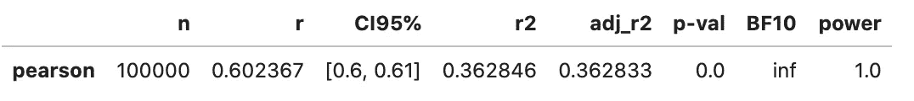

**决定系数(R )**

在这个家族中，效应大小的第二个度量是决定系数，也称为 R。它说明了自变量解释(可预测)的因变量方差的比例。换句话说，这是一个衡量观察到的结果如何被模型复制的标准。

决定系数有几种定义，然而，对我们来说最相关的是与皮尔逊的 r 相关的定义。当使用包含截距的简单线性回归(有一个因变量)时，决定系数就是皮尔逊的 *r* 的平方。如果有更多的因变量，R 是多重相关系数的平方。

在上述任何一种情况下，决定系数通常在 0 和 1 之间。但是，如果使用另一个定义，这些值也可能变成负值。由于我们平方相关系数的事实，决定系数不传达任何关于相关方向的信息。

我们可以通过运行简单的线性回归并检查报告值来计算决定系数:

*   使用`pingouin`:

```
pg.linear_regression(x[:, 0], x[:, 1])
```

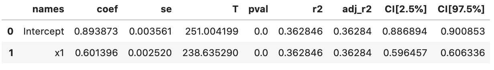

*   使用`statsmodels`:

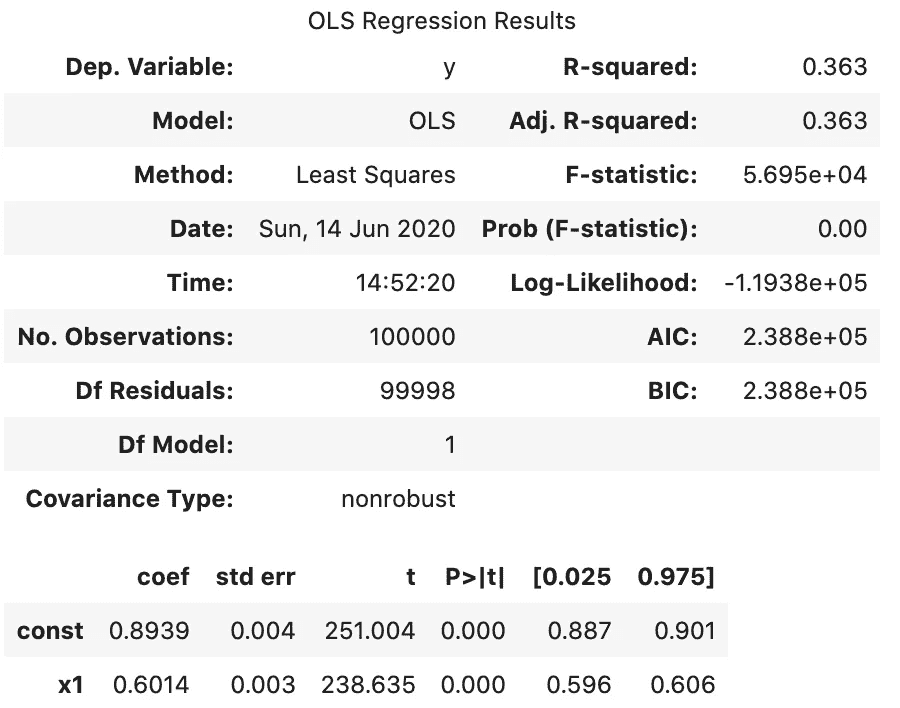

在这两种情况下，决定系数接近 0.36，这是相关系数(0.6)的平方。

**η平方( *η* )**

该系列中最后考虑的度量是 eta 平方。它是一个预测因子在因变量中解释的方差比率，同时控制其他预测因子，这使它类似于 r。

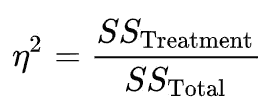

其中 SS 代表平方和。 *η* 是模型解释的总体方差的有偏估计量，因为它仅估计所考虑样本中的效应大小。这意味着 eta 平方将总是高估实际效应大小，尽管这种偏差随着样本大小的增加而变小。Eta-squared 也有 r 的弱点——每个额外的变量都会自动增加 *η* 的值。

为了用 Python 计算 eta 的平方，我们可以使用`pingouin`库:

```
pg.compute_effsize(x[:, 0], x[:, 1], eftype='eta-square')
# 0.057968511053166284
```

此外，该库包含一个名为`convert_effsize`的有用函数，它允许我们将 Pearson 的 *r* 或 Cohen 的 *d* 测量的效果大小转换为 eta-squared 等。

## 2.“差异”家庭

第二个家族被称为差异家族，这可能是衡量效应大小的最常用方法——计算样本平均值之间的差异。通常，该差异也通过除以标准偏差(任一或两个群体)来标准化。

实际上，人口数值是未知的，只能通过抽样统计来估计。这就是为什么有多种方法来计算均值之间的差异的影响大小——它们在使用的样本统计方面有所不同。

另一方面，这种估计效应大小的形式类似于计算 *t* 统计量，不同之处在于标准偏差除以 *t* 统计量分母中 *n* 的平方根。与 T21 统计不同，效应大小旨在估计总体水平的值，不受样本大小的影响。

这一族也被称为“ *d 族*”，以估计效应大小的最常见方法——Cohen 的 *d.* 命名

在深入研究指标之前，我们先定义两个来自正态分布的随机变量。我们使用不同的均值和标准差来确保变量有足够的差异来获得合理的效应大小。

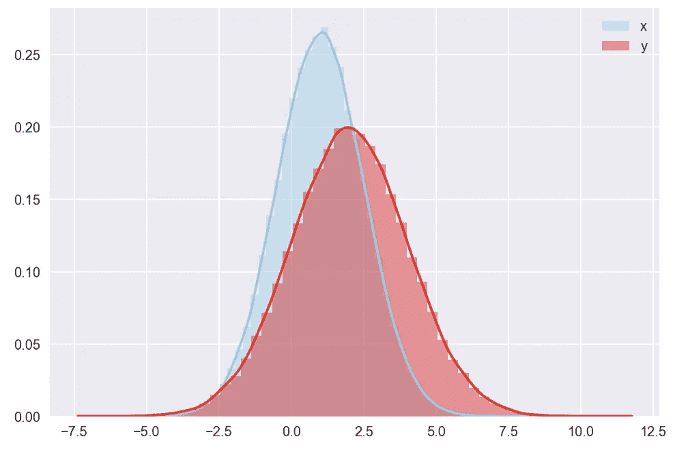

两个随机变量的分布

**科恩的 d**

科恩的 *d* 测量两个变量的均值之间的差异。差异以标准差的数量表示，因此在公式中有除法。科恩的 *d* 定义为:


其中 *s* 为合并标准差，S1、S2 为两个独立样本的标准差。

**注**:一些来源使用不同的集合标准差公式，并且分母中不包括-2。

对效应大小的最常见解释如下:

*   小效果尺寸:d=0.2
*   中等效果尺寸:d=0.5
*   大效果尺寸:d=0.8

Cohen 的 *d* 经常用于估算 A/B 测试所需的样本量。一般来说，Cohen 的 *d* 值越低，表明需要更大的样本量，反之亦然。

在 Python 中计算 Cohen 的 *d* 的最简单方法是使用`pingouin`库:

```
pg.compute_effsize(x, y, eftype='cohen')
# -0.5661743543595718
```

## 玻璃'δ'

Glass 的δ与 Cohen 的 *d* 非常相似，不同之处在于使用了第二个样本(A/B 测试中的对照组)的标准偏差，而不是混合标准偏差。


仅使用对照组的标准差的基本原理是基于这样的事实，即如果我们将多个治疗组与同一对照组进行比较，这样我们将在所有情况下具有共同的标准。

```
pg.compute_effsize(x, y, eftype='glass')
# -0.6664041092152272
```

**对冲的 g**

Cohen 的 *d* 是总体水平效应大小的有偏估计量，尤其是对于小样本(n < 20)。这就是为什么 Hedge 的 *g* 通过将 Cohen 的 *d* 乘以修正系数(基于伽马函数)来进行修正:

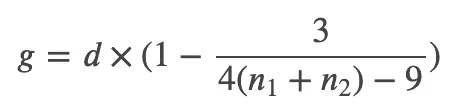

```
pg.compute_effsize(x, y, eftype='hedges')
# -0.5661722311818571
```

我们可以看到科恩的 *d* 和对冲的 *g* 的差别非常小。对于较小的样本量，这种情况会更明显。

## 3.绝对家族

这一族用于估计分类(以及在一些简单的情况下——二元)随机变量的效应大小。我们通过运行以下代码片段来生成该部分的随机变量:

**φ(φ系数)**

phi 系数是卡尔·皮尔逊引入的两个二元变量之间关联的度量，与 2x2 [列联表](https://en.wikipedia.org/wiki/Contingency_table)的卡方统计相关。在机器学习术语中，列联表基本上与混淆矩阵相同。

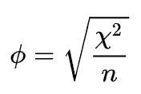

当大部分数据落在列联表的对角线上时，两个二元随机变量是正相关的(想想真正的正和真正的负)。相反，当大部分数据脱离对角线时，变量是负相关的(想想假阳性和假阴性)。

事实上，为两个二元变量计算的皮尔逊相关系数( *r* )会得出 phi 系数(我们将用 Python 来证明)。然而，phi 系数的范围不同于相关系数，尤其是当至少一个变量取两个以上的值时。

此外，在机器学习中，我们看到马修斯相关系数作为评估分类模型性能的一种度量标准越来越受欢迎。事实上，MCC 就是皮尔逊的 phi 系数。

Phi/MCC 考虑了混淆矩阵/列联表的所有元素，这就是为什么它被认为是一个平衡的评估指标，也可以在类别不平衡的情况下使用。

运行代码会产生以下输出:

```
Phi coefficient: 0.000944
Matthews Correlation: 0.000944
Pearson's r: 0.000944
```

**克莱默 V**

cramér’s V 是分类变量之间关联的另一种度量(不限于二元情况)。


其中 *k* 和 *r* 代表列数和行数，φ是上面计算的φ系数。

克拉默的 V 取值范围为 0(变量之间没有关联)到 1(完全关联)。请注意，对于 2x2 列联表(两个二元变量)的情况，Cramér 的 V 等于 phi 系数，我们将很快在实践中看到这一点。

对克拉默 V 的大小最常见的解释如下:

*   小效果尺寸:V ≤ 0.2
*   中等效果尺寸:0.2 < V ≤ 0.6
*   Large Effect Size: 0.6 < V

```
Cramer's V: 0.000944
```

We have indeed obtained the same value as in the case of the phi coefficient.

**科恩的 w**

Cohen 提出了效应大小的另一种度量，它“随着替代假设指定的分布与代表零假设的分布之间的差异程度而增加”(更多详细信息，请参见[1]第 216 页)。在这种情况下，我们处理的是比例(所有观察值的一部分)，而不是之前度量的列联表。

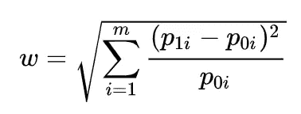

其中:

*   p_{0i} —零假设下单元格 *i* 中的比例，
*   p_{1i} —替代假设下单元格 *i* 中的比例，
*   m —细胞数量。

Cohen 的 *w* 测量的效应大小被认为对于接近 0.1 的值是小的，对于大约 0.3 是中等的，对于大约 0.5 是大的。

```
Cohen's w: 0.173820
```

**科恩的 h**

另一种用于比较两个独立样本比例的方法是科恩的 *h* ，定义如下:

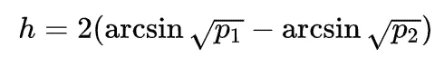

其中 P1 代表第一个样本中阳性病例的比例。为了评估影响大小的大小，作者提出了与科恩的 *d* 相同的指示值范围。

```
Cohen's h: 0.174943
```

**优势比**

通过比值比测量的效应大小通过注意到治疗组中事件发生的比值比对照组高/低 X 倍来计算。

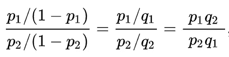

```
Odds Ratio: 1.374506
```

事件(例如转化)发生的几率在`x`组中比在`y`组中高约 1.37 倍，这与生成数据时提供的概率一致。

## **加成:通用语言效果大小**

最后一个指标非常有趣，因为——顾名思义——它旨在用每个人都能理解的简单语言来表达效果大小。也不属于上面提到的家庭。作者在[2]中将这一指标描述为:

> 从一个分布中随机抽取的分数大于从其他分布中抽取的分数的概率。

为了使描述尽可能清楚，我将转述文中提到的例子。假设我们有一个成年男女的身高样本，CLES 是 0.8。这将意味着在 80%随机选择的配对中，男性将高于女性。或者换个说法，10 次相亲中有 8 次，男方会高于女方。

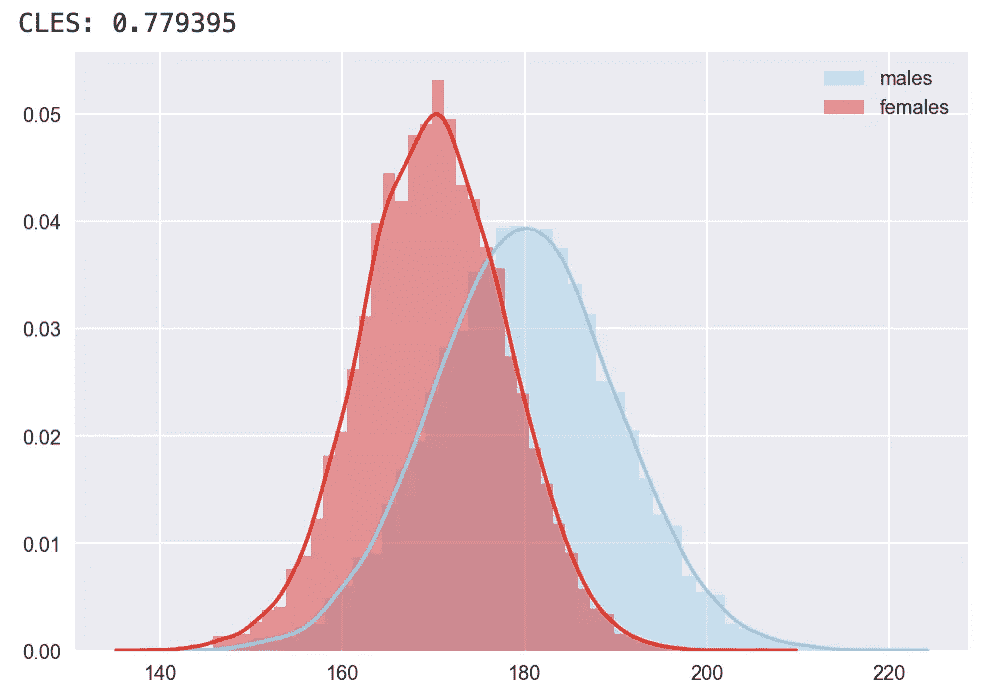

随机生成的高度的分布

# **结论**

在本文中，我介绍了影响大小的不同度量，并展示了如何在 Python 中计算它们。了解这些，或者每个家族至少有一个关键指标，在使用 frequentist 方法计划 A/B 测试时肯定会派上用场。

您可以在我的 [GitHub](https://github.com/erykml/medium_articles/blob/master/Statistics/effect_size.ipynb) 上找到本文使用的代码。一如既往，我们欢迎任何建设性的反馈。可以在 [Twitter](https://twitter.com/erykml1?source=post_page---------------------------) 或者评论里联系我。

如果您对本文感兴趣，您可能也会喜欢:

[](/the-new-kid-on-the-statistics-in-python-block-pingouin-6b353a1db57c) [## Python 统计块中的新成员:pingouin

### 图书馆的快速参观，以及它是如何从老守卫中脱颖而出的

towardsdatascience.com](/the-new-kid-on-the-statistics-in-python-block-pingouin-6b353a1db57c) [](/one-tailed-or-two-tailed-test-that-is-the-question-1283387f631c) [## 单尾还是双尾检验，这是个问题

### 了解统计测试的两种变体之间的区别，以及如何在 Python 中实现它们

towardsdatascience.com](/one-tailed-or-two-tailed-test-that-is-the-question-1283387f631c) [](/introduction-to-power-analysis-in-python-e7b748dfa26) [## Python 中的功耗分析简介

### 了解概念的重要性，如显著性水平、效应大小、统计功效和样本大小

towardsdatascience.com](/introduction-to-power-analysis-in-python-e7b748dfa26) 

# 参考

[1]科恩，J. (2013)。*行为科学的统计功效分析*。学术出版社。

[2] McGraw，K. O .，& Wong，S. P. (1992 年)。一种常见的语言效应大小统计。*心理通报，111* (2)，361–365。https://doi.org/10.1037/0033-2909.111.2.361