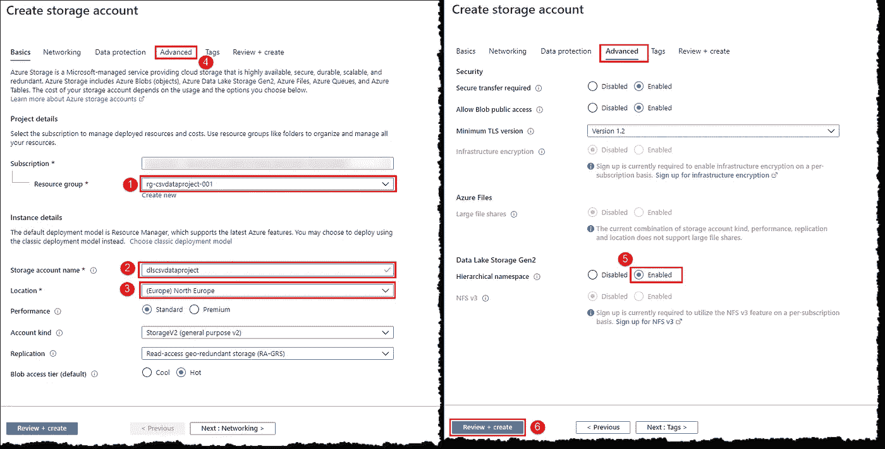

# 使用 Azure 将 CSV 文件转换为 Power BI 视觉效果的权威指南

> 原文：<https://towardsdatascience.com/a-definitive-guide-to-turn-csv-files-into-power-bi-visuals-using-azure-4483cf406eab?source=collection_archive---------30----------------------->

## 使用 Microsoft Azure 产品将新冠肺炎数据转化为惊人的 Power BI 视觉效果的分步指南。

照片由[马太·亨利](https://burst.shopify.com/@matthew_henry)在[上爆](https://burst.shopify.com/)

云、大数据和商业智能是这十年的三个热门词汇。每个人都在谈论他们。每个人都想做。但是没人告诉你怎么做。你如何使用*云*来处理你的*大数据*并围绕它构建*智能*来做出*业务*决策？

这个问题有多种答案，在本指南中，我们试图使用微软的云解决方案(Azure)和微软的 BI 工具(Power BI)来回答这个问题，以帮助您朝着正确的方向开始。

微软 Azure 是领先的云解决方案提供商之一，提供一套端到端的工具和技术来摄取、分析和消费大量的数据源和数据格式。

**注意:** *Microsoft Azure 是一项付费服务，遵循本文可能会导致您或您的组织承担财务责任。*

*在继续阅读本文之前，请阅读我们的使用条款:*[*https://dhyanintech . medium . com/disclaimer-disclosure-disclosure-terms-of-use-fb3 BF BD 1e 0e 5*](https://dhyanintech.medium.com/disclaimer-disclosure-terms-of-use-fb3bfbd1e0e5)

# 先决条件

1.  有效的 Microsoft Azure 订阅

如何获得 Azure 订阅？

 [## 立即创建您的 Azure 免费帐户| Microsoft Azure

### 利用人工智能创造个性化体验构建互联的跨平台体验-为客户互动量身定制…

azure.microsoft.com](https://azure.microsoft.com/en-us/free/) 

以一种简单、易于理解和可用的形式表示数据的第一步是识别数据的来源和格式。传统上，数据专业人员专注于*提取、转换&加载(ETL)* 加载和转换数据。Azure 的出现打开了在无限和前所未有的规模上处理无结构数据的大门。此变更将转换和加载数据转移到*提取、加载&转换(ELT)* 。基本原理和步骤保持不变；他们只是遵循不同的顺序。Azure 中的数据项目通常包括以下步骤:

1.  **获取:**确定加载数据的工具、技术和方法
2.  **准备和培训:**确定转换数据的工具、技术和方法

然后是两个额外的步骤来分析和使用清理后的数据

*   **建模和服务:**确定建模和分析数据的工具和方法
*   **消费:**确定消费或呈现数据的工具和技术

在这篇文章中，我们将借助一个例子，通过 ELT 的不同阶段，了解在 Azure 中转换和加载数据的整体方法。为了开始我们的旅程，我们将:

*   从 GitHub 获取公开的新冠肺炎数据(*来源*)
*   借助 Azure Data Factory ( *摄取*)将 CSV 文件存储到 Azure Data Lake Storage Gen2
*   将 CSV 文件转换并清理为 Azure Databricks 中的关系数据(*准备和培训*)
*   将清理后的数据存储在 Azure Synapse Analytics 数据仓库*(建模和服务)*
*   最后，以 Power BI 视觉效果的形式呈现准备好的数据(*消耗*)

# 体系结构

下图提供了我们旅程的高度可视化:

典型的现代数据仓库架构(图片由作者提供)

# 数据流

1.  使用 Azure Data Factory 以网页的形式从 GitHub 获取 CSV 数据。
2.  将传入的数据作为 CSV 文件保存在 Azure Data Lake 存储中。
3.  利用 Azure Databricks 来执行可扩展的分析，并实现清理和转换的数据(或者使用 PolyBase 来清理、转换和直接加载到 Azure Synapse Analytics 数据仓库)。
4.  将清理和转换后的数据移动到 Azure Synapse Analytics 数据仓库，以与现有的结构化数据相结合。
5.  在 Azure Synapse Analytics 数据仓库的基础上使用 Power BI 构建报告和仪表板，以从数据中获得洞察力。

# 成分

*   [**Azure Data Factory**](https://azure.microsoft.com/en-us/services/data-factory/):一种混合数据集成服务，用于创建、调度和编排 ETL 和 ELT 工作流
*   [**Azure 数据湖存储**](https://azure.microsoft.com/en-us/services/storage/data-lake-storage/) :面向非结构化数据、图像、视频、音频、文档等的大规模可扩展且经济高效的存储。
*   [**Azure data bricks**](https://azure.microsoft.com/en-us/services/databricks/):快速、简单、可扩展和协作的基于 Apache Spark 的分析平台
*   [**Azure Synapse Analytics**](https://azure.microsoft.com/en-us/services/synapse-analytics/):基于大规模并行处理架构的可扩展弹性云数据仓库，将企业数据仓库和大数据分析结合在一起
*   [**Power BI**](https://powerbi.microsoft.com/en-us/) :一套业务分析工具，提供来自数百个数据源的见解，简化数据准备，并推动即席分析

下一步是设置完成数据项目所需的资源和组件。在典型设置中，数据工程师可能会执行一些常规任务:

*   **提供**:提供数据平台技术存储数据
*   **过程**:创建数据处理管道，在不同的数据存储之间移动数据
*   **安全**:确保数据安全，防止未经授权的访问和网络攻击
*   **监控**:设置主动和被动监控和警报，以确保解决方案满足所需的性能、可用性和成本限制
*   **灾难恢复**:确保在发生灾难时能够恢复数据

在本指南中，我们将重点介绍资源调配和处理，因为其他任务超出了我们项目的范围。让我们开始吧。

# 创建资源组

在 Azure 中，每个资源都属于且仅属于一个资源组。资源组是资源的逻辑分组，以简化管理、访问、成本等。我们的资源组将保存所有我们提供的组件。

 [## 管理资源组- Azure 门户- Azure 资源管理器

### 了解如何通过 Azure 资源管理器使用 Azure 门户来管理您的 Azure 资源组。对于管理 Azure…

docs.microsoft.com](https://docs.microsoft.com/en-us/azure/azure-resource-manager/management/manage-resource-groups-portal#what-is-a-resource-group) 

登录 [Azure 门户](https://portal.azure.com/)。在左上角选择 **+创建资源**，搜索**资源组**，在新*刀片上，*点击**创建**开始创建过程。在**Create a resource group**blade 上，选择您将用于这个项目的订阅，为您的资源组键入一个名称，并从列表中选择一个适当的区域。

> 刀片指的是 Azure 门户中的窗格。

Azure 门户:搜索资源或服务(图片由作者提供)

Azure 门户:创建资源组(图片由作者提供)

您可以自由选择资源的名称；但是，遵循命名约定是一个好习惯。

 [## 推荐的命名和标记约定—云采用框架

### 组织您的云资产，以支持运营管理和会计要求。定义良好的命名和…

docs.microsoft.com](https://docs.microsoft.com/en-us/azure/cloud-adoption-framework/ready/azure-best-practices/naming-and-tagging) 

# 创建 Azure 密钥库

Azure Key Vault 是一款安全存储和访问机密的工具。秘密是您想要严格控制访问的任何东西，比如 API 密钥、密码、访问令牌或证书。

搜索 **Key vault** 与我们对资源组所做的类似(步骤 1-3 ),并填写所示的设置，将其余部分保留为默认设置，请注意，我们的资源组可在下拉列表中选择。

Azure 门户:创建 Azure 密钥库(图片由作者提供)

# 创建 Azure 数据工厂

在 Azure 门户搜索**数据工厂**，填写如图所示的设置；将其余部分保留为默认值。

Azure 门户:创建数据工厂实例(图片由作者提供)

# 调配 Azure 数据湖存储

在 Azure 门户中搜索**存储账号**，填写如图所示的设置；将其余部分保留为默认值。这里需要注意的重要一点是 *Azure Data Lake Storage Gen2* 提供的分层名称空间，它构建在低成本的 Azure blob 存储之上。分层命名空间将对象组织到目录的层次结构中，以增强性能、管理和安全性。

 [## Azure 数据湖存储第二代简介

### Azure Data Lake Storage Gen2 是一组专用于大数据分析的功能，构建于 Azure Blob 存储之上…

docs.microsoft.com](https://docs.microsoft.com/en-us/azure/storage/blobs/data-lake-storage-introduction) 

Azure 门户:提供 Azure 数据湖存储 Gen2(图片由作者提供)

选择工具栏上的**通知**图标，查看创建进度。部署后，您会收到一个弹出通知。使用它转到新创建的资源。在**概述**页面，找到**容器**选项；我们将使用它来制作一个容器，作为存储下载文件的仓库。按照所示步骤创建容器 CSV*-数据存储*。点击打开新容器，选择 **+添加目录，**创建新目录，命名为*covid 19-data；这个*文件夹将保存我们的文件。

在 Azure 数据湖存储 Gen2 中创建一个容器(图片由作者提供)

# 创建 Azure Databricks 工作区

在左上角，选择 **+创建资源**。选择**Analytics>Azure data bricks**开始创建过程，如图所示填写设置。

Azure 门户:创建一个 Azure Databricks 工作区(图片由作者提供)

# 在 Azure Synapse Analytics 中创建数据仓库

在左上角，选择 **+创建资源**。选择**数据库> Azure Synapse Analytics(以前的 SQL DW)** 开始创建过程，填写如图所示的设置。我们已经在 Azure Synapse Analytics 中成功创建了一个数据仓库。

Azure 门户:创建 Azure Synapse 分析数据仓库(图片由作者提供)

> ***一台服务器，多个数据库***
> 
> 当我们创建第一个 Azure SQL 数据库时，我们也创建了一个 Azure SQL(逻辑)服务器。可以把服务器想象成我们数据库的管理容器。我们可以通过服务器控制登录、防火墙规则和安全策略。我们还可以在服务器中的每个数据库上覆盖这些策略。目前，我们只需要一个数据库。

部署完成后，转到资源，为我们的新数据库打开**概述**页面。浏览概览页面上的数据库详细信息；我们对**服务器名**和**连接字符串**特别感兴趣。我们稍后将需要这些来连接到我们的数据库。

Azure Synapse 分析:概述(图片由作者提供)

# 设置 Microsoft Power BI

Microsoft Power BI 存在于 Azure 产品之外，有三种不同的定价风格——桌面版、专业版和高级版。桌面版对个人用户是免费的，非常适合我们的锻炼。从 Microsoft store 下载并安装 Power BI Desktop。

 [## 超级商务智能桌面

### Microsoft Power BI Desktop 专为分析师打造。它结合了最先进的互动可视化，与…

www.microsoft.com](https://www.microsoft.com/en-us/download/details.aspx?id=58494) 

伙计们，就这样吧。喝杯咖啡，我们将在后续的系列文章中继续讨论各个组件的详细处理步骤。

# 结论

我们看了新时代的 ETL 过程和数据工程师必须执行的任务。我们提出并讨论了一个数据工程项目，并设置了 Microsoft Azure 组件来构建我们的项目。

# 后续步骤

跟随我们的后续文章，与我们一起构建您的项目。我们将详细讨论和解释所有组件的处理过程。

*   使用 Azure 数据工厂摄取文件

 [## 使用 Azure Data Factory 基于 HTTP 上的 URL 模式增量复制文件

### 一个创新的 Azure 数据工厂管道，通过 HTTP 从第三方网站增量复制多个文件…

medium.com](https://medium.com/@dhyanintech/using-azure-data-factory-to-incrementally-copy-files-based-on-url-pattern-over-http-569476b625fc) 

*   在 Azure 数据块中清理和转换 CSV 文件

 [## 在 Azure Databricks 中将模式漂移的 CSV 文件清理并转换为关系数据

### 使用 PySpark 处理模式漂移文件并将其加载到 Azure Databricks 中的 Azure Synapse Analytics 数据仓库

medium.com](https://medium.com/@dhyanintech/cleansing-and-transforming-schema-drifted-csv-files-into-relational-data-in-azure-databricks-519e82ea84ff) 

*   使用 PolyBase 在 Azure Synapse Analytics 中加载数据

 [## 使用 PolyBase 将 CSV 数据加载到 Azure Synapse Analytics

### 使用 PolyBase 将 CSV 数据从 ADLS Gen2 导入 Azure Synapse Analytics 的分步指南

dhyanintech.medium.com](https://dhyanintech.medium.com/loading-csv-data-into-azure-synapse-analytics-by-using-polybase-5ae942ce3059) 

*   用 Power BI 建模和呈现数据—无限期推迟

## 喜欢这个帖子？与 Dhyan 联系

让我们做朋友吧！你可以在 [LinkedIn](https://www.linkedin.com/in/dhyans/) 上找到我或者在 [Medium](https://dhyanintech.medium.com/membership) 上**加入**我。