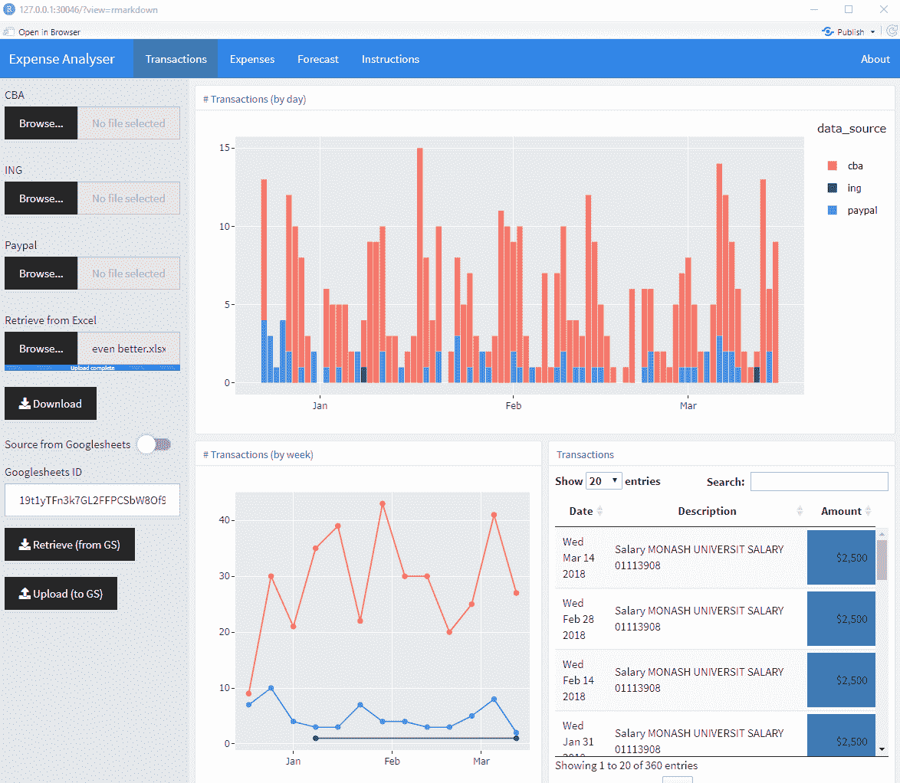

# RShiny 演示——您的下一个基于代码的仪表板解决方案？

> 原文：<https://towardsdatascience.com/a-demonstration-of-rshiny-your-next-code-based-dashboard-solution-3e964d66c86c?source=collection_archive---------40----------------------->

## 建立一个个人支出仪表板应用程序来检查我的财务状况

市场上最好的两个 dashboarding 工具，Tableau 和 Power BI，使用起来完全是一种享受(好吧，也许不是 Power BI……)。然而，在可行的情况下，我总是倾向于使用 r，而不是使用他们争论数据的产品(Prep 和 PowerQuery)。

r 更快，有非常优雅的语法(如果你对 Tidyverse 感兴趣的话)，可重复(因为它是代码),并且对它可以完成的各种数据争论任务(包括数据检索)几乎没有限制。

但是 R 也提供了各种各样的表示/报告选项。r 可以通过编程*构建 pdf 报告、PowerPoints、Word 文档和网页，所有这些都以图表和表格为特色，这些图表和表格利用了一些最新的 web 可视化库(也可以设置为在预定的基础上自动通过电子邮件发送这些输出)。*

*这篇文章的主要焦点是 R 的交互式仪表板/应用程序解决方案，通常被称为“闪亮”。*

*在许多情况下，*定制的*仪表盘/应用程序(并不闪亮)使用 JavaScript、React 和 D3(我当然不是专业的定制应用程序开发专家)，然而，存在许多 R 包作为这些技术的“包装器”，使得从 R 代码生成相同类型的专业输出成为可能。*

*当然，与这些语言的本地编码者可能产生的东西相比，可能会有一些限制；但是对于一个 R 程序员来说，能够*进入下一步*并产生一个工作原型(最终可能完全足够)而不是引入一个新专业人员，是相当有价值的。*

*鉴于目前 R 在一大堆本科科学课程中的受欢迎程度，预计未来几年将会有越来越多崭露头角的 R 开发人员涌入。因此，为了展示 R 在这方面的能力，我制作了一个个人财务应用程序(显示的值是半虚拟的旧交易数据)。*

**

*初始输入和交易检查页面*

**

*主费用汇总页面*

**

*累计费用和收入预测页*

*如果你想看视频，这里有一个可能比你希望的更详细的演示(但它有一个额外的目的，所以请继续阅读，在最后找出它是什么)。*

*对于那些经过一些整洁的小技巧的人来说，这里是带有代码的 GitHub repo。是的，有 2000 多行(我喜欢危险的生活)。*

* [## 数据分析/个人支出闪亮仪表板

### 此时您不能执行该操作。您已使用另一个标签页或窗口登录。您已在另一个选项卡中注销，或者…

github.com](https://github.com/Tadge-Analytics/Personal-expense-shiny-dashboard) 

仅仅因为 R 是开源的，并不意味着这些仪表板项目一定会比使用流行的付费工具便宜。虽然您可能会节省最初的订购费用，但大多数人会意识到，一个专有的拖放式工具能够让您在更少的计费时间内启动并运行。使用一个也可能使过程更容易转移，因为 Tableau 和 Power BI 开发人员比闪亮的开发人员多得多。

然而，当使用代码时，在**再现性**方面有相当大的优势。例如，如果为多个客户端创建同一个仪表板；有了 R，每当需要更新时，不再需要完全独立的仪表板构建工作和对每个文件的单独编辑。使用(正确的)代码，您只需更改相关的函数(或特定的参数)就可以实现更改。

但是，当然，通过代码获得*美学*可能会很麻烦(对于最初的尝试来说**也是如此**)。默认情况下，许多软件包都产生了不错的设计，并且您可以完全控制几乎所有的元素(但这就是问题所在——选项太多了。有时，仅仅通过拖动或简单地从一个漂亮的用户调色板中“挑选”你想要的颜色来调整图表的大小要容易得多。* 

*对于我的应用程序来说，数据争论非常复杂。虽然这个*可以*作为一个单独的数据预处理过程来完成，但是争论层和表示层之间的迭代和*交织*本质意味着将它们放在同一个软件中是理想的。最终结果更加无缝(这也是我想象中的最终用户真正使用产品的唯一方式)。*

*该应用包括 Tableau / Power BI 用户熟悉的许多功能:*

*   *“点击”过滤器(点击一个图表以过滤另一个图表)*
*   *点击高亮显示(基本相同，通常在一个图表中，尽管看到虚线下面的灰色条)*
*   *单击参数更新(出现并被更改的虚线)*
*   *工具提示(虽然我没有费心整理这些，因为它只是一个 MVP)*

**

*还有一些*流行的付费工具*的功能是闪亮仪表盘中不存在的(据我所知)。例如，将图例浮动在任何位置，并且在工具提示图表中有“*”。**

*   *通过表示层将“客户端”CSV 直接上传到流程中*
*   *将有争议的 CSV 摘要下载到 Excel 文件中(包含多个工作表和格式化表格)。这样做是为了让用户可以选择在最熟悉的环境中对他们的交易进行手动分类。*
*   *利用与 Googlesheets 的连接来存储汇总数据(作为使用 Excel 文件的替代方案)，并利用检索和“写回”功能，只需点击一个按钮。这使得用户不必在保存和上传多个 Excel 文件之间进行迭代(它还允许跟踪更改——这非常简洁)。*

*我闪亮的仪表板能够做的关键事情(在*付费工具中不可能做到的)是*:*

*这款应用的主要特点是它可以帮助对银行交易进行分类。本质上，随着用户收集更多的关键字，所需的工作(正确识别新交易)大大减少。*

*第二页是洞察力开始的地方。特别是，主要功能是支出率图表。对我来说，关键的一点是，这让我可以看到我的总体“消耗率”和按特定类别细分的支出率。尤其是我在外出就餐、公共交通和日常不可避免的开支上花了多少钱。*

*第三页是由用户说明引导的关于费用的推断。在这里，您可以看到每个类别的贡献。*

**

*通过 Excel 电子表格(或 Googlesheet)，可以:*

*   *加入尚未发生的预期事件*
*   *修改那些已经发生的(通过指定正在进行的费率/时间表，规定它们不会再次发生)。*
*   *限制用于每日消费率计算的历史数据的范围(例如，仅使用我外出就餐的最近 20 笔交易来预测未来，或仅使用自[某个日期]以来的交易)。*

**

# *最终注释*

*这个项目是一个经典的案例，一些*看起来很简单的东西*被发现实际上非常复杂。即使作为一个爱好项目和(广告)博客帖子的组合，它也占用了相当多的额外时间。最后，它被证明是一个无论是用 Tableau 还是 Power BI 都无法真正完成的项目(至少没有那样的凝聚力)，所以我想这并不是真正最公平的比较。*

*对于像这样的应用程序的安全(启用身份验证)、基于网络的交付系统， [Shinyapps.io](https://www.shinyapps.io/) 提供了这项服务，但也有许多自托管选项可用。然而，因为我预计大多数个人和企业都非常不愿意将他们的私人交易数据上传到第三方(即使这是一个相当改进的、安全的在线版本的应用程序)——这就是为什么我一直将该文件作为可以在个人电脑上本地使用的东西。*

*此外，我已经决定让这个项目开源。希望它的某些部分可能对 R 社区有所帮助。项目本身也可以从他们的推荐/建议中受益，所以请随意使用 Youtube 视频和脚本来检测可能的改进。如果你愿意合作，请随时给我发电子邮件。*

**原载于 2020 年 1 月 21 日 https://tadge-analytics.com.au***。***