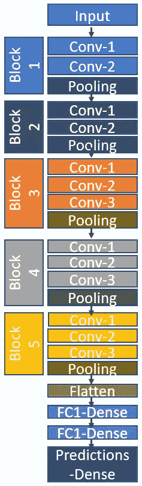
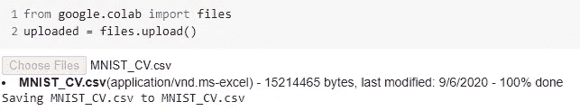
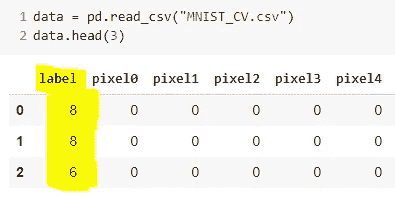
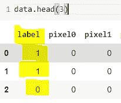
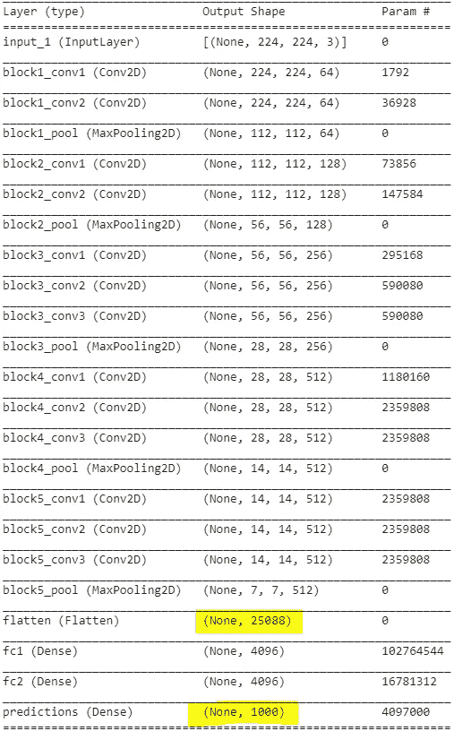
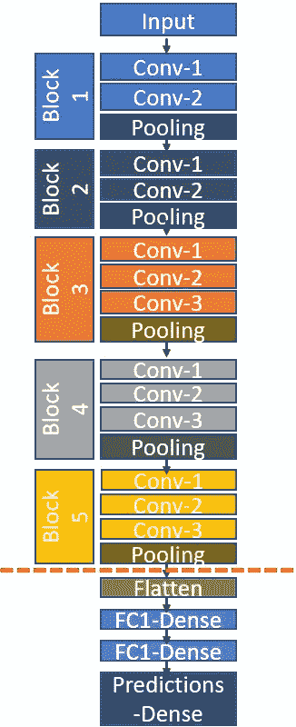
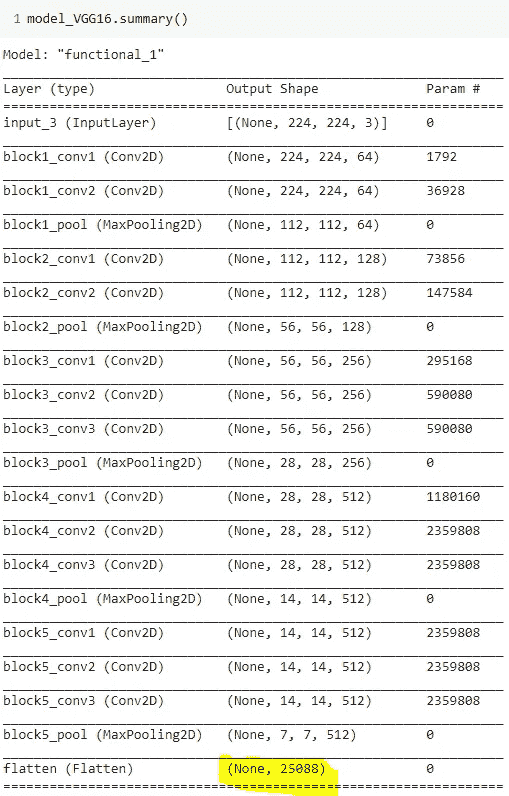
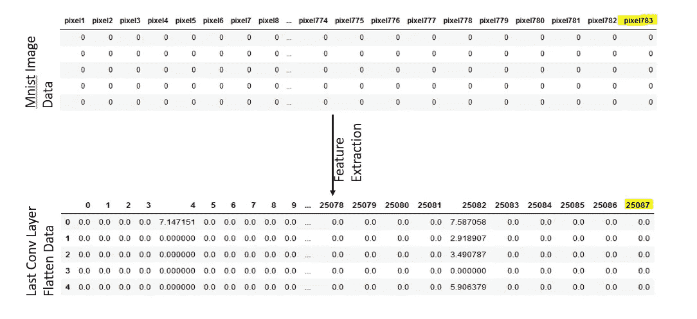
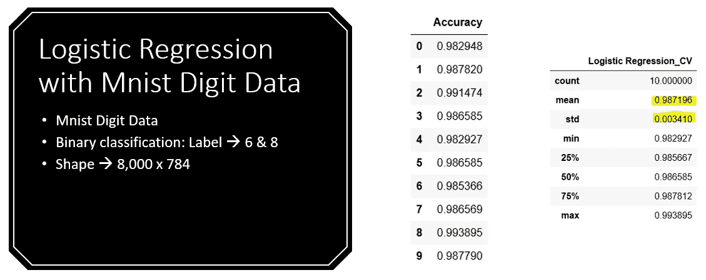
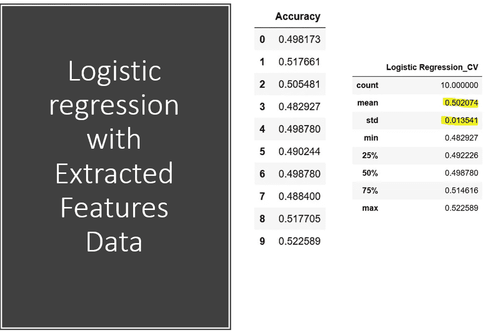

# 迁移学习的一个糟糕例子:VGG 预训练模型在 Keras 中的应用

> 原文：<https://towardsdatascience.com/a-demonstration-of-transfer-learning-of-vgg-convolutional-neural-network-pre-trained-model-with-c9f5b8b1ab0a?source=collection_archive---------8----------------------->

## 使用特征提取过程对 Mnist 数字数据进行分类的迁移学习演示


[T. Q.](https://unsplash.com/@tq_photos?utm_source=medium&utm_medium=referral) 在 [Unsplash](https://unsplash.com?utm_source=medium&utm_medium=referral) 上拍摄的照片

迁移学习是机器学习中最先进的技术之一，已广泛应用于图像分类。在这篇文章中，我将讨论迁移学习，VGG 模型和特征提取。在最后一部分，我将展示一个有趣的迁移学习的例子，其中迁移学习技术在对 **MNist 数字数据集**进行分类时表现出乎意料地差。

V VGG 小组参加了一年一度的计算机视觉竞赛——ImageNet 大规模视觉识别挑战赛( [ILSVRC](http://www.image-net.org/challenges/LSVRC/) )，并提交了著名的 VGG 模型，用于参加对象定位(检测来自 200 个类别的图像中的对象)和图像分类任务(1000 个类别的分类)的竞赛。ImageNet 数据集是比赛中使用的主要计算机视觉基准数据集，包括属于 1000 个类别的超过 1400 万张图像。VGG 模型以 92.7%的前 5 名测试准确率超越了其他模型，并在 2014 年 ILSVRC 竞赛中获得了第一名和第二名。

**VGG 建筑**

VGG 有两种不同的架构:VGG-16 包含 16 层，VGG-19 包含 19 层。在本文中，我们将重点关注 VGG-16，它主要包含三个不同的部分:卷积、池和全连接层——它从两个卷积层开始，然后是池，然后是两个卷积，然后是池，再重复三个卷积，然后是池，最后是三个全连接层。下图显示了 VGG-16 模型的架构。VGG 模型最有趣的部分是模型权重可用于不同的平台(如 Keras ),并可用于进一步的分析——开发模型和应用程序。将模型的权重用于进一步任务的想法引发了迁移学习的想法。



VGG-16 建筑

我们可以运行以下三行代码，用 python 绘制 VGG-16 模型架构:

```
from keras.applications.vgg16 import VGG16
from keras.utils import  plot_model
model = VGG16()
plot_model(model)
```

**迁移学习**

我们知道，随着神经网络架构的增加/深化，训练时间呈指数增长。一般来说，用大规模数据集训练一个 3-5 层的神经网络可能需要几个小时/几天。因此，由于模型架构中完全连接的图层/节点的深度和数量，在大规模数据集上从头开始部署 VGG 是一项令人厌倦且计算量巨大的任务。另一个挑战是从零开始构建 VGG 需要相当大的内存空间和带宽，因为 ImageNet 训练的 VGG-16 砝码的大小为 *528* MB。然而，我们可以执行**转移学习，即**，利用权重等知识以及之前训练过的(例如预训练的 VGG)模型的特征，来解决类似的问题，而不是从零开始构建 VGG。例如，如果我们想开发一个二进制图像分类器，那么我们可以使用一个预先训练的模型，它是在像 VGG 这样的大型基准图像数据集上训练的。因此，迁移学习是一种机器学习方法，其中为一项任务开发的模型被重新用作第二项任务的模型的起点。迁移学习通常用于加快训练时间，最终提高模型的性能。在利用迁移学习的同时，我们必须考虑到使用迁移学习的好处并不明显。

**什么时候使用迁移学习？**

可以阅读深度学习的世界 *中的文章 [*迁移学习的意义，解释什么时候使用迁移学习。*](https://analyticsindiamag.com/transfer-learning-deep-learning-significance/)*

当训练数据不足时，机器学习算法尤其是深度神经网络可能无法正确学习。迁移学习可以在解决这一问题和调整模式以适应新任务方面发挥重要作用。在应用迁移学习时，我们可以寻找一些因素[1]:

1.  **更高的起点:**有迁移学习的模型初始阶段的表现应该会优于没有迁移学习的模型。
2.  **更高的斜率:**在源模型的训练阶段，性能斜率或改进率比其他情况下更陡。
3.  **更高的渐近线:**预训练的应该更平滑地收敛。

**为什么要用 VGG 模式进行迁移学习？**

假设给定数量的训练样本(图像)不足以构建分类器，在这种情况下，VGG 可以很容易地用于特征提取，因为它是在数百万个图像上训练的。VGG 是在 2014 年推出的，尽管如此，通过 2014 年之后出现的许多最先进的图像分类器，它在一些特定任务上比其他分类器具有更好的准确性。

在这篇文章中，我们将用 VGG 模型展示迁移学习的一个例子，它表明迁移学习方法没有达到标准。在以后的文章中，我们将展示另一个例子，在这个例子中，利用迁移学习方法，模型的性能得到了预期的提高。

在这次演示中，我们使用著名的 MNIST 数字数据集。我们使用仅包含数字 8 和 6 的 MNIST 数据集的一部分。总共有 8200 个样本，每个样本有 784 个特征。我们使用 VGG 预训练的权重为 MNIST 数据集提取特征。

**步骤 1 —数据准备**

我们将数据集从本地硬盘上传到 Google Colab，并将标签从 8 和 6 转换为 1 和 0。

```
from google.colab import files
uploaded = files.upload()
```



从本地驱动器上传数据到 Colab

现在，我们读取数据集。下图显示标签为 8 & 6。在后面的部分中，我们将应用逻辑回归，我们将标签转换为 1 和 0。



数据片段

运行这一行代码将转换标签:

```
data['label'] = np.where(data['label'] == 8, 1, 0)
```



转换数据集的标签

**步骤 2——从 VGG-16 模型中提取特征**

在提取特征之前，只需观察 VGG-16 模型的总结:



VGG-16 模型综述

总之，VGG-16 包含 16 层，其中在展平最后一个卷积层(第一个突出显示)之后，特征的数量是 25，088，并且在最后一层(预测或最终密集层)中，节点的数量是 1000，因为 VGG-16 主要针对 1000 类分类问题进行训练(第二个突出显示)。

出于迁移学习的目的，我们可以使用 VGG 模型从 MNIST 数据集中提取 25088 个特征。红色垂直线显示特征提取的切割。



VGG-16 的特征提取

下面的代码部分将在最后的卷积层之后剪切 VGG 模型:

```
from keras import  models
base_model = VGG16(weights='imagenet')
model_VGG16 = models.Model(inputs=base_model.input, outputs=base_model.get_layer(**'flatten'**).output)
```

输出:



VGG 模型在去掉最后三层后的总结



利用 VGG-16 模型的特征提取

在使用 VGG 模型从数字数据中提取特征之后，我们用这些特征训练了逻辑回归二元分类器，并执行 10 重交叉验证。同时，我们还对原始的 mnist 数字数据进行了逻辑回归，并进行 10 重交叉验证，以将结果与迁移学习的性能进行比较。

以下两个表显示了对原始数据和从原始数据中提取的特征应用逻辑回归的结果。在没有迁移学习的情况下，即将 LR 应用于原始数字数据实现了大约 98%的准确度，而利用迁移学习特征的模型仅实现了 50%的准确度，这类似于二进制分类问题的随机猜测。总的来说，我们期望随着迁移学习的进行，模型的性能会提高。然而，在这个演示中，我们发现随着迁移学习，模型性能急剧下降。



逻辑回归应用于 Mnist 数字数据的结果



VGG16 性能不佳的可能原因:

1.  VGG-16 是为 3 通道 RGB 图像训练的，而 Mnist 数字数据是 1 通道灰度

2.通过 VGG-16 高级代表性特征学习的 ImageNet 数据中的背景噪声

3.VGG-16 训练用于 1000 级分类，而对于这个任务，我们使用它进行二进制分类

虽然具有迁移学习的模型在该实验中没有提供有益的结果，但是利用 VGG 的其他层进行特征提取过程或者微调参数可以产生更好的准确性。总之，迁移学习是一种最先进的机器学习技术，可以提高模型的性能。然而，灵活运用迁移学习技术是获得适当优势的必要条件。

# 阅读默罕默德·马苏姆博士(以及媒体上成千上万的其他作家)的每一个故事。

你的会员费将直接支持和激励穆罕默德·马苏姆和你所阅读的成千上万的其他作家。你还可以在媒体上看到所有的故事—[](https://masum-math8065.medium.com/membership)

****阅读愉快！****

**参考:**

**[1][https://analyticsindiamag . com/transfer-learning-deep-learning-significance/](https://analyticsindiamag.com/transfer-learning-deep-learning-significance/)**

**[https://keras.io/guides/transfer_learning/](https://keras.io/guides/transfer_learning/)**

**[3][https://www . Alibaba cloud . com/blog/part-1-image-class ification-using-features-extracted-by-transfer-learning-in-keras _ 595289](https://www.alibabacloud.com/blog/part-1-image-classification-using-features-extracted-by-transfer-learning-in-keras_595289)**