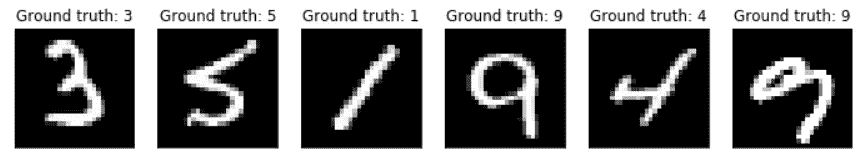
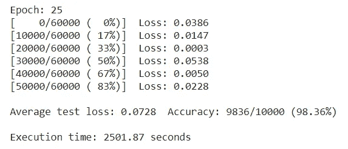

# PyTorch 中使用视觉转换器的实际演示:MNIST 手写数字识别

> 原文：<https://towardsdatascience.com/a-demonstration-of-using-vision-transformers-in-pytorch-mnist-handwritten-digit-recognition-407eafbc15b0?source=collection_archive---------15----------------------->

在本文中，我将给出一个实际操作的示例(带代码)，说明如何使用流行的 PyTorch 框架将视觉转换器应用到实际的计算机视觉任务中，该框架是在论文“ [**中提出的，一幅图像相当于 16x16 个单词:按比例进行图像识别的转换器**](https://openreview.net/pdf?id=YicbFdNTTy) (我在 [**的另一篇文章**](https://medium.com/@stankriventsov/an-image-is-worth-16x16-words-transformers-for-image-recognition-at-scale-brief-review-of-the-8770a636c6a8) 中对此进行了评论)。

视觉转换器的原理图(来自[https://openreview.net/pdf?id=YicbFdNTTy](https://openreview.net/pdf?id=YicbFdNTTy))

为此，我们将使用众所周知的 [**MNIST 数据集**](https://en.wikipedia.org/wiki/MNIST_database) 来研究手写数字识别的问题。

使用 Pyplot 生成的 MNIST 手写数字示例

我想马上提供一个警告，只是为了说明这一点。我选择 MNIST 数据集进行这次演示，因为它足够简单，可以在几分钟内，而不是几小时或几天内，在没有任何专门硬件的情况下，从头开始训练模型并用于预测，因此几乎任何有计算机的人都可以做到这一点，并看看它是如何工作的。我没有尝试过优化模型的超参数，我当然也没有用这种方法达到最先进的精确度(目前这个数据集的精确度约为 99.8%)的目标。

事实上，虽然我将展示视觉转换器可以在 MNIST 上获得令人尊敬的 98%以上的准确性，但可以说它不是这项工作的最佳工具。由于该数据集中的每个图像都很小(只有 28x28 像素),并且由单个对象组成，因此应用全局注意力只能具有有限的效用。稍后我可能会写另一篇文章，研究如何在包含更大图像和更多种类的更大数据集上使用该模型。现在，我只想展示它是如何工作的。

在实现方面，我将依赖来自王飞的 [**这个**](https://github.com/lucidrains/vit-pytorch) 开源库的代码，特别是来自 *vit_pytorch.py* 文件的以下 Vision Transformer (ViT)类:

与任何 PyTorch 神经网络模块类一样，它具有初始化( **__init__** )函数，其中定义了所有可训练参数和层，以及**转发**函数，该函数建立了将这些层组装到整个网络架构中的方式。

为了简洁起见，这里只给出了 ViT 类本身的定义，没有给出依赖类。如果你想在你的电脑上使用这段代码，你需要导入整个[***vit _ py torch . py***](https://github.com/kriventsov/vit-pytorch/blob/main/vit_pytorch/vit_pytorch.py)文件(这个文件出奇的小，只有一百行左右的代码；我在 GitHub 上给出了我自己的分叉版本的链接，以防将来原始文件发生变化)，以及最近版本的 [**PyTorch**](https://pypi.org/project/torch/) (我使用的是 1.6.0)和用于张量操作的 [**einops**](https://pypi.org/project/einops/) 库。

要开始使用 MNIST 数据集，我们需要首先加载它，我们可以这样做(从这一点开始，这篇文章中的所有代码都是我的，尽管其中很多都很标准):

上面代码中的 **transform_mnist** 转换用于归一化图像数据，使其均值为零，标准差为 1，这有助于神经网络训练。 **train_loader** 和 **test_loader** 对象包含已经随机分成批次的 MNIST 图像，以便它们可以方便地输入到训练和验证程序中。

数据集中的每个项目都包含一个带有相应地面实况标签的图像。一旦在数据集的训练部分(60，000 个手写数字图像)上进行训练，我们的转换器的目标将是基于图像来预测测试部分(10，000 个图像)中每个样本的正确标签。

我们将使用以下函数为每个时期训练我们的模型:

该函数对 [**data_loader**](https://pytorch.org/docs/stable/data.html#torch.utils.data.DataLoader) 对象中的每个批次进行循环。对于每一批，它计算模型的输出(作为一个 [**log_softmax**](https://pytorch.org/docs/master/nn.functional.html#torch.nn.functional.log_softmax) )和这个输出的 [**负对数似然损失**](https://pytorch.org/docs/stable/generated/torch.nn.NLLLoss.html#torch.nn.NLLLoss) ，然后通过 **loss.backward()** 计算这个损失关于每个可训练模型参数的梯度，并通过 **optimizer.step()更新参数。**每第 100 批，它提供一份关于训练进度的打印更新，并将当前损失值附加到 **loss_history** 列表中。

在每个时期的训练之后，我们将能够使用以下函数来查看我们的当前模型在测试集上的表现:

虽然这类似于上面的训练程序，但现在我们不计算任何梯度，而是将模型的输出与地面实况标签进行比较，以计算准确性并更新损失历史。

一旦定义了所有的函数，就该初始化我们的模型并运行训练了。我们将使用以下代码:

在这里，我们用 7x7 的面片大小(对于 28x28 的图像，这意味着 4 x 4 =每个图像 16 个面片)、10 个可能的目标类别(0 到 9)和 1 个颜色通道(因为图像是灰度)来定义我们的视觉转换器模型。

在网络参数方面，我们使用 64 个单元的嵌入维数，6 个变换器块的深度，8 个变换器头，以及输出 MLP 头的隐藏层中的 128 个单元。对于优化器，我们将使用学习率为 0.003 的 Adam(如论文中所示)。我们将对我们的模型进行 25 个时期的训练，并观察结果。

使用上面的超参数值没有特别的理由。我只是选了一些看起来合理的东西。当然有可能优化这些将导致更高的精度和/或更快的收敛。

一旦代码运行了 25 个时期(在一个普通的免费 [**谷歌实验室**](https://colab.research.google.com/) 笔记本电脑上，配有一个特斯拉 T4 GPU)，它会产生以下输出:

嗯，98.36%的准确率还不算太差。这比人们期望从全连接网络中得到的要好得多(我在那里得到了大约 97.8-97.9%，没有任何技巧)，所以注意力层肯定有好处。当然，正如我上面提到的，视觉转换器并不特别适合这项任务，即使是几层的简单卷积网络也可以达到 99%或以上的精度。在优化了超参数之后，这个变压器模型可能会做得更好。

但关键是，它是可行的，而且，正如 [**论文**](https://openreview.net/pdf?id=YicbFdNTTy) 中所描述的，当应用于更大、更复杂的问题时，它可以与最好的卷积模型相媲美。希望这篇简短的教程向读者展示了如何在自己的工作中使用它。