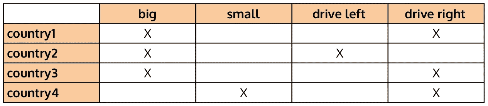
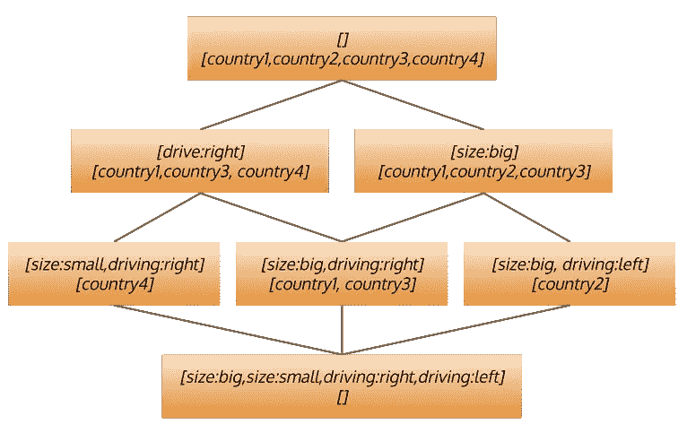
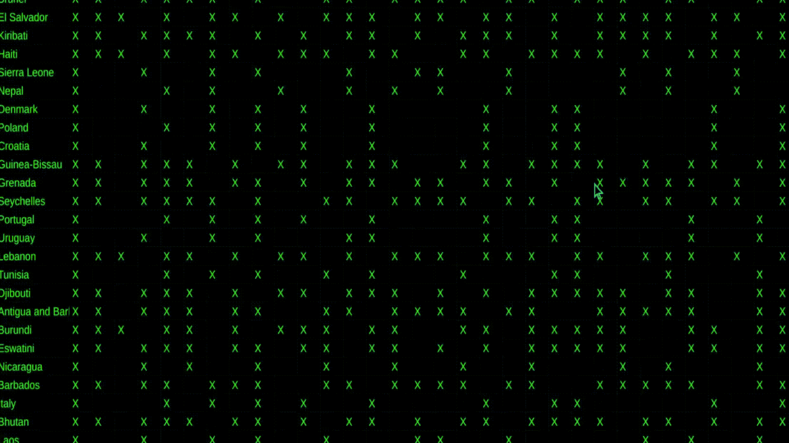

# 揭开形式概念分析(FCA)的神秘面纱

> 原文：<https://towardsdatascience.com/a-demystifying-introduction-to-formal-context-analysis-fca-ab8ce029782e?source=collection_archive---------26----------------------->

## 在复杂数据中寻找结构和规则。


结构(图片作者提供)。

这种情况多久发生一次？一个新的数据仓库出现了，或者有人给你指出一个不错的新数据集，从中你可以看到可能有一些有趣的事情要做。然后你看着它，嗯…它是一串数字。你可以运行一些统计数据，并四处打探，但这到底意味着什么呢？

也许[形式概念分析](https://en.wikipedia.org/wiki/Formal_concept_analysis) (FCA)能有所帮助。这看起来可能很复杂，但它基于一个相当简单的想法:T2 概念 T3。概念(有点像面向对象编程中的类)表示共享一组属性的一组对象。通常，在 FCA 中，这些属性是二进制的。

例如，假设我们正在查看关于四个国家的数据，这四个国家可大可小，人们可能会在左侧或右侧驾驶。我们可以用下面的二进制矩阵来表示每个国家的属性。



一个非常简单的数据集的形式上下文。

这个矩阵就是所谓的*形式背景*，我们可以看到这里有意义的概念包括大国的概念，或者说大国在右侧行驶的概念。包含在第一个对象(称为概念的*范围*中的对象(国家)集合是国家 1、国家 2 和国家 3 **、**，第二个对象仅包含国家 1 和国家 3。每个概念的*意图*，即共享的属性集合，对于前者为*【size:big】*，对于后者为*【size:big，driving:right】*。

有一件事我们需要添加到概念的定义中，这是 FCA 的核心:概念必须是封闭的。这意味着范围中的对象集应该正好是共享意图属性的对象集，*和*意图中的属性集应该正好是范围中的对象共享的属性集。

从那个定义来看，*【大小:大】**【大小:大，驾驶:右】* 是封闭的，但是*【大小:小】*这个概念不是。的确，只有 country4 有这个属性，但它也有*【驾驶:右】*。因此，要使其封闭，必须通过范围元素共享的两个属性来定义概念:*【size:small，driving:right】*。同样适用于*【驾驶:左】*。这种情况下的封闭概念是*【大小:大，行驶:左】*。

现在，寻找封闭的概念当然很有趣，但是让整个事情变得真正强大的是这些概念是由*包容*自然组织起来的。直觉上，一个概念包含另一个更一般的概念。更正式的说法是，它的意图(属性)包含在对方概念的意图中，它的范围(对象)包含对方概念的范围。基本上，*【大小:大】*归入*【大小:大，驾驶:左】*。

这种包含关系是一种*偏序*，这意味着一个概念可能包含另一个概念，被另一个概念包含，或者都不包含。因此，给定数据集(形式背景)的所有封闭概念都自然地组织在一个层次结构中(一个*点阵*)，从更一般到更具体。



由一个小例子创建的概念格。

当然，对于这样一个小例子，它实际上并没有多大帮助。那么，让我们看看它在一个更重要的例子上做了什么。

# 乡村的例子，但是真实的

为了得到一个更真实的例子，我使用了 [Wikidata](https://www.wikidata.org) 来检索国家列表以及与它们相关的信息(属性)。跳过细节(用于重新创建数据集的所有代码都可以通过 FCA 的基本实现以及在[github.com/mdaquin/fca.js](https://github.com/mdaquin/fca.js)的示例获得)，数据集包括来自国家/地区的信息，这些国家/地区具有超过 90%的国家/地区共享的属性值，并且具有数值或少于 5 个唯一分类值。对于这些国家，属性值通过以下方式转换为二进制属性:

*   对于分类属性，为每个可能的值创建一个属性，例如*驾驶侧:左侧*(机器学习从业者称之为 [*一个热编码*](https://en.wikipedia.org/wiki/One-hot) )。
*   对于数字属性，根据 33%和 67%的百分点创建低、中和高值的属性，例如*人口:低*(一种非常基本的[离散化](https://en.wikipedia.org/wiki/Discretization_of_continuous_features)方法)。

结果是 147 个对象(国家)和 33 个二元属性的正式上下文。例如，法国由以下属性表示:

```
France:[
  "area:high",
  "population:high",
  "mains voltage:medium",
  "driving side:right",
  "inflation rate:low",
  "total fertility rate:low",
  "PPP GDP per capita:high",
  "life expectancy:high",
  "has quality:free country",
  "nominal GDP per capita:high",
  "nominal GDP:high"
]
```

看这个正式的上下文感觉有点像看矩阵。一列接一列的 x，感觉有点随机，但也有点不随机:这里面有模式，所以让我们试着找到它们。



正式的上下文看起来都是矩阵。

# 构建概念格

构建概念格是一项复杂的任务，但是为了这个例子的目的，我使用了一个基本的方法。首先，我通过添加每个对象的意图以及与现有概念的意图的任何交集来构建所有相近的概念。然后我迭代概念来建立包含关系。最后，我用它们的范围填充每个概念。这远远不是最有效的算法(参见[这篇文章](http://ceur-ws.org/Vol-42/paper3_kuznetsov.pdf)中更好的算法列表), javascript 也不是最好的语言，但在我的笔记本电脑上，只需要几分钟就可以完成，所以还不算太差。

首先要注意的是，该算法找到了 8，840 个概念。这听起来可能很多，但是这远远没有达到我们用这个数量的属性所能找到的最大概念数量！我想这就是为什么大多数关于 FCA 的教程和例子倾向于只使用非常基本的例子。复杂的不是技术，而是结果。

然而，即使逐个检查所有这些概念是乏味且毫无意义的工作，这里的关键是它们不是作为属性集的列表，而是通过导航结构来探索它们。事实上，从网格的顶部开始(即没有属性作为意图，所有对象作为范围的概念)，我们可以将注意力集中在下一个级别，例如低预期寿命的国家(*【预期寿命:低】*)，发现有 20 个次级概念，包括人口也低的国家(其中 14 个)。在第三个层次，我们发现只有 5 个可能的其他概念，除了低预期寿命和人口之外，还有:

*   低名义 GDP，
*   高总和生育率，
*   中等电源电压，
*   低购买力平价人均国内生产总值，或
*   高通货膨胀率

可能有许多其他概念，但只有这五个，而且 FCA 基于封闭的属性集，这意味着这些其他概念根本不存在于数据中。在我们列出的国家中，你不可能预期寿命和人口都很低，也不可能不属于那 5 个类别之一。网格更深入地细分了这组国家，并提供了一种便捷的方式来探索数据集。但是它能做得更多吗？

# 提取关联规则

除了提供一个(相当庞大的)导航结构之外，一旦构建好，网格还可以用来识别数据中应用的规则。这里简单的直觉是，如果概念 C 的意图包括不在其任何父概念的意图中的属性(即包含概念)，那么这些属性暗示了父概念的属性。这也是因为概念是封闭的:如果 C 自己的属性(其正确的意图)可以在没有父属性的情况下出现，那么它们就已经出现在更高的层次上了。

不幸的是，这种情况在我们国家的数据集中没有出现。然而，我们可以看到这种情况何时会发生。一个概念的支撑是其范围内的对象(国家)的数量。比如*【预期寿命:低，人口:低】*的支持度是 14，如上图。如果一个概念 C 的支持度几乎与它的一个父概念 D 的支持度相同，那一定意味着 D 的意图的属性几乎隐含了 C 的意图的属性。换句话说，如果 C 具有意图*【a，b，C】*的支持度为 9，并且包含概念 S 具有意图*【a，b】*，的支持度为 10，我们可以说，任何具有属性 a 和 b 的对象在 90%的情况下也具有 C。我们有一个*关联规则*说明 a 和 b 隐含 c，置信度 90%(支持度 9)。

那个，我们国家数据集有很多。仅关注置信度高于 95%且支持度至少为 25 的规则，我们可以发现例如以下规则:

```
inflation rate:high,total fertility rate:high -> life expectancy:low s:25 c:0.9615384615384616
```

其中指出，在 96.1%的置信度下，高通胀率和高生育率的国家预期寿命也低，这适用于我们数据集中的 25 个国家。

# 结论

FCA 和关联规则提取的应用还有很多，但对我来说，数据集探索和理解是最重要的应用之一。上面的规则和网格的结构可能反映了世界的某种现实，或者可能是数据集构建方式的人工产物。它可能会说明一些国家的情况，或者在数据中显示出一些偏差。无论是哪种情况，在数据过程的可解释性变得越来越重要的时候，一个可以告诉我“这是你的数据所说的东西”或“这是我在你的数据集的一个角落里发现的一个重要模式”的过程，对于理解数据和我们对数据所做的任何事情的结果都是无价的。