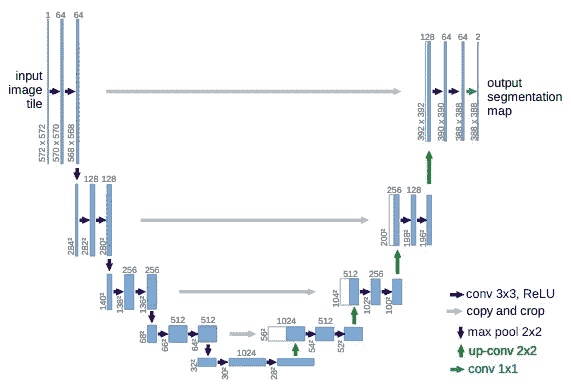
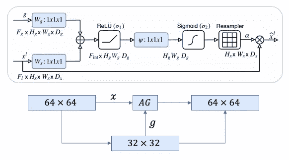
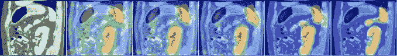
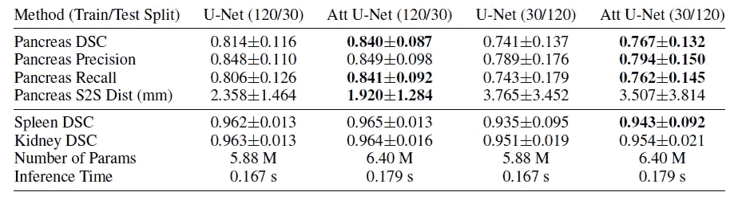

# 注意 U-Net 的详细说明

> 原文：<https://towardsdatascience.com/a-detailed-explanation-of-the-attention-u-net-b371a5590831?source=collection_archive---------7----------------------->

## U-网中的注意门

## 了解新颖的注意力门，它可以自动聚焦于图像中的目标结构

在这个故事中，我解释了 Oktay 等人写的 [Attention U-Net:学习在哪里寻找胰腺](https://arxiv.org/abs/1804.03999)中的 Attention U-Net。艾尔。该论文写于 2018 年，提出了一种新颖的注意力门(AG)机制，允许 U-Net 专注于不同大小和形状的目标结构。

# 概述

1.  什么是注意力？
2.  为什么 U-Net 需要关注
3.  注意力是如何实现的？
4.  分析

# 1.什么是注意力？

在图像分割的背景下，注意力是一种在训练期间仅突出相关激活的方式。这减少了浪费在无关激活上的计算资源，为网络提供了更好的泛化能力。本质上，网络可以“关注”图像的某些部分。

**答:努力关注**

注意力有两种形式，**硬**和**软**。硬注意的工作原理是通过裁剪图像或迭代区域提议来突出相关区域。由于硬注意一次只能选择一个图像的一个区域，所以它有两层含义，它是不可微的，需要强化学习来训练。

由于它是不可微的，这意味着对于图像中的给定区域，网络可以“关注”或不关注，没有中间状态。因此，无法进行标准的反向传播，需要蒙特卡罗采样来计算反向传播各个阶段的精度。考虑到准确性取决于采样的好坏，因此需要其他技术(如强化学习)来使模型有效。

**b .软注意**

软注意通过对图像的不同部分进行加权来工作。高相关性区域乘以较大的权重，低相关性区域用较小的权重标记。随着模型被训练，更多的焦点被给予具有较高权重的区域。与硬注意不同，这些权重可以应用于图像中的许多小块。

当处理句子中的不同单词时，图像上的软注意力权重的可视化。较亮的区域具有较高的权重。[(徐等，2015)](http://proceedings.mlr.press/v37/xuc15.pdf)

由于软注意的确定性，它仍然是可区分的，可以用标准的反向传播来训练。随着模型被训练，权重也被训练，使得模型在决定关注哪些部分方面变得更好。

强烈关注:

1.  一次只挑补丁注意
2.  不可微，需要强化学习

软性关注:

1.  对图像的不同块进行加权以确定相关性
2.  可微分的，可以用反向传播来训练

# 2.为什么在 U-Net 中需要注意力？

为了理解为什么注意力在 U-Net 中是有益的，我们需要看看所使用的跳跃连接。

灰色箭头表示 U 形网络中使用的长跳线连接。 [(Ronneberger 等人，2015)](https://arxiv.org/abs/1505.04597)

在扩展路径中的上采样期间，重新创建的空间信息是不精确的。为了解决这个问题，U-Net 使用跳过连接，将来自下采样路径的空间信息与上采样路径相结合。然而，这带来了许多冗余的低级特征提取，因为初始层中的特征表示很差。

**在跳过连接处实施的软**注意将主动抑制不相关区域中的激活，减少带来的冗余特征的数量。

# 3.注意力是如何实现的？

Oktay 等人推出的注意门使用的是**加性软**注意。

**a .注意门的故障**

**顶部**:注意门(AG)示意图。**底部**:AGs 是如何在每个 skip 连接上实现的。

1.  注意力门接受两个输入，向量 ***x*** 和 ***g*** 。
2.  向量 ***g*** 取自网络的下一个最低层。该矢量具有更小的维度和更好的特征表示，因为它来自网络的更深处。
3.  在上面的示例图中，矢量***×矢量*×矢量**的尺寸为 64×64×64(滤镜×高度×宽度)，矢量**×g×的尺寸为 32×32×32。**
4.  向量 ***x*** 经过步长卷积，其尺寸变为 64×32×32，向量 ***g*** 经过 1×1 卷积，其尺寸变为 64×32×32。
5.  这两个向量按元素求和。该过程导致**对齐的权重变大**，而非对齐的权重变得相对较小。
6.  合成向量经过 ReLU 激活层和 1x1 卷积，将维度折叠为 1x32x32。
7.  这个向量经过一个 sigmoid 层，该层在范围[0，1]之间缩放向量，产生注意系数(权重)，其中系数越接近 1 表示越相关的特征。
8.  使用三线性插值将关注系数上采样到矢量***×矢量*** 的原始尺寸(64×64)。关注系数被逐元素地乘以**原始** ***x*** 向量，根据相关性缩放该向量。然后像往常一样在 skip 连接中传递。

Oktay 等人还提出了一种基于网格的门控机制，该机制从上采样路径而不是下采样路径(除了最低层)获取 ***g*** 向量，因为该向量已经通过先前的注意门被调节到来自多个尺度的空间信息。

注意系数在 3、6、10 和 150 个时期显现，其中红色突出了较高的注意系数。(Oktay et。阿尔，2018)

如上图所示，随着训练的进行，网络学会聚焦于所需的区域。注意门的可微分性质允许它在反向传播期间被训练，这意味着注意系数在突出相关区域方面变得更好。

**b .在 Keras 的实施情况**

# 4.分析

CT-150 数据集上的结果(Oktay 等人，2018 年)

Oktay 等人获得的结果表明，在整体骰子系数得分方面，注意力 U-Net 比普通 U-Net 的表现好得多。虽然注意 U-Net 有更多的参数，但并没有显著增加，推理时间也只是略微延长。

总之，注意门是一种在大量数据集上一致地改进 U-Net 的简单方法，并且在计算成本方面没有显著的开销。

要获得预先实施了注意力、递归和初始层的 U-Net 的完整实施，请检查[https://github.com/robinvvinod/unet/](https://github.com/robinvvinod/unet/)。