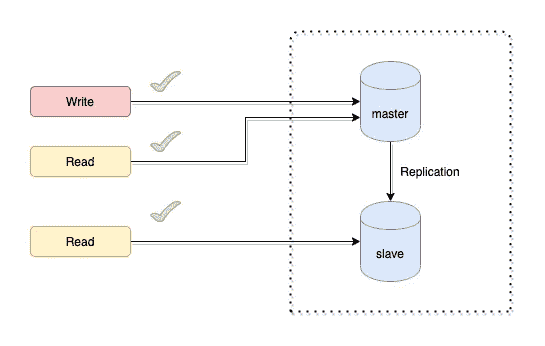
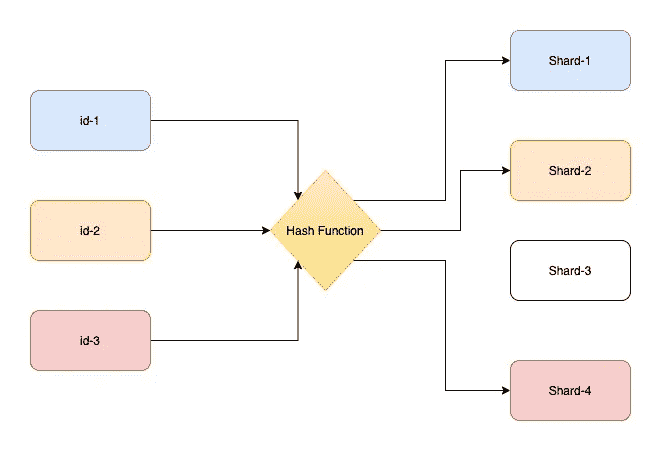
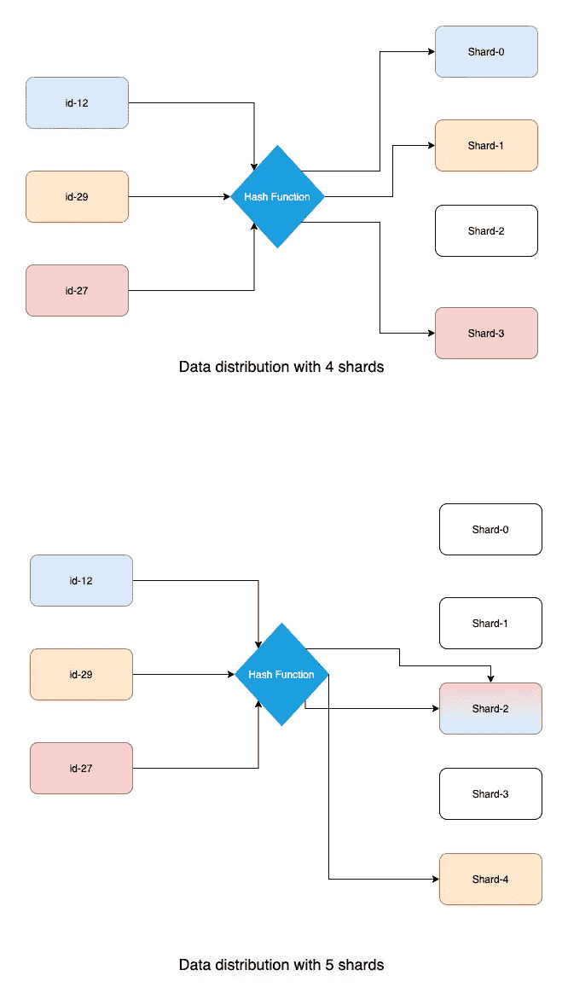
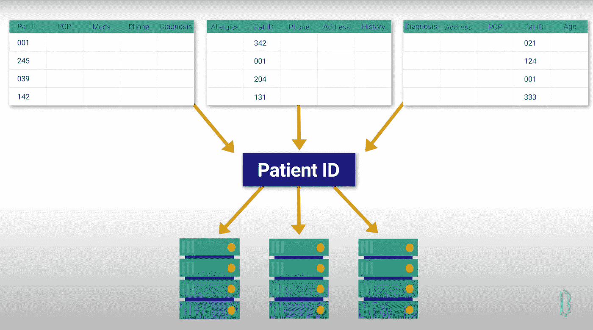
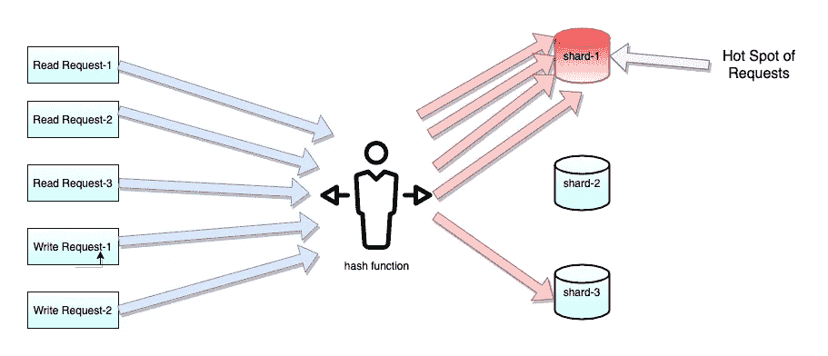

# 理解数据库伸缩基础的开发人员指南

> 原文：<https://towardsdatascience.com/a-developers-guide-to-understanding-the-basics-of-database-scaling-37c8fef94c11?source=collection_archive---------42----------------------->

## 如何扩展数据库以承受传入的流量，以及如何降低其潜在性并提高其性能

菲德尔·费尔南多在 [Unsplash](https://unsplash.com?utm_source=medium&utm_medium=referral) 上的照片

假设我们有一个服务，用一个数据库服务器处理每月几千个请求，这个服务器处理来自应用服务器的所有读/写请求。

到目前为止，一切都运行良好，但是随着时间的推移，您开始观察到传入流量的峰值，即使尝试了以下方法，您也无法减少**延迟**和**数据库故障**:

*   拥有一个拥有大量内存和高性能闪存的数据库。
*   实现了最佳缓存以减少延迟。
*   对数据库查询进行适当的索引和优化。

因此，现在您需要**解决您的数据库基础设施**，以便它能够承受传入的流量。

让我们看看数据库**分片**和**复制**如何提供一个高度可靠和高性能的数据库系统，能够承受数百万的规模。

# 分身术

数据复制是将相同的数据存储在多个数据库服务器上的过程，可减少延迟、提高读取可伸缩性、简化数据恢复和提高数据可用性。

通常，数据副本存储在单独的硬件组件中，因为如果该硬件崩溃，您不希望副本崩溃。

最常用的复制策略是**单领导者复制。**

## 单头复制

在这种复制中，有一个主节点负责所有写入，并处理所有其他节点上的数据复制。
领导节点通常称为主节点，其他从属节点称为从节点。

读取和写入仅在主服务器上启用，从服务器只能处理读取查询。

*作者图片—* 单头主从复制

现在，要更新从属服务器上的数据，我们可以选择同步复制或 T21 异步复制。这两者各有利弊。

**1。同步复制:**一旦收到确认，它就完成写入并通知客户端。

***同步复制的好处***

*   它通过确保所有节点都拥有更新的数据来提供数据一致性，因为所有从节点都与主节点同步。
*   如果主节点出现故障，任何从节点都可以轻松成为主节点，而不会丢失任何数据。

***同步复制的缺点***

*   有时，当主设备等待来自所有从设备的确认时，系统可能是高度潜伏的。
*   如果任何从属服务器不可用或出现故障，则主服务器会阻止所有写入，直到同步副本再次可用。因此导致较低的可用性。

**2。异步复制:** 

这样，即使所有从节点都出现故障，主节点也可以继续进行写入。

***异步复制的好处***

*   它提供了低延迟，因为主设备不等待从设备上的数据更新。
*   更高的可用性，因为即使任何从节点发生故障，也不会影响主节点。

***异步复制的缺点***

*   由于**复制滞后**，可能导致数据不一致。即主设备到从设备的数据复制可能需要很长时间。
    因此，如果在主服务器和从服务器上运行相同的查询(并发执行)，可能会得到不同的结果。
*   如果异步系统中的主节点发生故障，新指定的主节点可能无法完成前一个主节点的所有写操作。如果先前的主设备重新联机并成为从设备，它将具有冲突的写入。

因此，对数据库的**读取规模**可以通过复制来实现。
但是怎么加一个**写尺度**？答案是**分片**。

# 分片

比方说，你有一个比萨饼，你不能一个人吃整个，所以你把它切成片，然后打电话给你的朋友。

现在，这些朋友中的每一个都将得到一片比萨饼。你所做的是根据每个朋友的份额有效地划分比萨饼，就像我们可以有多个数据库服务器，它们将承担发送到它的请求的负载。

照片由 [mahyar motebassem](https://unsplash.com/@mahyarmotebassem?utm_source=medium&utm_medium=referral) 在 [Unsplash](https://unsplash.com?utm_source=medium&utm_medium=referral) 上拍摄

因此，从技术上讲，我们将在分片中将完整的数据库负载分配给 N 个数据库服务器。

每个传入请求的子集将由一个单独的服务器提供服务。现在，每个分区都位于完全不同的物理机器上，并受具有相同数据库模式的独立数据库实例的控制。

这被称为**分片**。它也可以称为水平分区，因为分片基本上是跨不同物理机器/节点的水平分区。

**分片提供了更高的可用性，减少了读/写数据库延迟，并且可以高效地处理高数据库负载。**

在为数据库启用分片时，需要考虑多种因素。需要考虑的两个主要问题如下:

## **碎片键:**

我们需要一些标识符来决定一个特定的请求应该从哪个数据库服务器得到服务。也就是说，应该有一个键，我们应该根据这个键来决定一个请求应该放在哪个碎片上。我们称之为**碎片密钥**或**分区密钥**。
一般我们选择表格的任意一列作为 **shard_key** 。

## **哈希函数**:

哈希是使用**数学函数将任意长度的输入转换成固定大小的文本字符串的过程。** 这意味着任何文本无论多长都可以转换成数字和字母的数组。

这个用于生成散列值的数学函数**被称为**散列函数**。**

因此，我们使用散列函数计算 shard_key 的散列值，然后将该散列值映射到 DB 服务器。

在下图中，**散列函数**将 shard_key (row-id)作为输入，并返回一个值，通过这个值我们可以确定它应该进入哪个 shard。

*作者提供的图片-* 带有 4 个碎片集群的数据库碎片

现在， **NoSQL** 像 Mongo DB 这样的数据库为分片提供了一个内置的标准实现。
更多在数据库级别提供分片的数据库是 Cassandra、Hadoop 和 Apache H-Base e.t.c。

而在 MySQL 这样的关系数据库中，没有分片的标准实现。因此，通常的做法是让**应用程序级分片**用于关系数据库。

# 由于分片可能产生的问题

## 1.数据的重新分布:

如果在一个数据库集群中，一个数据库服务器出现故障，或者您正在向集群添加一个新的数据库碎片，那么您可能需要重新分发或重新散列数据。

这种开销直接依赖于我们用来在不同碎片之间分发数据的散列函数。

如果散列函数是一个简单的取模函数，它采用**行 id** 的**取模**和**个碎片**来决定请求应该到达的碎片，那么在这种情况下，它将导致数据的完全重新散列，如下所示:

*作者提供的图片-* **在添加服务器的情况下重新散列数据**

*在上图中，我们可以看到 4 个碎片的数据映射基于 id 模 4(碎片数)*

12%4 ->第 0 分片
29%4 - >第 1 分片
27%4 - >第 3 分片

*对于 5 个分片，数据映射基于 id 模 5(分片数)*

12%5 ->第二碎片
29%5 - >第四碎片
27%5 - >第二碎片

因此，我们在这里观察到，当我们向现有的 **four shard 集群**添加一个 DB shard 时，所有的行都需要重新映射。

这种**重新分配**通常需要系统停机，这对您的系统来说是有风险的。

## 如何避免:

*   为了避免这种情况，我们可以使用一种特殊的散列技术，名为 [***一致散列***](https://en.wikipedia.org/wiki/Consistent_hashing) ，它通常只需要重新映射`k/N`个键，其中`k`是键的数量，`N`是数据库服务器的数量(更具体地说，是服务器的初始和最终数量的最大值)。

## 2.数据非规范化(关系数据库)

对于单个数据库服务器，需要连接的查询可以很容易地完成，但是我们知道在分布式架构中，数据跨越多个区域。因此，驻留在多个区域上的表的连接将需要大量的处理，并且是相当潜在的。

因此，您可能需要进行数据反规范化，以尽可能避免连接。

## 如何避免:

*   你也可以去 NoSQL 数据库的情况下，你想避免这一点。但是在某些情况下，你可能对关系数据库有一个确切的需求。
*   **共享连接:** 一般来说，为了避免关系数据库中的连接，我们尝试将同一碎片中的行的 FK 映射放在不同的表中。因此，所有需要连接的行都位于同一个片上。

为了实现这一点，我们选择可以连接的列作为 **shard_key** 。因此，不同表中具有相同的 **shard_key** 列值的行将位于同一个 shard 中。

*作者图片——共享加入*

在上面医院数据库的例子中，我们选择 **patient-id** 作为分片键。
因此，具有相同**患者 id** 的不同表格的所有条目将位于相同的碎片中。

## 3.热点关键问题

对同一分片中的一个或多个特定键的过度访问会导致节点耗尽。

也就是说，大部分请求由一小部分碎片提供服务，而其他碎片在大部分时间保持理想状态。这可能会导致节点故障或过载，从而导致延迟和故障激增。

*作者图片-* **大多数请求由 shard-1** 提供服务

在上图中，我们可以看到大多数请求由 **shard-1** 提供服务，因此负载很重。而**碎片-2** 和**碎片-3** 几乎是理想的。

这可能导致 shard-1 所服务的所有请求的延迟和失败增加。

一个真实的例子是，假设脸书选择**用户名**作为其用户表的**碎片键**。所有访问量最大的个人资料，如克里斯蒂亚诺·罗纳尔多的
**、Lady Gaga 的**和贾斯汀比伯的最终都在同一个碎片中。那么与其他碎片相比，该特定碎片将是请求的热点。

## 如何避免:

*   为了避免这种情况，我们需要选择碎片键和散列函数，使得整个应用程序负载几乎平均分布在所有数据库碎片中。

# 结论

分片是以一种巧妙的方式抵御传入流量的绝佳方式。但是你需要确定什么时候是分片的确切需求，因为你可以看到数据分区和分片会带来很多额外的复杂性。

因此，在决定共享数据库之前，您应该考虑其他选项来提高数据库的性能，比如索引或缓存。

但是如果您仍然决定设计一个分布式数据库系统，那么您还必须考虑其他的权衡。

感谢阅读。编码快乐！