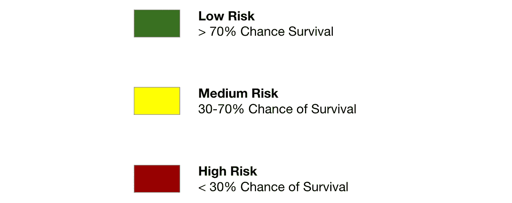
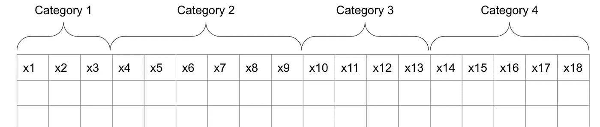

# WiDS 2020 数据马拉松的另一种方法

> 原文：<https://towardsdatascience.com/a-different-approach-to-the-wids-2020-datathon-c1eb07d7f3a4?source=collection_archive---------21----------------------->

## 使用随机森林分类器对 ICU 中的患者进行分类

虽然今年的 [WiDS Datathon](http://dataset) 要求数据科学家预测重症监护室中的患者存活率，但我决定对[数据集](https://www.kaggle.com/c/widsdatathon2020/overview/description)提出一个不同的问题。源于几年前我参加的一个急诊医学课程，我想知道，除了宣布一个病人是否会存活，我们是否可以用存活的概率来相应地对 ICU 中的病人进行分类。

# 设计

问题的第一步是确定分类级别，并确定分配标签的标准。为此，我利用了 [medicinenet](https://www.medicinenet.com/medical_triage_code_tags_and_triage_terminology/views.htm) 上展示的分类层级，并确定了以下模式。

由 Molly Liebeskind 创建的图像

为了确定幸存的机会，我在一个分类模型中预测该类‘幸存’的概率。虽然 Kaggle 竞赛基于 AUC 分数评估模型，但我在这里又一次偏离了，而是选择了针对回忆进行优化。当标记 ICU 中的患者时，我觉得捕捉所有潜在的高风险患者是最重要的，我愿意牺牲一些精确性。也就是说，我确实确保了 AUC 不会随着我的调整而显著下降。一旦我对模型感到满意，我就使用阈值调整来分配分类标签，以确定存活概率与上述模式一致的患者。

# 模型

我的目标是创建一个简单的模型，以便它可以在快节奏的医院环境中有效地部署，我自下而上地设计了这个模型。如下所示，使用数据字典，我根据列所属的类别将较大的数据集分成多个表。

由 Molly Liebeskind 创建的图像

从那里，我评估了存活组和未存活组之间哪些特征有显著差异，以及哪里有机会通过特征工程放大信号。当我从每个类别中选择特征时，我测试了将它们添加到两个不同的模型中，逻辑回归和随机森林，并观察了影响。

有了完整的特性集，我对两个模型都进行了调优。通过五重交叉验证，我认为随机森林优于逻辑回归和我测试的总体变化。最终代码可以在这里找到[。](https://github.com/mollyliebeskind/ICU_Triage_Through_Classification_Modeling)

# 输出

为了证明询问数据的力量，我们可以如何对病人进行分类，而不是预测存活率，我创建了一个简单的 Tableau 仪表板，向医生和医院管理人员显示高风险病人在 ICU 的位置，以便他们可以相应地进行规划和资源配置。下面是该工具的简要演示。

板 1:用于管理人员，显示每个分流组中的患者数量、他们所在的位置以及他们从哪里进入 ICU。board 2:For physicians and filters by department in the ICU，显示该部门中每个风险级别的患者，然后提供每个患者的进一步信息以便快速获取。注意:所有患者 ID 都是我出于演示目的随机生成的，并非来自原始数据集。Molly Liebeskind 设计的仪表盘。

# 持续的挑战

不幸的是，这个模型的最佳特性集包括许多变量，这需要医生和患者的开销。这些特征不仅需要时间、金钱和身体耐力来为每个患者生成，而且输入结果的手动过程会妨碍该工具提供实时益处的能力。由于这只是概念的演示，真正的目标是建立一个模型，在进行医学测试时自动获取数据，并实时协助医生进行分类。

我希望你喜欢 WiDS Datathon 挑战赛的这种不同。请在下面添加任何问题或评论。作为参考，你可以在这里找到[的完整代码](https://github.com/mollyliebeskind/ICU_Triage_Through_Classification_Modeling)。