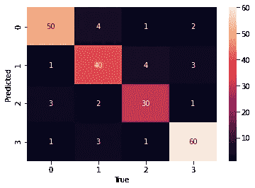
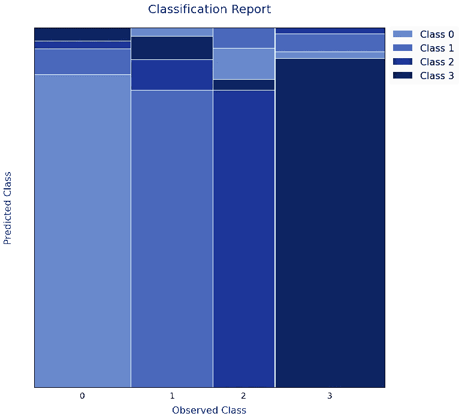

# 可视化分类结果的不同方式

> 原文：<https://towardsdatascience.com/a-different-way-to-visualize-classification-results-c4d45a0a37bb?source=collection_archive---------25----------------------->

## 用不常见的分类图升级你的机器学习报告。

我喜欢好的数据可视化。早在我攻读粒子物理学博士学位的时候，我就被我的同事们构建的直方图和在一个单独的图中积累的信息量惊呆了。

## **图中的信息**

改进现有的可视化方法或从其他研究领域移植方法确实具有挑战性。你必须考虑你的情节中的维度和增加更多维度的方法。一个很好的例子是从箱线图到紫线图再到群集图的路径。这是一个不断增加维度和信息的过程。

给情节添加信息或维度的可能性几乎是无穷无尽的。可以使用不同的标记形状添加类别，像热图中的颜色图可以作为另一个维度，标记的大小可以提供对进一步参数的洞察。

## 分类器性能图

当谈到机器学习时，有许多方法来绘制分类器的性能。有大量的度量标准来比较不同的评估者，如准确度、精确度、召回率或有用的 MMC。

所有常见的分类指标都是从*真阳性、真阴性*、*假阳性*和*假阴性*事件中计算出来的。最受欢迎的图无疑是 ROC 曲线、PRC、CAP 曲线和混淆矩阵。

我不会深入三条曲线的细节，但是有许多不同的方法来处理混淆矩阵，比如添加热图。

混乱矩阵的 seaborn 热图。

## 分类镶嵌图

在许多情况下，这可能就足够了，并且很容易获得所有相关的信息，但是对于一个多类的问题，要做到这一点会变得更加困难。

在阅读一些文件时，我偶然发现:

> *雅各布·雷梅克斯、彼得·j·罗瑟夫、米娅·休伯特。可视化分类结果。arXiv:2007.14495[统计。ML]*

从那里到

> 很友好，迈克尔。"多向列联表的镶嵌显示."*美国统计协会杂志*，第 89 卷，第 425 号，1994 年，第 190-200 页。JSTOR ，[www.jstor.org/stable/2291215.](http://www.jstor.org/stable/2291215.)2020 年 8 月 13 日访问。

作者建议使用镶嵌图来绘制离散值。我们可以将这种想法转移到机器学习领域，将预测的类别作为离散值。

在多类环境中，这样的图看起来像下面这样:

具有四个类别的分类结果的镶嵌图。

与经典的混淆矩阵相比，它有几个优点。人们可以容易地看到 y 轴上的预测类别和 x 轴上的每个类别的数量比例。与简单的柱状图最大的不同是柱状图的宽度，它给出了阶级不平衡的概念。

你可以在这里找到这样一个带有混淆矩阵的图的代码:

祝您在绘制下一个分类结果时愉快！