# 对决策树的探究

> 原文：<https://towardsdatascience.com/a-dive-into-decision-trees-a128923c9298?source=collection_archive---------3----------------------->

马里乌斯·马萨拉尔在 [Unsplash](https://unsplash.com/s/photos/machine-learning?utm_source=unsplash&utm_medium=referral&utm_content=creditCopyText) 上的照片

## 决策树是如何工作的？

决策树是一些最常用的机器学习算法。它们用于分类和回归。它们可用于线性和非线性数据，但主要用于非线性数据。顾名思义，决策树是根据数据及其行为做出的一系列决策。它不使用线性分类器或回归器，因此其性能与数据的线性性质无关。Boosting 和 Bagging 算法已经被开发为使用决策树的基本原理的集成模型，该决策树经过一些修改以克服决策树的一些重要缺点并提供更好的结果。使用树模型的另一个最重要的原因是它们非常容易解释。

## 决策树

决策树可用于分类和回归。虽然原理是相同的，但方法略有不同。决策树使用 CART 算法(分类和回归树)。在这两种情况下，决策都基于任何特性的条件。内部节点表示条件，叶节点表示基于条件的决策。

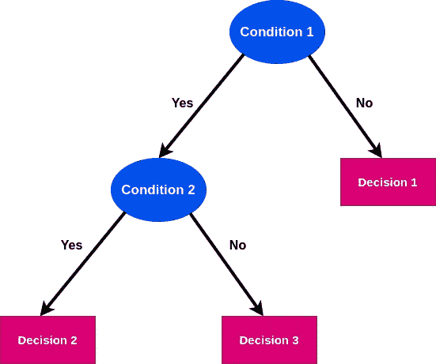

## 分类

> 决策树是基于特定条件的决策的所有可能解决方案的图形表示。

在用于分类的决策树的每个步骤或节点上，我们尝试在特征上形成一个条件，以最大限度地分离数据集中包含的所有标签或类。让我们看看这个想法是如何运作的。

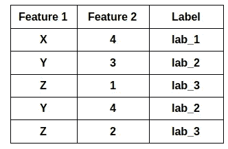

比方说，上面给出的表格是我们的数据集。如果我们尝试分析数据集并基于数据集创建决策树，我们将获得类似下面给出的树

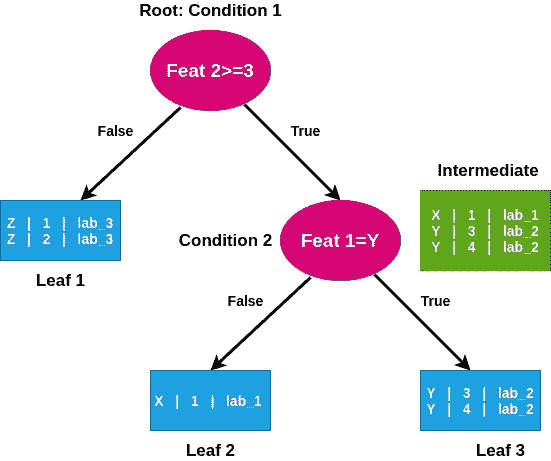

在根节点中，我们首次使用“Feat 2 ≥3”作为分离数据集的条件。我们可以看到，如果答案是假的，我们到达一片叶子，它只有标签为 3 的条目。所以，标签 3 是完全分离的。但是，如果答案是真的，我们到达一个中间节点。在这种情况下，有 3 个条目，其中 2 个属于标签 2，一个属于标签 1。因此，这个结果有杂质，因为有两个标签混合。我们对中间态应用另一个条件，得到纯分离的标签。在叶 2 上，我们仅获得了标签 1 条目，而在叶 3 上，我们仅获得了标签 2 条目。

现在，可能出现的问题是:

1.  在数字特征的情况下，例如“feat 2≥3”，我们如何确定决定值？
2.  我们如何决定应该使用哪些特性来创建我们的内部条件节点？
3.  如何决定首先使用哪个特性，例如，在前面的例子中，我们有特性 1 和特性 2，那么，我们应该使用哪个特性作为根？

随着我们的前进，我们将会看到这些问题的答案。

在我们开始讨论这些答案的细节之前，让我们先来看看在回答这些问题时起主要作用的一些定义。

**熵:**它给出了数据中杂质或随机性的度量。它由下式给出:

> 熵= — P(类 1) x Log(P(类 1)) — P(类 2) x Log(P(类 2))

其中 P 表示概率。

如果有两个数量相等的类别，类别 1 和类别 2，即类别 1 的条目数量等于类别 2 的条目数量，并且我们随机选择一个条目，则它将以 50%的概率属于任何类别 1 或类别 2。在这种情况下，熵将会很高。

如果某个数据集的所有数据都属于类 1 或类 2，则获得的熵为 0，因为在这种情况下，P(类 1)或 P(类 2)将等于 0。如果 P(class1)=0，那么 P(class2)应该等于 1。因此，很明显，如果数据集中有不纯或混合的类别标签，熵将会很高。

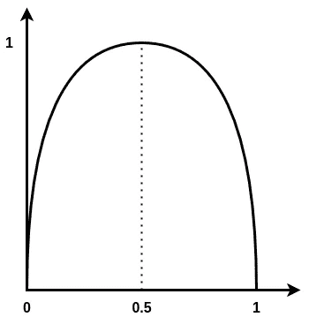

Pr(x==1)

上图显示了标签概率随熵的变化。我们可以看到如果一个标签的概率是 0.5，熵是最大的。

如果数据集中总共有 20 个条目或行，其中 14 个属于标签 1，6 个属于标签 2，则熵将等于:

> = — P(标签 1)。log(P(标签 1)) — P(标签 2)。日志(P(标签 2))
> 
> =—14/20 . log(14/20)—6/20 . log(6/20)
> 
> =0.880

**信息增益:**信息增益是数据集基于属性拆分后熵的减少。构建决策树取决于找到返回最高信息增益的属性。它有助于选择在特定点使用哪个特征或属性来创建决定性的内部节点。

它由下式给出:

> 信息增益=熵(s) — [(加权平均)x(每个特征的熵)

那么，这实际上是如何操作的呢？

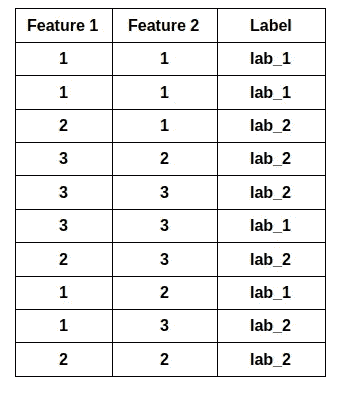

比方说，这是我们的数据集。所以，我们有特性 1 和特性 2，它们应该是我们的根节点。上述决定是基于每个特征提供的信息增益量。所以，让我们检查一下。

首先，我们想要检查基于每个特征的标签的分布，以便深入了解一个特征将提供多少信息增益。

例如对于特征 1，

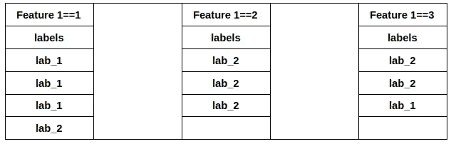

我们可以看到，如果我们选择条件“特征 1==2”，我们可以成功地将标签 2 从数据集中纯粹地分离出来。

> 现在，熵(E(s))=—4/10 * log(4/10)—6/10 * log(6/10)= 0.97
> 
> 对于功能 1:
> 
> e(feature _ 1 = = 1)=—3/4 * log(3/4)—1/4 * log(1/4)= 0.81
> 
> e(feature _ 1 = = 2)=—3/3 log(3/3)=—1 log 1 = 0
> 
> e(feature _ 1 = = 3)=—2/3 * log(2/3)—1/3 * log(1/3)= 0.91
> 
> 对于功能 1，加权平均值=
> 
> 4/10*0.81+3/10*0+3/10*0.91=0.597
> 
> 信息增益= 0.97–0.597 = 0.313

同样，让我们对特性 2 做同样的事情:

对于功能 2:

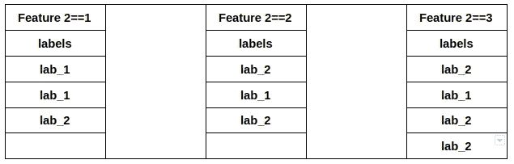

> 对于功能 2:
> 
> e(feature _ 2 = = 1)=—2/3 * log(2/3)—1/3 * log(1/3)= 0.91
> 
> e(feature _ 2 = = 2)=—2/3 * log(2/3)—1/3 * log(1/3)= 0.91
> 
> e(feature _ 2 = = 3)=—3/4 * log(3/4)—1/4 * log(1/4)= 0.81
> 
> 对于特性 2，加权平均值=
> 
> 3/10*0.91+3/10*0.91+4/10*0.81=0.87
> 
> 因此，特征 2 的信息增益= 0.97–0.87 = 0.1

现在，我们发现特征 1 在该点的信息增益大于特征 2。因此，我们将使用特性 1 来形成根节点。

**基尼指数:**基尼指数也是一种衡量杂质的指标，用于使用 CART 机制构建决策树。

它由下式给出:

> 基尼系数= 1 —(“第一类”的概率)——(第二类”的概率)

让我们看看它的工作情况，

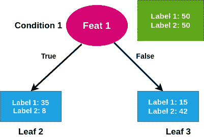

比方说，这是我们在 100 个条目的数据集上的分布。应用于特征 1 的条件给出了上述结论。

> 叶的基尼系数 1:1-(35/43)—(8/43)= 0.302
> 
> 叶 2 的基尼系数:1 — (15/57) — (42/57) =0.38
> 
> 现在，特征 1 的总体基尼系数杂质:
> 
> 基尼系数的加权平均值:
> 
> =43/100* 0.30+ 57/100*38=0.34

同样，我们还计算了其他特征的基尼系数。

需要注意的一点是，如果数据集中的每个条目只属于一个类，即类 1 或类 2，

> 基尼杂质:1-(1/(0+1) )-(0/(0+1) )=0

因此，我们可以看到，对于一个纯粹的分布，基尼系数是 0。

Gini 杂质指数也可以用于决定应该使用哪个特征来创建条件节点。选择产生较小基尼系数杂质指数的特征，以在该点创建内部条件节点。

我们已经看到了一些概念，为了理解决策树的工作原理，我们需要知道这些概念。我想我们已经找到了第二个和第三个问题的答案，即特征是如何决定的，以及哪个特征被用来形成结论的条件。我们现在需要找到第一个问题的答案，即在连续数字特征的情况下，如何获得用于形成条件的值。

寻找最合适的值来创建条件的过程非常简单。首先，我们基于数值特征以升序方式对数据集进行排序。接下来，我们找到相邻数值对的平均值。

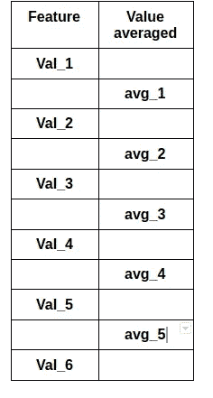

比方说，我们获得了如上所示的平均值。所以，avg_1=(val_1+val_2)/2。接下来，根据我们使用的方法，我们拟合条件中的平均值，以检查哪个提供了最小的基尼系数或哪个提供了最大的信息增益。平均值用作我们为该特征形成的条件中的截止值。

类似地，对于基于离散值或基于类的特征，我们尝试拟合集合中存在的每个值并创建条件。最后，我们选择给出最小基尼系数的值或条件。我们的第一个查询到此结束。

现在，我们已经看到，我们考虑基尼系数或信息增益来决定我们应该考虑哪种情况。在某些情况下，一些特征显示根本没有改进或者没有信息增益，这样的特征从不在决策树中使用。决策树就是这样进行自动特征选择的。

决策树的主要挑战之一是它会导致数据过度拟合。这主要是因为它为训练数据创建了基于条件的方法。所以，它与训练数据非常吻合。现在，对树中的训练数据应用的条件越多，树就长得越深，它就越适合数据。但是在一个点之后，它开始考虑一些特征上的非常小的变化，这给出非常低的信息增益，通常这些点破坏了模型的泛化，并且在测试数据上表现得像异常值。我们可以通过使用信息增益的阈值来限制这些条件，这样，如果条件提供的信息增益小于给定值，我们就不会考虑该条件。这部分地防止了过度拟合，并有助于创建通用模型。

剪枝是一种删除节点以获得最优解和降低复杂度的树的方法。它删除分支或节点，以便创建降低过拟合倾向的子树。一旦我们完成了回归树，我们将讨论这个概念。

## 回归

要理解回归树的概念，必须对回归和线性回归的概念有一个清晰的认识。如果需要，请随意阅读我关于回归的文章。

让我们考虑两个条件:

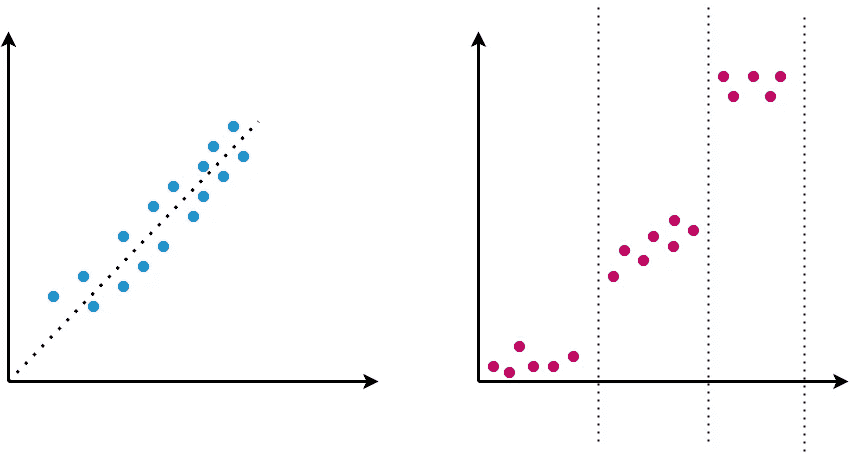

在第一个分布中，我们可以看到，我们可以很容易地拟合一条线。所以，在这种情况下，我们可以用线性回归来预测一个值。但是，在第二种分布的情况下，很明显，我们不能用任何特定的直线来拟合分布来预测值，因为分布在不同的范围内表现非常不同。换句话说，在第二种情况下，分布是非线性的。在这种非线性情况下，使用回归树。一个论点是，我们可以对非线性数据使用多项式回归，但有时分布分析和决定多项式相当复杂，因此，决策树的基于条件的方法是首选。

在回归树中，叶子代表一个连续的数值，而分类树通常在叶子上代表布尔值或离散值。

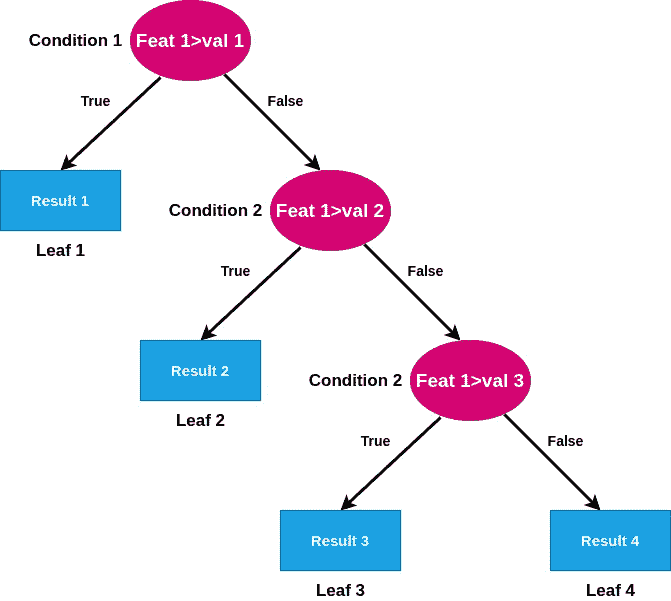

上图展示了回归树的基本结构。当多个特征加入并且特征集的维度增加时，树变得更加复杂和难以分析。

现在，让我们看看如何决定我们应该选择哪个值来创造条件。这与我们在分类树中所做的有点不同。

假设我们有一个由三个特性组成的特性集:特性 1、特性 2 和特性 3。

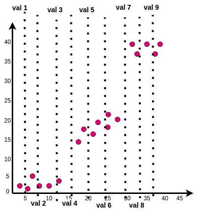

功能 1 的分布

让我们把上面的图像看作是特性 1 的分布。y 轴具有我们需要拟合回归的值，X 轴具有特征值。因此，我们将图表中显示的值 Val 1、Val 2 等视为构成要素 1 条件的截止值。这些值只是两个对应点的特征 1 值的平均值。现在，让我们看看计算是如何进行的。

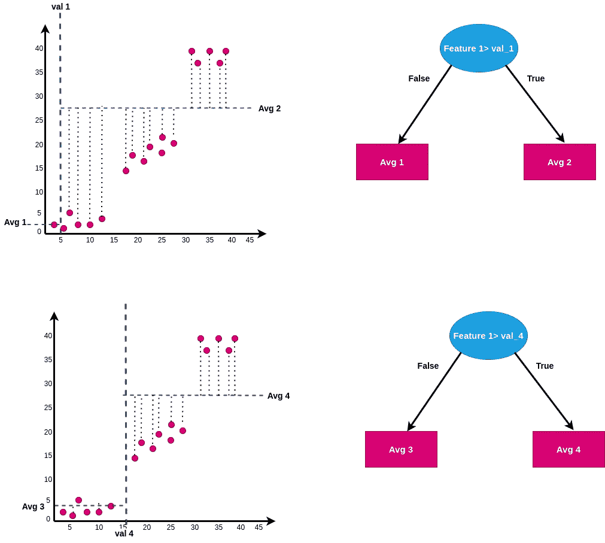

现在，让我们考虑上面的图表。这些图不是按比例绘制的，所以 avg_2 不等于 avg_4。当我们将 val_1 视为要素 1 的临界值时，我们将线左侧点的所有 Y 值的平均值视为 avg_1，同样，我们将线右侧所有点的平均值视为 avg_2。因此，对于条件 feature 1>val_1 为真的任何值，树提供 avg_2 作为预测，反之亦然。

接下来，我们计算所有点的平方误差。因此，对于线右侧的任何点，该点的平方误差为(实际值-预测值(即 avg_2))，类似地，对于左侧的任何点，该点的平方误差为(实际值-预测值(即 avg_1))。所以，我们找到所有点的平方误差，然后求和。这叫做误差平方和。比方说，对于值 1，误差平方和是 S_1。

类似地，对于值 4，计算误差平方和为 S_4。我们可以观察到 S_4 会比 S_1 小很多。因此，我们找到所有我们观察的值的误差平方和，作为创建条件的截止值。如果我们绘制它们，我们将获得如下所示的图。

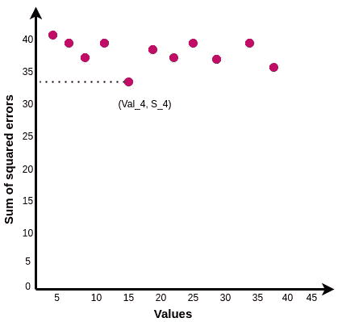

在上图中，我们可以看到特征 1 的 val_4 提供了该点的最小误差平方和。现在，我们已经看到了特定值的截止值是如何确定的。

现在，如果我们有多个特征，如何决定我们应该使用哪个特征来创建节点。为此，我们创建候选人。例如，对于特征 1，val_4 给出最小的误差平方和。因此，它被称为功能 1 的候选。类似地，我们找到特征 2 和特征 3 的候选者。假设特征 2 的候选对应的 SSR 是 S2 _ 3，特征 3 的候选对应的 SSR 是 S3 _ 5。我们将比较 S_4、S_2_3 和 S_3_5，并选择最小值。对应于最小值的特征将被用于创建决定节点。

上述方法被递归地用于创建回归树。至此，我们已经看到了 CART 机制是如何工作的，以及分类树和回归树是如何形成的。现在，简单回顾一下树木中一个非常重要的概念:修剪。

## 修剪

该方法用于树中以减少过度拟合。这是一个减少树的节点和分支以减少树的深度的过程。

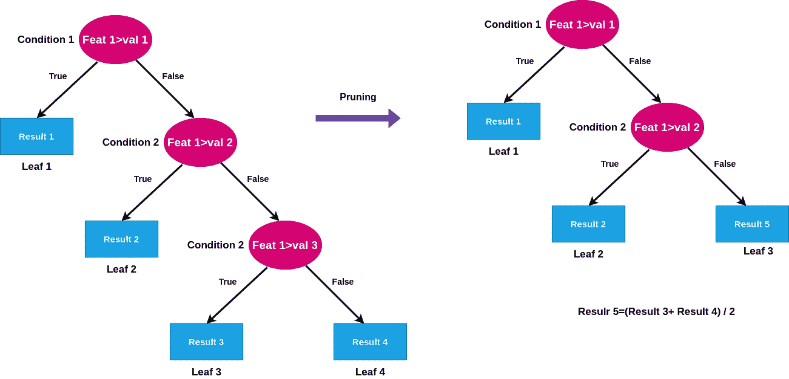

上图显示了修剪的概念是如何工作的。

基本上有两种类型的修剪:

1.  预修剪
2.  后期修剪

在预修剪中，我们在创建树的过程中设置参数，如“最小样本数”、“最大深度”和“最大叶子数”。所有参数都需要超参数调整，并使用交叉验证和网格搜索方法找到。它将树限制在一定的深度或一定数量的叶子。

后期修剪方法大多是在树已经形成之后进行的。成本复杂性修剪是最常用的后修剪方法。

## 结论

决策树具有巨大的重要性，因为它们在 bagging 和 boosting 的情况下形成了集成学习模型的基础，bagging 和 boosting 是机器学习领域中最常用的算法。同样，由于其简单的结构和可解释性，决策树被用在一些人类可解释的模型中，如 LIME。

在本文中，我们已经看到了决策树是如何使用 CART 原理工作的。

希望这有所帮助。