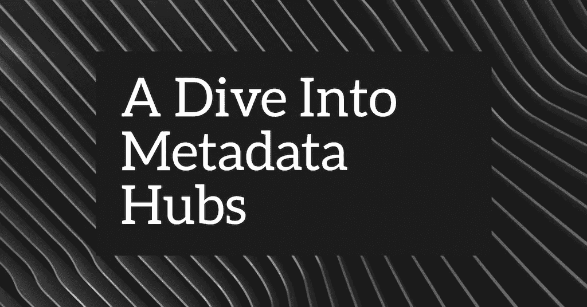
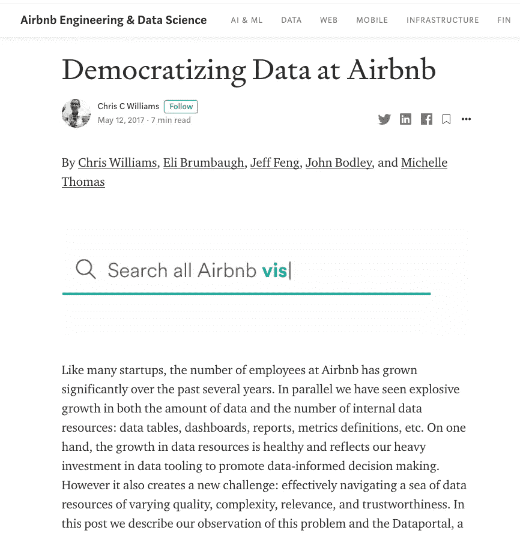
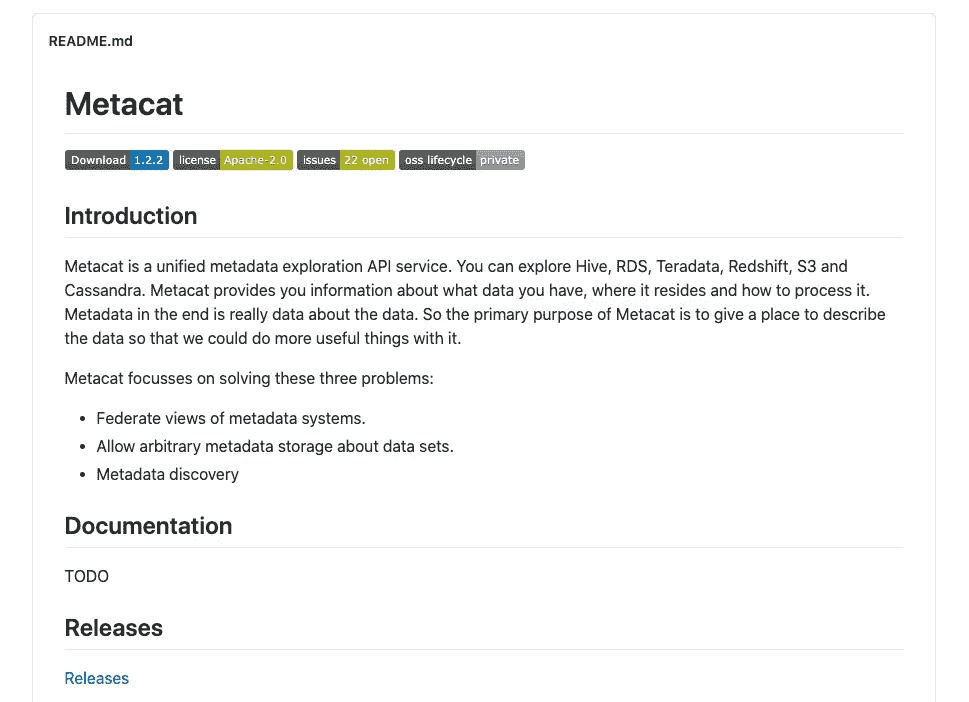
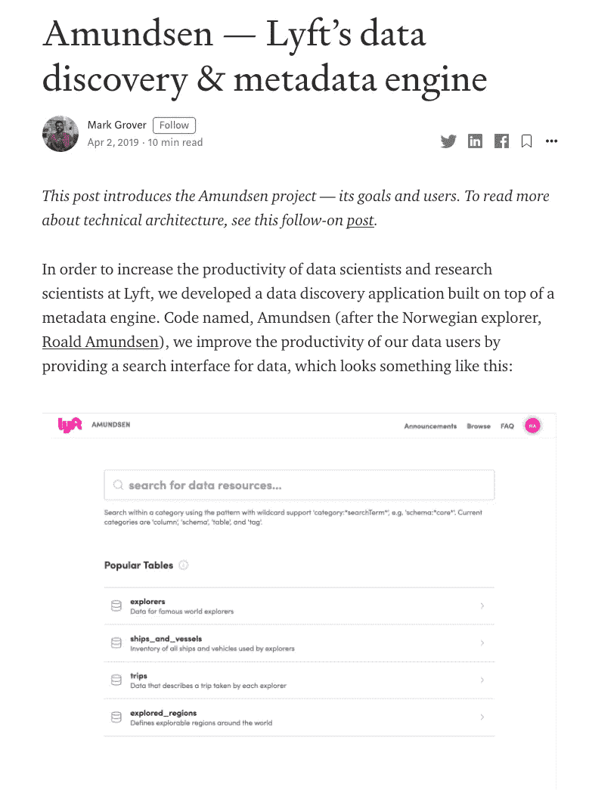
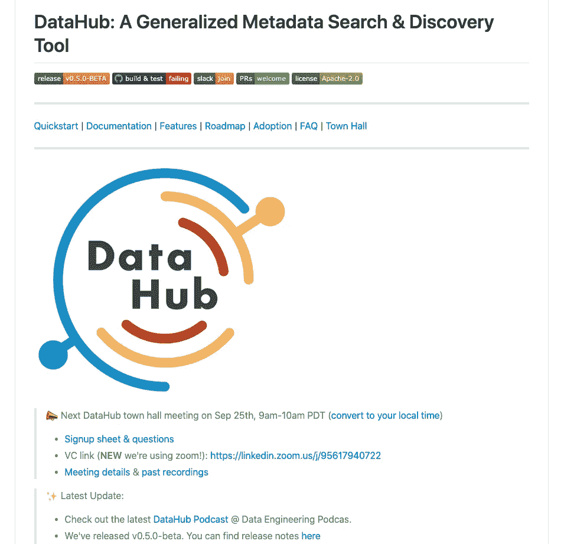

# 元数据中心工具探究

> 原文：<https://towardsdatascience.com/a-dive-into-metadata-hub-tools-67259804971f?source=collection_archive---------35----------------------->

## 如今，“元数据中心”正在发生一些变化

作者图片

元数据中心(有时也称为元数据搜索和发现工具)似乎是分析领域正在发生的另一种趋势/运动。仅在过去的两年里，我们已经看到许多元数据中心项目被主要的技术公司发布、撰写或开源。其中包括:

*   Airbnb 的[数据门户](https://medium.com/airbnb-engineering/democratizing-data-at-airbnb-852d76c51770)
*   网飞的[元卡特](https://github.com/Netflix/metacat)
*   优步的[数据手册](https://eng.uber.com/databook/)
*   LinkedIn 的[数据中心](https://github.com/linkedin/datahub)
*   Lyft 的[阿蒙森](https://www.amundsen.io/)
*   Spotify 的 [Lexikon](https://engineering.atspotify.com/2020/02/27/how-we-improved-data-discovery-for-data-scientists-at-spotify/)
*   以及谷歌云平台的[数据目录](https://cloud.google.com/data-catalog)(虽然我只是把它包括进来，因为它看起来像是对当前市场上元数据中心趋势的回应)。

在这篇文章中，我将快速总结这些产品旨在解决的问题，快速概述每个项目，然后深入研究看起来最有希望的两个项目:LinkedIn 的 Datahub 和 Lyft 的 Amundsen。

# 什么是元数据中心？

假设您是一家大型公司的数据用户或数据分析师，该公司在全球有许多办公室。您的数据组织分布在这些位置，您在不同的数据仓库和 BI 工具中有数千个表，还有分布在整个公司不同分析阶段的数百个报告、数据集和数据模型。你需要找到你需要的报表，或者你想要的数据集。如果你找不到这些东西，那么你需要找到下一个最好的东西:你需要知道向谁询问，或者向组织中的哪个团队询问。

进入元数据中心。

元数据中心的目标是充当公司内整个数据生态系统的“搜索引擎”。名称中的“元数据”意味着“关于数据的数据”。这包括表模式、列描述、访问记录以及与每个数据库或数据仓库相关联的 SLA 等信息，还包括“哪个团队负责这个数据集”以及“最后一个从这个数据集创建报告的人是谁？”

当然，正如 LinkedIn 数据中心的 Mars Lan 所说:“如果你能通过问你公司的一个人来找到所有东西的位置，那么你肯定*不需要这个。”只有当您是一个大型组织，并且您需要跨整个组织扩展数据访问时，元数据中心才变得重要。你会听到像“数据民主化”和“数据可发现性”这样的词被抛来抛去；他们真正指的是随机数据分析师跟上一个非常大的数据生产和数据消费组织的能力。*

> 只有当您是一个大型组织，并且您需要跨整个组织扩展数据访问时，元数据中心才变得重要。

概括地说，*我上面提到的所有*元数据中心项目都提供了以下内容的某种组合:

*   **搜索:**终端用户的搜索界面。
*   **Discovery:** 一个可探索的界面，供用户浏览和导航不同的数据源，并深入到表或行级别。
*   **自动化:**一个 API 服务，公开元数据供其他内部数据服务使用。
*   **管理:**选择、保存和管理元数据集合的能力。

某些项目，如 Airbnb 的 Dataportal 和 Spotify 的 Lexikon，能够公开用户资料，以便你可以找到最近接触过你感兴趣的数据集的个人或团队。但其他人没有。

# 这些项目，简单来说

我将按时间顺序浏览这些项目，如果你愿意，我会给你足够的外部链接，让你可以去寻找最初的公告帖子、存储库(如果有的话)和技术讲座。但是，如果您想了解好的部分，我建议您浏览这一部分(特别注意关于 Amundsen 和 Datahub 的部分)，然后跳到下一部分，在那里我将比较这两个项目。这两个人似乎是目前社区活动最多的人。

# Airbnb 的数据门户，2017 年 5 月 11 日

Airbnb 公布数据门户的博文截图。到目前为止，它不是开源的，也没有任何更新。图片作者。

这个列表中最早的项目是 Airbnb 的 Dataportal。克里斯·威廉姆斯和约翰·博德利在 GraphConnect Europe 2017 的舞台上首次描述了 Dataportal(此处提供幻灯片)。一天后，也就是 2017 年 5 月 12 日，他们发表了一篇博文，描述了这个系统。

Dataportal 跟踪谁在 Airbnb 内生产或消费数据资源。该项目将这些关系建模为 neo4j 中的图表，这意味着他们可以提供一个搜索引擎，使用 Pagerank 算法，将这些关系展现给用户。

Dataportal 从来都不是开源的，有趣的是，它也没有出现在[https://airbnb.io/projects/](https://airbnb.io/projects/)上。从那以后我们再也没有听说过这件事。

# 网飞的 Metacat，2018 年 6 月 15 日

大约一年后，网飞发表了一篇[博文](https://netflixtechblog.com/metacat-making-big-data-discoverable-and-meaningful-at-netflix-56fb36a53520)描述他们的元数据系统，命名为 Metacat。这个项目是为了填补网飞数据栈中的一个漏洞而构建的——本质上，他们需要一个元数据服务来介于他们的 Pig ETL 系统和 Hive 之间。

Metacat 系统是网飞数据基础设施中的一个联合服务。它提供了一个统一的 API 来访问网飞内部生态系统中各种数据存储的元数据，但它是根据网飞自己的工具和数据堆栈高度定制的。它看起来没有特别好的可扩展性。

Metacat 的 Github 页面。作者照片。

Metacat 是[开源的](https://github.com/Netflix/metacat)，正在积极开发中，但似乎不是为外部采用而设计的。截至发稿时，他们的 Github 自述文件包含一个标题为“Documentation”的部分，下面写有“TODO”字样。

# 优步的数据手册，2018 年 8 月 3 日

优步的数据手册是在网飞的 Metacat 发布后一个月左右在一篇博客文章中公布的。

优步公布数据手册的博客文章——作者照片。

Databook 从 Hive、Vertica、MySQL、Postgres 和 Cassandra 获取元数据，并在一个界面中展示表模式、列描述、来自数据库的样本数据、统计数据、沿袭、新鲜度、SLA 保证和数据所有者等内容。它还允许 Databook 用户在其用户界面中组织和管理这些元数据。在早期阶段，Databook 建立在一个爬虫架构上(也就是说，Databook 将运行爬虫，从各种数据源收集元数据)，但随着时间的推移，优步的数据工程团队最终将系统切换到一个建立在 Kafka 之上的系统。他们还从 MySQL 转换到 Cassandra，以便支持多个数据中心，同时不会增加延迟。

Databook 并不是开源的，我们也没有听说过它。据推测，它仍然在优步广泛使用。

# Lyft 的阿蒙森，2019 年 8 月 3 日

Lyft 的 Amundsen 是在 2019 年 8 月 3 日[宣布](https://eng.lyft.com/amundsen-lyfts-data-discovery-metadata-engine-62d27254fbb9)的，然后几个月后[开源](https://eng.lyft.com/open-sourcing-amundsen-a-data-discovery-and-metadata-platform-2282bb436234)，同年 10 月 31 日。

阿蒙森的书出版后引起了一些轰动。dbt [的 Tristan Handy 写了关于 Amundsen 开源的](http://roundup.fishtownanalytics.com/issues/amundsen-s-launch-scaling-a-data-team-resampling-evolutionary-algorithms-open-source-segment-dsr-205-209650):

> *这款产品非常重要，我真的相信在未来五年内，该产品类别将成为数据领域最重要的产品类别。所有东西都需要放入目录中。*

阿蒙森的 DNA 中有过去系统的痕迹。与 Dataportal 一样，它允许您在公司内部搜索数据资源，并为它可以访问的每个数据源中的每个表公开一个可发现的界面，一直到行级别。在发布时，创建者还谈到了他们打算如何与 Workday 等工具集成，以便在 Amundsen 的搜索图中显示员工信息，这样您就可以联系到与您感兴趣的数据集有关联的同事。

Lyft 的博客文章宣布阿蒙森。作者照片。

Amundsen 由许多不同的部件组成([来源](https://eng.lyft.com/open-sourcing-amundsen-a-data-discovery-and-metadata-platform-2282bb436234)):

*   **元数据服务**处理来自前端服务以及其他微服务的元数据请求。默认情况下，持久层是 Neo4j。
*   **搜索服务**由 Elasticsearch 支持，处理来自前端服务的搜索请求。这个搜索引擎也可以被替代。
*   **前端服务**是一个 Flask webapp，托管一个 React 前端。这是用户交互的主要界面。
*   **Databuilder** 是一个通用的数据摄取框架，它从各种来源提取元数据。它受 Apache[goblin](https://eng.lyft.com/open-sourcing-amundsen-a-data-discovery-and-metadata-platform-2282bb436234)的启发，作为 ETL 工具将元数据推送到 Amundsen 的元数据服务中。它使用气流作为工作流程工具。
*   最后， **Common** 是一个库 repo，它保存了阿蒙森所有微服务的公共代码。

在阿蒙森发布的博客文章中，作者[注意到](https://eng.lyft.com/amundsen-lyfts-data-discovery-metadata-engine-62d27254fbb9)发现数据假象的时间已经降低到阿蒙森之前基线的 5%。阿蒙森的社区可能是这里涵盖的所有项目中最大的，并且它今天仍在快速增长。

# 领英的数据中心，2019 年 8 月 14 日

[宣布](https://engineering.linkedin.com/blog/2019/data-hub)在阿蒙森之后不到两周，LinkedIn 的数据中心实际上是他们建立元数据中心的第二次尝试。2016 年，LinkedIn 开源了 [WhereHow](https://engineering.linkedin.com/blog/2016/03/open-sourcing-wherehows--a-data-discovery-and-lineage-portal) ，这影响了本文提到的其他一些项目。但 Datahub 是从头开始编写的，旨在解决 LinkedIn 在 WhereHow 方面遇到的一些问题。

最有趣的是，Datahub 建立在“基于推送”的架构之上。这意味着必须修改组织中的每个数据服务，以便将元数据推送到数据中心，而不是让数据中心从服务中抓取数据。在实践中，这并不太难做到，因为 Datahub 是建立在 Kafka 流之上的，Kafka 已经在 LinkedIn 中广泛使用(Kafka 是在那里创建的)。

DataHub 的 Github 页面。你可以看到这个项目正在进行中。作者照片。

Datahub 的架构带来了许多有趣的好处。首先，它允许增量摄取(而不是每隔一段时间进行一次抓取或快照)。其次，它允许近乎实时的更新，因为任何推送到数据中心的更改都会立即传递给下游用户。火星兰，创作者之一，笔记(播客；大约在 [18:20](https://www.dataengineeringpodcast.com/datahub-metadata-management-episode-147/) 左右)这种设置允许您构建使用从 Datahub 发出的 changestream 的应用程序，并且他们已经在 LinkedIn 中广泛地这样做了。

事实上，[整集播客](https://www.dataengineeringpodcast.com/datahub-metadata-management-episode-147/)值得一听。Lan 谈到了他们在 Datahub 中提出可扩展但通用的数据模型时需要做出的一些权衡(“当人们花 90%的时间讨论如何正确地对元数据建模，然后花 10%的时间实际编码时，你知道你已经成功了。”).它让你感受到工程师们给这个项目带来的丰富经验。

Datahub 在今年二月被[开源](https://engineering.linkedin.com/blog/2020/open-sourcing-datahub--linkedins-metadata-search-and-discovery-p)。稍后会有更多的介绍。

# Spotify 的 Lexikon，2020 年 2 月 27 日(尽管建于 2017 年)

Spotify 的 [Lexikon](https://engineering.atspotify.com/2020/02/27/how-we-improved-data-discovery-for-data-scientists-at-spotify/) 与之前的项目覆盖了大部分相同的领域。Lexikon 的最初版本建于 2017 年，以应对 Spotify 转移到 GCP 和 BigQuery 后数据集的爆炸。

Spotify 公布 Lexicon 的博文。到目前为止，这个项目还没有开源。作者照片。

该项目的最新颖之处在于，它为数据用户提供了算法生成的个性化数据集建议。(如果你仔细想想，*这是 Spotify 应该做的事情*)。像 Dataportal 一样，Lexikon 提供了一种搜索体验，同时也提供了可能对你正在查看的数据集有所帮助的用户。像 Amundsen 和 Datahub 一样，Lexicon 向您显示表级和列级的统计信息。

Lexikon 不是开源的。

# 谷歌云的数据目录，2020 年 5 月 1 日

[谷歌云的数据目录](https://cloud.google.com/data-catalog)是一种类似的元数据服务，但它只适用于 GCP 服务，如 BigQuery、Pub/Sub 和云存储文件集。这个想法是，你将数据目录添加到一个现有的 GCP 主持的项目中，打开开关，享受谷歌数据目录的好处。

我只包括这个项目有两个原因。首先，谷歌[宣布它已经在 2020 年 5 月 1 日](https://cloud.google.com/blog/products/data-analytics/data-catalog-metadata-management-now-generally-available)全面上市，就在不久之前。对于外部观察者来说，这似乎是对该领域当前活动的回应，这对整个数据生态系统来说是个好兆头。

其次，谷歌表示，数据目录是建立在从他们的*商品*数据系统中提取的洞察力之上的，该数据系统过去是(现在是？)作为一种非常有效的数据目录服务在谷歌内部使用了很多年。描述这个系统的论文可以在[这里](https://static.googleusercontent.com/media/research.google.com/en//pubs/archive/45390.pdf)找到。

# 观看阿蒙森和数据中心

在这组项目中，Amundsen 和 Datahub 似乎是领先者。阿蒙森有一个热闹的社区，一个非常时髦的 [网站](https://www.amundsen.io/)，以及许多有趣的案例研究:[edmunds.com](https://technology.edmunds.com/2020/05/27/Adding-Data-Quality-into-Amundsen-with-Programmatic-Descriptions/)、 [ING](https://medium.com/wbaa/facilitating-data-discovery-with-apache-atlas-and-amundsen-631baa287c8b) 和 [Square](https://developer.squareup.com/blog/using-amundsen-to-support-user-privacy-via-metadata-collection-at-square/) 。其他采用 Amundsen 的公司包括 Workday、Asana 和 iRobot。

Amundsen 在 Datahub 上有一点领先，因为它在去年 10 月开源。社区更大，截至 8 月 11 日，阿蒙森现在是 Linux Foundation 的 AI 基金会孵化项目。更重要的是，你可以在[新闻稿](https://lfai.foundation/blog/2020/08/11/amundsen-joins-lf-ai-as-new-incubation-project/)中看到项目创建者 Mark Grover 的声明:

> *“成为 LF AI 基金会的一员是该项目在成为事实上的开源数据发现和元数据引擎的旅程中的一个重要里程碑。看到 Lyft 采用 Amundsen，以及其开源社区的增长，现在已经有超过 750 名成员，真是令人惊讶。我很高兴看到这个项目在 LF AI 基金会的支持下持续增长并取得成功。”*

另一方面，Datahub 应该受到重视，因为 LinkedIn 在开源项目方面的记录(他们创建了 Kafka，然后开源了 Kafka，Kafka 现在是云基础设施领域的一个主要项目，Datahub 建立在 Kafka 之上*……用创建者的话说，使扩展它的工作成为一个“解决的问题”)。根据他们的 Github 页面，采用 Datahub 的组织数量也相当可观:其中包括 Expedia、Saxo Bank、TypeForm 和 Experius 等公司。*

这是值得注意的，因为 DataHub 仅在六个月前开源。Mars Lan 和 Pardhu Gunnam 最近在[数据工程播客](https://www.dataengineeringpodcast.com/datahub-metadata-management-episode-147/)上接受了采访，他们指出，采用的速度和不断增长的社区让他们有些吃惊。兰还认为，他们的方法优于市场上的其他任何方法，因为四年多前在 LinkedIn 内建立 [WhereHow](https://engineering.linkedin.com/blog/2016/03/open-sourcing-wherehows--a-data-discovery-and-lineage-portal) 的经验来之不易(应该指出，兰没有参与 WhereHow，但 WhereHow *的使用为 Datahub 的设计提供了*)。

# 结论

当我写这篇文章的时候，距离这些项目公开发布已经一年多了，距离开始采用开源还不到一年，距离它们成熟还有很长的路要走。

鉴于这些项目解决了非常相似的问题，并得到了强大的技术公司的支持，而且大多数项目都选择了开源方法，看看哪些项目会走在前面以及是什么让它们这样做将会很有趣。