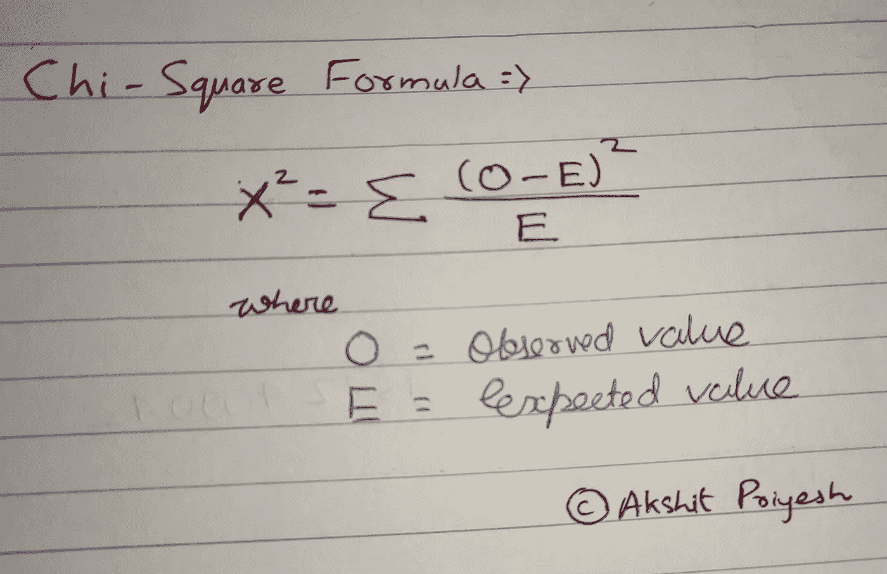
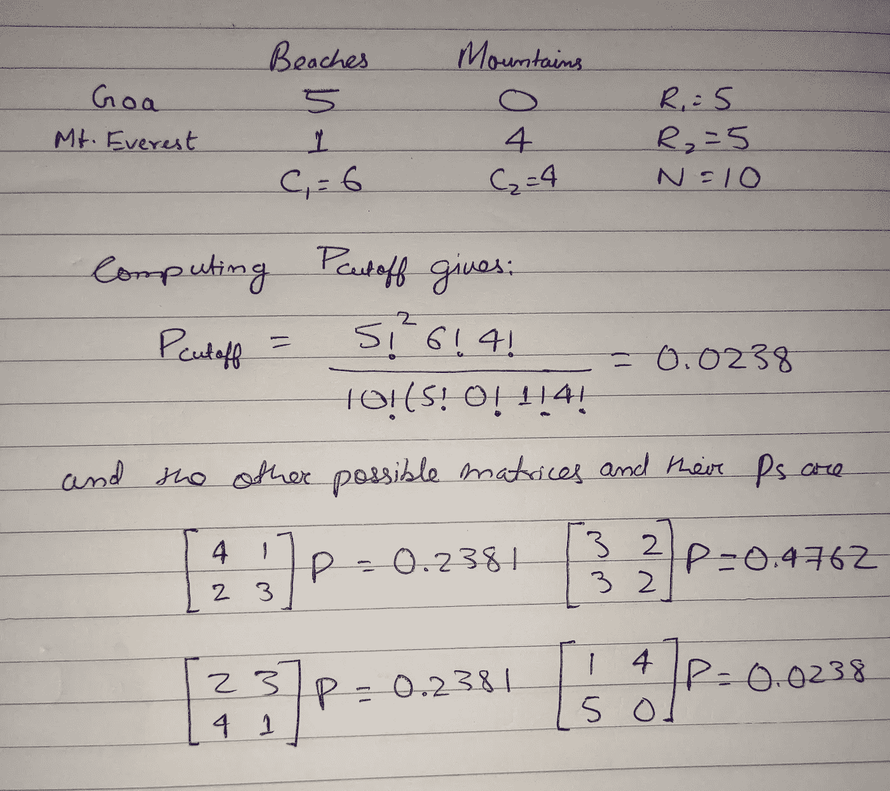

# 推动分类数据的测试

> 原文：<https://towardsdatascience.com/a-drive-to-tests-on-categorical-data-2154cb89093?source=collection_archive---------52----------------------->

阿克希特·普里耶什

## 什么是数据的分类分析？

C 分类数据分析是将响应变量分成一组互斥的有序(如信用评分组)或无序(如贷款类型)类别的数据分析。

## 用更简单的话说

> 在统计学中，我们使用总体样本进行分析，在该样本中，属于特定组的数据点总数称为频率，因此这种分类数据分析称为频率分析。定量描述一组数据特征的研究称为描述统计学。频率分析是描述统计学的一部分。在统计学中，频率是一个事件发生的次数。频率分析是统计学的一个重要领域，它处理出现的次数(频率)并分析集中趋势、离差、百分位数等的度量。对于这种频率分析，我们有许多统计测试。我们将在本文中讨论一些重要的测试。

# 卡方检验

这是最常见、最常用和最重要的假设检验之一。一个**卡方检验**，也被写为**T5χ2 检验**，是一个[统计假设检验](https://en.wikipedia.org/wiki/Statistical_hypothesis_testing)，当检验统计量在[零假设](https://en.wikipedia.org/wiki/Null_hypothesis)下为[卡方分布](https://en.wikipedia.org/wiki/Chi-squared_distribution)时[有效](https://en.wikipedia.org/wiki/Validity_(statistics))执行，特别是[皮尔逊卡方检验](https://en.wikipedia.org/wiki/Pearson%27s_chi-squared_test)及其变体。皮尔逊卡方检验用于确定在[列联表](https://en.wikipedia.org/wiki/Contingency_table)的一个或多个类别中，预期[频率](https://en.wikipedia.org/wiki/Frequency_(statistics))和观察到的频率之间是否存在[统计显著性](https://en.wikipedia.org/wiki/Statistical_significance)差异。

卡方检验有两种类型**。两者都将卡方统计和分布用于不同的目的:**

**卡方拟合优度测试**确定样本数据是否与总体匹配。

一个**卡方独立性检验**比较列联表中的两个变量，看它们是否相关。在更一般的意义上，它测试分类变量的分布是否彼此不同。

*   **非常小的卡方检验统计量**意味着您的观察数据与您的预期数据非常吻合。换句话说，是有关系的。
*   非常大的卡方检验统计量意味着数据不是非常吻合。换句话说，没有关系。

## 用简单的话，用简单的例子

> 卡方检验给出了一个“p”值来帮助我们决定哪一个应该是完美的和首选的蜜月目的地。

举例。阿克希特·普里耶什

> **性别影响蜜月目的地吗？**
> 
> 如果性别确实影响首选蜜月目的地，我们说他们是依赖。
> 
> 通过简单的计算，我们可以很容易地找到 p 值。
> 
> p 值为 0.101
> 
> 现在， **p < 0.05** 是对**依赖性**的通常测试。
> 
> 在这种情况下 **p 大于 0.05** ，因此我们认为变量是独立的**。**
> 
> **换句话说，男人和女人可能对泰姬陵和巴黎有不同的偏好，而不是 T21。这只是我们在收集数据时预期的随机差异。**

****

**卡方公式。**

> **使用 python 进行卡方检验**
> 
> **t，p = stats.chisquare(dataframe)**

# **费希尔精确试验**

**从前面的例子中，我们知道卡方检验是近似的，所以我们需要一个精确的检验。对于这个精确的测试，费希尔的精确测试进入了框架。**

****费希尔精确检验是一种用于列联表分析的统计显著性检验。尽管在实践中，当样本量很小时使用它，但它对所有样本量都有效。****

> **使用 python 导入**
> 
> **stats.fisher_exact**

**它返回 p 值，用于查找极端值或比观察值更极端的值。**

**例如，x 是度假目的地海滩或山区，y 是旅游目的地海滩或山区的数量。如果果阿旅游了 5 次，珠穆朗玛峰旅游了 1 次，果阿没有山和 4 个不同的海滩。那么相关的矩阵将是**

****

**举例。阿克希特·普里耶什**

**实际上总和为 1。小于或等于 Pcutoff= 0.0238 的 p 值之和是 0.0476，因为它小于 0.05，所以[有效](https://mathworld.wolfram.com/Significance.html)。因此，在这种情况下，在目的地和出现的目的地类型之间将存在统计上显著的关联。**

# **麦克内马试验**

**在统计学中，麦克内马检验是一种用于成对名义数据的统计检验。它应用于具有二分特征的 2 × 2 列联表，具有匹配的受试者对，以确定行和列的边际频率是否相等。它是以奎因·麦克尼马尔的名字命名的，他在 1947 年引进了它。**

> **在 python 中**
> 
> **从 statsmodels.sandbox.stats.runs 导入 mcnemar**

# **科克伦 Q 检验**

**在统计学中，在双向随机区组设计的分析中，响应变量只能采用两种可能的结果，Cochran 的 Q 检验是一种非参数统计检验，用于验证 k 处理是否具有相同的效果。它是以科克伦命名的。**

> **在 python 中**
> 
> **从 statsmodels.sandbox.stats.runs 导入 cochrans _ q**

## **结束注释
本文的重点是收集&演示分类数据测试的概念。这种方法提供了一个自然的框架来处理参数和模型的不确定性，并且已经变得非常流行，特别是在像机器学习这样的领域。然而，它的计算量要大得多，因此通常需要借助现有的工具(如 statsmodels 或 stats)来实现。这也显示了像 Python 这样的自由和开放语言的优势之一，因为它们提供了一种建立在科学界现有工作基础上的方法，并且只需要我们的热情和奉献。**