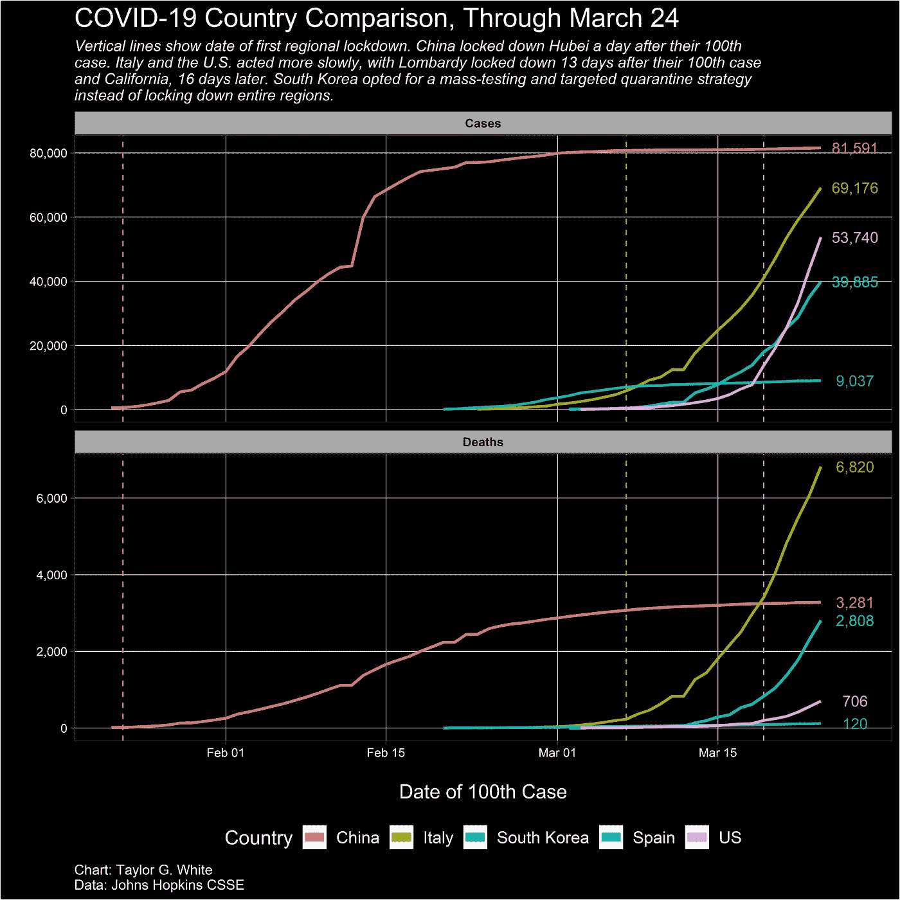
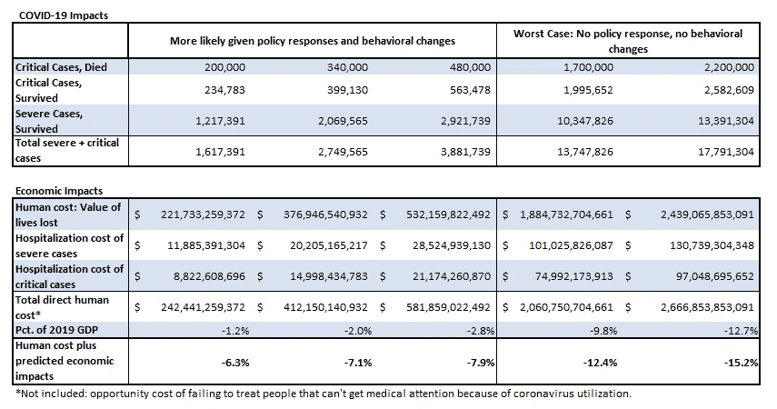

# 错误的选择:拯救生命还是拯救经济

> 原文：<https://towardsdatascience.com/a-false-choice-save-lives-or-the-economy-4a420822b510?source=collection_archive---------37----------------------->

## 生命可以被拯救，但经济总是会受到冠状病毒的沉重打击

***编者按:*** [*走向数据科学*](http://towardsdatascience.com/) *是一份以数据科学和机器学习研究为主的中型刊物。我们不是健康专家或流行病学家，本文的观点不应被解释为专业建议。想了解更多关于疫情冠状病毒的信息，可以点击* [*这里*](https://www.who.int/emergencies/diseases/novel-coronavirus-2019/situation-reports) *。*

周日晚上，川普总统在推特上表示，他不希望解决新冠肺炎问题的方法比问题本身更糟糕。其他人，包括非常严肃的人如[埃隆·马斯克](https://twitter.com/elonmusk/status/1239756900255903744?s=20)和[杨安泽](https://twitter.com/AndrewYang/status/1236395050441027584?s=20)，都说对抗病毒的经济损失超过了如果我们选择什么都不做或反应软弱可能导致的死亡。得克萨斯州副州长丹·帕特里克说得更直白，他认为很多祖父母会愿意为他们的孙辈牺牲经济。

这种思维有两种解读方式。一是人们不相信公共卫生专家的说法，即冠状病毒的致命性是季节性流感的十倍，季节性流感在美国每年导致 3-4 万人死亡，即使有疫苗(冠状病毒疫苗可能要到明年的 T32 才能准备好)。另一个解释是，美国老年人的生命没有得到适当的重视，这比专家对病毒危险的估计更有可能是不正确的。

## 珍惜生命

人们怎么能把这些生命的价值与试图拯救它们的代价相比较呢？人们可能会觉得生命是无价的，但保险公司和政府机构等组织会给人的生命贴上价格标签，以衡量不同的政策决定。以 2020 年的美元计算，美国环保署估计一个人的生命价值为 1050 万美元。这比其他估算生命价值的方法都要高，比如用一个人一生的收入来估算(2020 年价值 280 万美元)。但它抓住了人们在经济贡献之外还有价值的直觉。

利用环境保护局的生命价值和其他一些指标，人们可以比较不同政策选择的成本。我们有[按年龄组估计的](https://www.imperial.ac.uk/media/imperial-college/medicine/sph/ide/gida-fellowships/Imperial-College-COVID19-NPI-modelling-16-03-2020.pdf)病毒致命程度，我们知道每个年龄组有多少[人。我们还对最终处于严重或危急状态的冠状病毒病例的比例以及每种类型的病例可能花费的费用有所了解。最后，研究人员估计了在人们行为的各种假设下，病毒的致命性。](https://data.census.gov/cedsci/table?q=Population%20Total&hidePreview=false&t=Population%20Total&tid=ACSDP1Y2018.DP05&vintage=2018)

在没有政策应对措施和很少或没有行为应对措施的情况下，[早期最坏情况](https://www.nytimes.com/2020/03/13/us/coronavirus-deaths-estimate.html)估计冠状病毒将在美国导致 170 万到 220 万人死亡。然而，这种灾难不太可能在现实中发生。即使政府对这样的疫情无所作为，人们也会改变他们的习惯，许多其他机构如企业和学校也会改变他们的行为来减缓病毒的传播。更有可能的情况是，死亡人数估计在 20 万到 48 万之间，中间值为 34 万，是季节性流感每年死亡人数的十倍。

## 比较政策成本

下表显示了将所有这些数字放在一起的结果。很难说当前的政策会属于哪种情况。尽管鉴于迄今为止的行动，我们不太可能看到最坏的情况估计，但根据图 1 所示的数据，很明显，美国的反应看起来更像意大利，而不是中国或韩国。我的假设是，目前的政策符合更有可能的 20-48 万人死亡的估计。

更有可能的情况是直接成本占 GDP 的-1.2%到-2.8%。这包括 160 万或更多重症或危重病例的住院费用以及生命价值损失。这还不包括*不能*因集中资源治疗冠状病毒而造成的影响(在最糟糕的情况下，这一影响会更高)。这些数字也不包括对经济的后续影响。

高盛[估计](https://www.goldmansachs.com/insights/pages/us-daily-20-march-2020.html)由于公共卫生状况，经济将在 2020 年收缩 3.8%。但总的影响不仅仅是-3.8%，而是这种增长与没有冠状病毒的情况有多么不同。[过去五年的平均经济增长率](https://fred.stlouisfed.org/series/GDPC1)为 2.3%，但在病毒来袭前[市场预计会出现衰退](https://markets.businessinsider.com/news/stocks/next-recession-trump-survey-shows-most-economists-predict-downturn-2021-2019-8-1028456445)。我的方法使用了一个介于平均增长率和 1990 年、2001 年和 2009 年的平均值 0.3%之间的值，结果为 1.3%。总体而言，该病毒的经济影响为 GDP 的-5.1%-3.8%-1.3%。

这个数字应该与更可能发生的情况的直接成本结合起来，以计算我们当前政策的总成本，结果是 GDP 的-6.3%到-7.9%。与最坏的情况相比，这个成本就相形见绌了。无所作为的直接成本(不包括经济状况)估计为 GDP 的-9.8%到-12.7%，远远高于现行政策。

## 面对威胁，人们会改变行为

然而，说什么都不做就意味着经济将继续沿着同样的增长道路前进是错误的。最糟糕的情况表明，1370-1780 万人将因严重或危急病例而住院。由于对人们产生了如此巨大的影响，从某种意义上来说，一旦佛罗里达的春假孩子因为危及父母和祖父母的安全而受到严厉指责，他们就会停止外出。联邦政府之外的机构会制定政策来保证人们的安全。综合来看，这些措施会减缓经济增长。

即使美国选择什么都不做以避免衰退，其他国家仍然会让[关闭](https://www.youtube.com/watch?v=KxtGJsnLgSc)他们的大部分经济活动，这将会减缓全球经济，降低美国的增长。我在这里的假设是，在最糟糕的情况下，对美国经济的影响将是一半(-2.6%，而不是-5.1%)，导致总成本为 GDP 的-12.4%至 15.2%，远远高于美国迄今为止采取的黯淡应对措施的成本。

如果一个人对生活有不同的价值观，或者认为经济在最坏的情况下会更好，那会怎样？任何人都可以在这里下载电子表格模型[，并利用输入来观察影响。这些结果对许多关于最坏情况下经济增长和生命价值的合理假设选择是稳健的。](https://github.com/tgwhite/Public_Policy/blob/master/Projects/COVID-19/Economic%20costs%20of%20coronavirus.xlsx?raw=true)

## 但是拯救经济需要多少成本呢？

这篇文章的早期反馈正确地指出，目前国会正在辩论的财政刺激方案(约 2 万亿美元)的价格高于当前的政策(占 GDP 的 7.1%，约 1.5 万亿美元)。然而，财政刺激计划旨在让经济恢复活力，目标是让经济比没有刺激时增长得更快。

这意味着刺激的净成本低于其初始价格。例如， [TARP](https://en.wikipedia.org/wiki/Troubled_Asset_Relief_Program) 是一项 7 亿美元的计划(实际投资约 4 亿美元)，旨在帮助 2008 年金融危机后的[最终实现盈利](https://money.cnn.com/2014/12/19/news/companies/government-bailouts-end/)。很难说这项刺激计划的最终成本是多少，但值得指出的是， [2017 年特朗普减税](/which-party-adds-more-to-deficits-a6422c6b00d7)仅在 2018 年就使政府收入减少了大约[5000 亿美元](https://www.cnbc.com/2019/12/05/us-tax-revenue-dropped-sharply-due-to-trump-tax-cuts-report.html)。危机过后回到奥巴马时代的收入水平将有助于为当前的刺激买单。

## 人们不仅仅是经济贡献者

事实是，从来就没有什么也不做的选择。各州命令人们就地避难是一件好事，这不仅仅是因为拯救生命的价值。上面的功利算计，错过了以尊严和尊重待人的价值。这种尊重有助于一个有凝聚力的社会，并支持个人权利。

未来的问题是，特朗普政府和州/地方政府会坚持到底吗？我最担心的是，人们会变得如此担心经济，以至于放松限制和他们自己的个人安全措施，这将导致病毒传播的死灰复燃，就像在台湾看到的那样。鉴于迄今为止的经济损失和许多人对传播病毒的恐惧，放松限制不太可能让经济起死回生。

*数据仓库和脚本可以在* [*这里找到*](https://github.com/tgwhite/Public_Policy/tree/master/Projects/COVID-19) *。*