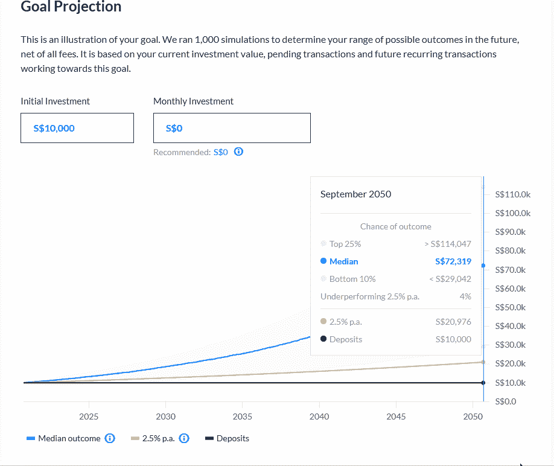
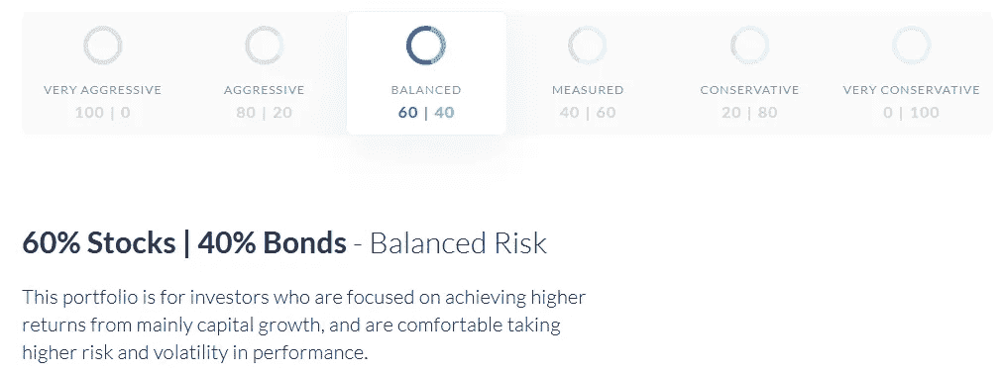
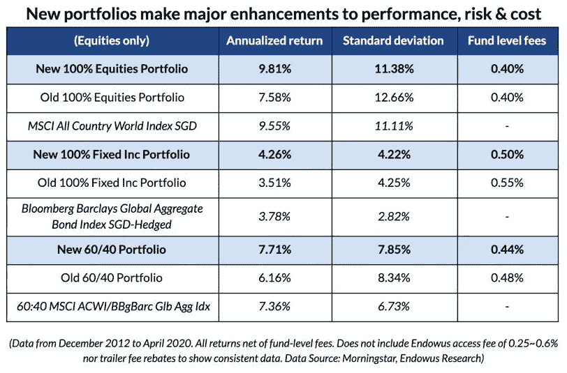
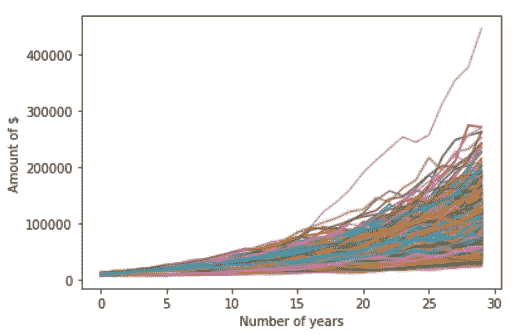
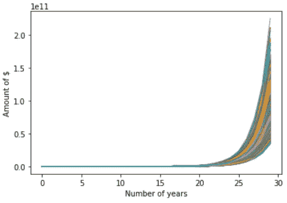
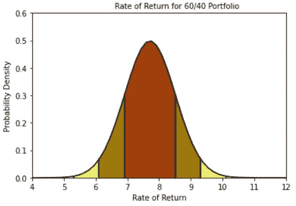

# 虚假的安全感

> 原文：<https://towardsdatascience.com/a-false-sense-of-security-when-investment-firms-tell-you-they-ran-1000-simulations-11673ffc9572?source=collection_archive---------60----------------------->

## 或者，当投资公司告诉你他们进行了 1000 次模拟时，你为什么要小心翼翼

所以，几天前，我和我爸爸就如何处理我银行里的一些现金发生了一点小争执。我想用这笔钱来产生比大多数银行提供的可怜的 0.5%的利率更好的利率。我父亲更倾向于把我的钱存放在一个随机的顾问那里，并相信他们会投资，而我更倾向于自己管理这笔钱。由于无法得出结论，我们决定进行一次实验，并决定以 2:1 的比例分割这笔钱，将 2/3 的钱存放在这家新的、受欢迎的投资公司，并将 1/3 的钱留给我投资。

然而，当我开始调查这家公司时，我变得有点警惕——特别是因为他们一直宣传自己是一家“数据驱动”的公司，并拥有所有这些很酷的图形。下面是文章大纲(和 TL；博士)

# TL；博士；医生

1.  这家公司是新加坡金融公司，拥有数据驱动解决方案和专有系统
2.  问题:
    a .模拟的不准确性/不可靠性:模拟/模型的准确性取决于其输入的准确性。如果输入一开始就有缺陷，那么运行一个模型 1000 或 1000000 次并不会提高它的预测准确性。因此，他们的 1000 次模拟预测并不令人印象深刻。
    b .历史回报+费用:历史回报(公司用于预测)从不具有指示性或提供未来回报的确定性。此外，费用会影响回报率。
3.  结论:投资公司做这样的预测没有错，但作为消费者，我们必须意识到，它们并不总是最准确的

# 公司

该公司标榜自己是一家“总部位于新加坡的 ***金融科技公司*** ，让人们能够掌控自己的财务未来”。我强调了“金融技术公司”部分，因为这是这家公司真正高度推销自己的地方，将这种“先进”的技术方法与传统的财务顾问形成对比。他们的使命声明继续解释说，他们使用“专有系统，在构建个性化解决方案时提供数据驱动的财富建议。”哇——对普通人来说，这一切听起来真的很酷，而且(用新加坡的俗语)很俗气。数据驱动的建议？专有系统？帮我报名吧，宝贝。

当你第一次在他们那里开户时，你可以选择设定一些财务目标。你投入你的初始投资，你的每月供款，以及你的风险承受能力(用最大提取百分比表示)。这就是令人印象深刻的数据奇迹发生的地方。在运行了一些**密集的**计算后，它吐出了一个预计的投资组合增长图(基于 ***1000 次*** 模拟；是的一千)。它看起来是这样的:



很漂亮不是吗？因此，这种所谓的数据驱动方法似乎向潜在投资者传达了这样的信息——嘿！我们使用一些尖端技术来管理您的资金，因此您可以信任我们。但是事情是这样的…真的有那么令人印象深刻吗？让我们找出答案。

# 问题

# 模拟的不准确性

首先，运行 1000 次模拟听起来很酷。我的意思是，如果我们尝试 1000 次，它肯定是准确的，对不对？但是让我们回顾一下，想想这意味着什么。运行 1000 次模拟以获得一系列可能性可以被认为是蒙特卡洛模拟**。这被定义为任何“当随机变量的干预存在时，用于预测不同结果的概率的模型”。本质上，它允许您使用重复采样来解释潜在的随机性。**

这真的是一个“先进”的概念吗？当然，这听起来和看起来令人印象深刻，但实际上很容易复制。因此，我创建了一个函数来估计回报，给定预期回报和标准差(这也是模拟的另一个关键问题，我们将在后面讨论)

创建函数后，我运行了一个循环，允许用户输入他们的初始投资、年回报率和标准偏差(根据公司的模拟)。

在我的模拟中，我使用了他们 60/40 投资组合的年回报率和标准差——这是一个保守但面向增长的策略。



```
how much is your initial investment? 10000 
What is the yearly rate of return? 0.0771 
What is the standard deviation of return 0.0870 
How many years are you investing for? 30 
How many times to simulate? 1000
```

在输入我的设置(遵循给定的回报率)后，我计算了投资组合的第 10 个百分点、中间值和第 75 个百分点(模仿公司模拟给出的结果)

```
The median return of the portfolio is 71657.24\. 
The 10th percentile is 38651.81 and the 75th percentile is 96055.78\. The highest amount is 438889.69, and the lowest is 16925.8.
```



将我的结果与他们的进行比较(如下图)，我必须说这是非常接近的。我的模拟超出了中位数约 7000 美元，但这很可能是因为我没有考虑费用等因素。前 25%的人也超出了大约 6000 美元，但后 10%的人非常相似，只有大约 2000 美元的差异。总的来说，我对这个结果很满意。


在这一点上，你可能会说，“扎克！看到了吗？太准了！这家公司有什么让人不喜欢的地方？”这让我想到了模特的问题。模型的输出完全取决于模型的输入。这似乎是显而易见的，但这正是这些花哨的萨满的问题，告诉你他们运行了 1000 次模拟。我可以运行 1，000，000 次模拟(事实上我确实这么做了)，如果我的输入完全错误，它不会增加我的准确性一点。例如，我用不同的输入再次运行这个模型(并模拟 10，000 次)。



我运行这个模型 10，000 次会让它更精确吗？不要！如果我的输入是有缺陷的(在这种情况下，70%的年回报率)，我的输出仍然是有缺陷的，不管我运行了多少次模拟。因此，这些东西看起来很好，很花哨，但它们不能成为“准确性”的标志，因为它们严重依赖于输入。这就引出了我的下一个观点…

# 历史回报+费用

作为一家公司，该公司自 2010 年代末才成立，因此预期回报率来自他们所投资基金的历史回报率。预计回报率，当用图表表示时，看起来像这样:



标准差为 8.7%，这意味着有 68%的机会(一个标准差)，你的年回报率将在 6.9%和 8.4%之间。原则上，该公司不“选股”，而是通过买入股票和债券 ETFs 共同基金(并为智能再平衡收取管理费)，帮助客户实现多元化。因此，预测的不是公司投资组合的历史回报，而是这些基金历史回报的合并(加权)！我们都知道使用历史回报的问题……正如 David Blanchett(晨星投资管理公司退休研究负责人)指出的那样，使用历史回报来衡量未来回报“隐含了历史事件的重复发生，并且只考虑了有限的数据”。此外，他认为，“蒙特卡洛工具的一个问题是，它们往往能描绘出一幅不切实际的回报图景”，给人一种确定性的假象，而实际上，“确定性要小得多”。

另一个影响回报的潜在因素是费用。我明白每一笔投资都要收费。毕竟，有人*要拿*的工资来维持公司运转。该公司将其 0.6%的费用(低于 20 万美元的投资组合)与行业平均水平约 2%进行了比较。虽然这个数字肯定更低，但我们必须再次记住，这家公司本身并不是一家投资公司。相反，他们将资金分配到基金中，而基金经理就是投资这些资金的人。这些基金*也*收取管理费(合计约 0.5%)。

# 结论

那么，这一切给我们留下了什么？我写这篇文章的意图并不是要败坏这家公司的名声，或者阻止任何人投资这种“数据驱动型”投资公司。相反，通过剖析该公司背后的“奇特”技术，我想提出两个关键点。

1.  首先，警惕漂亮的视觉效果和 *cheem* sounding 的东西。运行 1000 次模拟听起来真的很酷，但你必须记住，一个模型的预测输出只和它的输入一样准确。如果输出不准确，1000 或 100 万次模拟真的不会对模型的准确性产生太大影响。
2.  第二，历史回报不能为未来回报提供确定性。我们当然可以用历史回报来估计未来的回报，但我们需要记住，无论图表看起来有多好，都没有确定性。

所以，我没有责怪他们。该公司显然收取较低的费用，而且确实有健全的多样化战略等。但是，作为一个潜在的投资者，请注意，他们作为“优势”呈现的美丽的数据驱动模型是有局限性的。

*最初发表于*[https://zachlim98.github.io/me/](https://zachlim98.github.io/me/)*。*