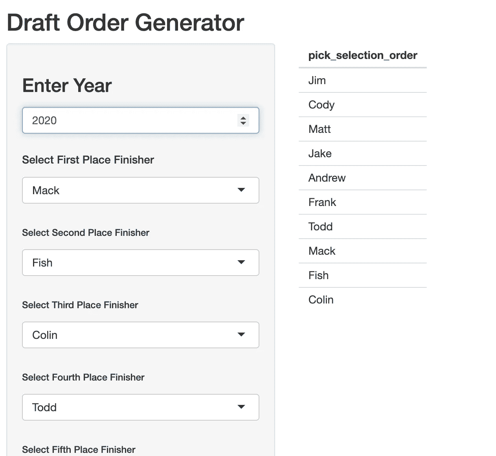

# 一个幻想草案秩序彩票使用 R 闪亮

> 原文：<https://towardsdatascience.com/a-fantasy-draft-order-lottery-using-r-shiny-6668a5b275d2?source=collection_archive---------49----------------------->

## 作为 web 应用程序编写的 NBA 风格的彩票系统


迪伦·诺尔特在 [Unsplash](https://unsplash.com?utm_source=medium&utm_medium=referral) 上的照片

新冠肺炎影响了体育运动，进而影响了梦幻体育运动。然而，我们的梦幻足球联盟仍然准备好为一个不确定的赛季进行选秀。我们的联盟竞争激烈，为了确保没有人在第一次选秀权时出局，我们实施了 NBA 风格的抽签系统，让每个人都有机会获得梦寐以求的第一次选秀权。在本文中，我将解释如何为我们的梦幻联盟创建一个 web 应用程序来实现 NBA 风格的彩票系统。

## NBA 风格彩票(加权彩票)

NBA 在 1990 年采用了加权抽签系统，给战绩最差的球队最好的机会获得状元签。与 NBA 内的加权彩票系统相关联的赔率多年来一直在调整，以减少彩票中最佳球队的第一次整体选秀权的数量，并减少最差球队获得第一次整体选秀权的整体赔率，以防止故意失败。在我们的联盟中，第一次选秀权没有保证的威慑和最后一次选秀权的耻辱目前足以防止任何故意的失败。

## 我们的系统

2 的幂有一些美丽的东西，我们的系统以 2 的幂增加了赢得第一次选秀权的几率。联赛冠军只有一次机会(0.1%)赢得第一次选秀权。亚军有 2 次机会(0.2%)赢得第一次选秀权。第三名和第四名的赔率分别为 0.4% (4 次机会)和 0.8% (8 次机会)。你看到一种模式出现了吗？这种情况一直持续到我们联盟的最后一名，有 512 次机会或 50%的几率赢得第一次选秀权。

## 代码

当我们实现这个系统时，我们同时使用了 R 和 python，但是为了本文的目的，我们将只详细描述 R 版本。*** *注意:R 和 python 会有不同的结果，因为两者之间的随机数生成器不同。**** 为了实现我们的系统，我们创建了长度为 N 的联盟成员姓名列表，N(机会的数量)由他们的位置决定。

```
## Create Member Lists of Length N by Finish Position
first <- "Mack"
second <- rep("Colin", 2**1)
third <- rep("Frank", 2**2)
...
last_place <- rep("Matt", 2**9)
```

为了简洁起见，上面的代码被截断了，但是，一旦我们有了不同大小的列表，我们就将列表名称汇集在一起并随机抽样。这就是设定种子发挥作用的地方，我们使用年份作为设定种子以获得可重复性。最后，在随机抽样之后，我们通过使用 unique 命令返回成员名称的第一次出现来返回选择顺序。

```
## Establish set.seed
year <- 2020
set.seed(year)## Pool and randomly sample
pool <- c(first, second, third, fourth, fifth, sixth, seventh, eighth, ninth, last_place)sampled_pool <- sample(pool)## Get unique output 
pick_selection_order <- unique(shuffled_pool)
```

## 让联盟中的每个人都可以使用它

为了增加程序的透明度，我们使用 [R Shiny](https://shiny.rstudio.com/) 创建了一个 web 应用程序。运行应用程序的代码可以在我的 [**GitHub**](https://github.com/glickmac/Fantasy_Draft_Order) 上找到。在本地运行应用程序需要闪亮的包。由于输入被列为选项，web 应用程序目前只适用于我们的联盟。为了使它对你的联盟来说是独一无二的(如果你有 10 名球员),只需在应用程序中的每个位置改变列表。

```
selectInput("last", h5("Select the Loser"),
            choices = c("Mack", "Fish", "Todd", "Colin", "Andrew",
                        "Jake", "Frank", "Matt","Cody", "Jim"))
```

在[**Fantasy _ Draft _ Order**](https://glickman.shinyapps.io/Fantasy_Draft_Order/)**可以通过 [shinyapps.io](https://www.shinyapps.io/) 访问 web 应用。**下面是应用程序的截图。

 [## 草稿订单生成器

我们梦幻联盟的梦幻选秀订购工具 glickman.shinyapps.io](https://glickman.shinyapps.io/Fantasy_Draft_Order/) 

马特是最后一名，以第三顺位结束比赛。坏运气和糟糕的幻想足球。

## 我们专员的智慧


敬我们英明的专员！

虽然该应用程序由专员运行并在联盟范围内得到验证，但有些人对他们的选秀位置(第二或第三)不满意，因为他们希望在我们的 snake 选秀格式中接近第 9 或第 10 顺位。专员改变了草稿选择生成器的目的，不是定义草稿中的位置，而是选择选择位置的顺序。例如，在上面的排序中，吉姆可以选择第一轮的第一个选择或其他任何地方。作为第二人选，我可以选择任何职位，除了那些已经被我上面的人选中的职位。在过去的 4 年里，这个系统已经被 10 个极具竞争力的梦幻足球运动员接受来组织我们的选秀位置。它具有随机性和可控性。

## 感谢阅读

一如既往地感谢您的阅读。我叫科迪·格利克曼，可以在 LinkedIn 上找到我。R Shiny 应用程序的代码可以在我的 [GitHub](https://github.com/glickmac/Fantasy_Draft_Order) 上找到。如果有赛季的话，祝你好运！

## 附加文章

[](/creating-photo-mosaics-using-python-49100e87efc) [## 使用 Python 创建照片镶嵌

### 一步一步的教程，让你自己的美丽的图像

towardsdatascience.com](/creating-photo-mosaics-using-python-49100e87efc) [](/dashing-through-christmas-songs-using-dash-and-sql-34ef2eb4d0cb) [## 使用 Dash 和 SQL 快速浏览圣诞歌曲

### 使用 SQL 数据库创建 Dash 仪表板的简单项目

towardsdatascience.com](/dashing-through-christmas-songs-using-dash-and-sql-34ef2eb4d0cb) [](/building-a-beautiful-static-webpage-using-github-f0f92c6e1f02) [## 使用 GitHub 创建漂亮的静态网页

### 查找模板和为静态网页创建表单的位置

towardsdatascience.com](/building-a-beautiful-static-webpage-using-github-f0f92c6e1f02)