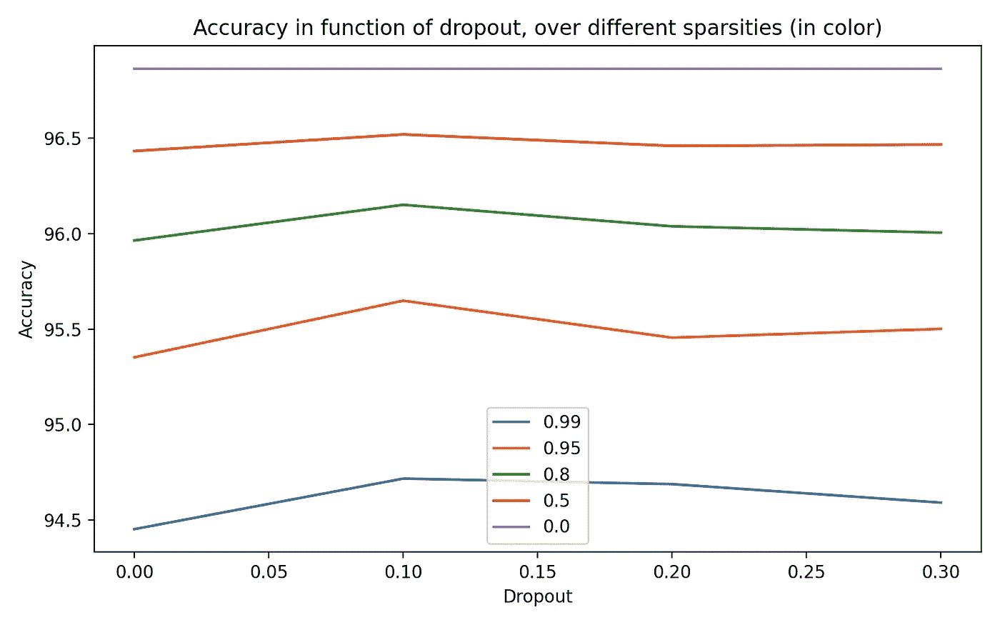
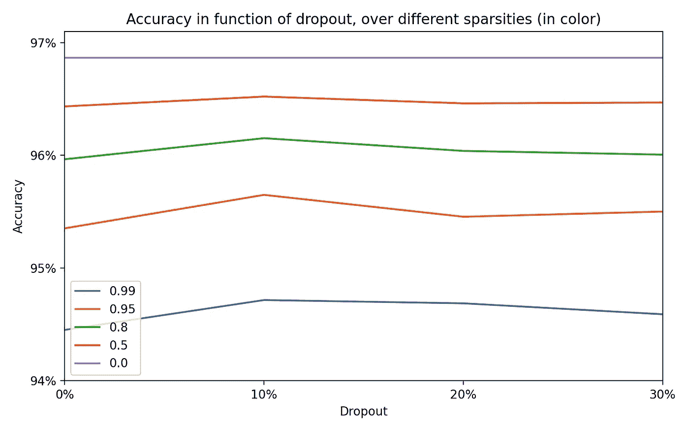
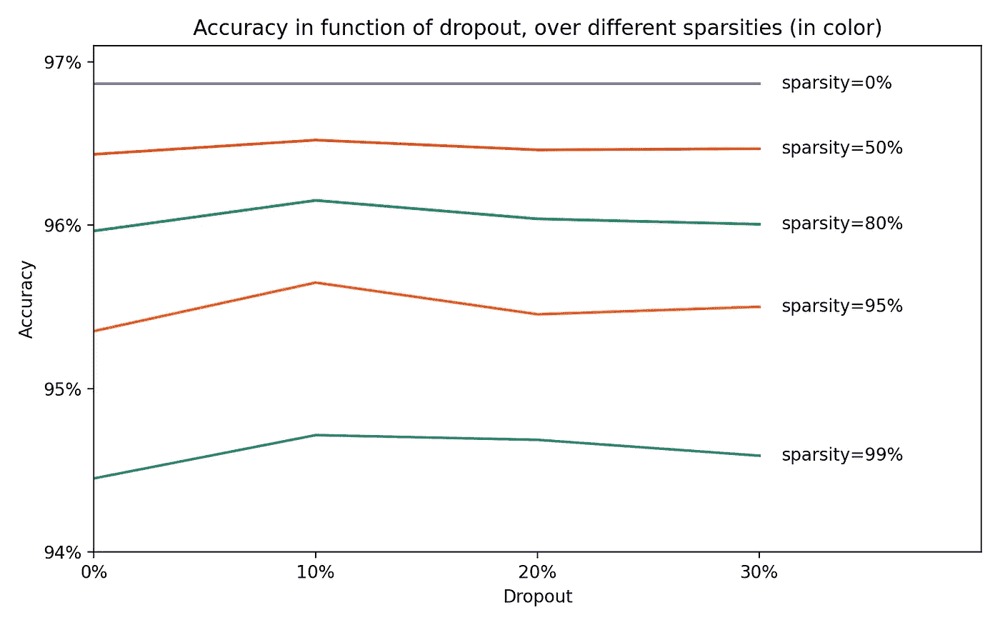
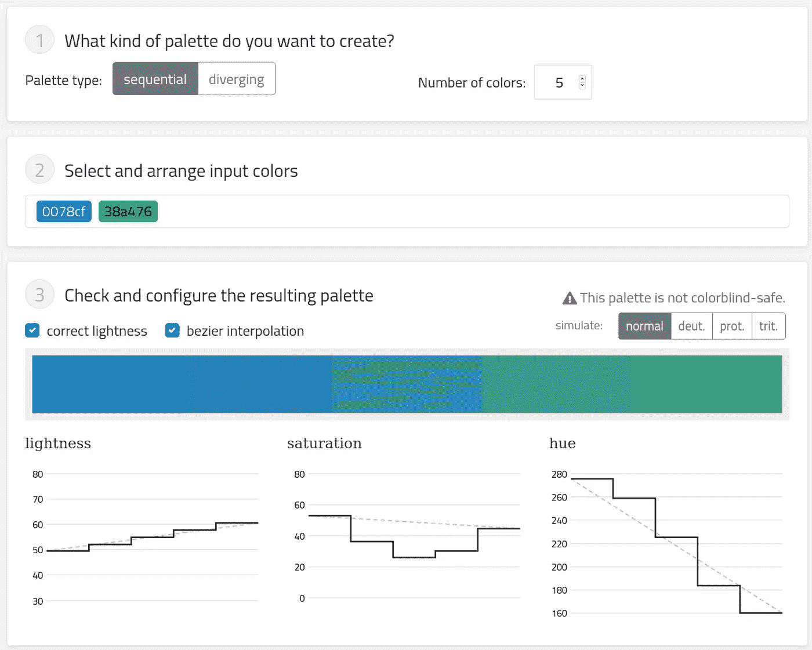
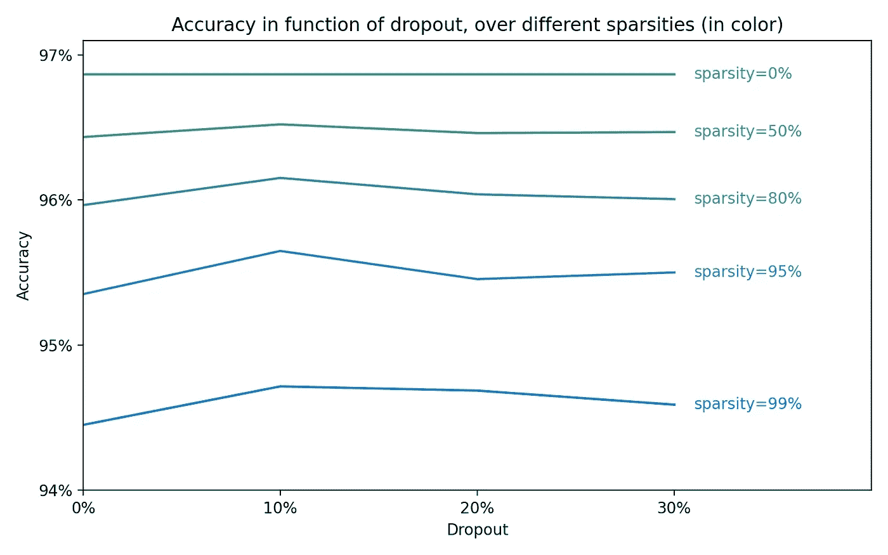
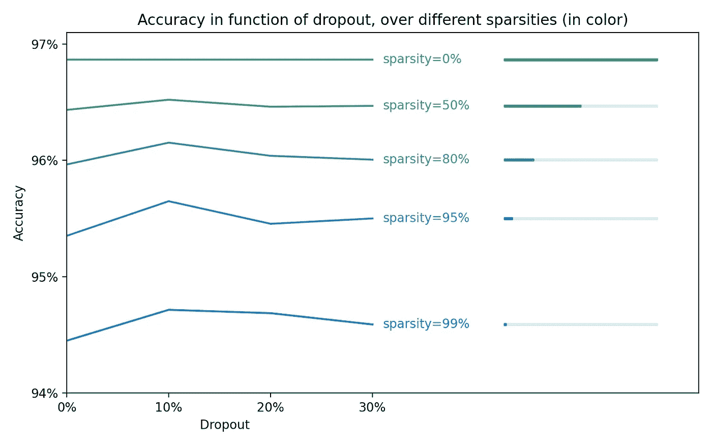
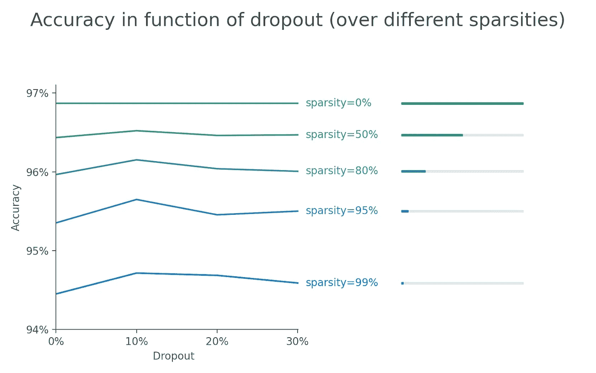
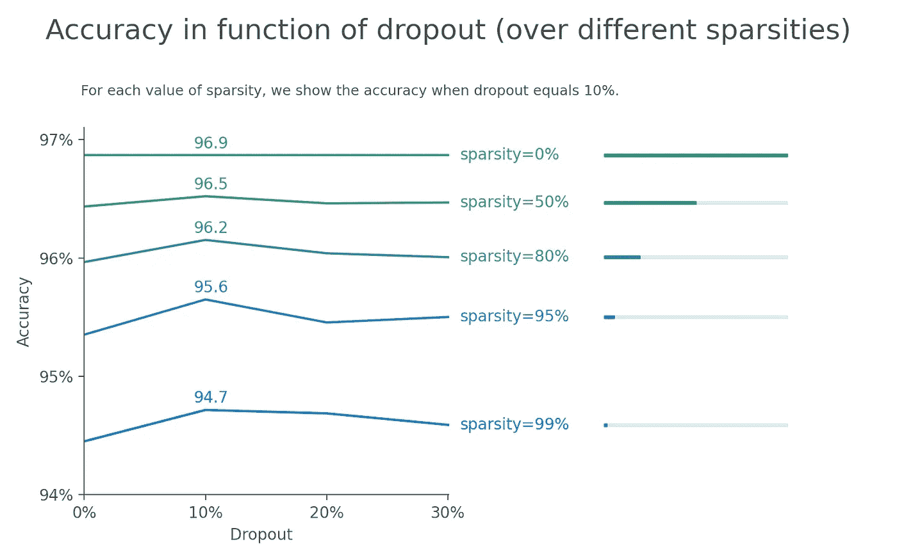
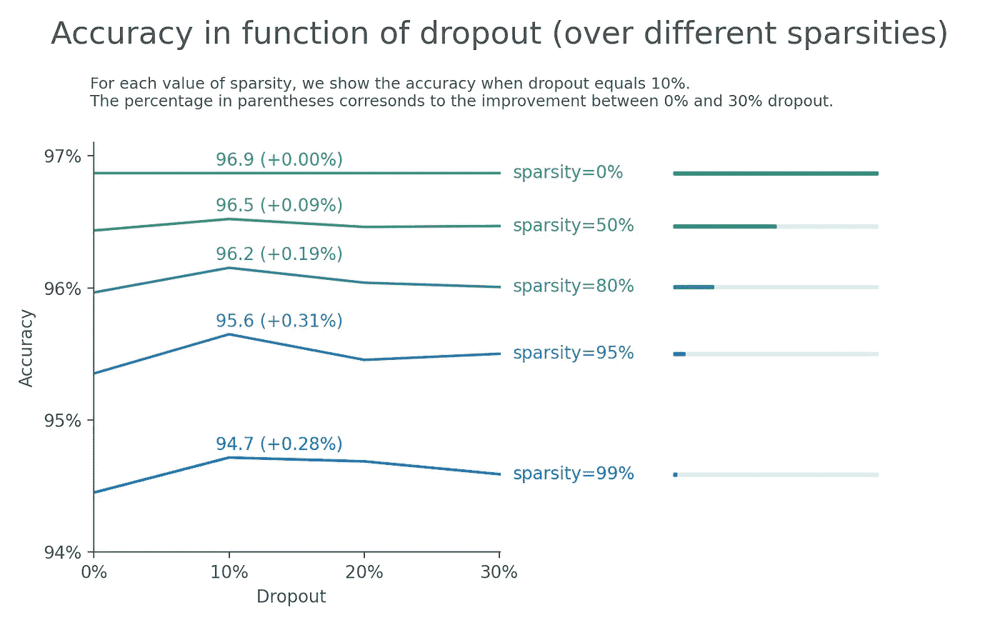

# 改善数据展示的一些技巧

> 原文：<https://towardsdatascience.com/a-few-tips-to-improve-you-data-presentations-8a5fd6dc3853?source=collection_archive---------44----------------------->

## 7 个简单步骤的例子

在这篇文章中，我将展示一个如何改进结果图的例子。假设你致力于通过修改神经网络的稀疏性和丢弃的使用来改进某种神经网络(它显然可以是其他东西)。原始数据看起来像这样:

作者图片

在此图中，我们可以看到不同的颜色稀疏值、x 轴的 dropout 值和 y 轴的 accuracy 值。

## 步骤 1:通过删除值和使用百分比来修复轴标签

由于两个轴中的值太多，我们希望通过删除一些值并使用百分比来提高可读性:

作者图片

## 步骤 2:显示稀疏值，而不是使用图例

当查看不同的线条时，我们需要在图例和线条之间来回移动，以了解哪种颜色对应于哪种稀疏度值。这样做对读者来说心理上并不舒服，我们选择显示每行的稀疏值:

作者图片

## 第三步:使用连续的调色板

稀疏值实际上是连续的，但是当前的调色板不使用它。当不同的值是有序的时，默认颜色是很好的，但是在这个例子中，我们可以改进调色板。为了选择一个调色板，我使用了 chroma.js 调色板网站。我想要从蓝色到绿色的 5 种颜色。我选择了两种亮度大约为 50-60%的颜色，这样它在白色背景下是可读的(例如，而不是< 40%的亮度)。这些颜色不是完全色盲安全的(但仍然可以，因为亮度是不一样的)，可以改进。

[chroma.js 调色板网站](https://vis4.net/palettes/#/5|s|0078cf,38a476|ffffe0,ff005e,93003a|1|1)

作者图片

现在更明显的是，不同的稀疏度/颜色是连续的，图形看起来更专业，因为初学者经常使用默认的调色板，专业人员使用他们自己的调色板(顺便说一下，我不是数据可视化专业人员)。

## 步骤 4:显示一个代表稀疏度的条形

我们有一个连续的调色板，它在“颜色空间”中是线性间隔的，但是稀疏值实际上根本不是均匀间隔的。很难想象我们正在处理的稀疏性的数量。为了澄清这一点，我们添加了一个表示稀疏度的线段:

作者图片

## 第五步:降低对比度，删除顶部和右边的部分

图形看起来有点奇怪，因为 x 轴对右边部分没有太大意义。我们删除 30%后的 x 轴，并删除没有实现任何东西的右边和顶部部分。我们还把黑色换成了不那么咄咄逼人的灰色。同样，它使图形更加专业。大多数专业人士使用深灰色而不是纯黑色。在 Medium 中，默认情况下，我写的文本是 84%不透明度的黑色，这使它成为深灰色。我们还把标题做得高一点，大一点，为几个字幕做准备。

作者图片

## 第六步:展示一些价值观

查看图表时，我们很想找到精度值，但很难读懂，因为我们只有 y 轴上的 4 个值来计算。此外，最有趣的值是 10%的下降值，这似乎是最佳下降值。所以我们把这些值加起来，写一个副标题解释一下(可选) :

作者图片

## 第七步:增加百分比来回答读者的问题

我们现在很想量化 10%压差精度对 0%压差设置的帮助有多大。为了帮助读者理解这一点，我们增加了这个百分比:

作者图片

我们完事了。

最终的 matplotlib 代码是:

## 结论

在这些步骤中，它们是几种类型的转换:
-清理:例如，当我们移除一些刻度标签时，我们试图使绘图更干净。当你在做演示时，寻找要删除的东西，而不是要添加的东西(在开始的时候)。
-预见读者的问题:试着设身处地为读者着想，你想了解数据中的哪些内容，但又很难了解？在我的例子中，我们需要添加一些数值和百分比
——视觉上很难理解的是什么？在我的例子中，不容易看出稀疏值不是均匀分布的。