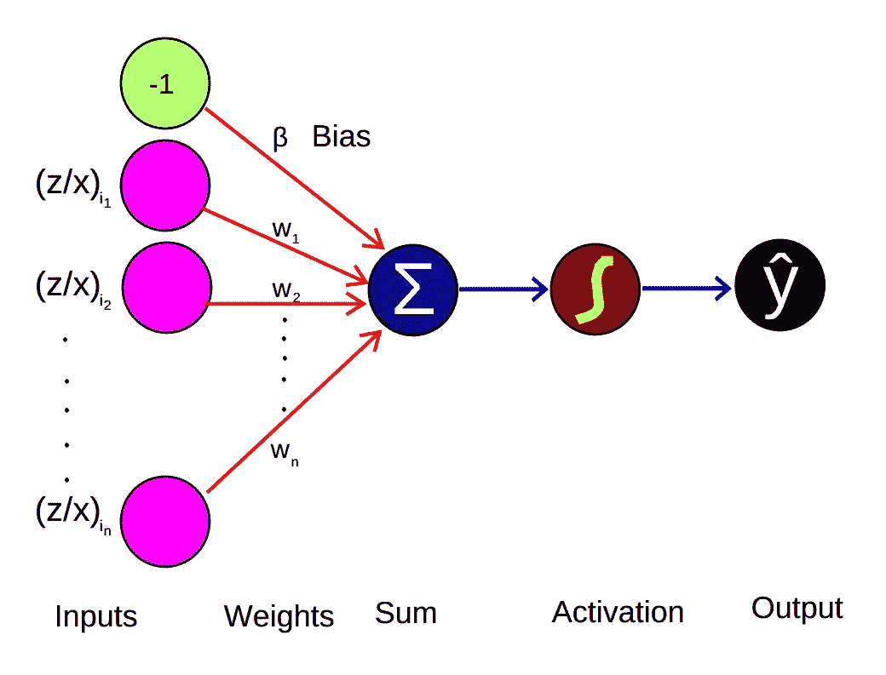
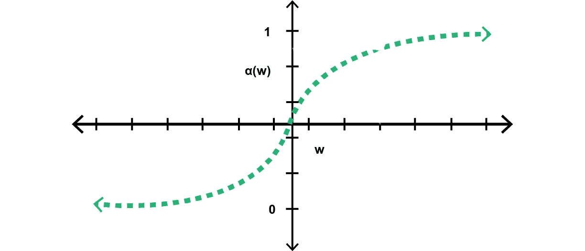
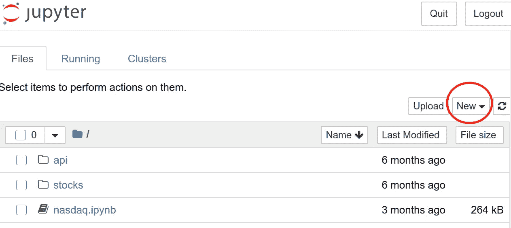
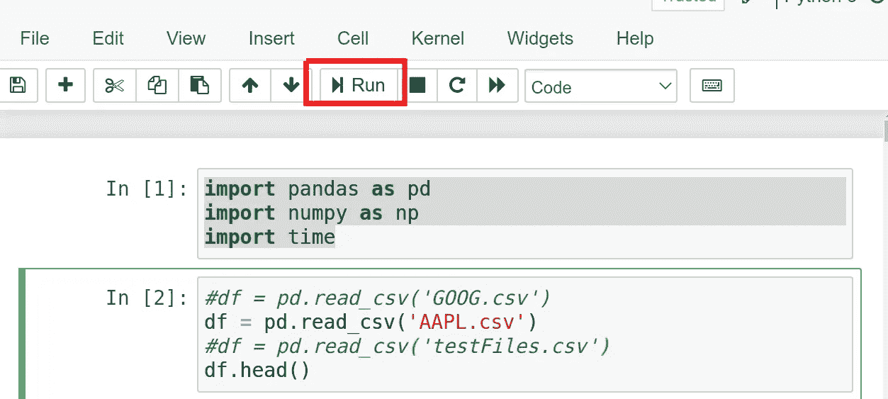
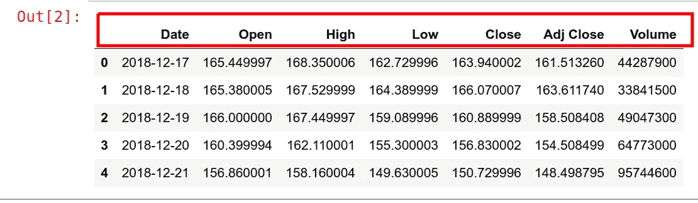
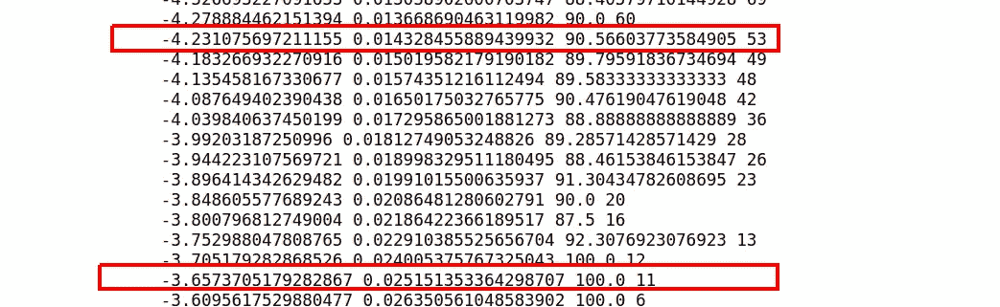

# 一个用于 quants 的金融神经网络

> 原文：<https://towardsdatascience.com/a-financial-neural-network-for-quants-45ec0aaef73c?source=collection_archive---------37----------------------->

## 阿尔法-贝塔分类器

## 背景

从我们应该观看的 YouTube 视频的建议，到运行我们在华尔街的高频交易的算法，人工智能(AI)正在不断成为我们今天所做的不可或缺的一部分。事实上，谷歌算法知道我们更喜欢什么，而不是我们想要什么。这是 Twitter 首席执行官兼创始人杰克·多西的说法。如果不是模式识别和分类，这不会被提及，而模式识别和分类是人工智能的主要基本原则。


图 1 人形机器人的图像。图片来源: [Franck V.](https://unsplash.com/@franckinjapan?utm_source=unsplash&utm_medium=referral&utm_content=creditCopyText) 在 [Unsplash](https://unsplash.com/s/photos/artificial-neural-network?utm_source=unsplash&utm_medium=referral&utm_content=creditCopyText) 上的照片

尽管几个世纪以来，这两个原则完全是通过传统的统计推断和数学来实现的，但我们(作为一个文明)花了一段时间才认识到这些过程还不够好，相反，它们可能难以置信地难以解决，至少可以说是笨拙和耗时的。人工神经网络构成了人工智能的核心，因为它们是用来成功模仿不必要的自愿行为的主要实体，但在许多情况下，显然是正确的决定。这里我们指的是自动驾驶汽车、语音和面部识别、物体跟踪，甚至人形机器人。

因此，有许多类型的神经网络已经被用于各种目的。例如:前馈神经网络、径向基函数神经网络、递归神经网络、卷积神经网络、模块化神经网络和 Kohonen 自组织神经网络。作为 Teuvo Kohonen 教授，后一种观点对我来说尤其珍贵——自从我开始了解神经网络及其功能以来，它的支持者恰好是我最大的鼓舞人心的人物之一。我关于神经网络的第一个项目是关于风速和风向的预测，作为在芬兰不同城市建立风力农场的可行性研究的一部分。尽管这个概念很先进，但在这篇参考文献中讨论了非常基础的内容，例如神经网络的类型以及哪种网络适合什么问题。然而，本文不是关于神经网络的类型，而是如标题所示的一种特殊的神经网络— *金融神经网络*。你会注意到它没有出现在上面列出的神经网络类型中，并且可能目前根本不会出现在其他地方。这是我们在相对较新的人工智能领域遇到的模式之一。

## 为 quants 引入α-β分类器

想象一下这个场景，假设皇家邮轮泰坦尼克号(1912 年 4 月)的幸存者可以被预先决定和预言？这意味着你必须假设你已经知道事故会发生——这有点令人毛骨悚然。让我们把它变得更有趣，如果男人，女人和孩子的数量可以被告诉一部分，并根据他们将承受的伤害进行分类，只是根据他们在游轮上的位置。这是一个不幸的事件——让我们考虑一下资产交易。

以类似的方式，假设你将要购买的资产，比如股票、期货、债券，甚至是加密货币，已经可以预先确定，这样你就可以知道哪些交易会盈利，哪些不会，甚至在你进入这些交易之前。你会更明智地知道该交易什么，对吗？这就是 *alpha-beta* 金融神经网络的意义所在。有了这种类型的神经网络，你可以尝试对你将要进入的交易进行分类，并确定它是否有利可图，是否值得参与的概率。这些决定通常决定了你策略中的“买入”和“卖出”信号，特别是在你为算法交易编写代码的时候。


图:2 图片来源:[克里斯·利维拉尼](https://unsplash.com/@chrisliverani?utm_source=unsplash&utm_medium=referral&utm_content=creditCopyText)在 [Unsplash](https://unsplash.com/s/photos/trading?utm_source=unsplash&utm_medium=referral&utm_content=creditCopyText)

## 阿尔法-贝塔分类器的数学

这类神经网络是一个分类器，其输入是当前最高收盘比率、“高”和“开”比率的比率，作为单个输入，偏差为-1。这些通过逻辑激活函数传递，该函数将输入缩放到 0 和 1 之间的概率分布函数。要对此进行说明:



图 3:作者对 ABC 神经网络的说明

设高为 **z** ，开为 **x** ，权重为 **w** :


情商。(1)

符号 *β* 是偏差，在这种情况下是负常数-1。激活函数 *α* 是权重的函数，权重在开始时被初始化，并随着分类的进行而被估计。梯度下降是模型性能效率的最终衡量标准。最小化梯度相当于增加概率分布函数的值，在这个过程中我们得到如下结果:



图 4:α-β分类器的激活函数


情商。(2)

## 实用指南

如果你真的想在编写下一个交易算法的时候考虑使用这种技术，遵循这种方法总是可行的。我们将首先列出帮助您完成这项任务的要求:

*   首先，您需要熟悉在 python 中使用数据框。
*   接下来，您需要在系统上安装 python3.6。你还需要有熊猫和 numpy 基础。
*   最后，这不是必须的，但安装 jupyter notebook 或 ipython 将在很大程度上减轻您的工作。

## 数据采集

我们将利用标准的资产信息，以表格的形式呈现，列有:“日期”、“开盘”、“高”、“低”、“收盘”、“调整收盘”、“成交量”。你可以从雅虎财经网站下载到你的项目文件夹中。在本案例研究中，我们将使用股票代号“AAPL”和“谷歌”，分别对应于 Aple inc .和 Google Inc .的历史股票数据。这将有效地将数据下载到您的项目中。

## 导入库

首先，导航到您的项目文件夹。当您可以在命令提示符或 Unix 终端上工作时，这(更确切地说是整个项目)是最好的。为此，我将假设 Linux 终端。因此，请确保您已经安装了所有必需的软件，并运行以下命令开始安装:

```
$ cd /your/project/root/directory/
$ jupyter notebook 
```

上面的代码应该会在您的浏览器中弹出一个文本编辑器窗口，类似于下面这个:



图 Jupyter 笔记本项目文件夹的外观

单击红圈区域创建一个新文档，我们将在其中放置代码。然后，我们将继续导入前面提到的库。这些是:熊猫，熊猫和时间如下:

```
# import libraries
import pandas as pd
import numpy as np
import time
# Read in the data from the downloaded csv file(s) into a data frame
df = pd.read_csv('AAPL.csv')
```

## 检查数据和预处理

要检出导入到您的工作区的数据，请键入以下内容并运行单元格—单击图 2 中的红色矩形选择:



图 6:在 Jupyter 笔记本中执行命令

这将导致类似这样的结果:



图 7:用命令 df.head()检查熊猫数据帧的内容

为了简化代码，我们希望更改列名的大小写。因此，我们通过运行以下代码来替换现有的:

```
df.columns = ['date', 'open', 'high', 'low', 'close', 'adjclose', 'volume']
```

你可以在这里做很多练习，例如，你可以只过滤掉你希望进入的积极交易(pos)——也就是说，如果你当时进入，就会产生利润的交易。为此，只需键入以下代码:

```
pos = df[df['change'] > 0 ]
```

你可以对那些最终产生负收益或亏损的交易做同样的事情。你可能希望不要参与这些交易，或者只参与买入——用它们创造一个买入信号。然后你可以输入:

```
neg = df[df['change']< 0 ]
```

## 填充指标

这个分类器使用有史以来最简单的指标。这些是:

*   关闭率与打开率之比，将作为神经网络的输入，以及
*   我们也将计算我们将用作指导的变化，更像控制实验。因此，相应的代码放置如下:

```
df['change'] = df['close'] - df['open']
df['ind'] = (df['high']/df['open']) -1
df.head()
```

上面的代码将创建两个额外的列，一个是我们讨论过的比率——我们称之为“ind ”,另一个简单地称之为“change ”,就像我们一直知道的那样。请注意，变量“ind”已经是等式 2 的 LHS 的镜像。(1).现在，我们将在以下几节中继续计算 RHS。

## 权重初始化

我们将从使用 numpy 库分配一组线性权重开始，如下所示:

```
w = np.linspace(-6,6,len(df))
```

上述代码将定义一组线性参数，这些参数将用于计算概率分布函数——或等式中的激活函数。(2).Alpha 的计算方法如下:

```
alpha = 1/(1+np.exp(-w))
```

## 评估算法

我们完了。现在，我们需要在数据框中实现实际的方程并检查结果。用最简单的话来说，你将为你从上面计算的每个 alpha 值输入下面的内容。

```
test = df[df['ind'] >= alpha]
eval = test[test['change'] > 0 ]
```

## 总结一下

我们已经看到，it 资产交易与其他存在预测理论方法的现象没有什么不同。因此，资产交易可以根据它们的潜力来分类——更确切地说，交易本身可以以决定是否进入为唯一目的来分类。关键参数是预期的盈利状态。以下代码总结了上述所有步骤:

```
import pandas as pd
import numpy as np
import time
from termcolor import colored# Read in the data from the csv file
df = pd.read_csv('AAPL.csv')# Reduce the column names to lower case
df.columns = ['date', 'open', 'high', 'low', 'close', 'adjclose', 'volume']# compute the change to use as a guide in backtesting
df['change'] = df['close'] - df['open']# populate the classifier
df['ind'] = (df['high']/df['open']) -1# Initialize the weights
param = np.linspace(-6,6,len(df))# Fire the neural network
eta = 0
while eta < 100:
    for i in param:
        alpha = 1/(1+np.exp(-i))
        test = df[df['ind'] >= alpha]
        if len(test) > 0:
            pos = test[test['change'] > 0]
            eta = len(pos)*100/len(test)
            #time.sleep(1)
            print(colored (i, 'green'), alpha, len(test), colored(eta, 'red'))
        else:
            pass
else:
    print('done classifying')
```

一旦你确定了进入交易的概率或阿尔法的最小值，买入和卖出信号可以简单地写成:

```
dataframe[dataframe['ind'] < min_alpha ] ----> buy
dataframe[dataframe['ind'] >= min_alpha ] ---> sell
```

## 主要结果

生成的表格是上面打印到屏幕上的(较长的)代码的标准输出。看看这个场景:

让我们假设你选定的最终权重 **w** 是“-4.23”，激活函数 *α* 将产生“0.0143”，因此概率是 0.90566——如图 8 所示。如表中所示，首先有三列:权重，第二列:alpha 值，第三列是模型的效率，最后是输入的交易数量。

这意味着如果你进入了这个交易，有 90.6%的机会你会盈利，相反，有 9.4%的机会你会亏损。至于如何计算这个百分比，我们简单地计算“评估”数据帧中变量“变化”大于零的数据帧的长度，并与“测试”数据帧的总长度进行比较。



图 8:指导性案例研究代码的标准输出

## 关于利弊和从哪里获得帮助的说明

**优点**

*   Alpha-Beta 分类器相当准确——至少从回溯测试结果来看是如此。
*   理论上可以保证高达 100%的分类效率。
*   然而，最好的特点是，模型效率越高，意味着交易越少，不仅回报越高，而且亏损的机会也越少。因此，这个特征就像某种止损。这意味着你可以选择进入少数几个交易，但盈利潜力很大。另一方面，你可能选择进入许多行业，每一个都没什么好处。这将帮助你分散风险，而不是集中在一个地方。
*   最后，阿尔法-贝塔分类器支持不重复自己(干)。一个模型可能适合多种情况。例如，下载 Google Inc .的历史数据(保存为 GOOG.csv ),在其他一切保持不变的情况下，您应该会发现该模型仍然有效——有时甚至更好。

**缺点**

*   然而，一个主要的挫折是，模型效率越高，你的交易次数就越少。

**F1 #帮助**

这是一个新的概念，可能会被证明是有帮助的，特别是对于那些喜欢试验和建立在它之上的定量分析师。如果你是这样的人，以此为起点，需要帮助，请告诉我，我会尽可能给予支持。

## 参考

[1]n . k .罗蒂奇、j .拜克曼、l .林南宁和丹尼尔，2014 年。基于神经网络的风资源评估和预测规划。*《能源、水与环境系统可持续发展杂志*， *2* (2)，第 174–190 页。