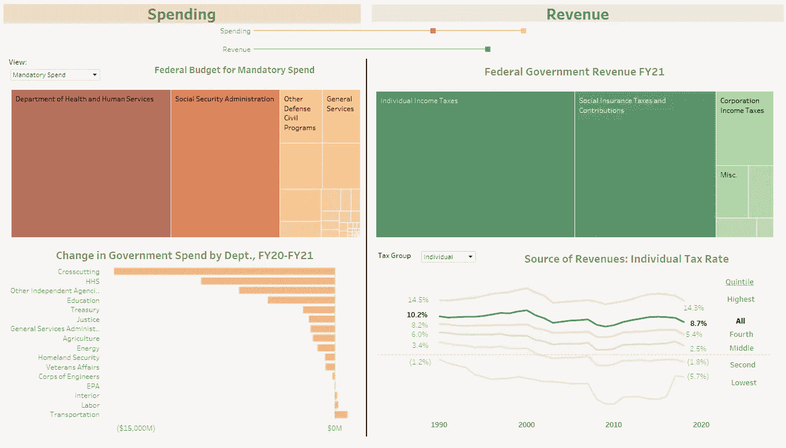
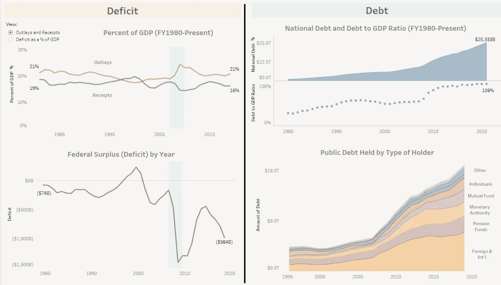
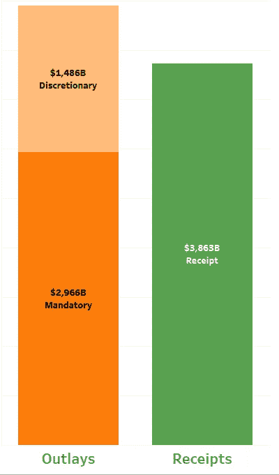
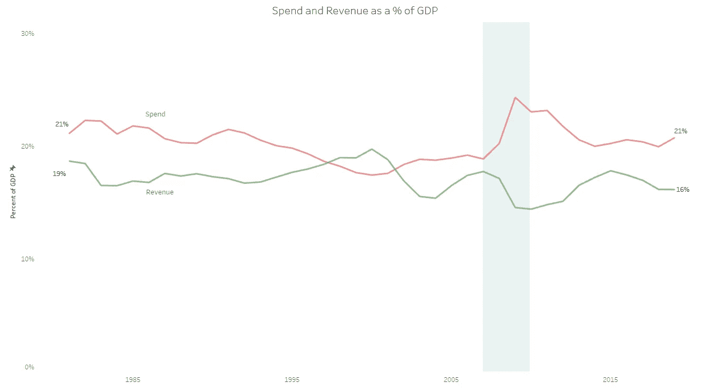
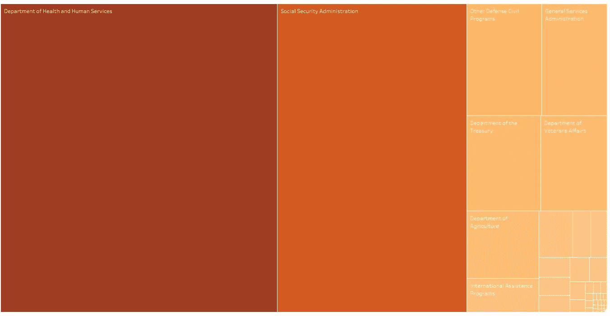
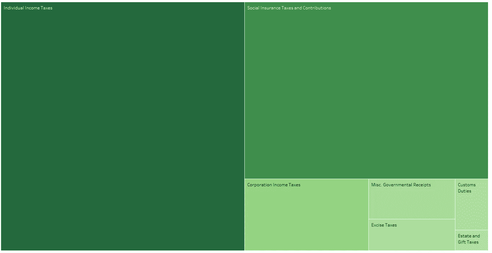
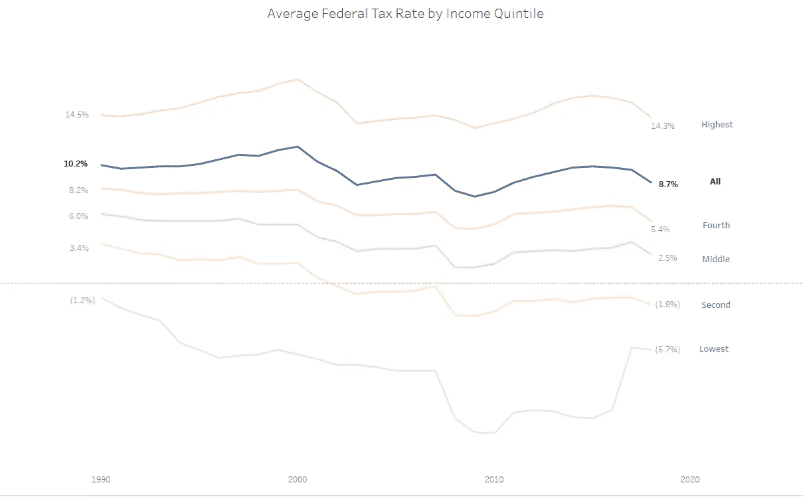
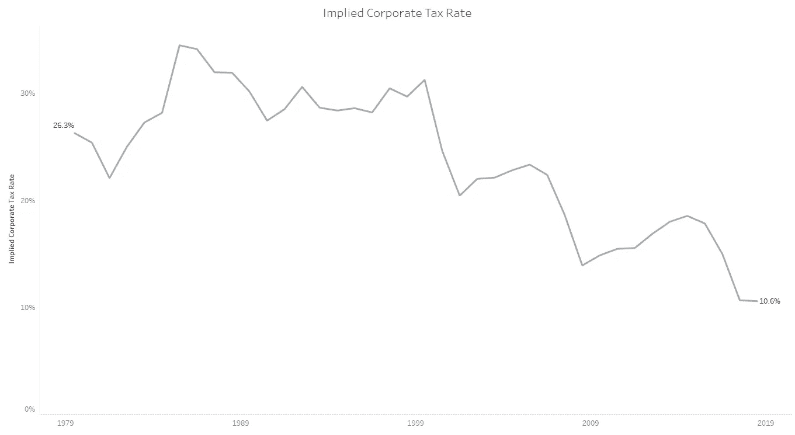
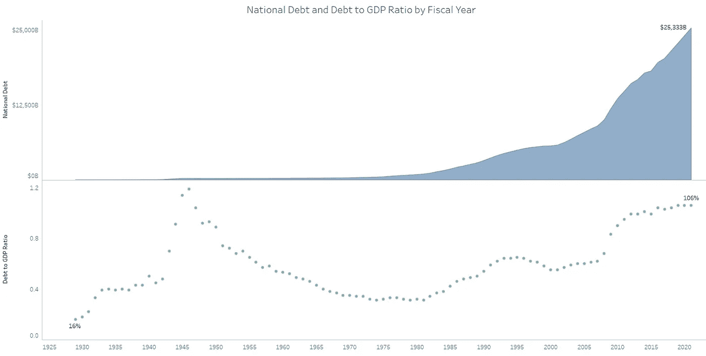
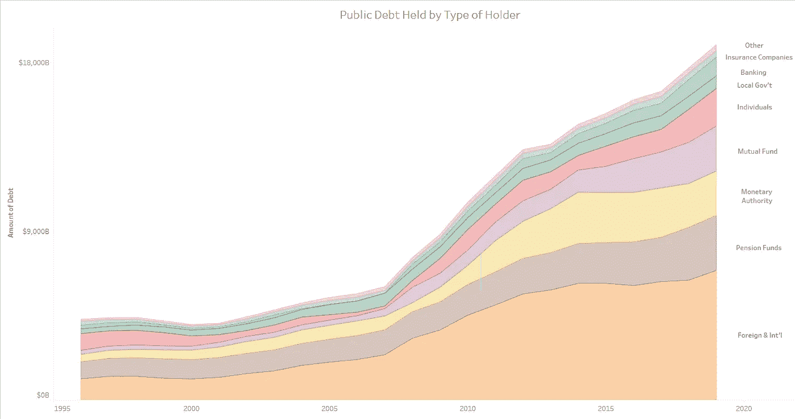

# 用视觉故事讲述财政状况

> 原文：<https://towardsdatascience.com/a-fiscal-state-of-the-union-with-visual-storytelling-bf58896659c8?source=collection_archive---------29----------------------->

## 可视化 2021 财年美国政府预算和当前财政状况

你有没有想过你的税金去了哪里？政府如何赚钱？

最近，特朗普总统发布了 2021 财年政府预算。随着民主党人抨击大规模支出和国防预算是不负责任和不可持续的，共和党人称赞预算是经济刺激，政治接管了。

真实的故事是什么？数据怎么说？钱是从哪里来的，去了哪里？美国的财政状况如何？

使用[这个仪表板](https://public.tableau.com/profile/jordan8097#!/vizhome/USGovernmentFY21BudgetandFiscalState/GovtFiscalState)与您自己的数据进行交互，并继续阅读了解更多详情。

[仪表盘](https://public.tableau.com/profile/jordan8097#!/vizhome/USGovernmentFY21BudgetandFiscalState/GovtFiscalState)截图

# **收入和成本**

2021 财年，政府预计预算赤字为 5890 亿美元，预计支出为 44.5 亿美元，收入为 38.6 亿美元。

换句话说，政府每收到 1 美元，就要支出 1.15 美元；每 1 美元收入中的 75 美分已经通过强制性项目支出。

赤字并不是本届政府独有的现象——自 1980 年以来，只有 4 年政府收入超过支出，并且在最近的 2007 年至 2009 年经济衰退期间赤字达到顶峰(下图中的阴影部分)。

政府支出和收入占国内生产总值的百分比；阴影区域是 2007 年至 2009 年的衰退。[来源](https://fred.stlouisfed.org/series/FYFRGDA188S)。

在政府约 44.5 亿美元的支出中，约 66%被分配给指定为“强制性”的项目，主要包括医疗保险和医疗补助(卫生与人类服务部/ HHS)以及社会保障。[访问仪表盘](https://public.tableau.com/profile/jordan8097#!/vizhome/USGovernmentFY21BudgetandFiscalState/GovtFiscalState)并将鼠标悬停在树形图中的每个框上，查看更多消费详情。

强制性联邦支出

在可自由支配的支出中，约 40%(约 6400 亿美元)用于国防，其次是退伍军人事务(约 1050 亿美元)、HHS(约 960 亿美元)和教育(约 660 亿美元)。

自由支配的联邦支出

过渡到收入，个人所得税占政府预期收入的约 50%，其次是社会保险税(~35%)和企业所得税(~7%)。

预计政府收入，2011 财年

收入赶不上支出的一个潜在原因是，过去 30 年来，主要的收入驱动因素——个人所得税——在家庭收入中所占的比例一直在下降，特朗普总统最近的减税政策导致这一比例显著下降。

平均值。按收入百分比计算的联邦税率。[来源](https://www.taxpolicycenter.org/statistics/historical-average-federal-tax-rates-all-households)

此外，第三大收入来源——公司税大幅下降。自 2000 年以来，有效公司税率的一个衡量标准——利润税——已经下降了 66%以上。

隐含的公司所得税是通过公司税前和税后利润之间的差额计算的。[源 1](https://fred.stlouisfed.org/series/A053RC1Q027SBEA) 和[源 2](https://fred.stlouisfed.org/series/CP) 。

总的来说，政府三个主要收入来源中的两个正以较低的税率征收。这意味着，企业利润或家庭收入的任何增长(如果存在的话)中，至少有一部分会流入政府，被税率的下降所抵消。

# 债务和赤字

因此，如果支出持续超过收入，那么政府就会出现年度赤字，导致债务增加。

作为一个快速入门，赤字是政府在某一年的收入和支出之间的差额；债务是政府借出和欠贷方的累计金额。

几十年来，政府一直在增加国债的绝对值和相对值(相对于 GDP)。最近的数据显示国家债务超过 25 万亿美元——相当于财富 500 强公司总收入的两倍——超过 GDP 的 106%。

1920 年以来的国债和债务与 GDP 的比率

历史上，债务与 GDP 之比一直是衡量一个国家借贷的标准，100%左右是债务过多的“门槛”。

然而，我认为 GDP 不是正确的判断标准，至少对美国来说是这样。如前所示，财政收入约占 GDP 的 16%。这意味着将每一美元的收入用于偿还债务需要超过 6.5 年的时间，更不用说 1)这是不可能的，2)政府每年都有赤字。

很难想象，如果没有巨大的变化，这笔钱如何能够全部收回。

另一个新出现的担忧是外国政府持有的美国债务越来越多。数据显示，这一群体代表了当前债务持有人的最大部分，自衰退以来显著增加。

按所有者类型划分的公共债务。[来源](https://www.sifma.org/resources/research/us-treasury-securities-holders/)

美国政府很幸运，利率处于历史低点，否则债务问题将(并且有一天，可能或将要)给国家带来更大的负担。

那么，美国的财政状况如何？数据显示不太好。

支出超过收入，没有一位总统一直找到扭转这一趋势的方法。长期指标同样没有带来积极的结果。当前的税收——尽管我们都不希望它们变得更高——无法维持政府的支出速度。

国债从来都是“改天的问题”。虽然政府的信用评级仍然很高，但人们相信可以借新钱来偿还到期债务。“另一天”将会到来，要么全额账单到期，要么信心丧失。

我鼓励你[查看仪表盘](https://public.tableau.com/profile/jordan8097#!/vizhome/USGovernmentFY21BudgetandFiscalState/GovtFiscalState)，了解政府支出、收入和财政健康的更多细节。我很想听听您对这种情况的看法，以及您认为与讨论相关的任何其他数据。