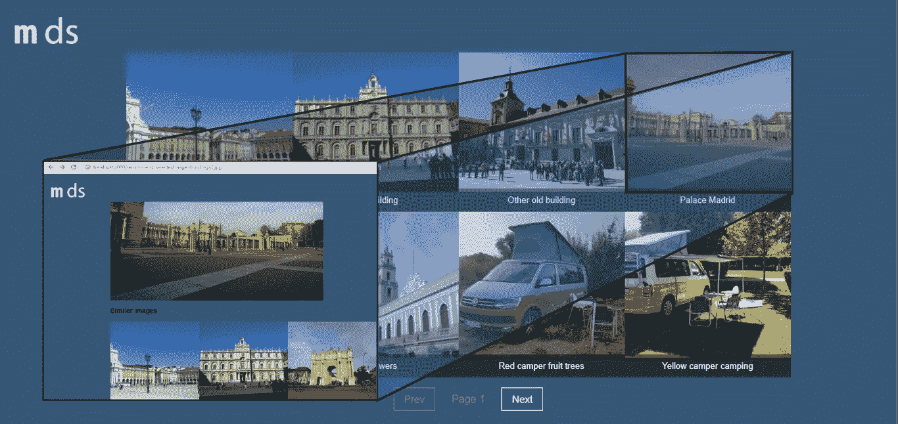
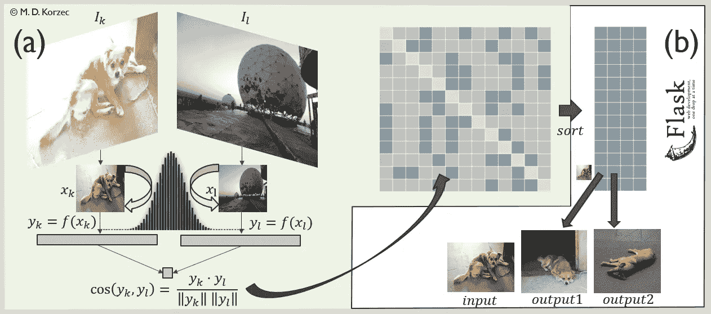
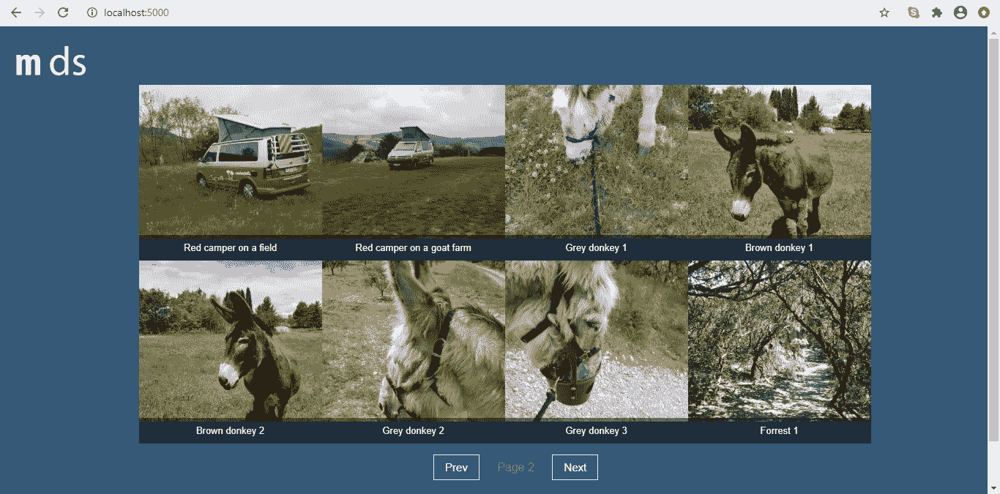

# 一个推荐图片的 Flask 应用程序

> 原文：<https://towardsdatascience.com/a-flask-app-for-image-recommendations-a865e1496a0d?source=collection_archive---------13----------------------->

## PyTorch 中基于卷积神经网络的相似图像推荐网站的实现



图片库和对所选图片的推荐(来源:M. D. Korzec)

在创建了一个基于 Python 的机器学习应用程序后，你可能想让它在网站上运行。

在这篇文章中，解释了如何通过基于图像的推荐系统的微框架 Flask 来实现这一点。

我们在一个网站上实现了一个图像库，可以选择图像，并显示相似的图像。这种解决方案可以用于例如在线商店。

如前一篇文章所述，相似性是通过比较由预训练的 Resnet18 网络[导出的特征向量获得的。这项工作的结果是熊猫数据帧(本质上是表格),其中包含最相似图像的名称，以及每幅图像的相似值在 0(不相似)和 1(最相似)之间。这些在这里储存和使用。](/recommending-similar-images-using-pytorch-da019282770c)

在下一张图中,( a)概述了理论和实施的步骤。本文主要讨论(b)部分，其中的数据框架已经离线计算，可以在网站上使用。



[相似度矩阵计算(a](/recommending-similar-images-using-pytorch-da019282770c?source=your_stories_page---------------------------) )和排序后的推荐前 k 列表(b)。在本文中，Flask 用于为一个网站使用结果(来源:M. D. Korzec， [Flask 标识，作者阿明·罗纳彻](http://flask.pocoo.org/static/logo/flask.svg)，版权所有[免费使用](https://commons.wikimedia.org/w/index.php?curid=19501815)

我们将了解如何

*   安装 Flask 并在调试服务器上本地运行应用程序
*   定义所需的路径-用于图库和建议的 URL
*   将所需的信息从用户输入传输到后端，并将建议返回给用户
*   实现一个建议相似图像的 html/JavaScript 库
*   基于我的前两篇文章创建 pickle 文件([理论](/effortlessly-recommending-similar-images-b65aff6aabfb)、[实现](/recommending-similar-images-using-pytorch-da019282770c?source=your_stories_page---------------------------)与 [Jupyter 笔记本](https://github.com/MathMagicx/JupyterNotebooks/tree/master/ImageRecommenderResnet18))。将它们用于定义推荐图像的 top-k 列表。

更新:在我的后续文章中，您可以找到所介绍方法的扩展。它解释了使用 PostgreSQL 数据库的所有相关代码、合适的打包，并包含了部署到 Heroku 的分步描述。代码链接在帖子里，演示者可以在这里联系到[。](http://image-recommender-demo.herokuapp.com/)

# 1.瓶


标志由[阿明·罗纳彻](http://flask.pocoo.org/static/logo/flask.svg)制作，版权所有[免费使用](https://commons.wikimedia.org/w/index.php?curid=19501815)

Flask 是一个非常流行的用 Python 编写的微框架。它被称为“微型”，因为它没有完整的功能集、数据库的抽象层、用户管理或类似的功能，但它可以通过覆盖所有需求的可用库进行扩展。

与像 [Django](https://docs.djangoproject.com/) 这样功能丰富的框架相比，这听起来可能是一个缺点，但是，它也降低了复杂性，给用户留下了更多的选择，并允许对应用程序进行更好的概述。

你*可以*轻松完成的事情:在后端使用你的 python 代码，将结果传递给前端，你可以用 html、JavaScript 和 css 编写结果——你也可以使用 Vue.js 这样的前端框架。

Flask 提供了基于 Jinja2 语法的模板使用，简化了网页的可重用性和动态创建。

如果你打算第一次玩 Flask，我推荐你看一些科里·斯查费的教程，他创作了一个简洁的 Flask 系列，可以让你很快上手。

第一步如何运行 Flask(在 Windows 上)？创建合适的虚拟环境后，安装它，例如使用 pip

```
**pip install Flask**
```

并导入它以使所有代码可用于构建 Flask web 应用程序

```
**from** **flask** **import** Flask
```

要运行本地调试 web 服务器，可以使用包含主 Python 文件的批处理文件

```
**set FLASK_DEBUG=1
set FLASK_APP=recommenderFlask.py
flask run**
```

FLASK_APP 只是设置应用文件。然后你可以通过

[http://localhost:5000/](http://localhost:5000/)

设置 FLASK_DEBUG 会导致调试信息直接显示在浏览器中。

印出“你好，世界！python 文件应该是这样的

```
from flask import Flaskapp = Flask(__name__)
@app.route(‘/’)
def hello_world():
  return ‘Hello, World!’
```

对于本文，我使用 Flask 版本 1.1.1 和 Python 版本 3.5.4。

# **2。路线**

让我们设置应用程序的主文件，recommendFlask.py

```
**from flask import Flask
app = Flask(__name__)****@app.route(“/”)
@app.route(“/home”)
# Need to write a function that is called when opening the site****@app.route(“/recommend”)
# Need to write a function that is called when opening recommendations****if __name__ == ‘__main__’:
  app.run(debug=True)**
```

*   我们导入 Flask 类来创建 Flask web 应用程序。
*   创建 Flask 实例应用程序，如果直接调用脚本，它将在最后一行运行，因为 Python 设置了 **__name__ == '__main__ '。**如果*推荐的 flash . py*是从另一个脚本导入的，情况就不一样了。将 debug 设置为 true 的好处是，您可以在网站本身的开发过程中看到错误。
*   在这两者之间是还没有做任何事情的家庭和推荐路线。它们将触发在下一节中编写和解释的相应功能。我们将通过 **localhost:5000/home/或 localhost:5000/，**到达包含图库的主页，而推荐将显示在**localhost:5000/recommend/**上

让我们创建一个图像库。

# **3。画廊**

我们将把位于一个文件夹中的感兴趣的图像名称放入位于 recommenderFlask.py 文件顶部的虚拟数组中。

```
images = [
  {
    ‘name’:’buildings0.jpg’,
    ‘caption’: ‘Lisboa’
  },
  {
    ‘name’: ‘buildings1.png’,
     …
```

我们使用这些数据来创建画廊。对于一个生产系统，这一部分需要移动到数据库中——这将是后续文章的一部分。

使用一个函数调用 home route，该函数根据与图像相关的可变内容呈现 html 页面。

因此，添加用于 html 呈现的库

```
from flask import render_template
```

并用图像数组调用画廊创建

```
@app.route(“/home”)
def home():
  return render_template(‘home.html’, images = images)
```

**home.htm**l 是一个放入 Flask template 文件夹中的模板，该文件夹允许在 div 块中迭代图像。

Flask 允许使用传递的变量，例如使用 for 循环和花括号中的变量，如下所示

```

  <div class=”item”>
    <a href=”{{ url_for(‘recommend’, selectedImage=’’) }}{{image.name }}”>
    
    <div class=”caption”>
      {{image.caption}}
    </div>
    </a>
  </div>

```

在模板中，您可以添加 css 和脚本来使图库工作。对于图库中的分页，我添加了一个位于静态文件夹中的脚本(由 Flask 默认配置)。

```
<script src=”{{ url_for(‘static’, filename=’js/pagination.js’) }}”></script>
```

总的来说，您可以创建自己喜欢的方法和风格来显示和迭代图像。



图片库(来源:M. D. Korzec)

对于测试和上述网站，我使用 GitHub 存储库中提供的图像进行 top-k 列表计算。由于 21 幅图像中的几个不同类别，它有助于测试所提供的建议。

当点击其中一个图像时

```
<a href=”{{ url_for(‘recommend’, selectedImage=’’) }}{{image.name }}”>
```

到推荐路线进场。我们希望生成一个新的 html 页面，显示与所选内容最相似的图像。

# **4。推荐人**

我们刚刚看到，触发图像会将变量 selectedImage 设置为图像数组中图像的名称，并调用推荐路线。点击图像时，您可以在 URL 中看到它(例如，点击集合中的 camper2.jpg)


让我们在应用程序文件中使用这个变量。

```
from flask import request@app.route(“/recommend”)
def recommend():
  selectedImage = request.args.get(‘selectedImage’)
  inputImage, images, values = getImages(selectedImage)
  return render_template(‘recommend.html’, title=’Recommendations’, customstyle=’recommend.css’, inputImage=inputImage, similarImages=images, similarityValues = values)
```

请求变量后会发生什么:

*   **getImages** 函数向输入返回相似图像的数组
*   从模板【recommend.html 的 ，基于输入和与输入相关的相似图像，生成一个 html 站点。自定义样式用于 html 页面。

在模板中，根据相应的变量**输入图像**显示原始图像

```
<div class=”originalImage”>
  <h3> Input image</h3>
  
</div>
```

并且基于**相似图像**数组列出相似图像

```
<div class=”galleryContent”>
  <h3> Similar images</h3>
  
    <div class=”item”>
      
    </div>
  
</div>
```

这就是核心烧瓶元素。所做的一切都是为了让网站更好，让画廊更实用。

最后要讨论的是上面的 **getImages** 函数。

# **5。使用前 k 列表**

当比较从不同图像的卷积神经网络的评估导出的特征向量时，创建 top-k 列表(对于每个图像，记录来自图像集的 k 个最相似的图像)。

参考[上一篇文章](/recommending-similar-images-using-pytorch-da019282770c?source=your_stories_page---------------------------)中介绍的实现(Jupyter 笔记本可以在 [GitHub](https://github.com/MathMagicx/JupyterNotebooks/blob/master/ImageRecommenderResnet18/Recommending%20Similar%20Images.ipynb) 上找到，包括示例图片)，我们将已经从该笔记本中导出的熊猫数据帧 **similarNames** 和 **similarValues** 存储为 Pickle 文件，包含相似的名称和相应的相似值

```
**import pickle
similarNames.to_pickle("similarNames.pkl")
similarValues.to_pickle("similarValues.pkl")**
```

在网站上，这些可以被视为静态内容，加载并用于提供最相似的图像，但对于画廊，数据库应该在生产中完成这项工作。

下面的代码片段用于返回指定数量( **recLength** )的最相似图像和相似性值。

```
import pickle
import os
import sys
from numpy.testing import assert_almost_equalglobal recLength
recLength = 3def getNames(inputName, similarNames, similarValues):
  images = list(similarNames.loc[inputName, :])
  values = list(similarValues.loc[inputName, :])
  if inputName in images:
    assert_almost_equal(max(values), 1, decimal = 5)
    images.remove(inputName)
    values.remove(max(values))
    return inputName, images[0:recLength], values[0:recLength]def getImages(inputImage):
  similarNames = pickle.load(open(os.path.join(“static/pickles/similarNames.pkl”), ‘rb’))
  similarValues = pickle.load(open(os.path.join(“static/pickles/similarValues.pkl”), ‘rb’)) if inputImage in set(similarNames.index):
    return getNames(inputImage, similarNames, similarValues)
  else:
    print(“‘{}’ was not found.”.format(inputImage))
    sys.exit(2)
```

**getImages** 加载 pickle 文件。getNames 从它们中创建简单的列表，并从这些列表中删除相同的图像。 **recLength** 是您想要处理的相似图像的数量，应该将其移动到配置文件中。

现在，我们已经为这个 Python 函数提供了用户输入，该函数返回所选的相似图像。然后，如前所述，将它们用于 html 呈现。

# **展望:生产前景**

在之前的文章[中展示了如何用 PyTorch 实现推荐系统](/recommending-similar-images-using-pytorch-da019282770c?source=your_stories_page---------------------------)。本文描述了如何在本地使用基于 Flask 的网站上的结果。如果你想用原型工作，这是很棒的。它也适用于很少扩展的小型项目。

对于具有一些可伸缩性需求的不断发展的应用程序的生产，您可以使用 Flask，但是您可能需要关注更多的主题，这些主题的优先级可能会因范围而异:

*   项目结构
*   使用数据库
*   部署到生产系统/云环境→总的来说，一个可靠的持续集成链覆盖了一个合适的测试策略
*   配置处理
*   上传新数据(新图像)并自动更新 top-k 列表
*   错误处理、记录和监控
*   根据您的项目规模，这些可能成为最大的主题:可伸缩性、可靠性和可维护性[1]
*   根据特定的用例，在建议和一般调整中产生更多的多样性
*   安全性、负载平衡……

您的生产应用程序还有一些工作要做！

[在下一篇文章](/image-recommendations-with-pytorch-flask-postgresql-heroku-deployment-206682d06c6b)中，我将解释如何为这个用例使用 PostgreSQL 数据库，如何构建项目以及如何将它部署到 Heroku。

尽管如此，通过所介绍的步骤，您已经拥有了一切，可以在浏览器前开始连接 Python 代码和用户的旅程了！

[1] [Martin Kleppmann](https://www.amazon.de/Martin-Kleppmann/e/B00Q43XKD6/ref=dp_byline_cont_book_1) ，*数据密集型应用:可靠、可扩展和可维护系统背后的伟大理念*，奥莱利英国有限公司，2017 年

# 感谢阅读！喜欢这个话题吗？

如果你觉得这本书有趣，你可能想看看我的相关文章:

[](/effortlessly-recommending-similar-images-b65aff6aabfb) [## 轻松推荐相似图片

### 使用来自训练的卷积神经网络的特征来产生可比性

towardsdatascience.com](/effortlessly-recommending-similar-images-b65aff6aabfb) [](/recommending-similar-images-using-pytorch-da019282770c) [## 使用 PyTorch 推荐相似图片

### 使用 Resnet18 实现完全迁移学习

towardsdatascience.com](/recommending-similar-images-using-pytorch-da019282770c) [](/image-recommendations-with-pytorch-flask-postgresql-heroku-deployment-206682d06c6b) [## py torch+Flask+PostgreSQL+Heroku 部署的映像建议

### 用 Flask 封装一个基于 PostgreSQL/ PyTorch 的图像推荐系统，导入数据并在 Heroku 上运行

towardsdatascience.com](/image-recommendations-with-pytorch-flask-postgresql-heroku-deployment-206682d06c6b) [](https://medium.com/swlh/the-core-value-of-recommender-systems-for-successful-internet-enterprises-7164a7bacdc6) [## 成功互联网企业推荐系统的核心价值

### 推荐系统的重要性评估

medium.com](https://medium.com/swlh/the-core-value-of-recommender-systems-for-successful-internet-enterprises-7164a7bacdc6)