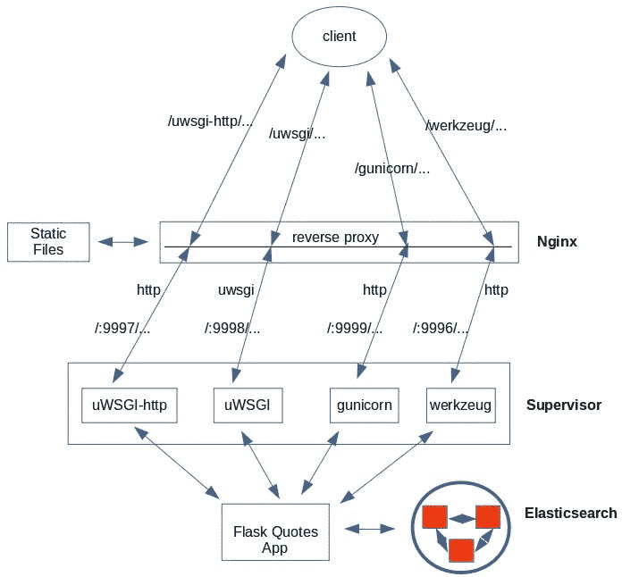
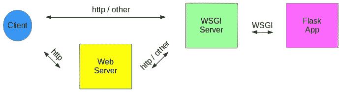
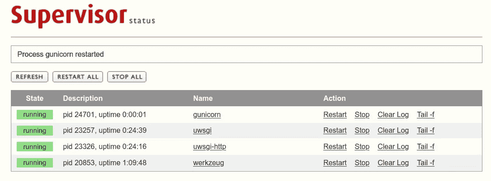
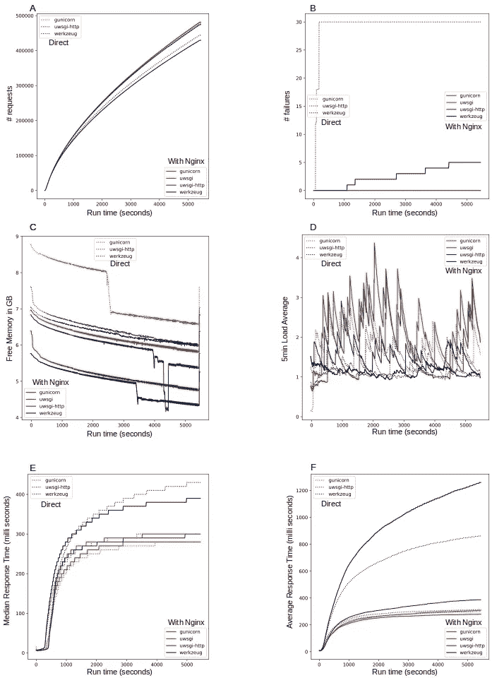
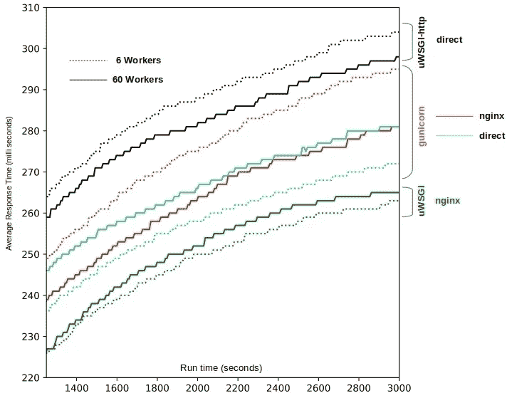

# 满满一瓶威士忌(WSGI)

> 原文：<https://towardsdatascience.com/a-flask-full-of-whiskey-wsgi-e89525d6f9da?source=collection_archive---------18----------------------->



有了目前由我们支配的 WSGI 服务器套件，提供 python web 应用程序变得前所未有的简单。Nginx 背后的 uWSGI 和 gunicorn 都是提供 Flask 应用程序的优秀执行者……

是的，在生活中你还能要求什么呢？也有许多品种，以适应个人的喜好。玩笑归玩笑，这篇文章是关于配置和压力测试几个 [WSGI](https://en.wikipedia.org/wiki/Web_Server_Gateway_Interface) (Web 服务器网关接口)来提供一个 Python web 应用程序。以下是我们在本帖中涉及的内容

*   用 Flask web 开发框架编写了一个简单的应用程序。唯一公开的 API 是通过查询后端资源生成随机报价。在这种情况下，是 Elasticsearch 索引了大量的引用。
*   看看下面这些独立的 WSGI web 服务器— [gunicorn](https://gunicorn.org/) 、 [uWSGI](https://uwsgi-docs.readthedocs.io/en/latest/) ，以及 Flask 捆绑的默认 [werkzeug](https://werkzeug.palletsprojects.com/en/0.16.x/) 。
*   看看使用 Nginx 来转发客户端请求的好处，这些请求被代理回上面的请求。
*   使用 supervisor 管理 WSGI 服务器，使用 Locust 驱动负载测试。

为了便于说明，我们在这里浏览了一些代码/配置片段，但是完整的代码可以从 [github](https://github.com/ashokc/A-Flask-full-of-WSGI) 获得。

# 1.WSGI 服务器

除非一个网站完全是静态的，否则 web 服务器需要一种方式来使用外部应用程序来获取一些动态数据。随着时间的推移，已经实现了许多方法来使这种练习变得精简、高效和简单。我们有好的旧 CGI，它为每个请求产生一个新的进程。然后是 mod_python，它将 python 嵌入到 web 服务器中，接着是 FastCGI，它允许 web 服务器接入一个长时间运行的进程池，将请求分派给它。他们都有自己的长处和短处。例如，请参见此[堆栈溢出](https://stackoverflow.com/questions/3937224/differences-and-uses-between-wsgi-cgi-fastcgi-and-mod-python-in-regards-to-py)页面上的讨论和链接。

目前最受欢迎的是 WSGI 协议，它允许 web 服务器和它们需要访问的应用程序完全分离。这是一个总的示意图。



图一。web 服务器和 python 应用程序通过中间的 wsgi 服务器进行通信，该服务器在 http 和 WSGI 协议之间进行转换。当然，WSGI 服务器不仅仅是一个翻译器。它是线程化的，将传入的请求分布在 Flask 应用程序的多个实例上。

*   WSGI 服务器本身支持 Http，所以客户机/Nginx 可以通过 Http 与它们对话。在 uWSGI 服务器的情况下，对于 Nginx，也可以选择 *uwsgi* 协议，并从命令行进行测试。
*   Nginx 将请求代理回一个为 URI 配置的 WSGI 服务器。
*   WSGI 服务器配置了 Python 应用程序来调用请求。结果会一路传回。

# 2.应用

应用程序很简单。这个应用程序只有一个文件——T2 报价。它允许一个 GET 请求。

```
/quotes/byId?id=INTEGER_NUMBER
```

该应用程序从 Elasticsearch 索引中获取报价文档，将 INTEGER_NUMBER 作为文档 ID，并将其呈现如下。


图二。我们从这篇博文中学到了什么？

图片和 CSS 由 Nginx 提供。

在没有 Nginx 的情况下，它们是从*静态*文件夹中发送的。

这就是应用程序的全部。无论我们选择使用哪种 WSGI 服务器都是一样的。这是目录和文件布局。

```
.
├── config.py     # Config options for gunicorn
├── quotes.py
├── static
│   ├── css
│   │   └── quote.css
│   ├── favicon.ico
│   └── images
│       ├── eleanor-roosevelt.jpg
│       ├── martha washington.jpg
│       └── maya angelou.jpg
├── templates
│   └── quote.html
└── wsgi.py       # Used by uWSGI
```

当使用内置的 *werkzeug* 作为 WSGI 服务器时，我们在 *quotes.py* 模块中提供运行时配置。调用服务时会提供 *uWSGI* 和 *gunicorn* 的配置。接下来我们将讨论 Nginx 和服务经理[主管](http://supervisord.org/)的问题。

# 3.配置

任何 WSGI 服务器使用的并发进程/工作进程的数量都会对性能产生影响。建议值约为内核数量的两倍，但如果不降低性能，也可以更大。在这里，我们不会弄乱每个工作线程，因为我们应用程序的内存占用很小。参见[这篇文章](https://medium.com/building-the-system/gunicorn-3-means-of-concurrency-efbb547674b7)中关于工人 vs 线程使用的一些讨论。

我们从 6 个工人开始，并改变它来衡量影响。我们对 *gunicorn* 和 *uWSGI* 服务器使用相同的数字，所以比较是苹果对苹果的。不幸的是，似乎没有办法在服务器上做同样的事情。

# 3.1 主管

我们使用 [supervisord](http://supervisord.org/) 来管理 WSGI 服务器进程。这允许更容易的配置、控制、通过 app/wsgi 和 UI 引导的日志的清晰分离。每台服务器的配置文件放在/etc/supervisor/conf.d 中，并启动 supervisord 服务。

```
[/etc/supervisor] ls conf.d/*
conf.d/gunicorn.conf  conf.d/uwsgi.conf  conf.d/uwsgi-http.conf  conf.d/werkzeug.conf[/etc/supervisor] sudo systemctl start supervisor.service
```

这里是一个 UI 截图(默认为 localhost:9001 ),显示了正在运行的 WSGI 服务器，以及停止/启动、跟踪日志等控件。



图 3。Supervisor service 支持对 WSGI 服务器进行干净简单的管理

*uwsgi* 和 *uwsgi-http* 的区别在于，后者有一个 http 端点，而前者使用二进制 uwsgi 协议。我们在图 1 的上下文中讨论了这一点。让我们来看看每一个的配置文件。请注意，下面配置文件中的路径是带有“…”的占位符，将根据磁盘上的确切路径进行适当替换。

# 3.2 gunicorn

配置中的命令字段调用 *gunicorn* 。 *gunicorn* 服务器使用 *quotes.py* 中的 app 对象，并使 web api 在端口 9999 可用。下面是配置文件*/etc/conf . d/guni corn . conf*

一个单独的文件 *config.py* 用于提供线程数量、日志细节等等。

# 3.3 uWSGI

正如我们前面提到的, *uWSGI* 服务器可以提供 Http 或 uWSGI 端点。当 *uWSGI* 服务器位于类似 Nginx 的 web 服务器之后时，建议使用 uwsgi 端点。以下配置适用于 Http 端点。对于 uwsgi 端点，我们将“ *-http 127.0.0.1:9997* ”替换为“ *-socket 127.0.0.1:9998*

配置类似于 gunicorn 的配置，但是我们不使用单独的配置文件。关键的区别是参数'-wsgi-file '，它指向由 *uWSGI* 服务器使用的带有应用程序对象的模块。

# 3.4 werkzeug

默认 *werkzeug* 服务器的选项作为 *quotes.py* 模块中 app.run (…)调用的一部分给出。我们禁用日志记录是为了不影响性能数字。

supervisord 唯一要做的就是让 werkzeugrun 成为一个守护进程。

# 3.5 Nginx

当使用 Nginx 时，我们需要它将请求正确地路由到上述 WSGI 服务器。我们使用 URI 签名来决定应该联系哪个 WSGI 服务器。下面是来自 *nginx.conf* 的相关配置。

我们通过 URI 的前导部分识别 WSGI 服务器，并小心地将它代理回我们定义的该服务器要监听的正确端口。

# 3.5 总结

有了这些，下面是 Nginx 就位时从客户端到后端的调用流的概要图。


图 4。当 Nginx 面向 WSGI 服务器时，来自客户端的请求的流程和路由。

在没有 Nginx 的情况下，客户机直接向由 WSGI 服务器支持的 Http 端点发送请求。足够清楚——不需要另一张图。

# 4.用蝗虫进行负载测试

[Locust](https://locust.io/) 是一个针对 Python 的负载测试框架。测试可以方便地在代码中定义，统计数据以 csv 文件的形式收集。这里有一个简单的脚本，它在收集系统指标的同时使用了 Locust。我们使用 [cmonitor_collector](https://github.com/f18m/cmonitor) 来收集负载和内存使用指标。

*   启动系统监视器来收集负载、内存使用等统计数据
*   在本地主机上运行 *load_tests.py* 中描述的测试
*   将结果保存到文件“results_stats.csv”和“results_stats_history.csv”。
*   测试开始时，总共模拟了 500 个用户，每秒增加 10 个用户
*   测试运行 60 分钟
*   Locust 还启用了一个带有绘图等功能的 UI(localhost:5557 ),但这里没有使用
*   停止系统监视器
*   对来自 Locust 的 csv 数据和系统度量数据进行后处理，以生成可以在不同的 WSGI 备选方案之间进行比较的图形

我们必须定义的唯一测试是命中我们已经公开的单个 API 是 *…/quotes/byId？id=xxxx*

该代码模拟一个用户，在再次点击 API 之前等待 1 到 3 秒钟，并使用一个随机整数作为要获取的报价的 ID。

# 5.结果

终于到了公布结果的时候了。花了一段时间来确定，但我们有相当多的移动件。绘制收集的数据很简单(我在这里使用 matplotlib ),因此我们将跳过这方面的代码。可以从 [github](https://github.com/ashokc/A-Flask-full-of-WSGI) 中获取 *plots.py* 。

我们有两个系列的运行——(a)6 个工人，和(b)60 个工人。每个系列有 7 次 locust 运行，如上面的代码片段所示。Locust 生成各种指标的数据——请求数、失败数、响应时间等……作为时间的函数。同样，cmonitor 收集硬件的负载、内存使用等数据。下面的图 5 显示了工人的结果。


图 5。6 名工人的绩效结果。gunicorn 和 uWSGI (uwsgi protcol)在有/没有 Nginx 的情况下性能最佳

从图 5 (E & F)中得出的主要结论如下。

*   *性能*:我们考虑平均响应时间(图 5F)。 *uWSGI* 和 *gunicorn* 服务器的性能在有/没有 Nginx 的情况下都不相上下。Flask 自带的默认服务器 *werkzeug* 是最差的，这是他们推荐的原因之一——不要在生产中使用它。另外，如果你喜欢 uWSGI 协议，那么选择二进制 uwsgi 协议，把它放在 Nginx 之后，因为它是最好的。下面是明确的顺序。

1.  Nginx 后面的 *uWSGI* 服务器( *uwsgi* )
2.  *没有 Nginx 的 gunicorn* 服务器
3.  Nginx 后面的 *uWSGI* 服务器(Http)
4.  Nginx 背后的 gunicorn 服务器
5.  *无 Nginx 的 uWSGI* 服务器(Http)
6.  *werkzeug* ，带/不带 Nginx

*   *为什么响应时间增加*？原因不是因为服务器性能随着时间而下降。更确切地说，这是工作中清晨喝咖啡的星巴克现象！Locust 在这里报告的是从发出请求到收到响应之间的总时间。我们发出请求的速率大于服务器清除请求的速率。因此请求被排队，队伍随着时间变得越来越长。较早进入队列的请求比较晚进入队列的请求等待时间短。当然，这表现为后续请求的响应时间更长。
*   *为什么中值的阶跃增加而平均值的阶跃平滑*？中位数(或任何百分位数)只是一个整数(毫秒)，而平均值当然是所有数字的平均值(浮点数)。百分位数基于其当前值两侧的计数，并给定随机性— *缓慢增加，并通过量子跳跃*。另一方面，平均值持续增加。

但是从图 A-D 中我们可以学到更多的东西。

*   (A)请求的总数随着时间的推移而增加——当然！有点线性，但不完全线性，在运行之间也有一些变化。这仅仅是因为模拟用户连续请求之间的*等待时间*在上面的代码片段中被随机化了。
*   (B)有一些失败，但是与被服务的请求总数相比非常非常少。或许还不足以得出重大结论。
*   (C & D)在任何情况下都有足够的空闲内存，没有太多的负载。但是*看起来*当不使用 Nginx 时，服务器会消耗更多的内存，负载也会稍微高一些。

很明显，我们不会用 6 名员工来增加服务器的负担。让我们把工人增加到 60 人，看看我们会得到什么。这在下面的图 6 中。



图 6。60 名工人的绩效与 6 名工人的绩效在质量上是相同的。gunicorn 和 uWSGI (uwsgi protcol)不管有没有 Nginx 都还是最好的。

我们明显增加了负载和内存使用量(C & D)，但我们从图 5 中得出的所有结论仍然适用，首先是 *uWSGI* 服务器，其次是 *gunicorn* 。在结束这篇文章之前，让我们来看看 6 个和 60 个工人在同一个地块上的响应时间结果，只关注 *uWSGI* 和 *gunicorn* 。



图 7。在我们的案例中，增加工人数量不会产生巨大的影响。Nginx 后面的 uWSGI 服务器表现最好，其次是带/不带 Nginx 的 gunicorn。

# 6.结论

我们在这篇文章中了解到:

*   Nginx 后面的 uWSGI 服务器表现最好
*   不管有没有 Nginx，gunicorn 都不会出错
*   我们希望避免将 uWSGI Http 服务器放在 Nginx 之后，就像他们在其网站上推荐的那样
*   我们在生产中不使用默认的 *werkzeug* 服务器！

快乐学习！

*原载于 2020 年 2 月 16 日 http://xplordat.com*[](http://xplordat.com/2020/02/16/a-flask-full-of-whiskey-wsgi/)**。**