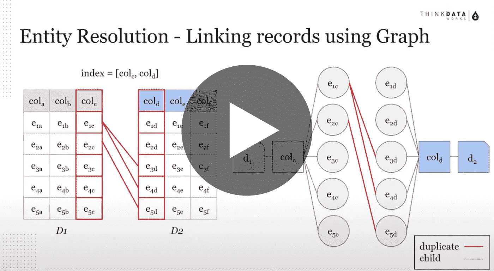

# 一个灵活的实体解析框架

> 原文：<https://towardsdatascience.com/a-flexible-framework-for-entity-resolution-da970732884a?source=collection_archive---------70----------------------->

## [活动讲座](https://towardsdatascience.com/event-talks/home)

## Hoyoung Jang & Cheng Lin | TMLS2019

【https://torontomachinelearning.com/ 号

## 关于扬声器

*   ThinkData Works 首席数据科学家 Hoyoung Jang
*   程林，麦吉尔大学优等生

## 关于谈话

数据管理和丰富管道的一个关键组成部分是连接来自各种来源的大型数据集，以形成一个整体视图；在跨数据源的实体之间建立连接。通常，这些实体(如个人、组织或地址)可能没有可用作检测重复项或合并数据集的关键字的唯一标识符。ThinkData 开发了一个可扩展的实体解析引擎来解决这些问题。在试验了深度学习和传统的 NLP 技术之后，该团队找到了准确性和性能的最佳平衡。具体来说，与 Magellan(研究中领先的实体解析项目)相比，我们已经实现了近乎对等的准确性，尽管具有更好的性能指标和更大的可扩展性。本次讲座将讨论实体解析的重要性，我们解决现实世界挑战的方法，以及将实体解析和图形关系结合使用的潜力。

一个灵活的实体解析框架