# 一个被遗忘的苏联人工智能故事

> 原文：<https://towardsdatascience.com/a-forgotten-story-of-soviet-ai-4af5daaf9cdf?source=collection_archive---------23----------------------->

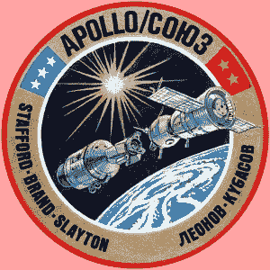

阿波罗-联盟号试验项目是苏联太空探索中最受欢迎的项目之一。然而，苏联在人工智能方面的早期工作在很大程度上被遗忘了。 [*图片来源*](https://ru.wikipedia.org/wiki/%D0%A1%D0%BE%D1%8E%D0%B7_%E2%80%94_%D0%90%D0%BF%D0%BE%D0%BB%D0%BB%D0%BE%D0%BD) *。*

西方计算机科学和人工智能的创始人图灵、明斯基和麦卡锡的名字现在为每个人所熟悉。然而，人们对苏联铁幕下的人工智能发展史知之甚少，尽管有时两个系统之间的竞争并不像在太空中那样激烈。下面是一个被遗忘的苏联人工智能的故事，通过这些事件的英雄，安德烈·莱曼和他的同事的生活镜头呈现。

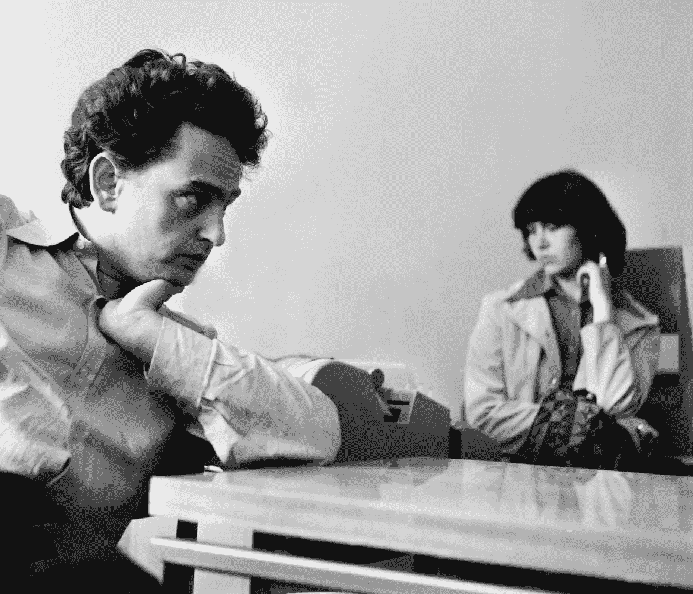

安德烈·莱曼。图片来源:Igor Faradzhev 的个人档案。

1955 年可以被认为是苏联人工智能的开始，当时一群数学家接触到了计算机 M-2，并开始了软件工程来解决科学问题和数学难题。

Andrey Leman*(1940–2012)，现在因与人合著 Weisfeiler-Leman 算法、对第一个苏联数据库国际核事故等级和第一个国际象棋世界冠军 Kaissa 的贡献而闻名，他是 Kronrod 团队的早期成员之一，当时该团队正在开发第一批人工智能程序。*

> 他的一生，从在学校数学奥林匹克竞赛中获胜，到在人工智能实验室工作，再到后来移民到硅谷，是苏联天才工程师和数学家一代的象征。

# 数学奥林匹克

安德烈·莱曼(Andrey Leman)所受的教育是那个时代聪明男孩的典型教育:数学成绩优异，在数学奥林匹克竞赛中表现优异，就读于美国最好的大学。在没有互联网的时代，数学奥林匹克是追求数学职业生涯的灵感来源，安德烈很自然地被吸引到这一领域。

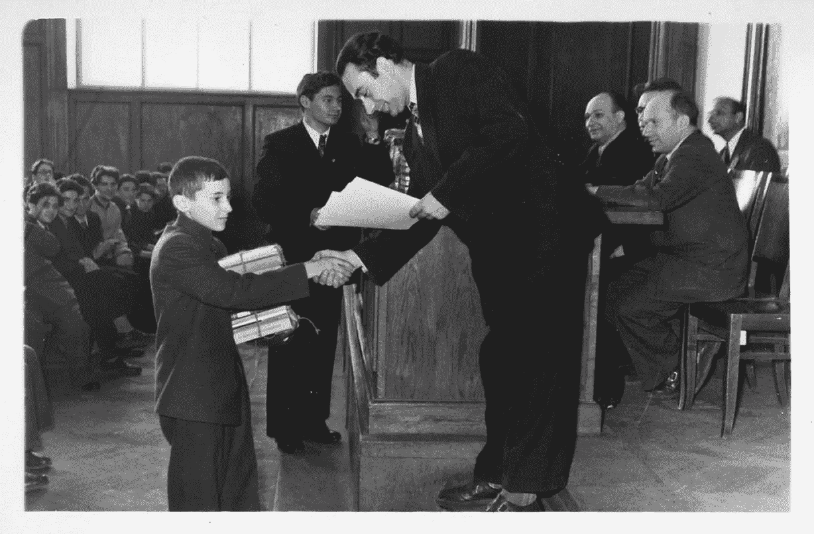

给 1958 年数学奥林匹克冠军颁奖。[图像来源](https://olimpiada.ru/article/687)。

可以说，这种对谜题的兴趣贯穿了安德烈的一生，他开始作为数学家，然后作为程序员，继续解决难题。他后来将这些问题收集成一本书，多年来，这本书是苏联学生准备的主要来源。

17 岁时，安德烈是苏联顶尖学校莫斯科国立大学的新生。他与鲍里斯·魏斯费勒一起学习，并一直合作到鲍里斯 1975 年移民国外。他于 1962 年毕业于莫斯科国立大学，并加入了苏联的“第一个人工智能实验室”。

# 人工智能实验室

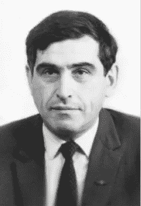

亚历山大·克朗罗德。苏联 AI 创始人。[图片来源](https://en.wikipedia.org/wiki/Alexander_Kronrod)。

如果有一个人应该被命名为苏联人工智能的创始人，那将是实验室的负责人[亚历山大·克朗罗德](https://en.wikipedia.org/wiki/Alexander_Kronrod)。Kronrod 作为一名科学家有一条非常有趣的道路，开始是一名有前途的年轻数学家，从事复分析和微分方程的研究，他在第二次世界大战开始时自愿参军，这使他获得了几枚勇敢勋章，但也导致了两次受伤，使他无法继续服役。1945 年，他加入了[库尔恰托夫的研究所](https://en.wikipedia.org/wiki/Kurchatov_Institute)，从事数值数学研究，直到他意识到计算可能比“纯”数学更有成果。

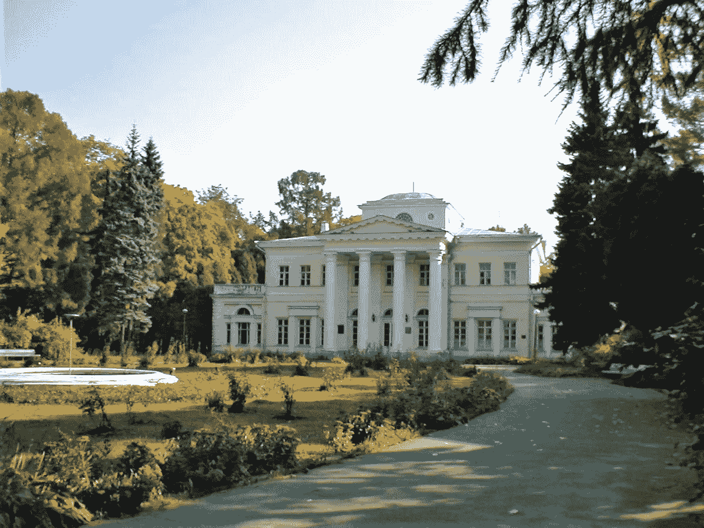

理论和实验物理研究所(ITEP)。[图像来源](https://en.wikipedia.org/wiki/Institute_for_Theoretical_and_Experimental_Physics)。

四年后[他成为新的理论和实验物理研究所(ITEP) *数学系*](http://www.mathnet.ru/php/archive.phtml?wshow=paper&jrnid=rm&paperid=448&option_lang=rus)的负责人，目标是领导核物理的创新(计算基本粒子的核反应堆和加速器，处理云室中的观察结果等)。)—这个方向对这个国家来说至关重要。如果不是 Kronrod 对人工智能的坚定信念，实验室只会进行数值模拟，人工智能可能不会出现在这个研究所。然而，Kronrod 的高声誉让他和他的团队也可以研究可以玩纸牌游戏和国际象棋的智能系统。

在 AVL 树中插入元素，这是 ITEP 发明的。

当时计算机科学的一个热门话题是离散算法的计算复杂性，Kronrod 的团队也对此做出了贡献。团队中的两名成员 G. Adelson-Velsky 和 E. Landis 提出了第一个自平衡二叉查找树，现在被称为 AVL 树。

引入了多项式可解问题和 NP-完全性的第一个概念，实验室对寻找各种问题的快速算法感兴趣。

> 大多数问题很快被排除在 P 或 NP-完备集之外，但是两个实际上很重要的问题，线性规划和图同构，不属于这一类。

后来，另一位苏联数学家 [Leonid Khachiyan](https://en.wikipedia.org/wiki/Leonid_Khachiyan) 构造了线性规划的多项式时间算法，但是图同构问题仍然不属于 p 类。

自然，克朗罗德实验室的成员包括安德烈·莱曼和[鲍里斯·魏斯费勒](https://en.wikipedia.org/wiki/Boris_Weisfeiler)都对图同构问题感兴趣。他们的第一个重要成果就是今天众所周知的[魏斯费勒-莱曼算法](/limitations-of-graph-neural-networks-2412fffe677) (1968)。

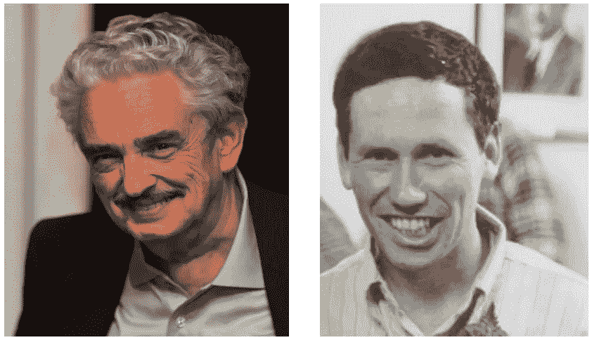

安德烈·莱曼和鲍里斯·魏斯费勒。图片来源:Igor Faradzhev 的个人档案。

最近，由于图的机器学习的发展，对 Weisfeiler-Leman 算法的兴趣增加了，它为[图神经网络](/limitations-of-graph-neural-networks-2412fffe677)奠定了基础。

这项关于图同构的工作最终导致了 1971 年在 Kronrod 指导下的 Leman 的第一篇论文；然而，高级认证委员会(HAC)负责人与 Andrey 导师的个人敌意导致论文被拒绝，其表述为“这不是数学”。

> “我不是数学家，我是程序员。”——安德烈苦涩地回应道。

随后，他将兴趣从组合学转向更像程序员的问题，并于 1973 年在 V. Arlazarov 的指导下就数据库管理对他的第二篇论文进行了答辩。他对苏联第一个数据库国际核事故等级的贡献为他赢得了苏联部长理事会奖，该数据库在苏联被广泛使用。

Andrey 没有将自己局限于数据库编程，而是致力于软件工程的其他问题。*其中之一是人工智能棋手的发展，他们成为了第一个世界冠军。*

# 艾下棋

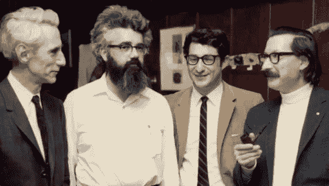

克劳德·香农、[约翰·麦卡锡](https://en.wikipedia.org/wiki/John_McCarthy_(computer_scientist))、[埃德·弗雷德金](https://www.chessprogramming.org/Edward_Fredkin)和[约瑟夫·韦岑鲍姆](https://en.wikipedia.org/wiki/Joseph_Weizenbaum) (1966)。[来源](https://www.chessprogramming.org/John_McCarthy)。

艾伦·图灵发明他的“通用图灵机”几年后，信息论之父克劳德·香农试图教计算机下棋。这个想法后来流行起来，并且有平行的倡议，一个在美国，另一个在苏联，来开发一个可以学习下棋的算法。

在美国，这是麻省理工学院的约翰·麦卡锡和他的学生开发的程序。 [约翰·麦卡锡](https://en.wikipedia.org/wiki/John_McCarthy_(computer_scientist))等人在 1952 年与图灵讨论时创造了“人工智能”一词，是这个新兴领域的先驱。

在苏联，这是由 ITEP 的 Kronrod 小组开发的程序。Kronrod 的实验室于 1963 年开始了这项研究，其中包括许多天才数学家，如 G. Adelson-Velskyi、V. Arlazarov 和 Andrey Leman。一家苏联报纸《共青团员报》的读者与它有过一场比赛，他们决定称它为 [*凯萨*](https://en.wikipedia.org/wiki/Kaissa)*——象棋女神。*

*1965 年，j .麦卡锡访问了苏联，并与 Kronrod 达成协议，在 1967 年举行了两个程序之间的第一次国际象棋比赛。在 4 场比赛中，凯萨展示了强大的开局知识和分析能力，以 3:1 赢得了系列赛。但这只是世界杯前的热身。*

*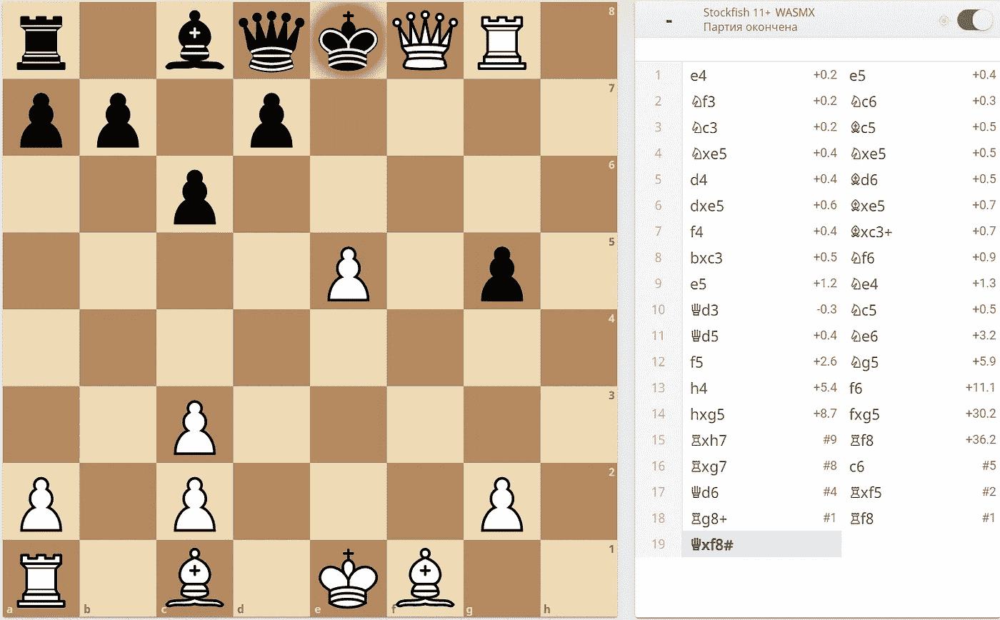*

*计算机之间的第一场国际象棋比赛:苏联(白)和美国(黑)。lichess.orgT2 制造的图像。*

*1969 年，克朗罗德和其他数学家[在信](https://ru.wikipedia.org/wiki/%D0%9F%D0%B8%D1%81%D1%8C%D0%BC%D0%BE_%D0%B4%D0%B5%D0%B2%D1%8F%D0%BD%D0%BE%D1%81%D1%82%D0%B0_%D0%B4%D0%B5%D0%B2%D1%8F%D1%82%D0%B8)上签名，为另一位遭到不公正谴责的苏联数学家[叶赛宁-沃尔平](https://en.wikipedia.org/wiki/Alexander_Esenin-Volpin)辩护。这种活动在大学里是严格禁止的，不幸的是，克朗罗德被解雇了，他的实验室也被解散了。*

*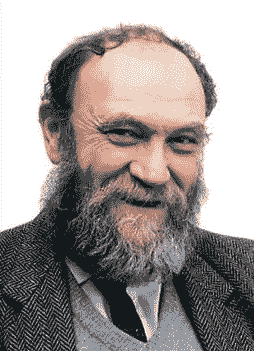*

*V. Arlazarov 带领 Kaissa 集团参加了第一届国际象棋锦标赛。[图像来源](https://ru.wikipedia.org/wiki/%D0%90%D1%80%D0%BB%D0%B0%D0%B7%D0%B0%D1%80%D0%BE%D0%B2,_%D0%92%D0%BB%D0%B0%D0%B4%D0%B8%D0%BC%D0%B8%D1%80_%D0%9B%D1%8C%D0%B2%D0%BE%D0%B2%D0%B8%D1%87)。*

*他的实验室成员加入了控制问题研究所(ICP)；但克朗罗德并没有加入新的实验室[**v . Arlazarov**](https://en.wikipedia.org/wiki/Vladimir_Arlazarov)**成为领导 Kaissa 为首届 AI 棋手世界杯开发的团队负责人。***

*1974 年，在斯德哥尔摩，来自 8 个国家的 13 个项目争夺世界冠军的头衔。比赛在这个城市最大的酒店的音乐厅举行了五个晚上。六场比赛同时进行。**凯萨** [**赢下全部四局**](https://web.archive.org/web/20091028082847/http://www.geocities.com/SiliconValley/Lab/7378/kaissa.htm) **赢得金牌**，以各 3 分超越美国对手 Chess-4、Chaos、Ribbit。看到他们的科学家为国际象棋带来第一枚金牌，这是整个国家的胜利。*

*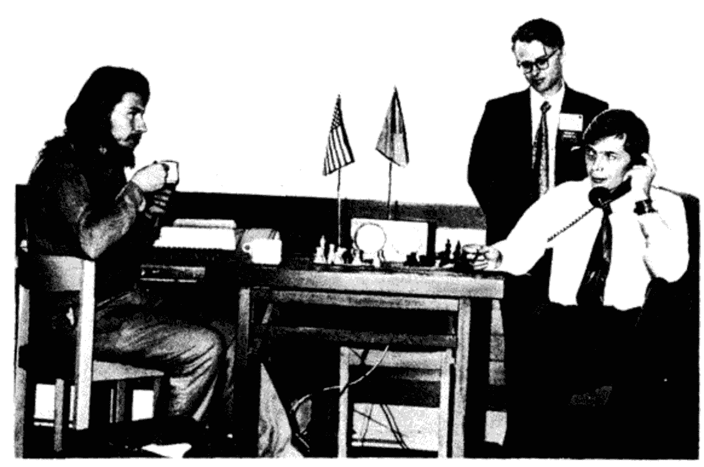*

*Tech-2(美国)对 Kaissa(苏联)，1974 年，斯德哥尔摩。右边的唐斯科伊先生正在通过电话接收这些动作。[图片来源](http://kvant.mccme.ru/1974/12/chempionat_mira_sredi_shahmatn.htm)。*

> *随后，克朗罗德[说](http://jmc.stanford.edu/articles/drosophila/drosophila.pdf):“国际象棋是人工智能的果蝇”。这是一种极好的实验动物，研究人员可以用它来测试他们的假设。*

# *硅谷*

*Andrey 继续与他在 Kronrod 实验室的 AI 朋友一起工作:首先是 1968-76 年在 ICP，然后是 1976-90 年在系统分析研究所，直到铁幕倒塌。*1990 年安德烈加入了硅谷的“登陆党”组织。**

*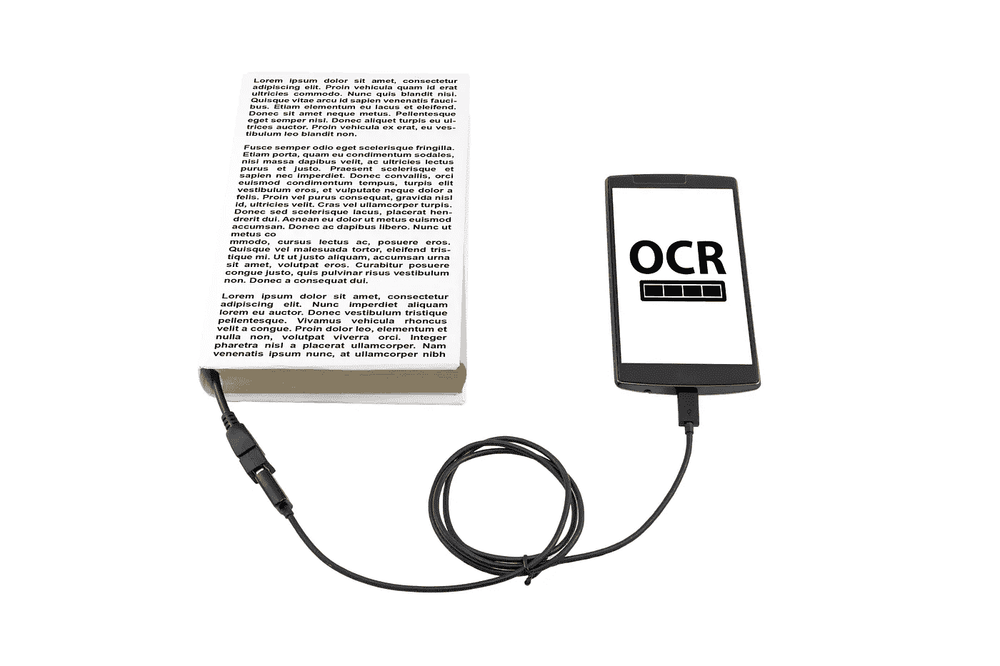*

*楔形文字 OCR 是 Andrey 和他的同事在登陆硅谷后的第一个成功产品。[图片来源](https://www.shutterstock.com/)。*

*在那里成立的初创公司[认知技术公司](https://en.wikipedia.org/wiki/Cognitive_Technologies)，他们开发了光学识别系统，成为识别不同语言扫描文本的领导者。他们的楔形文字 OCR 解决方案被许多 IT 巨头使用，如甲骨文、IBM 和三星。*

*从 1995 年到 2012 年，Andrey 在多家高科技初创公司担任程序员。他最后的雇主是基因公司 Invitae，在那里他开发了基础设施系统，至今仍被员工大量使用。他是生物信息学的新手，但他对解决挑战性问题的好奇心也帮助他在这一领域取得了成功。*

*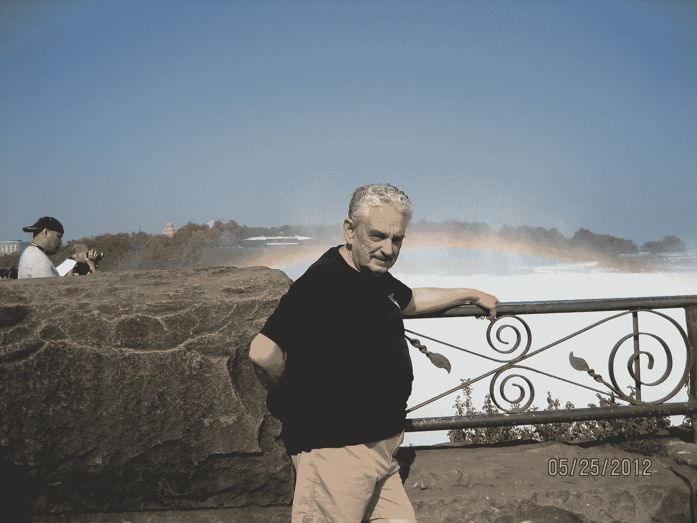*

*美国的安德烈·莱曼。图片来源:Igor Faradzhev 的个人档案。*

*安德烈于 2012 年去世，但在人们的记忆中，他是一位可靠的同事和忠诚的朋友，极具幽默感，总是乐于助人。*

*他和他的同事们的贡献帮助人工智能从一个数学分支发展成为最有影响力的科学领域之一，他们的工作现在是苏联人工智能历史的一部分。*

*— — — — — — —*

***鸣谢:**大部分历史资料收集自 Andrey 的同事:Igor Faradzhev、Michael Furman、Ilia Ponomarenko、Olga Weisfeiler、Vladimir Arlazarov。这篇文章中的一些信息可以在“[对称性与规律性:它是如何开始的，它导致了什么？伊戈尔·法拉吉夫。Igor Faradzhev 授予的文本中使用的一些照片。我感谢阿列克塞·伊万诺夫对编辑文本提出了有益的建议。](https://www.iti.zcu.cz/wl2018/pdf/wl2018_faradjev.pptx)*

**P.S .我会继续写关于图机器学习的文章，所以如果你有兴趣，可以在 medium 上关注我或者订阅我的* [*电报频道*](https://t.me/graphML) *(我每天都更新)或者* [*我的 twitter*](https://twitter.com/SergeyI49013776) *(我每周更新一次)。**