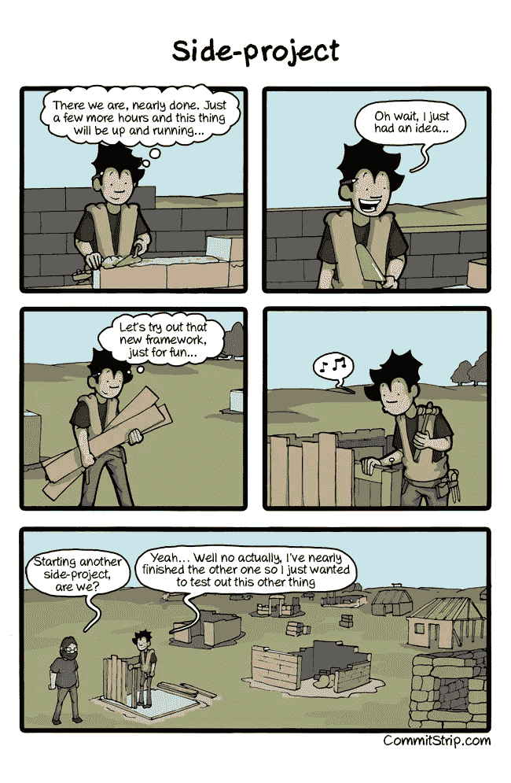
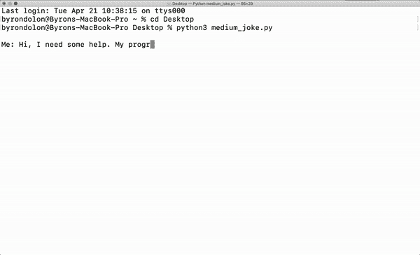

# 前技术实习生成为好实习生的指南

> 原文：<https://towardsdatascience.com/a-former-tech-interns-guide-to-being-a-good-intern-f9d18c60da9e?source=collection_archive---------54----------------------->

## 我可以和熊猫一起玩。

图多尔·巴休在 [Unsplash](https://unsplash.com/s/photos/coffee-code?utm_source=unsplash&utm_medium=referral&utm_content=creditCopyText) 上的照片

“你熟悉 Python 吗？”

我尽最大努力令人信服地点头，同时一直在想“python…为什么我们要谈论蛇？”

**引发读者哄堂大笑*

我毕业时获得了国际商业管理学士学位。我大学毕业后的第一次实习？“客户数据智能”。我不知道我在做什么。

我们入职一个月后，一位资深员工把他的一个项目交给了我们。在他给我们的第一封邮件中，他写道:

“这是 Gitlab 的链接。我主要使用 Pandas 进行数据处理，但是一些数据来自我们的数据仓库，所以我只使用 SQL 查询。如果你对目前为止的 60 行有任何问题，请告诉我。否则，您可以开始开发。”

呃…

我有几个问题:

1.  什么是 gitlab？
2.  熊猫？喜欢..吃竹子的那种？(是的，我会开些糟糕的玩笑)
3.  如何在 Python 脚本中执行 SQL？你是魔术师吗？

我快速搜索了一下，想出了一些答案。我了解到:

*   Gitlab 是一个基于 web 的分布式版本控制系统，由团队用于开发项目。
*   Pandas 是一个用于数据分析的 Python 库。
*   您可以使用 ODBC(开放式数据库连接)驱动程序将 Python 连接到数据库并执行 SQL 命令。

澄清这些介绍性的问题是一个开始。一个月后，我们有了一个最小可行的产品。五个月后，我和另一个实习生已经把那 60 行代码变成了一个 600 行的庞然大物，并根据用户反馈进行了功能扩展和调整。所有这一切都需要边做边学，因为我们之前都没有接触过 Python。当我们的实习结束时，我们移交了这个项目，感觉有点似曾相识。我们已经从学生变成了大师。或者可能只是中级生。(那是 HIMYM 的参考。)

陷入困境给了我一个独一无二的机会来快速掌握一项新技能。我知道我离成为一名合格的开发人员还有很长的路要走。单单回顾那个项目，我就能想到一千件我会以不同方式去做的事情。但这半年的经历让我建立了足够的兴趣，想进一步从事这种工作。

在实习期间，我也一路接触了 SQL、Tableau、Splunk 和 AWS。我从未想过我会使用这些工具，更不用说我喜欢学习它们了。在大学里，每当我们有任何与数据相关的任务时，我都会避开它们。我更喜欢在团队中担任与写作相关的角色。现在，我的全职工作每天都涉及开发工作！

我还是觉得自己不够格。我学得越多，就越意识到自己有多少不知道。这让人望而生畏，因为人们期望我去实现。到目前为止，我学得足够跟上，但我担心这不会永远持续下去。

我现在的经历和我当实习生时的感受相似。每天我都在学习，学习，这样我就能向每个人证明我不只是说说而已。实习结束时，我的一个队友为我和另一个实习生计划了一次与团队的告别会。在我们开始吃蛋糕之前，他说(转述):

> “你们真的展示了实习生应该是什么样的。你最终给公司带来了切实的影响。”

这对我意义重大，因为我觉得花在学习新东西、观察代码崩溃、学习更多新东西和调试代码上的所有时间实际上都有意义。他的话打破了我长久以来“编码对我来说太难了”的心态。

因此，我非常感激我的实习经历。现在让我坚持下来的是，我的实习证明了我可以学习并适应工作中的新要求。因此，我想分享我在实习期间做的事情，每个人都可以做(即使你不是实习生)。

# **如何充分利用你的实习:**

## 1.做一块海绵。会游泳的海绵。

仅仅吸收同事教给你的东西是不够的。实习是一份让你学习新事物的工作。我把每天努力学习至少一件新东西作为目标。你永远不知道什么时候你偶然得到的一个小消息会让你帮助一个需要帮助的同事。你知道的越多，你能做的就越多。

当有人能做他们不能做的事情，或者有人能做他们能做但更快的事情时，人们总是印象深刻。更让人印象深刻的是因为你是一个(年轻？)实习生。做那个实习生！

## 2.不要坐在办公桌前等着有事做。请随机的人做随机的事。

我很幸运，有一位经理告诉我，除了我的工作描述之外，还要探索其他项目。我牢记在心，最后列出了一长串与“客户数据智能”无关的事情。

其中一部分就是在 Slack 上给随机的人发消息，看看他们是否需要帮助。我还经常把我的办公椅转过来，问那个总是需要 Excel 帮助的家伙是否还需要我做什么(我有点夸张，但只是一点点)。

如果你想让人们认真对待你，你需要向他们展示你愿意工作。

## 3.积极推广自己的项目。

尽可能频繁的交流意味着和我一起工作的每个人都知道我在做什么。再说一次，我很幸运有一个提醒我大胆发言的经理。我养成了一个习惯，总是和我的项目主管、经理、队友和乒乓球伙伴谈论我正在做的工作和我面临的问题。人们听说了好的一面，主动提出帮助坏的一面。

## 4.请首席执行官喝咖啡。

这一次，我没有请我喝咖啡，而是主动请我的同桌喝一杯。作为一个人，他们站起来，从座位上跳起来，冲向食堂(我有点夸张，但只是一点点)。当我们排队时，首席执行官走过来站在我们身后。

在下单之前，我们和他谈了一会儿。我的一位同事告诉咖啡师，这轮由我买单，开玩笑地说我也可以为首席执行官买单。CEO 先生笑着说可以自己买咖啡。

当我为我们的订单付款时，我注意到它比应该的价格多了大约一欧元。然后我意识到咖啡师确实包括了 CEO 的订单。

当我意识到我(不小心)刚买了 CEO 的咖啡时，我眨了几下眼睛。

他笑了，和我们聊了一会儿，然后在离开前对我说“谢谢你的咖啡”。

也许你不必给首席执行官买咖啡，但充分利用你的经历很大一部分是从中获得乐趣。午餐时打乒乓球，将一名高级员工的代码修复称为“圣书”和 XXX 都绝对不是工作的一部分。但它们是我记忆最深的部分。

# **新的一章**

在大学期末考试前的几个月，我对自己说，我迫不及待地想完成学业。同时又害怕离开学校这个安全的泡泡。置身于“真实世界”意味着我必须找工作，支付账单，做所有其他学校无法做的成人事情。除此之外，我甚至不知道我想要什么样的工作。

实习改变了我的生活，不仅因为它给我提供了一些急需的工作经验。它让我接触到 Excel 之外的数据分析工具，什么是“云计算”,以及为什么这幅漫画有意义:

再次，一个夸张，但几乎无关紧要的项目漫画故事，来自[委员会旅行](http://www.commitstrip.com/en/2014/11/25/west-side-project-story/)

我的实习开启了一条与我想象的完全不同的职业道路。它帮助我在一个我真正喜欢的领域和职能中找到了我的第一份全职工作。如果你正在努力寻找大学毕业后想做什么，尝试在不熟悉的领域实习。

它对你的帮助可能超乎你的想象。

还有，有人还没给我买咖啡。

另外，再给你讲一个笑话:

宠物蛇…哈哈哈哈——我创作的 gif，笑话来源于 [devrant](http://devrant.com)