# 对比自我监督学习的框架和新方法的设计

> 原文：<https://towardsdatascience.com/a-framework-for-contrastive-self-supervised-learning-and-designing-a-new-approach-3caab5d29619?source=collection_archive---------2----------------------->

## 在一篇新论文中，我们讨论了在自我监督学习中驱动性能的关键思想，并展示了什么是重要的。

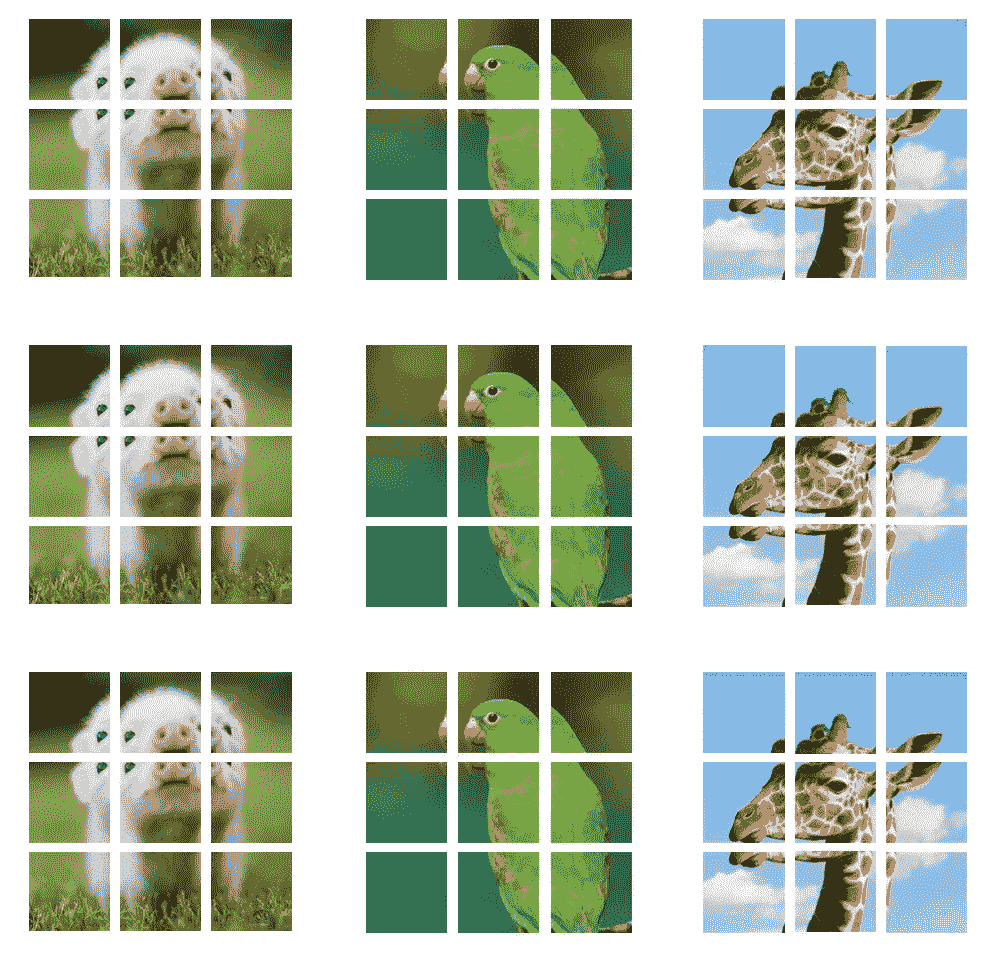

成批输入。

这是与我们的新论文相匹配的合作伙伴博客: [**对比自我监督学习的框架和设计新方法**](https://arxiv.org/abs/2009.00104) (作者威廉·法尔孔和赵京云)。

在过去的一年里，一系列“**小说**”*自我监督学习*算法在人工智能研究领域创造了新的最新成果:AMDIM、CPC、SimCLR、BYOL、Swav 等

在我们最近的论文中，我们提出了一个概念框架来描述对比自我监督学习方法。我们使用我们的框架分析了这些领先方法的三个例子，SimCLR、CPC、AMDIM，并表明尽管这些方法表面上看起来不同，但实际上它们都是彼此的细微调整。

在这篇博客中，我们将:

*   复习自我监督学习。
*   复习对比学习。
*   提出一个框架来比较最近的方法。
*   使用我们的框架比较 CPC、AMDIM、MOCO、SimCLR 和 BYOL。
*   使用我们的框架制定一个新的方法— YADIM。
*   描述一下我们的一些结果。
*   描述实现这些结果的计算要求。

这项工作的大部分是在脸书人工智能研究所进行的。

# 履行

您可以发现我们在本文中描述的所有增强和方法都在 [PyTorch Lightning](https://github.com/PyTorchLightning/pytorch-lightning) 中实现，这将允许您在任意硬件上进行训练，并使每种方法的并排比较更加容易。

[AMDIM](https://pytorch-lightning-bolts.readthedocs.io/en/latest/self_supervised_models.html#amdim)

[BYOL](https://pytorch-lightning-bolts.readthedocs.io/en/latest/self_supervised_models.html#byol)

[CPC V2](https://pytorch-lightning-bolts.readthedocs.io/en/latest/self_supervised_models.html#cpc-v2) (据我们所知，仅验证了 DeepMind 之外的实现)。

V2 莫科

[SimCLR](https://pytorch-lightning-bolts.readthedocs.io/en/latest/self_supervised_models.html#simclr)

# 自我监督学习

回想一下在*监督学习*中，系统被给定输入(x)和标签(y)，

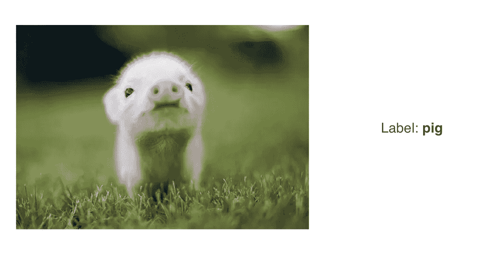

监督学习:左边是输入，右边是标签。

在 ***自我****——监督学习中，*系统只给出(x)。代替 a (y)，系统“学习从其输入的其他部分预测其输入的一部分”[参考](https://twitter.com/ylecun/status/1123235709802905600?s=20)。

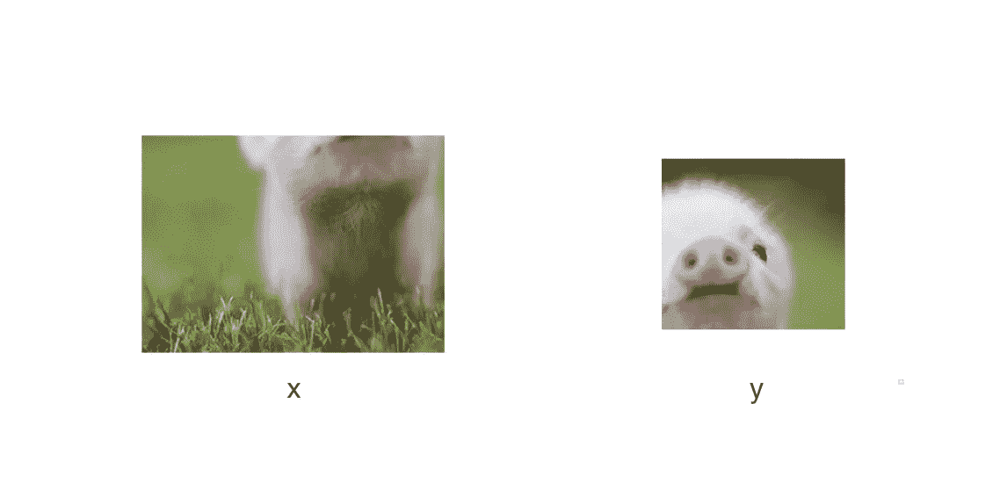

在自我监督学习中，输入被用作源和目标

事实上，这个公式是如此的通用，以至于你可以创造性地“分割”输入。这些策略被称为借口任务，研究人员已经尝试了各种方法。这里有三个例子:(1) [预测两个补丁的相对位置](https://arxiv.org/abs/1505.05192) , (2) [解决拼图游戏](https://arxiv.org/abs/1603.09246) , (3) [给图像着色](https://richzhang.github.io/colorization/)。

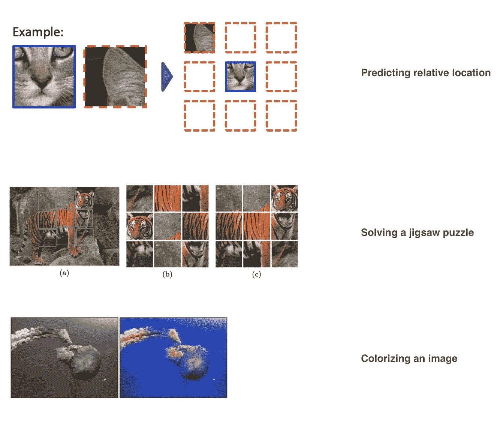

借口任务的示例

尽管上面的方法充满了创造性，但它们在实践中并不奏效。然而，最近一系列使用*对比学习*的方法实际上已经开始显著缩小 ImageNet 上监督学习之间的差距。

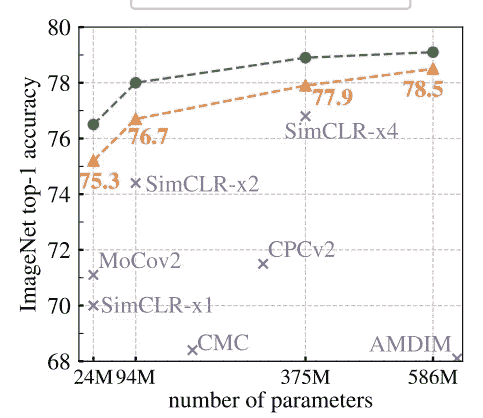

最新的方法(Swav)正在缩小在 ImageNet 上训练的监督变异的差距

# 对比学习

大多数机器学习算法背后的一个基本思想是，相似的例子应该被分组在一起，并且远离其他相关例子的集群。

这种想法是关于对比学习的最早作品之一的背后，Chopra 等人在 2004 年[有区别地学习相似性度量，并应用于人脸验证](http://yann.lecun.com/exdb/publis/pdf/chopra-05.pdf)。

下面的动画说明了这一主要思想:

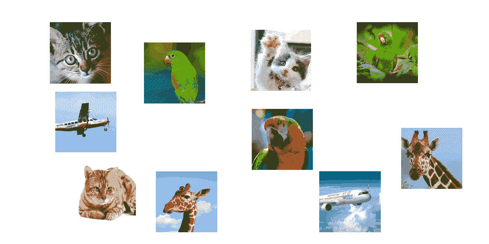

对比学习通过使用三个关键要素来实现这一点，即积极、锚定和消极(s)表征。为了创建一个正对，我们需要两个相似的例子，而对于一个负对，我们使用第三个不相似的例子。

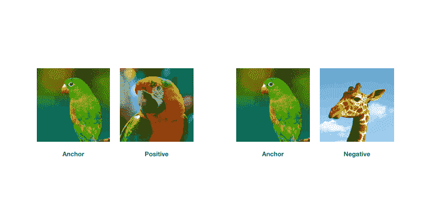

但是在自我监督学习中，**我们不知道例子的标签**。所以，没有办法知道两个图像是否相似。

然而，如果我们假设**每个图像是它自己的类别**，那么我们可以想出各种方式来形成这些*三元组*(正负对)。这意味着在一个大小为 N 的数据集中，我们现在有 N 个标签！

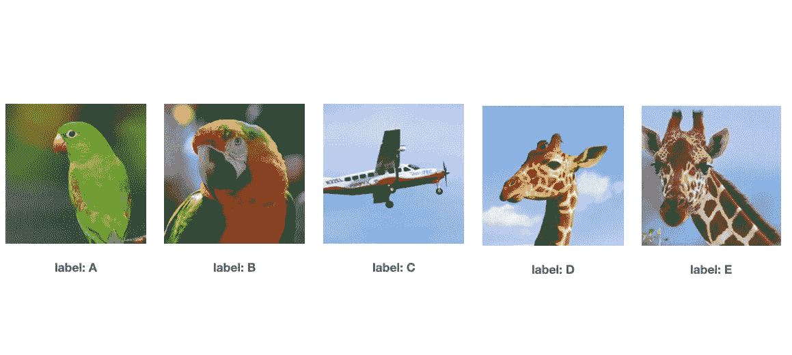

现在我们知道了每张图片的标签，我们可以使用数据扩充来生成这些三元组。

# 特征 1:数据增强管道

我们可以表征对比自我监督学习方法的第一种方式是通过定义数据扩充管道。

一个*数据扩充管道* **A(x)** 将一系列随机变换应用于相同的输入。

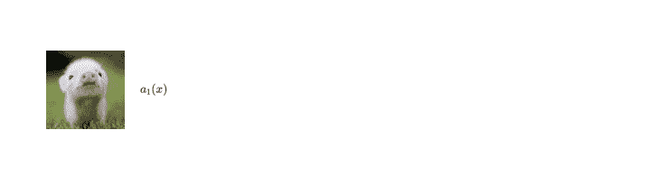

应用于输入的随机数据扩充管道

在深度学习中，数据扩充旨在构建对原始输入中的噪声不变的表示。例如，网络应该将上面的猪识别为猪，即使它被旋转，或者如果颜色消失，或者即使像素周围“抖动”。

在对比学习中，数据扩充管道有一个次要目标，即生成锚、正面和负面示例，这些示例将被提供给编码器，并用于提取表示。

**CPC 管道**

CPC 引入了一个应用变换的管道，如颜色抖动、随机灰度、随机翻转等，但它也引入了一个特殊的变换，将图像分割成重叠的子块。

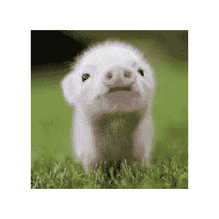

关键 CPC 转换

使用此管道，CPC 可以生成多组正样本和负样本。在实践中，这一过程应用于一批样品，其中我们可以使用该批样品中的其余样品作为阴性样品。

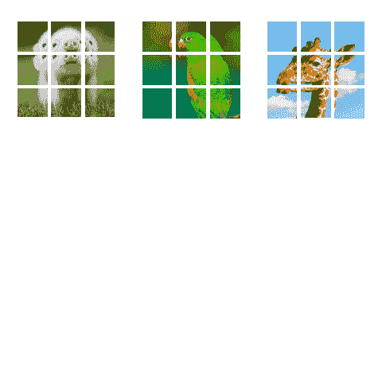

从一批图像中生成正对、锚对和负对。(批量= 3)。

**AMDIM 管道**

AMDIM 采用了一种稍微不同的方法。在执行标准变换(抖动、翻转等)后，它通过对同一图像应用两次数据扩充管道来生成图像的两个版本。

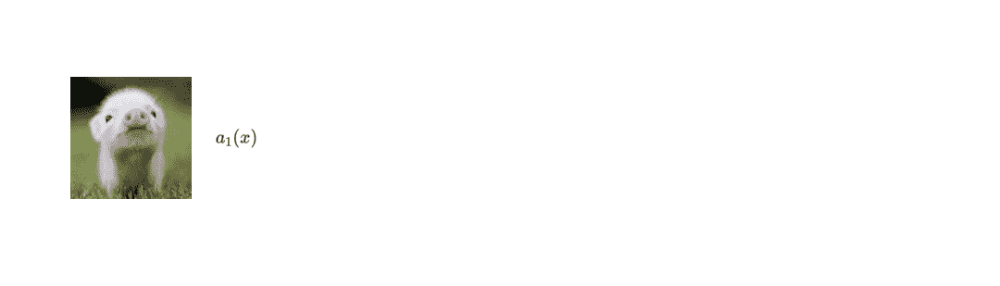

这个想法实际上是由 Dosovitski 等人在 2014 年通过[本文](https://papers.nips.cc/paper/5548-discriminative-unsupervised-feature-learning-with-convolutional-neural-networks.pdf)提出的。这个想法是使用一个“种子”图像来生成同一图像的多个版本。

**西姆 CLR、Moco、Swav、BYOL 管道**

AMDIM 中的管道工作得如此之好，以至于随后的每种方法都使用相同的管道，但对之前发生的转换进行了细微的调整(有些添加了抖动，有些添加了高斯模糊，等等)。然而，与 AMDIM 中引入的主要思想相比，这些变换中的大多数都是无关紧要的。

在我们的论文中，我们对这些变换的影响进行了评估，发现变换的选择对该方法的性能至关重要。事实上，我们认为这些方法的成功主要是由特定的转换选择所驱动的。

这些发现与西姆 CLR 和 BYOL 公布的类似结果一致。

下面的视频更详细地说明了 SimCLR 管道。

# **特征二:编码器**

我们表征这些方法的第二种方式是编码器的选择。上述大多数方法使用各种宽度和深度的网。

ResNet 架构(鸣谢:[原 ResNet 作者](https://www.cv-foundation.org/openaccess/content_cvpr_2016/papers/He_Deep_Residual_Learning_CVPR_2016_paper.pdf))

当这些方法开始出现时，CPC 和 AMDIM 实际上设计了定制编码器。我们的消融发现，AMDIM 不能很好地概括，而 CPC 则较少受到编码器变化的影响。

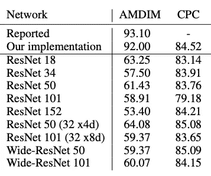

CIFAR-10 上的编码器鲁棒性

自 CPC 以来，每种方法都采用 ResNet-50。虽然我们可能还有更好的架构有待发明，但在 ResNet-50 上实现标准化意味着我们可以专注于改善其他特征，从而通过更好的培训方法而不是更好的架构来推动改进。

一个发现确实适用于每一次消融，**更宽的编码器**在对比学习中表现得更好。

# **特征 3:表示提取**

表征这些方法的第三种方式是通过它们用来提取表示的策略。这可以说是所有这些方法中“神奇”的地方，也是它们最不同的地方。

为了理解为什么这很重要，让我们首先定义一下我们所说的表示是什么意思。一个表示是一组**独特的特征**，允许系统(和人类)理解是什么制造了那个对象，那个对象，而不是一个不同的对象。

[这篇 Quora 帖子](https://www.quora.com/What-is-representation-learning-in-deep-learning)使用了一个尝试对形状进行分类的例子。为了成功地对形状进行分类，一个好的表示可能是在该形状中检测到的角的数量。

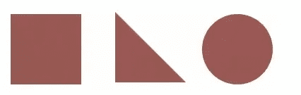

在这个对比学习方法的集合中，这些表征以不同的方式被提取出来。

**CPC**

CPC 引入了通过预测*潜在*空间中的“未来”来学习表征的思想。实际上，这意味着两件事:

1)将一幅图像视为一条时间线，过去在左上方，未来在右下方。

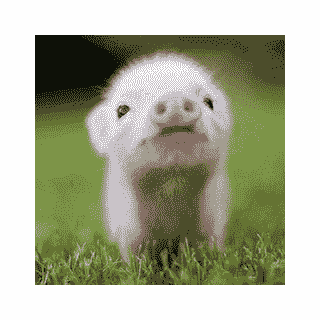

CPC“未来”预测任务

2)预测不会发生在像素级别，而是使用编码器的输出(即:潜在空间)

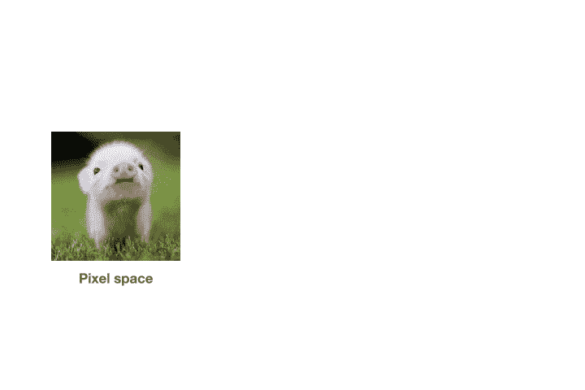

从像素空间到潜在空间

最后，通过使用编码器(H)的输出作为投影头(作者称之为上下文编码器)生成的上下文向量的目标来制定预测任务，来进行表示提取。

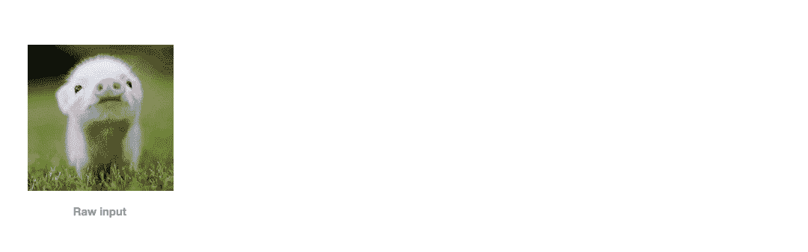

CPC 表示提取

在本文中，我们发现，只要数据扩充管道足够强大，这种预测任务是不必要的。虽然有很多关于什么是好的管道的假设，但我们认为，一个强大的管道会产生积极的配对，它们共享相似的全球结构，但具有不同的局部结构。

**AMDIM**

另一方面，AMDIM 使用从卷积神经网络(CNN)的中间层提取的特征图的视图间比较表示的思想。让我们把它分成两个部分，1)图像的多个视图，2)CNN 的中间层。

1)回想一下，AMDIM 的数据扩充管道生成同一图像的两个版本。

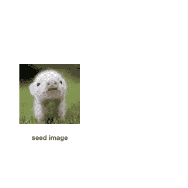

2)将每个版本传递到相同的编码器中，以提取每个图像的特征图。AMDIM 不会丢弃编码器生成的中间特征图，而是使用它们在*空间尺度*上进行比较。回想一下，当一个输入通过 CNN 的各层时，感受野对不同尺度的输入信息进行编码。

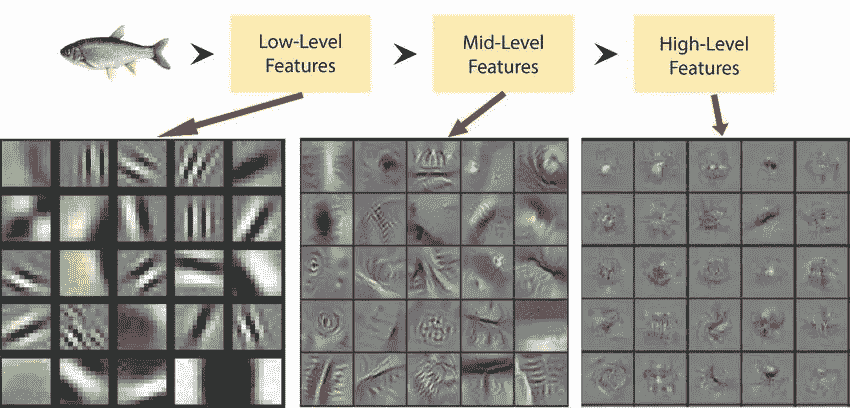

参考文献[【1】](https://arxiv.org/pdf/1311.2901.pdf)[【2】](https://www.researchgate.net/figure/Hierarchical-representation-learning-by-a-Convolutional-Neural-Network-where-the-initial_fig4_317558591)。

AMDIM 通过对 CNN 的中间输出进行比较来利用这些想法。下面的动画演示了如何对编码器生成的三个特征图进行比较。

**AMDIM 表示提取** : AMDIM 使用相同的编码器提取 3 组特征图。然后，它在特征地图之间进行比较。

这些方法的其余部分对 AMDIM 提出的想法进行了细微的调整。

**SimCLR**

SimCLR 使用与 AMDIM 相同的思想，但是做了 2 处调整。

a)仅使用最新的特征地图

b)通过投影头运行特征图，并比较两个向量(类似于 CPC 上下文投影)。

**Moco**

正如我们前面提到的，对比学习需要反面样本才能起作用。通常，这是通过将一批中的图像与一批中的其他图像进行比较来完成的。

Moco 做了与 AMDIM 相同的事情(仅使用最近的特征图)，但是保留了它所看到的所有批次的历史，并且增加了阴性样本的数量。其效果是，用于提供对比信号的阴性样本的数量增加，超过了单个批次的大小。

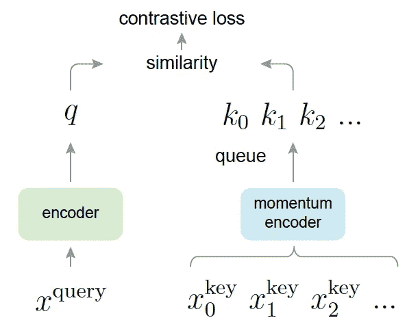

鸣谢:Moco 原创作者。([来源](https://github.com/facebookresearch/moco))

**BYOL**

使用与 AMDIM 相同的主要思想(但是只有最后的特性图)，但是有两个变化。

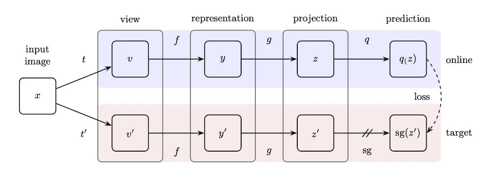

鸣谢:Deepmind ( [来源](https://twitter.com/deepmind/status/1272810643222126594)

1.  BYOL 使用两个编码器，而不是一个。第二个编码器实际上是第一个编码器的精确副本，但它不是在每次通过时更新权重，而是在滚动平均值上更新权重。
2.  BYOL 不使用阴性样本。而是依赖滚动权重更新作为向训练给出对比信号的方式。然而，[最近的一次消融](https://untitled-ai.github.io/understanding-self-supervised-contrastive-learning.html)发现这可能是不必要的，事实上添加批量标准化是为了确保系统不会生成琐碎的解决方案。

**Swav**

将他们的表示提取任务框定为“在线聚类”之一，其中他们强制“来自同一图像的不同增强的代码之间的一致性”【[参考](https://arxiv.org/pdf/2006.09882.pdf)】。因此，这与 AMDIM 的方法相同(仅使用最后的特征图)，但他们不是直接比较向量，而是计算一组 K 个预计算代码的相似性。

鸣谢:Swav 作者([来源](https://ai.facebook.com/blog/high-performance-self-supervised-image-classification-with-contrastive-clustering/))

在实践中，这意味着 Swav 生成 K 个簇，并且对于每个编码的向量，它与这些簇进行比较以学习新的表示。这项工作可以被视为混合了 AMDIM 和 [Noise 作为目标的思想。](https://arxiv.org/abs/1704.05310)

**特点 3，外卖**

这些方法的不同之处在于表示提取策略。然而，这些变化是非常微妙的，没有严格的消融，很难判断到底是什么驱动了结果。

从我们的实验中，我们发现 CPC 和 AMDIM 策略对结果的影响可以忽略不计，反而增加了复杂性。使这些方法起作用的主要驱动力是数据扩充管道。

# **特征 4:相似性度量**

我们可以用来比较这些方法的第四个特征是它们使用的相似性度量。以上所有方法都使用点积或余弦相似度。虽然我们的论文没有列出这些消融，但我们的实验表明，相似性的选择在很大程度上是无关紧要的。

# 特征 5:损失函数

我们用来比较这些方法的第五个特征是损失函数的选择。所有这些方法(除了 BYOL)都集中在使用 NCE 损失。NCE 损失有两部分，分子和分母。分子鼓励相似的向量靠近，分母推动所有其他向量远离。

如果没有分母，损耗很可能变成常数，因此所学的表示法将没有用。

然而，BYOL 不再需要分母，而是依靠对第二编码器的加权更新来提供对比信号。然而，如前所述，[最近的消融](https://untitled-ai.github.io/understanding-self-supervised-contrastive-learning.html)表明这实际上可能不是对比信号的驱动因素。

在本视频中，我以 SimCLR 为例，对 NCE 损耗进行了全面解释。

# 又一个 DIM(亚迪姆)

我们希望通过生成一种新的自我监督学习方法来展示我们框架的有用性，这种方法没有借口动机或涉及的表征提取策略。我们称这种新方法为另一种 DIM (YADIM)。

YADIM 的特点如下:

**特点一:数据增强管道**

对于 YADIM，我们合并了 CPC 和 AMDIM 的管道。

**特点二:编码器**

我们使用 AMDIM 的编码器，尽管任何编码器如 ResNet-50 也可以工作

**特征 3:表示提取**

亚迪姆策略很简单。对图像的多个版本进行编码，并使用最后的特征图进行比较。没有投影头或其他复杂的比较策略

**特征 4:相似性度量**

对于 YADIM，我们坚持点积

**特性 5:损失函数**

我们也使用 NCE 损失。

# YADIM 结果

尽管我们唯一有意义的选择是合并 AMDIM 和 CPC 的管道，但与其他方法相比，YADIM 仍然做得很好。

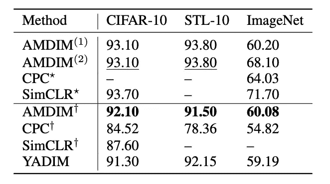

与所有相关的方法不同，我们通过实际实现每种方法来生成上面的结果。事实上，据我们所知，我们对 CPC V2 的实现是 DeepMind 之外的首次公开实现。

更重要的是，我们使用 PyTorch Lightning 来标准化所有实现，这样我们就可以客观地提炼出上述结果的主要驱动因素。

**计算效率**

上述方法是使用大量计算资源训练的。高昂的成本意味着我们没有进行严格的超参数搜索，而是简单地使用 STL-10 的超参数在 ImageNet 上进行训练。

使用 PyTorch Lightning 来有效地分配计算，我们能够通过 ImageNet 使用 16 位精度将一个时期降低到每个时期大约 3 分钟。

这些是我们用于每种方法的计算资源

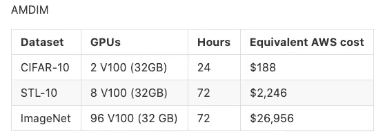

基于每小时 31.212 美元的 23dn . 24x 大型实例

基于每小时 31.212 美元的 23dn . 24x 大型实例

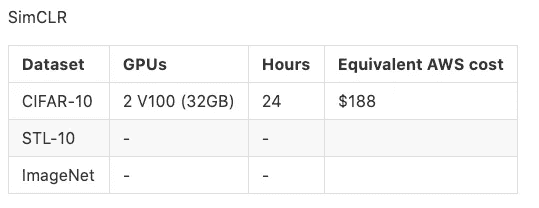

基于每小时 31.212 美元的 23dn . 24x 大型实例

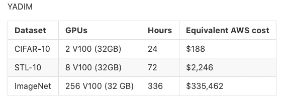

基于每小时 31.212 美元的 23dn . 24x 大型实例

# 关键要点

1.  我们引入了一个概念框架来比较和更容易地设计对比学习方法。
2.  AMDIM、CPC、SimCLR、Moco、BYOL 和 Swav 在细微方面彼此不同。主要的区别在于他们如何提取表示。
3.  AMDIM 和 CPC 介绍了其他方法使用的主要关键思想。SimCLR、Moco、BYOL 和 Swav 可以被视为 AMDIM 的变体。
4.  编码器的选择并不重要，只要它是宽的。
5.  只要数据扩充管道生成良好的正面和负面输入，表示提取策略就无关紧要。
6.  使用我们的框架，我们可以制定新的 CSL 方法。我们设计了 YADIM(另一个 DIM ),作为一个可以与竞争对手的方法相媲美的例子。
7.  训练这些方法的成本意味着世界上只有少数研究小组能够继续取得进展。尽管如此，我们以一种标准化的方式发布所有这些算法至少缓解了实现这些算法和验证这些实现的问题。
8.  由于大多数结果是由更广泛的网络和特定的数据增强管道驱动的，我们怀疑当前的研究路线可能有有限的改进空间。

# 感谢

正如我们在论文中提到的，我要感谢 CPC、AMDIM 和 BYOL 的一些作者进行了有益的讨论。

这项工作的大部分是在脸书人工智能研究所进行的。没有公平的计算资源，消融和长的训练时间是不可能的。

我还要感谢费尔和 NYU CILVR 的同事们，他们进行了有益的讨论，他们是 Stephen Roller、Margaret Li、Tullie、Cinjon Resnick、Ethan Perez、Shubho Sengupta 和 Soumith Chintala。

# PyTorch 闪电

此外，这恰好也是创建 [PyTorch Lightning](https://github.com/PyTorchLightning/pytorch-lightning) 的主要原因之一，PyTorch Lightning 是一种利用大量计算资源快速迭代想法的技术，而不会陷入训练这种规模的模型所需的所有工程细节中。

最后，我要感谢我的顾问 Kyunghyun Cho 和 Yann LeCun 在平行建造 PyTorch Lightning 的同时进行这项研究的耐心。