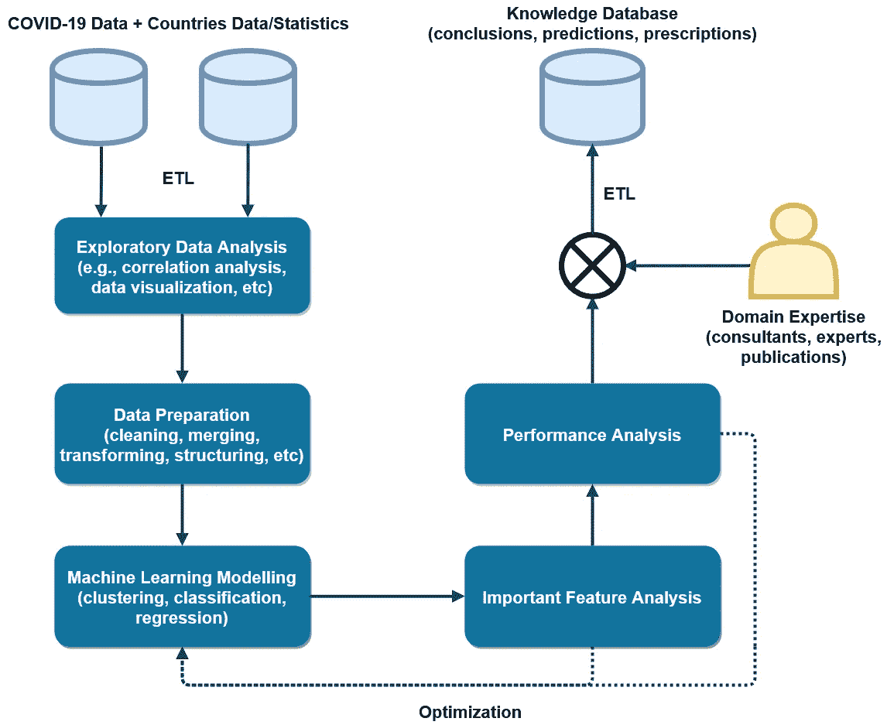

# 新冠肺炎数据的快速原型数据科学建模框架——民主化新冠肺炎相关数据科学和分析

> 原文：<https://towardsdatascience.com/a-framework-for-rapid-prototyping-data-science-modelling-of-covid-19-data-with-countries-cd8be3f35ad8?source=collection_archive---------59----------------------->

*[*项目的标志*](https://github.com/samarawickrama/COVID-19) *。**

# *介绍*

*新冠肺炎成为全球性的疫情，对人类生活的各个方面都产生了影响。由于这种感染正在迅速传播并危及人类生命，需要立即采取行动在社区一级预防这种疾病。到目前为止，每个国家都面临着新冠肺炎疫情和他们的统计数据显示更大的差异。为了有效应对新冠肺炎和类似的流行病，短期和长期的质量、因素和策略应该是什么还不是很明显[1，2]。*

*由于这是一个超越简单想象的多维挑战，数据科学是理解与新冠肺炎相关的数据的模式和趋势的有效策略。虽然数据科学是揭示洞察力的有效技术，但广泛的社区和专业人员目前依赖于开放的可视化框架，这些框架主要涵盖描述性分析技术。如果用户友好的开放数据科学框架可用，主题专家(SME)可以有效地采用和有效地解释对社会和人类利益的见解[3]。*

*这是一个利用国家统计数据快速构建新冠肺炎数据的数据科学模型的框架。这将有助于将大数据集与新冠肺炎数据联系起来，然后应用基于机器学习的高级建模技术。这有助于新冠肺炎相关数据科学和分析的民主化，并促进数据驱动的决策和创新。*

# *采纳框架*

*这个框架是使用[**Jupyter**](https://jupyter.org/)notebook 和 [**Python**](https://www.python.org/) 库开发的。用户可以通过安装 [**Anaconda**](https://docs.anaconda.com/anaconda/install/) 轻松安装 Jupyter 笔记本。可以使用任何支持 Jupyter notebook 的平台(例如 [AWS Sagemaker](https://aws.amazon.com/sagemaker/) )。**社区可以从**[**Github**](https://github.com/samarawickrama/COVID-19.git)**克隆/下载框架。***

# *数据集*

*为了演示该框架，使用了两个广泛使用的数据集。它们是:*

***1)** [***约翰霍普金斯大学(JHU)* 和 Worldometers.info 公开数据为新冠肺炎统计的国家**](https://ahmednafies.github.io/covid/)*

***2)** [***世界银行*公开各国数据和统计数据**](https://data.worldbank.org/)*

*这些数据以 Python 库的形式提供。用户可以通过导入库来访问这些数据。这些库有适当的 API 来访问数据。*

*以下是所用库的重要参考。*

 *[## 冠状病毒肺炎

### 编辑描述

ahmednafies.github.io](https://ahmednafies.github.io/covid/)*  *[## 欢迎阅读 wbdata 的文档！- wbdata 0.2.7 文档

### Wbdata 是一个简单的 python 接口，用于从世界银行的各种数据库中查找和请求信息，作为…

wbdata.readthedocs.io](https://wbdata.readthedocs.io/en/stable/)* * [## 世界银行数据

### 这是用 Python 实现的世界银行 API v2。使用此包探索世界发展…

pypi.org](https://pypi.org/project/world-bank-data/)  [## 冠状病毒肺炎

### Python 包来获得关于由约翰霍普金斯大学和…

pypi.org](https://pypi.org/project/covid/) 

然而，用户不希望局限于上述数据或库，因为有许多数据源可以轻松地与该框架集成。

# 方法学

该平台是使用[***【JHU】约翰霍普金斯大学*和 Worldometers.info 开放数据为新冠肺炎**](https://ahmednafies.github.io/covid/)**【4】和 [***世界银行*开放数据为各国**](https://data.worldbank.org/)【5】**进行演示的。**使用已发布的 Python 库将数据导入框架(如上一节所述)。**

**在 [***约翰霍普金斯大学(JHU)* 和 Worldometers.info 公开的新冠肺炎数据中，**](https://ahmednafies.github.io/covid/) 提供了与*确诊、活跃、康复和死亡病例相关的国家统计数据以及更新日期*。**

**另一方面， [***世界银行*各国公开数据**](https://data.worldbank.org/) 是一个通用和通用的数据集，提供与多个主题相关的多样化统计数据。它不是针对新冠肺炎危机开发的。该数据集包含与以下 21 个主题相关的国家统计数据。**

**世界银行数据集中与国家相关的主题**

**使用 Python 的 Jupyter notebook 有助于高效地探索和准备数据。在整个框架中，数据被作为 Pandas 数据帧来处理。根据需要使用 python[**matplotlib**](https://matplotlib.org/)和 [**seaborn**](https://seaborn.pydata.org/) 库来可视化和探索数据。由于世界银行数据集具有许多特征，因此需要探索性分析技术来有效地为精确建模准备数据。**

****

**新冠肺炎数据与国家数据/统计数据的快速原型数据科学建模框架。**

**该框架采用 [**LightGBM**](https://lightgbm.readthedocs.io/en/latest/) 基于梯度推进决策树的机器学习算法来设计和实现分类和回归模型。该算法在行业中被非常有效地用于结构化数据建模。它具有以下优点[6]:**

*   **训练速度更快，效率更高，**
*   **更低的内存使用率，**
*   **精确度更高，**
*   **支持并行和 GPU 学习**
*   **能够处理大规模数据。**

**一旦该模型被训练，该框架然后促进基于[**light GBM**](https://lightgbm.readthedocs.io/en/latest/)**算法的高等级特征的重要特征分析。这包括对[**【SHAP】(沙普利附加解释)**](https://shap.readthedocs.io/en/latest/) 库的改编，该库能够使用博弈论方法使用整合的功能来评估经过训练的机器学习模型[7]。这使得与假设相关的推理和处方成为可能。该框架还有助于评估培训和测试绩效。重要特性分析和性能分析阶段对于通过调整和重新训练模型来优化模型非常重要。****

# ****结论****

****已经发布了许多与新冠肺炎相关的研究数据，需要对这些数据进行快速分析，并向社区传达见解(即规定分析)，以改善健康和福祉。由于数据的高维度，围绕这一新冠肺炎数据分析的数据科学能力需要得到加强。这一提议的框架使得新冠肺炎数据与国家统计数据的数据科学模型快速原型化成为可能，从而有效地使新冠肺炎相关的数据科学和分析民主化。****

# *****未来工作*****

****许多数据集正在出现，如果以统一的方式对它们进行适当的分析，它们将增强知识。计划将以下数据集纳入提议的框架。****

**** [## 新冠肺炎资源

### 编辑描述

dataverse.harvard.edu](https://dataverse.harvard.edu/dataverse/2019ncov)  [## 数据集/新冠肺炎

### 冠状病毒疾病 2019(新冠肺炎)时间序列列出了确诊病例、报告的死亡和报告的恢复。数据…

github.com](https://github.com/datasets/covid-19)  [## 新冠肺炎冠状病毒数据资源中心

### 新冠肺炎数据中心新冠肺炎案件的数据是目前最重要的数据。这是我们看待事物的基础…

www.tableau.com](https://www.tableau.com/covid-19-coronavirus-data-resources)  [## 冠状病毒源数据

### 我们完整的新冠肺炎数据集是由我们的数据世界维护的新冠肺炎数据的集合。它每天更新…

ourworldindata.org](https://ourworldindata.org/coronavirus-source-data)  [## 新型冠状病毒(新冠肺炎)病例数据

### 自 2020 年 1 月 22 日以来的新型冠状病毒(新冠肺炎)流行病学数据。这些数据是由约翰·霍普金斯大学汇编的…

data.humdata.org](https://data.humdata.org/dataset/novel-coronavirus-2019-ncov-cases)  [## 新南威尔士州新冠肺炎数据

### 新南威尔士州政府提供了新南威尔士州新冠肺炎病例和测试的数据集。点击下面的链接访问…

data.nsw.gov.au](https://data.nsw.gov.au/nsw-covid-19-data)  [## 新冠肺炎开放研究数据集(CORD-19)

### 关于这个数据集的完整描述以及更新的信息可以在这里找到。作为对新冠肺炎的回应…

zenodo.org](https://zenodo.org/record/3727291#.Xq0HEpkRWUk) 

此外，**郊区一级的数据分析**正在通过整合国家的**人口普查数据进行规划。**

 [## 人口普查

### 普查地理基础如何使用统计地理进行普查输出的步骤

www.abs.gov.au](https://www.abs.gov.au/census)  [## 新南威尔士州新冠肺炎病例按位置-新冠肺炎病例按通知日期和邮编，当地卫生…

### URL…

data.nsw.gov.au](https://data.nsw.gov.au/data/dataset/covid-19-cases-by-location/resource/21304414-1ff1-4243-a5d2-f52778048b29)  [## Census.gov

### 人口普查局的使命是作为美国人口和经济的高质量数据的主要提供者。

www.census.gov](https://www.census.gov/) 

# 参考

[1]徐，b，Gutierrez，b，Mekaru，s .等.疫情流行病学资料，实时病例信息。 *Sci 数据* **7、** 106 (2020)。[https://doi.org/10.1038/s41597-020-0448-0](https://doi.org/10.1038/s41597-020-0448-0)

[2]董，e，杜，h .，，加德纳，L. (2020).实时跟踪新冠肺炎的交互式网络仪表板。*柳叶刀传染病*。[https://doi . org/10.1016/s 1473-3099(20)30120-1](https://doi.org/10.1016/S1473-3099(20)30120-1)

[3]卡拉汉·s·新冠肺炎是一个数据科学问题。模式。2020 年 4 月 7 日:100022。doi:10.1016/j . pattern . 2020.100022 .印刷前 Epub。PMCID: PMC7144860。
[https://www.ncbi.nlm.nih.gov/pmc/articles/PMC7144860/](https://www.ncbi.nlm.nih.gov/pmc/articles/PMC7144860/)

[4]数据集由约翰·霍普金斯大学和 world ometers . info
[https://ahmednafies.github.io/covid/](https://ahmednafies.github.io/covid/)提供

[5]世界银行公开数据
[https://data.worldbank.org/](https://data.worldbank.org/)

[6] LightGBM，https://github.com/microsoft/LightGBM
T4 灯光渐变增力机

[7]https://github.com/slundberg/shap[SHAP【SHapley Additive exPlanations】](https://github.com/slundberg/shap)*****