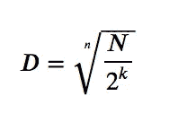
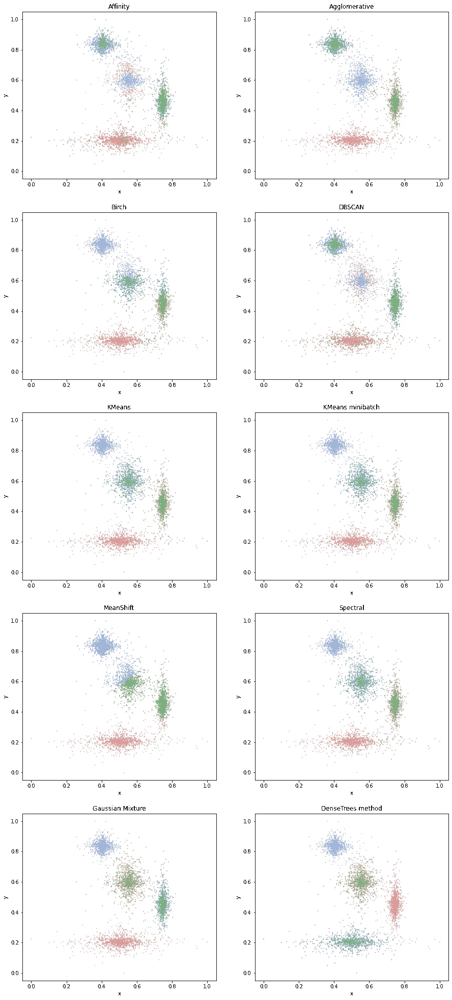
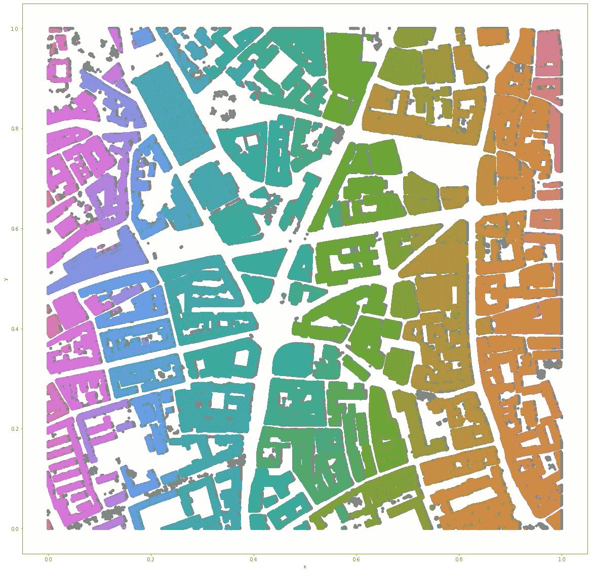

# 重新审视聚类算法

> 原文：<https://towardsdatascience.com/a-fresh-look-at-clustering-algorithms-c3c4caa1a691?source=collection_archive---------19----------------------->


吉列尔莫·费拉在 [Unsplash](/s/photos/cluster?utm_source=unsplash&utm_medium=referral&utm_content=creditCopyText) 上拍摄的照片

## [视频教程](https://towardsdatascience.com/tagged/video-tutorial)

## 深入研究一种新的聚类识别方法。

这个项目绝不是到了最后阶段。分享当前的想法，详细检查代码，获得一些反馈，看看是否值得进一步开发。出于对当前方法(至少是可通过标准库获得的方法)的失望，特别是所有主要方法的特殊性质，包括大众喜爱的 KMeans。我并不是说所提出的代码是以最有效的方式完成的，但是我确实努力做到了。如能提供改进建议，我们将不胜感激。

视频教程

## 设置问题

让我先介绍一下背景。由于 Medium 是一个博客平台，而不是一个科学研究的地方，所以我可以讲述这个故事，而不是以一种非常枯燥的形式呈现结果。如果这让你失望了，请原谅我——这基本上有点像“展示和讲述”。

几年前，我试图解决分析光栅文件的问题。如果您以前从未使用过这些工具，请查看我的地理空间冒险系列以了解更多详细信息:

[](/geospatial-adventures-step-5-leaving-the-flatlands-or-flying-over-the-sea-of-polygons-846e45c7487e) [## 地理空间冒险。第五步。离开平地或飞越多边形的海洋。

### 顾名思义，是时候让我们做一些真正酷的事情，用“激光”去飞行了。字面上。我们是…

towardsdatascience.com](/geospatial-adventures-step-5-leaving-the-flatlands-or-flying-over-the-sea-of-polygons-846e45c7487e) 

简而言之——这些是通过飞越你试图分析的区域，定期向其发射激光束并测量响应而获得的高度数矩阵。得到的矩阵可用于提取关于表面上各种物体的信息。这些物体可以是任何东西，从山和树到建筑物和桥梁。我对提取建筑物信息特别感兴趣，这意味着我有密集点的集合，我需要将它们解释为多边形。如果你在田野中间有一座孤零零的独立建筑——这很容易，你所要做的就是应用现成的凸包算法(来自 shapely library)。同样，如果你是这方面的新手——看看我的初级读本[这里](/geospatial-adventures-step-1-shapely-e911e4f86361)。但是如果我们着眼于一个人口密集的城市中心区域呢？

我最终通过编写一个自定义聚类算法来解决这个问题，该算法基本上将表示建筑物的点集合视为一个图形，其中每个节点(我们的栅格像素)都连接到它的近邻，如果它们满足高度标准的话。识别建筑物多边形的问题基本上是通过计算不连通图，然后对它们应用凸包来解决的。

现在，随着 COVID 危机的到来，我在找工作时有了大量的空闲时间，我认为重新审视这个问题并推广算法是一个好主意。我在这里展示的是结果。

唷…这是一个很长的介绍。让我们开始吧。

聚类的一个基本问题是，我们真的很擅长直观地判断它，但我们很少考虑它的机制。因此，很容易就能找到迷惑不经意的观察者得出错误结论的方法。如果我放大 2D 图上的一组点——我可以说它们是均匀分布的，如果我缩小——它们看起来像一个集群。所以从一开始，我们就需要定义问题的尺度，这将是驱动模型的主要参数之一。

最简单的方法是在我们的问题空间中定义一个基本单元的大小。如果这是一个简单的 2D，这意味着我们在包含该数据集的边界正方形中展开数据集中的所有点，并在每个点周围绘制正方形单元。如果我们在谈论一个更复杂的 n 维问题，例如 word2vec 文本表示的集合，这将是 n 维空间中的一个单位体积单元。当您看不到数据的图形表示时，很难识别数据的分组，因此拥有定义比例的正确方法非常重要。如果你有分类变量，它们总是可以简化为一组二进制变量(1/0 ),或者如果你想在它们之间建立一些有意义的关系，你可以选择一个使用实数的更复杂的版本。在任何情况下，每个维度所需的单元/分区数量的近似值可以构建为:



其中 *N* 是数据集中点(向量)的数量， *n* 是维度(连续变量)的数量， *k* 是分类变量的数量。我在这里假设分类变量减少到只有 1/0。

这个数字背后的直觉是:大大超过它将导致分割太小，因此除非聚类非常明显，否则您将无法检测到它。明显低于这个值会有使单元格变得太大的风险，以至于您只是掩盖了数据中的任何不规则性。在我的建筑物问题示例中，这一点特别重要，因为为了检测所有的建筑物，我们希望划分的数量比临界数量少很多。这是因为我们的点之间的距离在任何地方都是相同的，改变的是它们的类型(它们的高度轮廓)。最终，我们使划分足够大，以包括两层相邻的点。

为了这篇文章的目的，我不打算处理多维度的问题，我可能会在其他时间回来。这里给出的代码应该能够处理它们，如果您想包含分类变量，只需做一些小的修改。毕竟这里的目的是论证原理。

## 该算法

给你一个我们正在做的事情的浓缩的、简单的版本:

1.  对数据进行归一化，这样每个变量现在都在 0 到 1 的区间内。
2.  将每个变量乘以 D，取整数部分。通过将每个点放入特定的网格单元中，这有效地标准化了每个点。
3.  计算每个格网像元中的点数，并丢弃点数低于特定阈值的像元。这是我们将要传递到模型中的另一个重要参数。在这个实现中，我看到了特定的百分位数，但它可以由任意数字驱动。
4.  得到的结构可以表示为树的集合(或者更确切地说是图，但是让我们用树来滚动),我们所要做的就是运行广度优先搜索(BFS)算法来计算不相连树的实例，以识别我们的聚类。
5.  最后，一旦识别出主要聚类，由于其细胞没有超过阈值而被遗漏的点需要被归属。这里，我在 main 函数之外通过计算到已识别的簇的质心的最小距离来做这件事。这不是唯一的选择，我相信也不是最好的选择。虽然它现在已经够用了。)实现起来简单快捷。

好了，让我们言归正传。

让我们从创建一个将要使用的虚拟数据集开始。在这篇文章的最后，我还将分享通过 scikit 的一些标准聚类算法运行这个数据集的比较结果。

加载我们需要的库:

```
import numpy as np
import pandas as pd
import matplotlib.pyplot as plt
import seaborn as sns
pd.plotting.backend='seaborn'
import time
import itertools
```

大部分时间我会尽量避免使用熊猫，它会在我们设置的最开始使用，然后在最后帮助观想和保持所有东西在一个地方。在大部分内容中，我们将使用 numpy 数组、列表和字典。保持简单(并对性能有所帮助)。顺便说一句，我已经使用 numba 和 cython 进行了代码加速，但我对结果并不满意，所以我们暂时将它们放在一边。

Matplotlib 和 Seaborn 实现可视化，也使用 Seaborn 作为熊猫的后端。使用时间模块来比较性能，并使用 itertools 来避免循环(至少以显式 python 形式)。

数据集:

本质上，这是四个集群，每个集群的中心点很好地聚集在一起，加上一些基本的拉伸，所以它们看起来不太规则。它们最终也会有些重叠，所以看看我们如何处理这些情况会很有帮助。

我们将使它们正常化:

现在继续想象:

```
plt.figure(figsize=(10, 10))
sns.scatterplot(ttf.x, ttf.y, alpha=0.5)
```


太好了。

在我们的例子中，细胞的数量可以计算为:

```
D = int(np.sqrt(len(ttf_norm)))
tolerance = 50
```

这就给出了 D=63。因此，我们可以使用的模型参数将是 D = 60(只是一个很好的整数)，我们将在每个像元的点数(容差)方面寻找第 50 个百分位数。一般来说——容差的选择取决于我们的数据分布的好坏。如果无法通过视觉或其他方式进行检查，那么在不同的容差级别运行模型并查看不同级别找到了多少个聚类以及哪个结果最有意义(最稳定)不失为一个好主意。

我们还将把输入数据集转换成一个 numpy 数组。在这种情况下，它将只有两列，如果有更多的维度/变量，它将有更多。

```
X = ttdf_norm[['x', 'y']].values
```

好了，我们准备好了。我会一步一步来。

1.  缩放和离散化:

```
Xint = (X * D).astype(int)
```

2.为每个单元格创建字符串 id:

```
Xstr = np.apply_along_axis(
        ''.join,
        1,
        np.char.zfill(
            Xint.astype(str),
            len(str(D))
        )
    )
```

这里发生的事情是，我们将每个坐标转换成一个字符串，然后用前面的零填充它，这样每个零的长度都与代表划分数(D)的字符串的长度相同。最后一步，将它们合并成一个 ID。我以这种方式创建 id 的原因是，这使我能够找到每个单元的最近邻居，而不必在大型数组中进行昂贵的查找，我可以从当前 id 中推断出它们的 id。

3.使用所有单元格的出现频率计数创建字典。简单如:

```
unique, counts = np.unique(Xstr, return_counts=True)
tree = dict(zip(unique, counts))
```

4.计算阈值:

```
mincount = int(
        np.percentile(
            np.array(
                list(
                    tree.values()
                )
            )[
                np.array(
                    list(tree.values())
                ) >1
            ],
            tolerance
        )
    )
```

这一个有点忙，所以让我们看看是怎么回事。我们正在用树中的所有值创建一个 numpy 数组，并丢弃所有只有一点或更少的值。我们不希望这些影响百分点太多，因为它们不会带来任何价值。在得到的数组中，我们计算与我们的公差变量设置的百分比相对应的值。最简单的情况 50%对应中值。

5.修剪树木:清除所有低于最小数量的东西。使用简单的字典理解:

```
tree = {k: v for k, v in tree.items() if v > mincount}
```

顺便提一下——在玩 *numba.jit* 的时候，我不得不用一个简单的 python *来代替循环*(当我这么做的时候，我的心都流血了)——因为 numba 在当前的实现中不能处理 list/dict 理解。现在，考虑一下这个——使用 numpy 数组作为键和值，可以完全不使用循环来完成这个任务。这应该会使代码更快，尽管这不是主要的瓶颈，所以这不会实质性地改变计算时间。

主要部分已经完成了。留给我们的是一个字典，其中的键对应于所有有意义的单元格，需要对这些单元格进行计数。

本质上，我们需要对这些进行广度优先搜索。这意味着我们将从我们的树中选择一个随机 id，将其标记为已访问，并将其所有邻居分配到“tocheck”列表(经典实现中的队列)，然后我们从“tocheck”列表中选择任何值，并重复相同的过程。在经典实现中，这需要是来自“tocheck”的第一个值，因此使用了队列，但是，在我们的例子中，我们必须遍历所有的队列，所以顺序并不重要。一旦我们用完了‘to check’列表中的条目，我们就完成了第一棵树。我们可以将它分配给第一个集群，并从原始列表中选取下一个 id。

我不打算在这里讨论具体的实现细节，因为这不是特别新颖或有趣——我仍然试图让它更快，因为这是花费时间最多的地方。然而，我将向您展示邻居选择，因为这部分不是微不足道的(尤其是没有循环)。

首先，我们为坐标生成位移列表。我们正在寻找所有最近的邻居。在 2D 的例子中，是 9 个点(包括原点，在 3D 中是 27 个点，以此类推。我们需要能够在 x 定义的任意数量的维度上进行转换。这就是 itertools 派上用场的地方。

```
l = list(itertools.product([-1, 0, 1], repeat=Xint.shape[1]))
l=list(map(list, l))
l.remove([0] * Xint.shape[1])
```

这里发生的是——首先我们在 X 矩阵的水平维度上创建-1、0 和 1 的所有可能排列(在我们的例子 2 中，因为我们只有 2 个变量)。

这些是以元组的形式返回的，所以我们需要将它们转换成列表——这是第二行的工作。

最后一步——我们去掉零点漂移，因为它对我们没用。

结果如下:

```
[[-1, -1], [-1, 0], [-1, 1], [0, -1], [0, 1], [1, -1], [1, 0], [1, 1]]
```

现在，让 ***lD*** 作为我们的 *D* 参数的字符串表示长度，并且***id****作为我们试图寻找邻居的单个 id。我知道，使用 id 会更合理，但是 Python 有优先权，所以我们不得不用 *ids* 代替。*

```
*nbrs = np.array(
            [
                list(
                    [
                        int(
                            ''.join(
                                list(ids)[i * lD: (i + 1) * lD]
                            )
                        ) for i in range(len(l[0]))
                    ]
                )
            ] * len(l)
        ) + np.array(l)*
```

*好了，这里发生了很多事情，现在来分解一下:获取一个字符串列表——将它转换成组成它的字符列表。然后，我们获取列表中元素数量对应于 D 参数( *lD* )长度的部分，并使用 join 将它们粘合成字符串。完成后，我们再次将它们转换为整数值，这就给出了 X 矩阵中相应行的副本，也就是说，所有变量都对应于这个晶胞。然后，我们复制这个列表，复制的次数与我们试图达到的邻居数量一样多(T2 列表中重音的数量)。最后一步-将结果列表和应力列表转换为 numpy 数组，并将它们相加。这给了我们元素的总和，因此所有邻居的坐标。注意，这对于任意数量的变量都适用，所以这对于 n 维向量来说是很好的。当进入大量变量时，问题可能会出现，但我们现在不用担心这个。*

*最后，我们重复到 ids 的转换:*

```
*nbrs = np.apply_along_axis(
            ''.join,
            1,
            np.char.zfill(
                nbrs.astype(str),
                lD
            )
        )*
```

*瞧，我们有了邻居的身份证。剩下的就是快速检查我们以前没有访问过它们，并且它们确实属于被识别的树。*

*听着，妈，不要“循环”！！！*

*环境资源管理（Environmental Resources Management 的缩写）..实际上有一个列表理解，尽管它很短。但是，如果你找到了一种不用它的方法，请告诉我！*

*一旦我们数完树，我们差不多就完成了。我们所要做的就是将我们遗漏的单位细胞进行属性化，然后标记出相应的点。*

## *来看图吧！*

*是时候将运行我们函数的结果与标准聚类方法进行比较了。如果你想回顾后者，[这里有一个非常好的帖子](https://machinelearningmastery.com/clustering-algorithms-with-python/)，有一大堆——10 个！*

*事实上，我们将在我们的数据集上运行所有这些方法(除了光学方法，因为它是垃圾)，然后将它们与这里描述的方法进行比较(我称之为 DenseTrees，因为我们正在使用树结构寻找高密度区域)。*

*只是给你一个快速的例子来运行它*

*加载模型:*

```
*import sklearn
from sklearn.cluster import AffinityPropagation
model = AffinityPropagation(damping=0.9)*
```

*并运行拟合:*

```
*%%time
model.fit(X)*
```

*第一行是获取执行时间。*

*最后一步*

```
*ttf_norm['Affinity'] = model.predict(X)*
```

*在我的笔记本电脑上，这种特殊的方法耗时最长——大约 21 秒。*

*其他人也一样。我对驱动它们的参数进行了一些调整，以获得最佳结果。就亲和力而言，这并没有多大帮助。*

*我必须强调的是，一些方法——k means(直线和迷你批次)、Spectral、Gaussian mixture、Agglomerative 和 Birch——都将聚类数作为输入，这在某种程度上违背了目的。在应用集群之前，您必须知道集群的数量。事实上，我们可以直接丢弃它们，因为它们对我们将要尝试和解决的任何有趣的问题都没有用。让我们把它们留在里面，只是为了练习。*

*策划:*

**

*可以看到 MeanShift，Birch，DBSCAN，Affinity 都表现很差。顺便说一句，DBSCAN 在获得正确的参数方面特别复杂，甚至到了这一步。高斯混合看起来是最好的。我们的 DenseTrees 方法与 KMeans 方法表现相当。如果我们改变第二条路径的属性，我们可能会得到和 GM 一样好的结果(事实上我们可以使用 GM 进行最终的属性)。顺便说一句，高斯混合比 DenseTrees 快 6 倍，所以也有一些改进的空间(我们仍然用 300 毫秒做得很好——第六快)。这里的主要结论是——我们已经超越了每一个没有将聚类数作为输入的算法，而且我们离最好的算法也不远了。不算太寒酸。*

## *最后一个音符*

*我确实提到了从栅格文件中识别建筑物的问题，这是它的灵感来源，所以不展示该算法在数据集上的表现是很遗憾的。*

*只是给你一些背景。经过一些过滤和清理后，绘制成散点图的光栅文件如下所示:*

**

*给那些知道这是哪里的人额外的荣誉。*

*这些只是标绘在标准尺度上的点。任何低于 10 米的都被设置为零。你几乎可以看到我们在网里抓到了一些树。不幸的是，我们对此无能为力。至少现在是这样。这个正方形具有 2000×2000 的分辨率(总共 4mln 数据点)，每个像素对应于 0.5m×0.5m 的正方形。我们必须非常细致地捕捉建筑之间的空隙，所以为了处理这个，我使用了 D=500 和 10%的容差。注意，这个临界值太大了，因为所有点都是均匀分布的。在我的笔记本电脑上，这花了大约 5 个小时来处理。不太好。最初为 2D 优化的算法花了大约半个小时，所以肯定有很大的改进空间。*

*该算法返回 247 个聚类。在这里，他们都是彩虹色的荣耀:*

**

*你可以看到，无论如何，我们在树木方面都很幸运——所有的灰点都被遗漏了。对于这个问题，不需要额外的属性步骤，这就是为什么我把它从主函数中去掉了。*

*今天到此为止。期待大家的批评和建议。*