# 文本聚类的友好介绍

> 原文：<https://towardsdatascience.com/a-friendly-introduction-to-text-clustering-fa996bcefd04?source=collection_archive---------0----------------------->

## 用于聚类单词和文档的大量方法乍一看似乎令人不知所措，但是让我们仔细看看。

本文涉及的主题包括 k-means、brown 聚类、tf-idf、主题模型和潜在 Dirichlet 分配(也称为 LDA)。

# 聚集，还是不聚集

聚类是数据科学中最大的主题之一，如此之大，以至于你会很容易地找到大量的书籍讨论它的每一个细节。文本聚类子课题也不例外。因此，本文无法提供详尽的概述，但它涵盖了主要方面。话虽如此，让我们从什么是集群和什么不是集群的共同点开始。

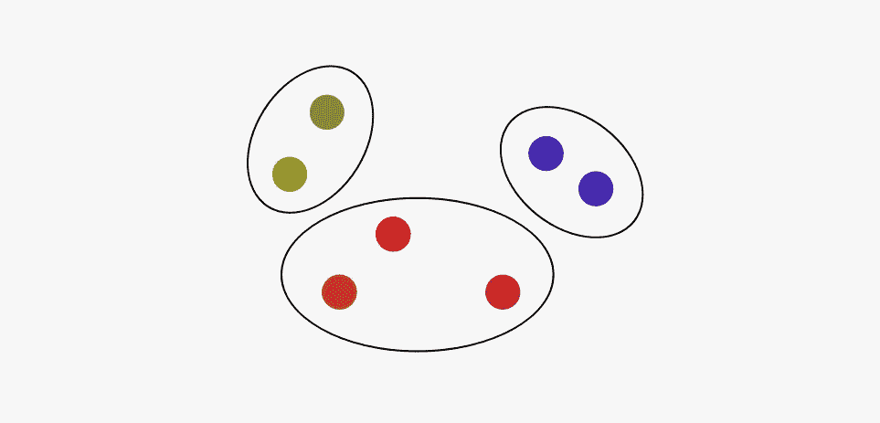

你刚刚按簇滚动了！

> 事实上，集群只不过是包含相似对象的组。聚类是用于将对象分成这些组的过程。

集群中的对象应该尽可能相似。不同集群中的对象应该尽可能不同。但是谁来定义“相似”的含义呢？我们将在以后的某个时刻回到这个问题上来。

现在，你可能听说过**分类**。在对对象进行分类时，您也可以将它们归入不同的组，但是有一些重要的区别。分类意味着将新的、以前未见过的对象根据已知的对象分组，即所谓的训练数据。这意味着我们有可靠的东西来比较新对象——当集群化时，我们从空白画布开始:所有对象都是新的！因此，我们称分类为**监督的**方法，聚类为**非监督的**方法。

这也意味着对于分类来说，正确的组数是已知的，而在聚类中没有这样的数目。请注意，它不仅仅是未知的——它根本就不存在*。根据我们的目的选择合适数量的簇是由我们决定的。很多时候，这意味着尝试几个，然后选择一个提供最好结果的。*

# 聚类方法的种类

在我们深入研究具体的聚类算法之前，让我们首先建立一些描述和区分它们的方法。有几种方法可以做到这一点:

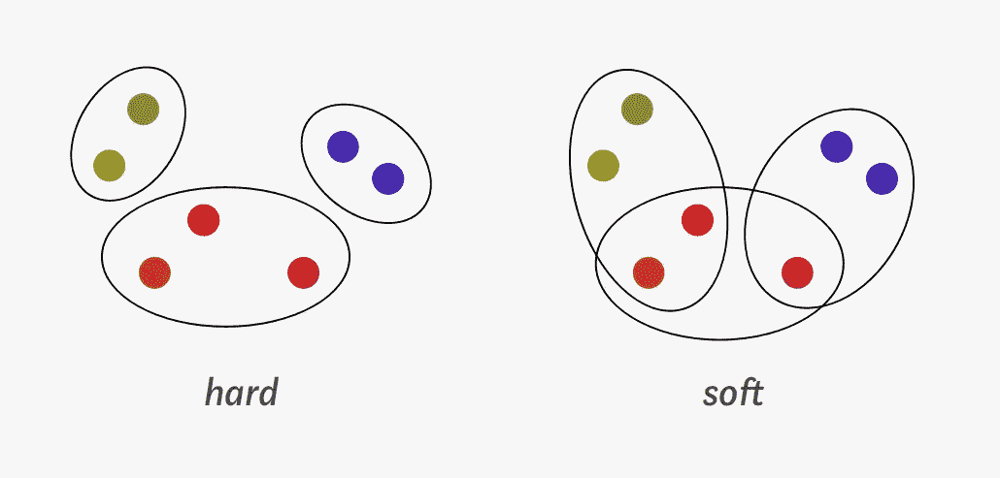

在**硬** **聚类**中，每个对象都属于*恰好一个*聚类。在**软** **聚类**中，一个对象可以属于*一个或多个*聚类。成员资格可以是部分的，这意味着对象可能属于某些集群多于属于其他集群。

在**分层聚类**中，聚类以分层的方式迭代组合，最终在一个根中结束(或者超级聚类，如果你愿意的话)。您也可以将分层聚类视为一棵二叉树。所有不遵循这一原则的聚类方法都可以简单地描述为**扁平聚类**，但有时也被称为*非分层*或*划分*。通过在您选择的级别上水平“切割”树，您总是可以将分层聚类转换为平面聚类。

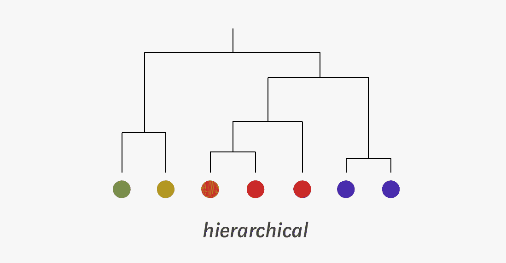

层次聚类的树形图称为树状图。在较低层次上连接的对象比在树的较高层次上连接的对象更相似。

分层方法可以进一步分为两个子类别。**凝聚**(“自下而上”)方法首先将每个对象放入自己的集群，然后不断统一它们。**分割**(“自顶向下”)方法则相反:它们从根开始，一直分割下去，直到只剩下单个对象。

# 聚类过程

应该很清楚聚类过程是什么样子的吧？你得到一些数据，应用你选择的聚类算法，然后，你就完成了！虽然这在理论上是可能的，但通常不是这样。尤其是在处理文本时，在聚类之前和之后，您必须采取几个步骤。在现实中，文本聚类的过程往往是混乱的，并且有许多不成功的尝试。但是，如果您试图以理想化的线性方式绘制它，它可能看起来像这样:

相当多的额外步骤，对吗？不要担心——无论如何，凭直觉你可能已经做对了。但是，单独考虑每一步是有帮助的，并且要记住可能存在解决问题的备选方案。

# 聚类单词

恭喜你！你已经通过了介绍。在接下来的几个段落中，我们将看看**单词**的聚类方法。让我们来看看下面这组照片:

对我们来说，哪些单词应该放在一起马上就变得很明显了。显然应该有一个包含单词*土豚*和*斑马*的动物集群，以及一个包含副词上的*和*下的*的集群。但是对于一台计算机来说同样明显吗？*

当谈到意思相近的单词时，你经常会读到语言学中的**分布假设**。这一假设认为，具有相似意义的词会出现在相似的语境中。你可以说“这个盒子在架子上”，而且还“盒子是在下面的*架子上”并且仍然产生一个有意义的句子。*上的*和*下的*在一定程度上可以互换。*

当创建**单词嵌入**时，利用该假设。单词嵌入将词汇表中的每个单词映射到一个 n 维向量空间。具有相似上下文的单词将大致出现在向量空间的相同区域。其中一个嵌入是由[韦斯顿，拉特&科洛伯特](http://www.thespermwhale.com/jaseweston/papers/deep_embed.pdf)在 2008 年开发的。你可以在这里看到单词 vectors 的一个有趣片段(用 [t-SNE](https://lvdmaaten.github.io/tsne/) 减少到二维):

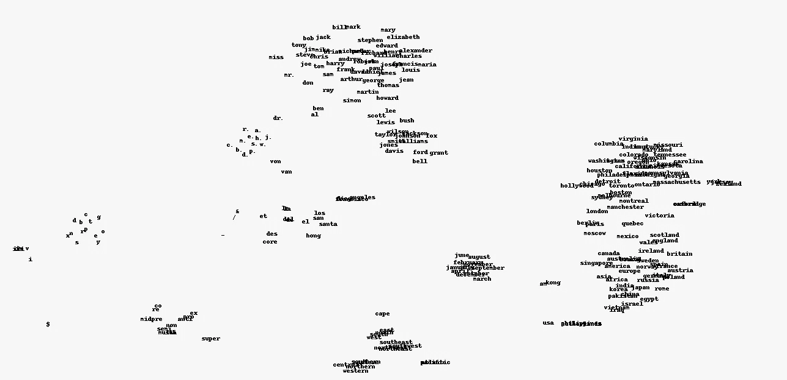

来源:[约瑟夫·图瑞安](https://medium.com/u/7e39eaa18a9d?source=post_page-----fa996bcefd04--------------------------------)，看全图[这里](http://www.cs.toronto.edu/~hinton/turian.png)

请注意月份、姓名和地点是如何整齐地组合在一起的。这将在下一步对它们进行聚类时派上用场。要了解更多关于单词嵌入到底是如何创建的以及它们的有趣特性，请看一下由 [Hunter Heidenreich](https://medium.com/u/66c914ddeac8?source=post_page-----fa996bcefd04--------------------------------) 撰写的[这篇文章。它还包括关于更高级的单词嵌入的信息，如](/introduction-to-word-embeddings-4cf857b12edc) [word2vec](/introduction-to-word-embedding-and-word2vec-652d0c2060fa) 。

# k 均值

我们现在来看看最著名的基于向量的聚类算法:k-means。k-means 所做的是为每个对象返回 k 个可能聚类之一的聚类分配。概括一下我们之前学到的，这是一种**硬的、平坦的聚类**方法。让我们看看 k-means 过程是什么样子的:

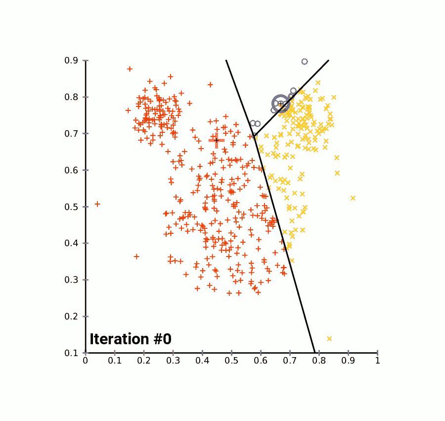

来源: [Chire](https://commons.wikimedia.org/wiki/File:K-means_convergence.gif) ，via [维基百科](https://en.wikipedia.org/wiki/K-means_clustering)

K-means 在向量空间中分配 k 个随机点作为 k 个聚类的初始虚拟平均值。然后，它将每个数据点分配给最近的聚类平均值。接下来，重新计算每个聚类的实际平均值。基于均值的偏移，数据点被重新分配。这个过程不断重复，直到聚类的均值停止移动。

为了更直观、更形象地理解 k-means 的功能，请观看 Josh Starmer 制作的[短片。](https://www.youtube.com/watch?v=4b5d3muPQmA)

k-意味着它不是唯一的基于向量的聚类方法。其他经常使用的方法包括 [DBSCAN](/how-dbscan-works-and-why-should-i-use-it-443b4a191c80) ，这是一种有利于人口密集的聚类的方法，以及期望最大化(EM)，这是一种假设每个聚类的潜在概率分布的方法。

# 棕色聚类

也有用于聚类单词的方法，这些方法不要求单词已经作为向量可用。可能引用最多的这种技术是布朗聚类，由[布朗等人](http://aclweb.org/anthology/J/J92/J92-4003.pdf)于 1992 年提出(与[布朗文集](https://en.wikipedia.org/wiki/Brown_Corpus)无关，该文集以罗德岛布朗大学命名)。

布朗聚类是一种**层次聚类**方法。如果在树中的正确位置切割，还会产生漂亮、扁平的簇，如下所示:

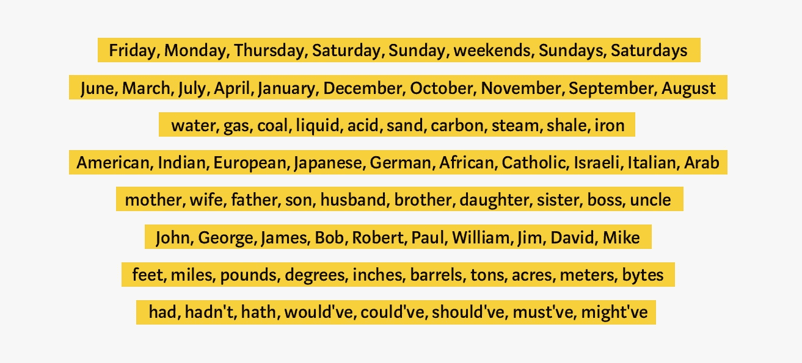

改编自:[布朗等人(1992)](https://www.aclweb.org/anthology/J92-4003.pdf)

您还可以查看小的子树，找到包含接近同义词的词对的簇，如*评估*和*评估*或*对话*和*讨论*。

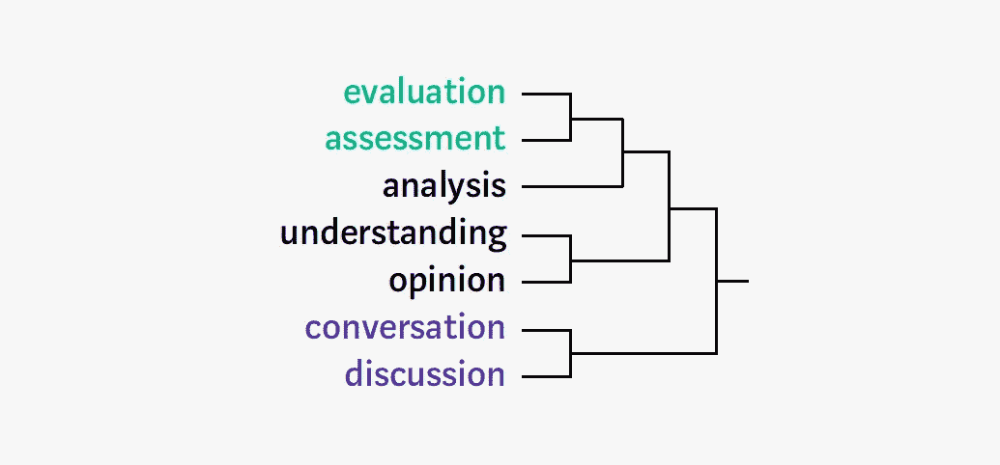

改编自:[布朗等人(1992)](https://www.aclweb.org/anthology/J92-4003.pdf)

这是如何实现的？同样，这种方法依赖于分布假设。它引入了一个质量函数，该函数描述了周围的上下文单词如何预测当前聚类中单词的出现(所谓的[互信息](https://en.wikipedia.org/wiki/Mutual_information))。然后，它遵循以下过程:

1.  通过将每个单词分配给它自己的唯一的簇来初始化。
2.  **直到只剩下一个聚类**(根)**:**合并产生的并集具有最佳质量函数值的两个聚类。

这就是为什么*评估*和*考核*合并这么早的原因。由于两者出现在极其相似的上下文中，上面的质量函数仍然提供了一个非常好的值。我们从逐渐统一的单元素簇开始的事实意味着这个方法是**凝聚的**。

布朗聚类沿用至今！在 Owoputi 等人(2013)的[出版物中，布朗聚类被用于在在线会话语言中寻找新的词簇，这些词应该有自己的词性标签。结果有趣而准确:](https://www.aclweb.org/anthology/N13-1039.pdf)

来源: [Owoputi 等人(2013 年)](https://www.aclweb.org/anthology/N13-1039.pdf)

如果你有兴趣了解更多关于布朗聚类是如何工作的，我强烈推荐你观看哥伦比亚大学迈克尔·科林斯的讲座[。](https://www.youtube.com/watch?v=Qes3YkDUI98&list=PLlQBy7xY8mbLLALDjL2R-r2dxV42IABP1&index=1)

虽然这一段总结了我们关于单词聚类的部分，但是还有很多方法没有在本文中讨论。一种非常有前途和有效的单词聚类方法是基于图的聚类，也称为**谱聚类**。使用的方法包括基于最小生成树的聚类、马尔可夫链聚类和汉语耳语。

# 聚类文档

一般来说，聚类**文档**也可以通过查看矢量格式的每个文档来完成。但是文档很少有上下文。你可以想象在一个整洁的书架上，一本书挨着其他书，但通常这不是大量数字文档(所谓的**语料库**)的样子。

对文档进行矢量化的最快(也可以说是最简单的)方法是给字典中的每个单词指定自己的向量维数，然后统计每个单词和每个文档的出现次数。这种不考虑词序的方式被称为单词袋方法。《牛津英语词典》包含 30 多万个主要词条，还不包括同形异义词。这是一个很大的维度，其中大部分可能会得到零值(或者你多久会读到一次*无精打采的*、 *peristeronic* 和*业余爱好者*？).

在一定程度上，您可以通过删除文档集合(语料库)中不使用的所有单词维度来抵消这一点，但最终仍会有很多维度。如果您突然看到一个新文档包含一个以前没有使用过的单词，您将不得不更新每一个文档向量，添加这个新的维度和它的零值。因此，为了简单起见，让我们假设我们的文档集合没有增长。

# tf-idf

看看下面的玩具示例，它只包含两个短文档 d1 和 d2 以及生成的单词向量包:

你可以看到，不太具体的词，如 *I* 和 *love* ，与实际识别两个文档的词，如 *pizza* 和*chocolate*获得相同的值。抵消这种行为的一种方法是使用 **tf-idf** ，这是一种数字统计，用作加权因子来抑制不太重要的单词的影响。

Tf-idf 代表术语频率和逆文档频率，这两个因子用于加权。**词频**就是一个单词在特定文档中出现的次数。如果我们的文档是*“我爱巧克力和巧克力爱我”*，单词*爱*的术语频率将是两个。该值通常通过除以给定文档中的最高词频来归一化，从而得到介于 0(对于文档中未出现的单词)和 1(对于文档中最频繁出现的单词)之间的词频值。术语频率是按单词和文档计算的。

另一方面，**逆文档频率**仅按单词计算。它表示一个单词在整个语料库中出现的频率。这个值通过取它的对数来求逆。还记得我们想要摆脱的那个无处不在的单词吗？由于一的对数是零，它的影响就完全消除了。

基于这些公式，我们为我们的玩具示例获得以下值:

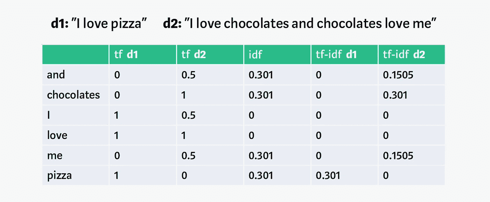

看最后两列，我们看到只有最相关的词得到高 tf-idf 值。所谓的**停用词**，意思是在我们的文档集合中普遍存在的词，得到的值等于或接近于 0。

接收到的 tf-idf 向量仍然与原始单词包向量一样高维。因此，诸如潜在语义索引(LSI)之类的降维技术经常被用来使它们更容易处理。k-means、DBSCAN 和 EM 等算法也可以用于文档向量，就像前面描述的单词聚类一样。可能的距离度量包括欧几里德距离和余弦距离。

# 潜在狄利克雷分配

通常，仅仅拥有文档簇是不够的。

> **主题建模**算法是一种统计方法，通过分析原文的词语来发现贯穿其中的主题，这些主题之间是如何相互联系的，以及它们是如何随时间变化的( [Blei，2012](http://www.cs.columbia.edu/~blei/papers/Blei2012.pdf) )。

所有主题模型都基于相同的基本假设:

*   每个文件都包含一个分布在**主题**上的文件，并且
*   每个主题由一个单词分布组成。

除了概率潜在语义分析(pLSA)等其他主题模型之外，**潜在狄利克雷分配** (LDA)是最著名和使用最广泛的一种。只要看看它的名字，我们就已经可以了解它的工作原理了。

**潜在**是指隐藏变量，**狄利克雷**分布是相对于其他概率分布的概率分布，**分配**是指基于两者分配一些值。为了更好地理解这三个方面是如何发挥作用的，让我们看看 LDA 给出了什么结果。下面的主题是从《科学》杂志的 17000 篇文章中选取的 100 个主题。

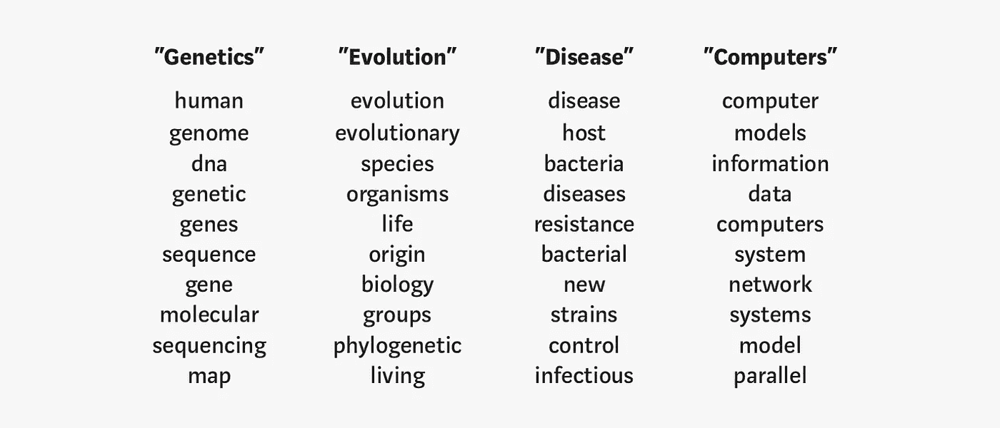

改编自:[博莱(2012)](http://www.cs.columbia.edu/~blei/papers/Blei2012.pdf)

你应该如何解读这些话题？一个**题目**是单词的概率分布。有些词在一个话题中出现的可能性比较大，有些则比较少。上面你看到的是每个话题最常出现的 10 个词，不包括停用词。值得注意的是，这些主题实际上没有名字*遗传学*或*进化论*。这些只是我们人类用来概括这个话题的术语。尽量把题目看成了*字概率分布 1* 或者*字概率分布 23* 而不是。

但这并不是 LDA 提供给我们的全部。此外，它告诉我们每个文档中出现了哪些主题以及出现的百分比。例如，一篇关于可以检测你 DNA 中特定疾病流行率的新设备的文章可能由 48% *疾病*、31% *遗传学*和 21% *计算机*的主题组合组成。

为了理解我们如何让计算机知道什么是好的主题以及如何找到它们，我们将再次构建一个小的玩具示例。让我们假设我们的语料库词汇只包含几个表情符号。

该词汇表中可能的主题或单词概率分布可能如下所示:

作为人类，我们可能会把这些话题归类为*食物、微笑*和*动物*。我们假设题目给定了。为了理解 LDA 所做的基本假设，让我们看看文档的生成过程。即使它们看起来不太现实，作者也会采取以下步骤:

1.  选择您想要在文本中写多少个单词。
2.  选择你的文章应该涵盖的混合主题。
3.  对于文档中的每个单词:

*   从混合物中引出一个单词应该与之相关的主题
*   从所选主题中画出一个单词的单词分布

基于这些步骤，可能会产生以下文档:

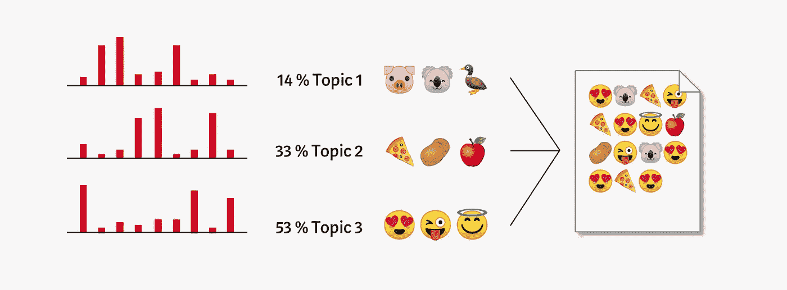

请注意，尽管披萨表情符号不太可能来自主题 3，但它仍然有可能源自主题 3。既然我们已经得到了想要的结果，我们只需要找到一种方法来逆转这个过程。只有？事实上，我们面临着这样的情况:

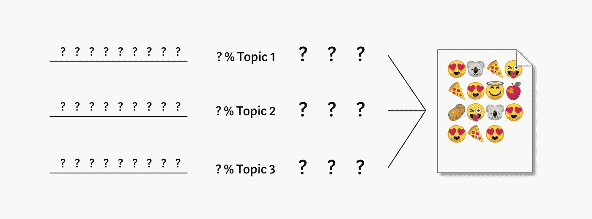

理论上，我们可以让我们的计算机尝试每一种可能的单词和主题的组合。除了这可能要花很长时间这一事实之外，我们最终如何知道哪个组合有意义，哪个没有意义呢？为此，狄利克雷分布派上了用场。不要像上图那样绘制分布，让我们在各自的位置上绘制主题单纯形的文档。

我们还可以从紧挨着这个的语料库中提取许多其他文档。它可能看起来像这样:

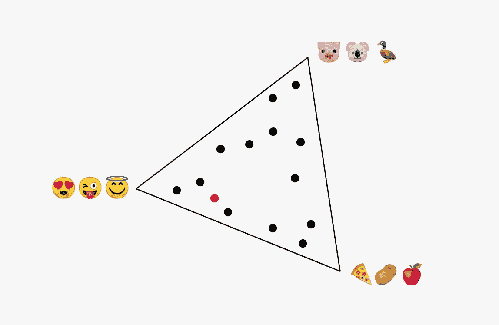

或者，如果我们事先选择了其他主题，像这样:

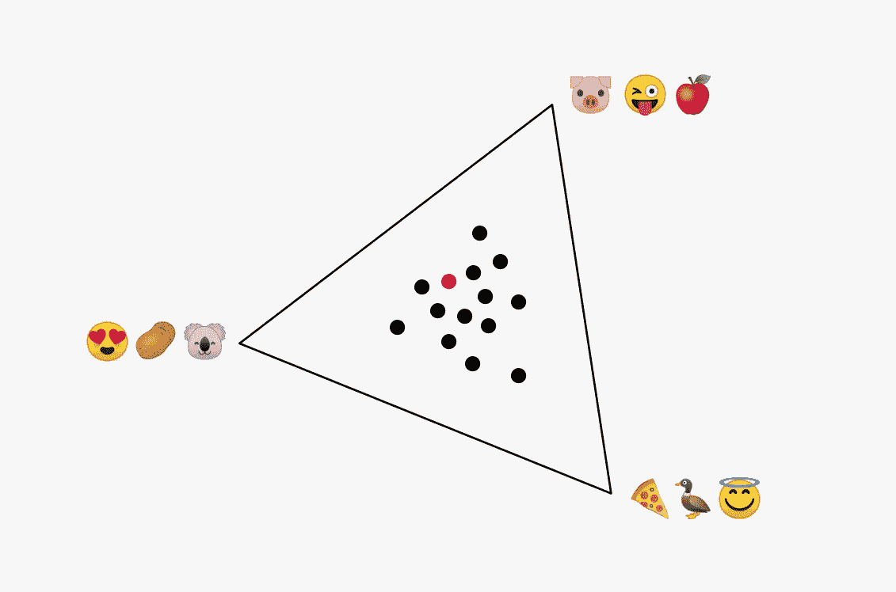

在第一种变体中，文档清晰可辨，并表示不同的主题，而在第二种变体中，文档或多或少都是相似的。这里选择的主题无法以有意义的方式分隔文档。这两种可能的文档分布无非是两种不同的**狄利克雷分布**！这意味着我们已经找到了一种方法来描述“好的”主题分布是什么样子的！

同样的道理也适用于话题中的词语。好的主题在单词上有不同的分布，而坏的主题和其他主题有相同的单词。Dirichlet 分布的这两种表现在 LDA 模型中由两个超参数α和β描述。一般来说，您希望将狄利克雷参数保持在 1 以下。在大卫[莱特伊尔](https://medium.com/u/dd4eda19e229?source=post_page-----fa996bcefd04--------------------------------)制作的这个精彩的动画中，看看不同的价值观是如何改变分布的。

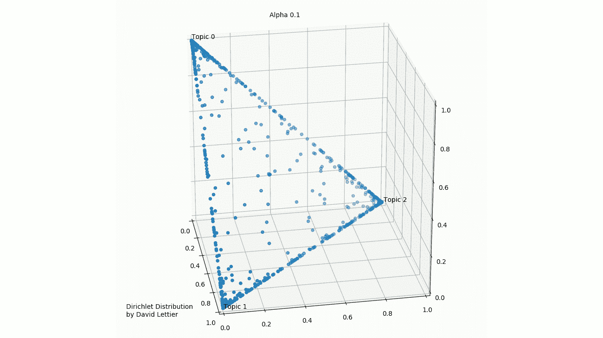

来源:[大卫·莱蒂尔](https://medium.com/@lettier/how-does-lda-work-ill-explain-using-emoji-108abf40fa7d)

好的单词和主题分布通常通过使用诸如折叠吉布斯抽样或期望传播的技术来近似。这两种方法都迭代地改进了随机初始化的单词和主题分布。然而，可能永远也找不到“完美”的分配。

如果你想试试 LDA 对你选择的数据集交互地做了什么，点击你的方式通过[这个](https://mimno.infosci.cornell.edu/jsLDA/)伟大的浏览器内演示，作者是 David Mimno。

还记得简介中介绍的集群流程图吗？尤其是最后一步叫终评？使用聚类方法时，您应该始终记住，即使某个特定的模型可能导致最小的矢量均值移动或最低的概率分布值，这并不意味着它是“正确的”。有许多数据集 k-means 不能正确聚类，甚至 LDA 也可以产生对人类没有任何意义的主题。

简而言之:所有的模型都是错的，但有些是有用的。祝你短信群发愉快，保重！

# 资源

Anastasiu，D. C .，Tagarelli，a .，Karypis，G. (2014 年)。文档聚类:下一个前沿。在 Aggarwal，C. C .和 Reddy，C. K .(编辑)、*数据聚类、算法与应用*(第 305–338 页)。明尼阿波利斯:查普曼&大厅。

[布莱博士，Ng，A. Y .，&约旦医学研究所(2003 年)。潜在狄利克雷分配。《机器学习研究杂志》，3(1 月)，993–1022。](http://www.jmlr.org/papers/volume3/blei03a/blei03a.pdf)

布莱医学博士(2012 年)。概率主题模型:调查为管理大型文档档案提供解决方案的一套算法。*ACM 的通信，55* (4)，77–84。

[布朗，P. F .，彼得拉，V. J .，苏扎，P. V .，赖，J. C .，&默瑟，R. L. (1992)。自然语言的基于类的 n 元模型。*计算语言学*，18，467–479。](https://www.aclweb.org/anthology/J92-4003)

费尔德曼和桑格(2007 年)。文本挖掘手册。分析非结构化数据的高级方法。剑桥:剑桥大学出版社。

米科洛夫(2014 年)。句子和文档的分布式表示。*第 31 届机器学习国际会议论文集，PMLR 32* (2)，1188–1196。

c .曼宁和 h .舒策(1999 年)。*聚类，统计自然语言处理基础*。马萨诸塞州剑桥。:麻省理工学院出版社。

[奥沃普提、奥康纳、戴尔、金佩尔、施耐德和史密斯(2013 年)。改进的在线会话文本词性标注。*人类语言技术:计算语言学协会北美分会会议，会议录，2013 年 6 月 9-14 日，美国佐治亚州亚特兰大*(第 380-390 页)。](https://www.aclweb.org/anthology/N13-1039.pdf)