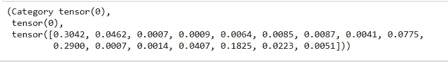

# 全栈机器学习项目

> 原文：<https://towardsdatascience.com/a-full-stack-machine-learning-project-7ab80e46e1c4?source=collection_archive---------39----------------------->

## 从模型创建到部署—一个端到端的机器学习项目


[亚历山大·奈特](https://unsplash.com/@agkdesign?utm_source=unsplash&utm_medium=referral&utm_content=creditCopyText)在 [Unsplash](https://unsplash.com/s/photos/tech?utm_source=unsplash&utm_medium=referral&utm_content=creditCopyText) 上拍照

当我还是个孩子的时候，我曾经痴迷于哈利波特(书，而不是电影)。我是赫敏·格兰杰的超级粉丝，并且被西弗勒斯·斯内普这个角色深深吸引。

所以当我发现一个 MBTI 性格预测数据集时，我决定没有比 ***创建一个哈利波特性格预测模型更好的使用它的方法了。***

# 这是最终产品的样子:


如您所见，该接口接受一些文本作为输入，调用后端模型，并生成一个预测。

# 为什么要创建前端接口？

作为(有抱负的)数据科学家，我们的重点主要是数据和构建模型。我们的大多数机器学习项目都存在于一个精心格式化的 Jupyter 笔记本中，并且可能会永远留在那里。

然而，创造一个人们可以互动的产品是一项重要的技能。

招聘人员每天要查看数百份简历。

他们会有时间查阅你所有的博客文章，阅读你所有的代码，来看看你的项目是关于什么的吗？

大概不会。

然而，如果你创造了一个他们可以互动并实际使用的环境，他们会对你的项目更感兴趣。

现在，我将回顾我完成这个机器学习项目的所有步骤。

# 构建和训练模型

## 法斯泰

我使用[这个 MBTI 人格类型](https://www.kaggle.com/datasnaek/mbti-type)数据集来创建和训练模型。我使用了 [fastai](https://www.fast.ai/2020/02/13/fastai-A-Layered-API-for-Deep-Learning/) 库来做这件事。

从头开始构建分类器来处理文本数据需要花费大量时间，并且需要大量的数据清理和预处理。相反，我使用了 fastai 的文本模块中预先训练好的模型。

如果你想创建一个类似的文本分类模型，我建议遵循他们的指南[这里](https://docs.fast.ai/text.html)。

您需要做的就是安装所需的库，并使用您的数据集来训练预先存在的模型。

我使用 [Google Colab](https://research.google.com/colaboratory/faq.html) 在我的数据集上训练模型，因为它允许用户免费连接到 GPU 后端。这使得训练深度学习模型的速度快了很多。

如果你以前没有用过 Colab，这里的是入门指南。

在 Colab 中创建和训练了模型之后，我将其导出到我的 Jupyter 笔记本中，并使用它用随机句子进行预测。

# 做预测

我得到的预测是张量:

```
pred = learn.predict('Happiness is not something ready-made.')
```



我必须将它们转换成字符串:

```
print(str(pred[0]))
```

输出:“ENFJ”

现在，剩下要做的就是创建一个前端界面，并为每种性格类型输出哈利波特角色的名字。

# 前端接口

## Dash 应用

Dash 应用程序是一种软件，允许您在工作环境中创建前端界面。它易于使用，无需了解 HTML、CSS 和 JavaScript 等前端语言。

作为数据科学家，我们的大部分工作都在 Jupyter 笔记本上完成。这是我们最熟悉的地方，用不同的扩展名创建单独的文件可能很耗时。

解决办法？

[JupyterDash](https://medium.com/plotly/introducing-jupyterdash-811f1f57c02e) ！

JupyterDash 是一个库，允许你直接从你的 Jupyter 笔记本上创建 Dash 应用程序。

它使用起来非常简单，下面是一些帮助您入门的代码:

```
# imports
from jupyter_dash import JupyterDash
import dash
from dash.dependencies import Input, Output, State
import dash_core_components as dcc
import dash_html_components as html
from dash import no_updateexternal_stylesheets = ['[https://codepen.io/chriddyp/pen/bWLwgP.css'](https://codepen.io/chriddyp/pen/bWLwgP.css')]app = JupyterDash(__name__, external_stylesheets=external_stylesheets)app.layout = html.Div([
    html.H1(children="Personality prediction: Which Harry Potter character are you?", style={'textAlign': 'center'}),
    html.Img(src='data:image/png;base64,{}'.format(encoded_image.decode()),style={'height':'350px','width':'550px'}),
    dcc.Markdown('''
                ###### Step 1: Type a sentence that you feel represents your personality.
                ###### Step 2: Click submit
                ###### Step 3: Wait for your prediction to appear!
    ''',style={'textAlign': 'center'}),

    dcc.Input(id='username',type='text'),
    html.Button(id='submit-button', type='submit', children='Submit'),
    html.Div(id='output_div')
    ],style={'textAlign': 'center','justify':'center','align':'middle','verticalAlign':'middle'})learn = load_learner("C:/Users/natassha selvaraj/Desktop")[@app](http://twitter.com/app).callback(Output('output_div', 'children'),
                [Input('submit-button', 'n_clicks')],
                [State('username', 'value')],
                )
def update_output(clicks, input_value):
    answ = learn.predict(input_value)
    if clicks is not None:
        if input_value is not None:
                if(str(answ[0])=='ISTP'):
                    return(html.H2(children='Harry Potter (ISTP)', style={'textAlign': 'center'}))
                elif(str(answ[0])=='ENFP'):
                    return(html.H2(children='Ron Weasley (ENFP)', style={'textAlign': 'center'}))
                elif(str(answ[0])=='INTP'):
                    return(html.H2(children='Hermione Granger (INTP)', style={'textAlign': 'center'}))
                elif(str(answ[0])=='ENFJ'):
                    return(html.H2(children='Albus Dumbledore (ENFJ)', style={'textAlign': 'center'}))
                elif(str(answ[0])=='ESTP'):
                    return(html.H2(children='Ginny Weasley (ESTP)', style={'textAlign': 'center'}))
                elif(str(answ[0])=='ISFJ'):
                    return(html.H2(children='Neville Longbottom (ISFJ)', style={'textAlign': 'center'}))
                elif(str(answ[0])=='INFP'):
                    return(html.H2(children='Luna Lovegood (INFP)', style={'textAlign': 'center'}))
                elif(str(answ[0])=='ESFP'):
                    return(html.H2(children='Fred and George Weasley (ESFP)', style={'textAlign': 'center'})) 
                elif(str(answ[0])=='ISFP'):
                    return(html.H2(children='Rubeus Hagrid (ISFP)', style={'textAlign': 'center'}))
                elif(str(answ[0])=='ISTJ'):
                    return(html.H2(children='Severus Snape (ISTJ)', style={'textAlign': 'center'}))
                elif(str(answ[0])=='ENTJ'):
                    return(html.H2(children='Minerva McGonagall (ENTJ)', style={'textAlign': 'center'}))
                elif(str(answ[0])=='ESFJ'):
                    return(html.H2(children='Fleur Delacour (ESFJ)', style={'textAlign': 'center'}))
                elif(str(answ[0])=='INFJ'):
                    return(html.H2(children='Remus Lupin (INFJ)', style={'textAlign': 'center'}))
        return('Please enter a valid sentence')

app.run_server(mode='external')
```

输出单元格如下所示:


只需点击网址，您就会发现您的 Dash 应用程序正在运行:


如果你想要更深入的 Jupyter-Dash 教程，我推荐以下资源:

1.  [介绍 JupyterDash](https://medium.com/plotly/introducing-jupyterdash-811f1f57c02e) —中篇
2.  [JupyterDash 教程](https://www.youtube.com/watch?v=PshzA4LUZu8) — YouTube 视频
3.  [在 Jupyter 中设置 Dash Plotly](https://www.youtube.com/watch?v=PshzA4LUZu8)—YouTube 视频

# 部署

现在，您的 Dash 应用程序正在本地服务器上运行。您需要将它托管在某个地方，以便其他人能够访问它。

一个受欢迎的选择是 Heroku。Heroku 允许你直接从远程服务器托管你的应用程序。你不需要支付托管费用，而且设置非常快捷，易于操作。[这里的](https://medium.com/better-programming/deploy-your-app-for-free-in-7-easy-steps-thanks-to-heroku-dfd0f387edd0)是用 Heroku 部署你的应用的指南。

对于这个项目，我用了 n [grok](https://www.pubnub.com/learn/glossary/what-is-ngrok/) 。Ngrok 是一个应用程序，它允许您以最少的努力将开发服务器公开给 Internet。

它通常用于在部署之前测试站点，而不是实际托管 web 应用程序。此外，如果您使用免费层，URL 可能会在您每次运行应用程序时发生变化。

然而，ngrok 非常容易设置，如果你想与朋友或潜在雇主分享一些快速应用程序或仪表板，它非常棒。

以下是使用 ngrok 的方法:

```
! pip install pyngrok
```

然后，访问他们的[网站](https://ngrok.com/)并登录(或者注册，如果你是第一次的话)。

您将会看到这样一个页面，其中第 2 个标记是:


复制令牌。在您的笔记本中运行以下代码行，并在“xxxxx”处插入令牌:

```
! ngrok authtoken xxxxxx
```

添加以下代码行:

```
from pyngrok import ngrok# Open a HTTP tunnel on the default port 80
public_url = ngrok.connect(port='8050')
print(public_url)
```

复制粘贴出现在你的浏览器中的 URL，你的网站将会运行！

[这里的](http://d2e42136c142.ngrok.io/)是我在 ngrok 上部署的 Dash app(加载需要一些时间)。

[这里的](https://www.youtube.com/watch?v=AkEnjJ5yWV0)是一个关于 ngrok 的综合视频教程。

# 本文到此为止！感谢阅读:)

> 永远不要停止学习。生活从不停止教导。