# 对抗性机器学习的博弈论方法

> 原文：<https://towardsdatascience.com/a-game-theoretical-approach-for-adversarial-machine-learning-7523914819d5?source=collection_archive---------29----------------------->

## 如何运用博弈论解决对抗性风险？

人工智能近年来取得了巨大的成功，因为它为我们提供了强大的算法，这些算法使用大型数据库进行准确的预测或分类。它们越来越多地用于不同的目的，包括高风险的目的。

然而，他们不是绝对可靠的**。**

**事实上，这些算法中的大多数都是根据数据训练的，这些数据可以被试图误导它犯错误的对手故意操纵。**

**让我们举一个简单的例子:**垃圾邮件检测。**起初，朴素贝叶斯等标准分类器在准确性方面效率极高。然而，垃圾邮件制造者很快学会了如何通过改变同义词来愚弄他们，并添加更多的“非垃圾邮件”世界。因此，垃圾邮件过滤器被改变来检测这些伎俩。但是垃圾邮件发送者用新的来回应。因此，这就导致了防守者和进攻者之间的**无休止的博弈，直到达到均衡状态**。**

**在这种情况下，**博弈论**可能非常有用，因为它提供了在防御和攻击策略方面对防御者的行为和对手的行为进行建模所需的数学工具。**

**更具体地说，基于博弈论的模型使我们能够考虑:**

*   ****攻击者**在适应分类器的成本和他从攻击中获得的收益之间做出的权衡。**
*   ****防御方**在正确攻击检测的好处和错误警报的代价之间进行权衡。**

**因此，基于博弈论的模型可以确定需要什么样的合适的策略来减少防守方在对抗性攻击中的损失。**

**垃圾邮件过滤并不是这些模型能够带来有价值信息的唯一案例。这个视角可以用来描述**许多其他风险更高的情况:**计算机入侵检测、欺诈检测、空中监视。**

**在这篇文章中，我将与你分享我关于如何将博弈论用于对抗性机器学习的**的关键发现。****

**阅读本文后，您将了解到:**

*   **博弈论如何应用于机器学习？**
*   **博弈论如何帮助解决对抗性学习问题？**
*   **如何让你的机器学习算法对对抗性攻击具有鲁棒性？**

# **基于博弈论方法的一个例子**

**先说一个简单的例子:**垃圾邮件检测。****

**以下部分描述了 W. Liu 和 S. Chawal 在[论文](https://ieeexplore.ieee.org/document/5360532)中为对抗性学习开发的博弈论模型。**

## **一般设置**

**它可以被建模为在**垃圾邮件发送者(S)** 和**防御者(D)** 之间的双人游戏。**

*   ****垃圾邮件发送者**可以选择 **1)** 通过改变垃圾邮件并让它们通过垃圾邮件过滤器来攻击分类器，或者 **2)** 在知道一些垃圾邮件可能通过的情况下不进行攻击。**
*   ****防御方**可以选择 **1)** 重新训练分类器，以保持较低的误分类率，或者选择 **2)** 不重新训练分类器，尽管误分类的垃圾邮件可能会增加。**

**我们将假设垃圾邮件发送者将是第一个采取行动的人。**

**有 **4 种可能的结果**，如下图所示。可以将每个场景与两个玩家的**收益**相关联，以反映最终结果的相对排名。**

> **例如，**场景 2** 对防御者来说是最坏的场景，对垃圾邮件发送者来说是最好的场景，因为他对未经过训练的分类器的攻击将导致**大量错误分类的垃圾邮件**。**

**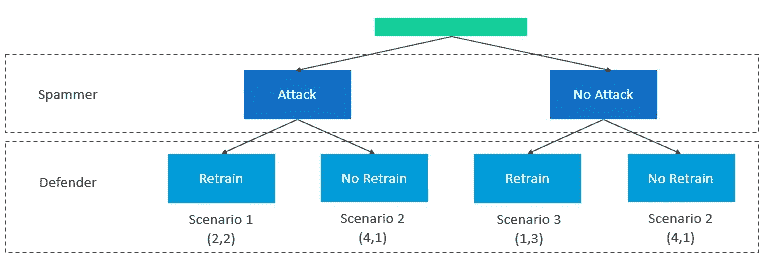**

**垃圾邮件制造者和防御者之间的博弈树**

## **模型定义**

**这种情况可以建模为一个 **Stackelberg 博弈**，即一个顺序博弈，其中有**一个领导者**(这里是垃圾邮件发送者)和**一个跟随者**(防守者 D)。**

**Stackelberg 博弈 通常用于模拟存在等级竞争的市场中理性主体之间的战略互动。**

**在这种情况下，每个玩家通过分别为 S 和 D 从一组可能的动作 U 和 V 中选择一个动作来对另一个玩家的动作做出反应。假设这些集合是有界的和凸的。**

**每个结果都与一个**收益函数 *Js、*和 *Jd 相关联。*** 收益函数 *Ji* 是两次可微映射 ***Ji(U，V) → R*** 其中 R 是反应。**

**因此，有可能将参与人 I 的反应 Ri 预期为使其收益最大化的反应，即:**

**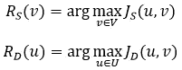**

**此外，第一个采取行动的人可以**预测**跟随者会如何理性反应，并在他的第一个决定中考虑到这一点。这就是所谓的**倒推**或**倒推**。**

**这意味着垃圾邮件发送者的第一个行动是解决下面的**优化问题**:**

**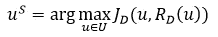**

**因此，防守者会选择最优解:**

**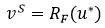**

**这个解(u，v)就是 **Stackelberg 平衡**。**

**请注意，它不同于**纳什均衡**，其中游戏的两个参与者同时行动**，联立方程的解是 **(0，0)** ，即两个参与者都没有反应。****

## ****模型设定****

****现在我们已经定义了一般的设置，我们仍然需要确定在一个**分类问题**的特殊情况下玩家的收益函数。****

****为了简化，我们首先只考虑一个属性。然后可以很容易地推广到多个属性，假设它们是条件独立的，给定它们的类标签。****

****一、选手招式的**影响**是什么？****

****让我们定义以下**分布**:****

*   *****P(μ'，σ)* :垃圾邮件分布****
*   ****Q *(μ，σ)* :非垃圾邮件的分布****

****用 *μ' < μ，*因为非垃圾邮件比垃圾邮件多****

****对手通过移动*μ’*到*μ’+u*(即朝向 *μ* )进行攻击。防守方的反应是将边界从 1/2 ( *μ'+μ')* 移动到(也向 *μ* 移动)****

****第二，玩家的**收益**是什么？****

****为了评估一个变换 u 对数据的重要性，可以使用[**kull back–lei bler 散度**](https://en.wikipedia.org/wiki/Kullback%E2%80%93Leibler_divergence) **KLD** (也叫相对熵)。它衡量一个概率分布如何不同于另一个参考概率分布。****

******垃圾邮件发送者的收益:**因为他的目标是增加错误分类的垃圾邮件的数量，所以他的收益可以表示如下:****

****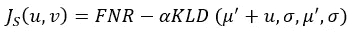****

****其中 FNR 是假阴性率的增加。因此，α代表**成本损失**的强度。****

******防守者的收益:**由于他的目标是提高分类的准确性，他的收益可以表示如下:****

****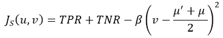****

****其中 TPR 和 TNR 代表真实正利率和真实负利率的增加。因此，β控制重新训练分类器的**成本的强度。******

****在这种情况下，下面的等式可以使用 [**遗传算法**](https://en.wikipedia.org/wiki/Genetic_algorithm) 来求解:****

****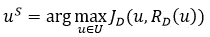****

****论文[的作者](https://ieeexplore.ieee.org/document/5360532)应用这种方法在合成数据和真实数据之间寻找平衡。根据生成攻击和重新训练分类器(通过α和β建模)所产生的成本的重要性，他们找到不同的均衡。****

# ****基于博弈论的方法的其他变体****

****前一个例子依赖于一组假设:它模拟了一个游戏，其中攻击者和防御者相互竞争。假设**攻击者首先采取行动**。它还假设两个玩家都知道他们各自对手的收益和成本。****

****然而，这些假设并不总是成立的。幸运的是，存在大量基于博弈论方法的模型。它们可以分类如下。****

## ****零和与非零和游戏****

****在两人零和游戏中，进攻者的收益等于防守者损失的成本，反之亦然。这意味着玩家的效用总和为 0。这种假设可能非常悲观，因为防守方的效用损失可能不如对手的效用。****

## ****同时博弈与顺序博弈****

****在同时移动游戏中，玩家同时选择**他们的策略，而不观察对方的策略。在顺序博弈中，他们一个接一个地选择他们的行动。******

****对抗性学习主要被建模为一个**序列游戏，防守者是领导者。事实上，人们通常认为，一旦防御者选择了分类器，攻击者就可以观察它并决定自己的策略。******

****上一节描述的模型是少数几个认为攻击者在选择策略之前无法观察分类器的模型之一。****

## ****贝叶斯博弈****

****贝叶斯游戏模拟了一种游戏，其中玩家拥有关于其他玩家的**不完全信息**。这更有可能是因为防御者可能不知道生成敌对数据的确切成本，并且攻击者可能不知道防御者的确切分类成本。他们只相信这些成本。****

> ****著名经济学家约翰·C·海萨尼在博弈论方面做出了重大贡献，他特别是在不完全信息环境下，他这样描述贝叶斯博弈:****
> 
> ****游戏中的每个玩家都与一组**类型**相关联，该组中的每种类型都对应于该玩家的一个可能的**支付函数**。除了游戏中的实际玩家，还有一个特殊的玩家叫做**自然**。大自然根据玩家类型空间的**概率分布**为每个玩家随机选择一个类型。所有玩家都知道这个概率分布(“**常见先验假设**”)。这种建模方法将不完全信息博弈转化为**不完全信息博弈**。****
> 
> ****来源:[维基百科](https://en.wikipedia.org/wiki/Bayesian_game)****

# ****如何让对抗性学习变得健壮？****

****依赖于基于博弈论的框架的对抗性学习技术可能是相关的，因为它基于重新训练模型和生成攻击者所产生的**收益和成本**来模拟学习者和对手的**行为**。****

****但是，如果最初的模型已经能够抵御恶意攻击呢？****

****提高这种稳健性的最常见方法之一是**对恶意数据**进行建模，这些恶意数据可能是由对手事先生成的，并将其包含在训练阶段。****

****在本节中，我们将考虑用于**生成对抗数据**的 3 种主要技术:扰动技术、转移对抗实例、生成对抗网络(GAN)。****

## ****扰动技术****

****这个想法是为了产生可以被潜在对手利用的合成对抗数据。要做到这一点，有必要了解并预测对手是如何发起攻击的。****

****这些技术中的大多数依赖于向有效的示例添加少量的噪声或扰动。让我们来看看一些众所周知的例子:****

****[**BFGS**](https://arxiv.org/pdf/1312.6199.pdf)****

****让我们注意一下:****

*   ****f:用于给定观察值 *x* 的分类器映射，包括 *m* 特征并返回类别标签****
*   *****损失:*关联的连续损失函数****
*   *****居:*微扰****

****如果攻击者的目标是生成一个被错误分类为 a1 的示例，他必须解决以下优化问题:****

********

****这可以通过执行线搜索来找到最小值 c > 0 来完成，对于该最小值 c > 0，以下问题的极小值 r 满足 *f(x + r) = l :*****

****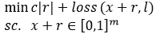****

****请注意，对于深度神经网络等复杂模型，该优化问题没有封闭形式的解决方案。但是，可以使用迭代数值方法，这会使生成速度变慢。然而，它的成功率很高。****

****[**【快速梯度征法】**](https://arxiv.org/pdf/1412.6572.pdf)****

****让我们注意一下:****

*   *****X* :清洁观察****
*   *****∇J(X,y):* 模型损失函数相对于 *X* 的梯度****
*   *****ϵ:* 参数*控制对抗性扰动的重要性*****

****该方法通过增加损失函数值来产生对抗性扰动，如下所示:****

****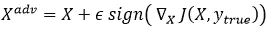****

****请注意，在梯度方向上增加一个扰动可以有意地改变观测结果，从而使模型对其进行错误分类。****

****与前一种方法相比，这种方法实现起来**更快，计算上更可行**。但其**成功率较低**。****

****Goodfellow 等人描述该方法的论文也导致了有趣的观察结果，例如:****

*   ****使用干扰的方向比干扰的数量更能有效地创造对立的例子****
*   ****用对立的例子训练分类器类似于分类器的**正则化******

****[**迭代快速梯度符号**](https://arxiv.org/pdf/1607.02533.pdf)****

****也可以**以较小的步长多次应用 fgsm**并对总数进行限幅，同时使干净样本和对立样本之间的失真低于ϵ.****

****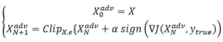****

****[**转移抗辩示例**](http://openaccess.thecvf.com/content_ECCV_2018/papers/Arjun_Nitin_Bhagoji_Practical_Black-box_Attacks_ECCV_2018_paper.pdf)****

****上面描述的大多数技术都假设攻击者知道所使用的模型。它们属于所谓的**白盒攻击**，与**黑盒攻击**相对。然而，在现实生活中，情况并非总是如此。****

****那么，攻击者通常采用哪些技术呢？****

****对手可以通过探测来重建模型，即向模型发送有效的和敌对的例子并观察输出。这使得他能够形成数据集，该数据集可用于训练**替代模型**。然后，可以使用白盒算法来实现对抗性示例的生成。****

****然而，在某些情况下，探测可能会受到被接受的查询的最大数量或对手产生的成本的限制。为了处理这个问题，对手可以生成对抗性的例子来欺骗分类器，并同时训练另一个模型。然后，他可以重复使用这些对立的例子来愚弄多个不同的分类器。****

****注意，使用通过模型生成的对立例子来欺骗黑盒模型是可能的，并且依赖于**转移属性**。****

****[**【乾坤】**](https://arxiv.org/abs/1406.2661)****

****生成敌对网络(GANs)完全依赖于一种**博弈论方法。**在这些模型中，扰动的例子从对手那里生成，同时用于训练学习者的模型，如下图所示。****

****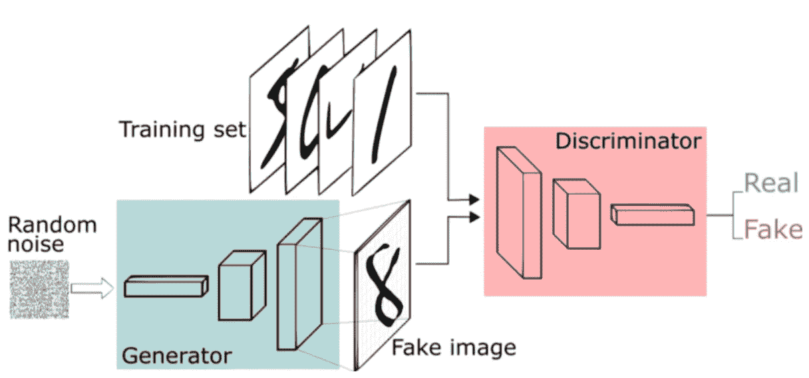****

****生成对抗性网络框架，来源:文章来自 [FreeCodeCamp](https://www.freecodecamp.org/news/an-intuitive-introduction-to-generative-adversarial-networks-gans-7a2264a81394/) ，Thalles Silva****

****如上图所示，学习者使用的函数称为**鉴别器**，而对手函数使用的函数称为**生成器**。****

****鉴别器和发生器通过零和游戏相互作用**，因为它们都在寻求优化不同的和相反的目标函数，或损失函数。******

****在这种情况下，鉴别器和生成器**分别不断调整**它们的预测和数据损坏机制。****

# ****结论****

****如今，随着个人和企业拥抱数字革命，人工智能算法越来越多地用于解决多种背景下的复杂问题，其中一些可能会有很高的风险。****

****因此，当他们在敌对环境中面临对抗性攻击时，不要低估他们的弱点是很重要的。****

> ****这些**例子**就像它们揭示的一样多:用于访问私人空间或有价值信息的图像识别系统，保护个人和公司财富的欺诈检测算法，等等。****

****在这种情况下，博弈论为对手和学习者的行为建模提供了**有用的工具**，因为它一方面包括对手攻击的收益和生成对手数据的成本，另一方面包括学习者更新模型的成本。****

****因此，基于博弈论的方法揭示了对手和学习者都做出的权衡，并可用于评估实施特定技术的风险。因此，它是一个**强大的决策**工具，需要在类似的环境中更广泛地使用。****

# ****参考****

****[1] W. Liu 和 S. Chawla， [*对抗性学习的博弈理论模型*](https://ieeexplore.ieee.org/document/5360532) ，2009 年 IEEE 国际数据挖掘研讨会，佛罗里达州迈阿密，2009 年，第 25–30 页。****

****[2] P. Dasgupta，J. B. Collins， [*网络安全任务中对抗性机器学习的博弈论方法调查*](https://arxiv.org/abs/1912.02258) *，*信息管理&决策架构(IMDA)分部，美国华盛顿特区美国海军研究实验室信息技术部，*2019 年 12 月*****

*****[3] N .达尔维等人， [*对抗性分类*](https://homes.cs.washington.edu/~pedrod/papers/kdd04.pdf) ，西雅图华盛顿大学计算机科学与工程系，2004 年 8 月*****

*****[4] P. L .巴霍， [*对抗性机器学习:如何攻防 ML 模型*](https://www.toptal.com/machine-learning/adversarial-machine-learning-tutorial)*****

*****[5] C. Molnar， [*可解释的机器学习*](https://christophm.github.io/interpretable-ml-book/adversarial.html) ，*制作黑盒模型的指南可解释的*，2020 年 4 月*****

*****【6】s . sa xena， [*游戏(理论)对于 AI？给大家一个图文并茂的指南*](https://www.analyticsvidhya.com/blog/2019/11/game-theory-ai/)*2019 年 11 月******