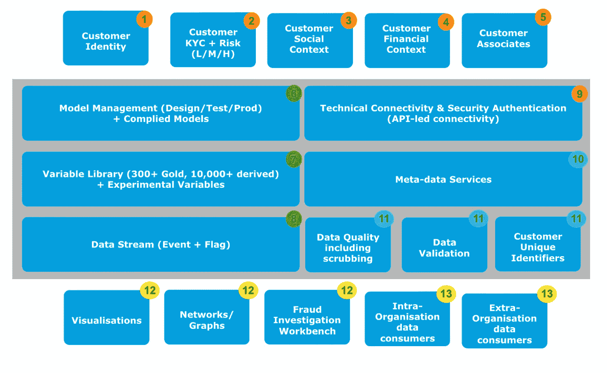

# 用于商家订单欺诈检测的通用数据科学架构。

> 原文：<https://towardsdatascience.com/a-generalised-data-science-architecture-for-merchant-order-fraud-detection-9382ad61daad?source=collection_archive---------39----------------------->

## 数据科学如何帮助阻止预计将增加我们所有人成本的 500 亿美元商业损失。

数字时代礼遇 Pixabay

## **当客户不是你的客户时…**

显然，当作者[爱德华·贝拉米](https://en.wikipedia.org/wiki/Looking_Backward#Synopsis)在他的小说《回望过去:2000-1887》中首次想到信用卡的概念时，所有公民都获得了等量的存储在现代借记卡上的信用额度。

澳大利亚只有一种信用卡，即[银行卡](https://en.wikipedia.org/wiki/Bankcard)，最早于 1974 年问世。现在，像 Visa 或 MasterCard 这样的全球信用卡网络提供了多种支付方式；奖励忠诚计划，如利润丰厚的澳航飞行常客或 Coles Flybuys 和移动钱包支付。

最初，银行卡的用途是*补充*现金。现金为王，有趣的是，教育项目伴随着负责任地使用信用卡的引入，这有助于降低违约率。随着 EFTPOS 网络、磁条和现在的 EMV [芯片的引入，包含加密细节](https://usa.visa.com/partner-with-us/payment-technology/visa-chip-technology-overview.html)并为每次购买生成 UID 的芯片增加了卡的安全性，但不能验证操作者。

不幸的是，信用卡和现金一样，无法完全弥合资金所有者和经营者之间的差距。不幸的是，持有该卡或泛 CVV 号码本身就充当了自己的认证者，为欺诈打开了方便之门。信用卡欺诈损失由发卡机构承保，例如，Visa 的零责任保单。卡不在场的损失是商家的责任。

2019 年，无卡(CNP)欺诈让澳大利亚商家每年损失约 5 亿美元。在美国，2015 年的估计表明，虽然 2020 年所有信用卡欺诈为[120 亿美元](https://www.forbes.com/sites/rogeraitken/2016/10/26/us-card-fraud-losses-could-exceed-12bn-by-2020/#64395db6d243)，但其中的 60%或[70 亿美元](https://www.globenewswire.com/news-release/2016/05/06/1156710/0/en/Card-Not-Present-Fraud-Losses-to-Exceed-7-Billion-by-2020.html)可能是由于不存在信用卡。当时，人们希望 EMV 标准芯片的出现能够抑制这种活动，但 CNP 卡欺诈的经历表明，这并不是全部的解决方案。

众所周知，信用卡欺诈策略是匿名黑客通过电子邮件或陌生电话渠道，使用设备浏览信用卡详细信息，或使用[社交工程窃取账户](https://news.cardnotpresent.com/news/real-time-payments-platforms-push-fraud-losses-higher)的网络钓鱼信用卡详细信息。在此之后，发卡机构在其实时支付平台附近的实时欺诈检测系统将在支付点检测或不检测、分类和阻止交易。在数据科学术语中，这是一个实时分类的问题。

## **家庭诈骗**

越来越多的不涉及犯罪集团或黑客的欺诈类型实际上是所谓的“友好”欺诈，其中欺诈发生在支付指令处理完毕后的*，由持卡人质疑交易的合法性。*

这些[退款](https://www.westpac.com.au/business-banking/merchant-services/manage/frauds-disputes-chargebacks/guide-to-chargebacks/)影响商户的余额，由发卡机构自动处理。发卡方对争议进行调解，并将费用转嫁给商家。

据说，到 2020 年，全球商家的退款成本可能在 500 亿美元左右。显然，经营一家电子商务商店的成本仅次于劳动力成本。这必须考虑到价格上涨，商家需要通过涨价来弥补他们的损失。

因此，除了授权持卡人之外的某人使用卡数据，无论卡是否存在，来进行授权持卡人不同意的购买。

授权持卡人的亲戚、同事，甚至可能是孩子，在线购买商品，注册在线服务，使用通过缓存登录电子商务门户访问的储值卡凭证购买应用程序，只需点击一下即可轻松购物。或者，在我知道的一个案例中，一个青少年在午夜从父母的钱包里拿走了卡片。

双因素认证(2FA)可能也无济于事，因为家庭成员或同事会知道账单地址和出生日期。

在这些情况下，争议是合法的，因为持卡人没有授权购买，但不知何故失去了对令牌或凭证的控制。

## 在我们能够对在线身份进行权威认证之前…

现金在我手里或钱包里或保险柜里；除非我把它掉了，忘了它在哪里，或者它被偷了，否则它是安全的。把你的信用卡拿在手中没有现金安全，因为凭证是数字联邦在你的手机、浏览器、你的实体钱包上，由 PayPal 等存储，甚至可以被我们的亲戚写下来。

这个问题正在由[生物识别](https://www.biometricupdate.com/201908/idex-biometrics-silone-cardtech-partner-on-biometric-cards-production)解决。虽然 2FA 似乎是一种安全的身份验证机制(我们有的，我们知道的)，但指纹是我们有的其他东西。

信用卡供应商正在将生物识别技术嵌入卡中。虽然这不能防止 CNP 欺诈，但它将有助于使用 POS 终端对卡进行未经授权的操作。

在我们能够权威认证在线身份之前，我们必须做的是通过数据科学分类和推理技术评估和验证来自电子商务客户*的购买模式是否合法，然后我们才能接受订单*。

在过去的实体店，我们可以看到顾客在我们面前，他们用现金或支票支付。现在不行了。我们希望能够信任每一位顾客，让商家做正确的事情，也许我们做不到，因为我们不能 100%确定谁是交易的参与者。

也许不仅仅是为了 CRM 和创造销售，也是为了向商家保证购买有较低的退款可能性，我们现在可能需要在处理订单之前评估订单的合法性，而不管付款是否可以在事后处理，*，特别是如果客户以前有过退款*。

## **用于检测商家订单欺诈的通用数据科学架构**。

亚当·哈特博士

商户订单欺诈检测的通用架构有 13 个组成部分:

1.  客户身份是他们在电子商务平台上的个人资料；
2.  客户了解你的客户是你在你的电子商务平台上验证他们时收集的详细信息。许多人会将此视为“空”。风险概况是实施欺诈的人口统计倾向；
3.  客户社交环境是客户已经链接或者甚至用来认证的社交账户；
4.  客户财务背景是购买历史和客户终身价值(CLV)；
5.  客户合作伙伴是朋友和朋友的层次结构；
6.  模型管理是分类器，如最近邻或随机森林，用于将订单分类为合法或非法；
7.  变量库是为模型提供的争论和混杂的数据存储；
8.  数据流是订单流和“是/否”标志，在潜在的非法订单进行支付之前拦截它们；
9.  连通性和安全性是不言而喻的；
10.  元数据服务包含规范和其他结构以及变量的含义；
11.  数据质量、数据验证和客户 UID 协同工作，以确保使用相同帐单和送货地址创建新帐户的客户相匹配；
12.  可视化和图表有助于将数据汇集在一起，形成一个整体客户视图(WOCV ),包括可能有机会和动机了解客户付款方式的员工。这有助于复杂欺诈调查的发现和确认阶段；和
13.  由于平台的组装性质，这些数据可以提供给 CRM 或其他可能从组装中受益的企业功能。

## **将支付验证与订单合法性分离**

如果退款是仅次于劳动力的第二大成本，这是一件大事。然而，对于商人来说，最不需要做的事情就是拒绝订单而拒绝顾客。虽然一些商家使用客户终身价值来传递退款，但如果客户之前有过退款，则有证据表明，由于客户所处的友好或家庭网络，可能需要增加订单审查。

在友好欺诈之前，客户在电子商务平台上进行认证就足以使*的任何*订单合法。并且商家依赖于发卡方的支付欺诈验证服务。现在，也许商家有责任验证*每张*订单的合法性，而不是仅仅依靠付款验证来确保顾客确实是顾客。

如果上面概述的平台由于异常值而标记了订单，那么，假设友好的欺诈者无法访问主要客户的设备，使用客户拥有的(不知道的)东西的简单挑战-响应可能会验证订单的合法性，就像谷歌通过浏览器登录 Gmail 时所做的那样，根据挑战-响应放弃订单将非常明显，因为我们大多数人都带着智能手机。

例如，有人试图进行善意的欺诈，并且订单超出了过去的购买模式或价值，则会发出请求打开应用程序的质询响应，如果质询未通过，订单将被暂停。

这肯定是一种平衡行为，但使用无监督的数据科学分类算法在所有数据中实时自动评估订单，不仅建立了购买上下文，还建立了客户自己的社交和关联上下文，这可能有助于抑制导致价格上涨的损失，同时保持误报水平可控。