# 计算 TF-IDF 值的简明介绍

> 原文：<https://towardsdatascience.com/a-gentle-introduction-to-calculating-the-tf-idf-values-9e391f8a13e5?source=collection_archive---------4----------------------->


图片来自[皮查拜](https://pixabay.com/?utm_source=link-attribution&utm_medium=referral&utm_campaign=image&utm_content=1327493) &图片来自[米哈尔·贾莫鲁克](https://pixabay.com/users/jarmoluk-143740/?utm_source=link-attribution&utm_medium=referral&utm_campaign=image&utm_content=436501)图片来自[皮查拜](https://pixabay.com/?utm_source=link-attribution&utm_medium=referral&utm_campaign=image&utm_content=436501)，CC0

## 一步一步的数学和基于代码的指南，通过计算鲁米的一首神秘的诗来揭示 TF-IDF 值。

当你浏览了上面的标题和副标题时，你已经形成了这个帖子相当专业的想法。最有可能的是，你会先浏览一下这篇文章，浏览一下标题，然后再决定是否要阅读整篇文章。也许，公式和代码会诱使你去读这篇文章。或者，这可能会导致你推迟阅读这篇文章。如您所见，您有一个非常好的机制来非常有效地处理文本。

在自然语言处理领域，我们试图让算法理解文本。大多数算法都是数学函数。因此，他们需要用数字来表示文本，以便有效地工作。本文深入研究了一种非常古老的将文本表示为数字的机制，称为 **TF-IDF，也称为术语频率逆文档频率。**

***那么，什么是 TF-IDF 呢？***

直觉上，为了理解文本是关于什么的，我们寻找频繁出现的单词。**术语频率**通过捕捉每个单词在文本中出现的次数来涵盖这一方面。然而，在这篇文章中，单词 ***、*** *、* ***出现了 200 多次，而单词 TF*** *(也包括使用的代码)*只出现了 55 次。为了降低过于频繁出现的单词的相对重要性，引入了反向加权来缩小过于频繁出现的单词。这种反向加权被称为反向文档频率。总的来说，TF-IDF 捕获了一组文档或一组文本中单词的相对重要性。

有许多关于 TF-IDF 背后的直觉的优秀文章，但关于如何推导出 TF-IDF 的精确值的文章却不多。本文的重点是将所涉及的各种计算拼凑在一起，并提供如何用 python 代码导出每一步，以便您可以在正在处理的文本上导出它。

# 为什么 TF IDF 仍然相关？

在自然语言处理领域，2013 年[单词嵌入](https://en.wikipedia.org/wiki/Word2vec)和 2018 年[语言模型](https://arxiv.org/abs/1801.06146)的发现改变了格局，并导致了 NLP 的许多令人兴奋的发展。因此，在 2020 年，我选择写 2000 多字关于 TF IDF 的文章，这似乎有点奇怪，TF IDF 最初是在 20 世纪 70 年代制定的。以下是我认为理解底层计算是有好处的两个原因。

1.  理解 TF-IDF 使理解和解释您在 TF-IDF 上应用的算法的结果更容易一步。
2.  在实际的商业环境中，文本分类问题是自然语言处理中常见的问题之一。在文本分类问题中，算法必须根据它训练过的一组预定义的主题来预测主题。2018 年，谷歌发布了一个基于对几个不同文本集的 450K 实验的文本分类框架。基于 450K 的实验，谷歌发现当样本数量/字数< 1500, TF IDF was the best way to represent text. When you have a smallish sample size for a relatively common problem, it helps to try out TF IDF.

# Overview

We will be using a beautiful poem by the mystic poet and scholar Rumi as our example corpus. First, we will calculate TF IDF values for the poem using TF IDF Vectorizer from the sklearn package. Then, we will pull apart the various components and work through various steps involved in calculating TF-IDF values. Mathematical calculations and Python code will be provided for each step.

So, let’s go!

# First things first — Introducing the Corpus

To illustrate the concept of TF-IDF, we need a corpus. A corpus is a collection of documents. In a typical Natural Language Processing problem, a corpus can vary from a list of call center logs/ transcripts, a list of social media feedback to [大量收集研究文档](https://www.kaggle.com/allen-institute-for-ai/CORD-19-research-challenge)时。

为了说明所涉及的各个步骤，我们需要保持语料库尽可能小，以便矩阵能够整齐地放在一页上。我偶然发现了 13 世纪波斯诗人和苏菲派神秘主义者[鲁米](https://en.wikipedia.org/wiki/Rumi)T2【jalāl ad-děn Muhammad rūmé】的这句名言/美丽的诗，它非常符合我们的使用案例。因此，我们将使用这首诗作为我们的文档列表，每个句子都被视为一个文档。

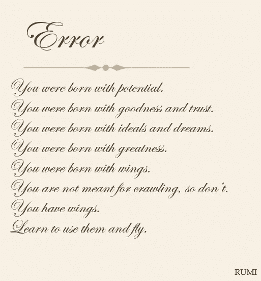

鲁米的诗

> 那不是一首真正美丽的诗吗？当我们通过代码和一点数学来提升自己时，这是很好的。

我们将上面的 8 个句子表示为 Python 中的字符串列表。

```
corpus =  ["you were born with potential",
"you were born with goodness and trust",
"you were born with ideals and dreams",
"you were born with greatness",
"you were born with wings",
"you are not meant for crawling, so don't",
"you have wings",
"learn to use them and fly"
]
```

# 展望最终产出

在这一步，我们将把这首美丽的诗抽取成神秘的小数。但是，嘿，毕竟，我们正试图通过理解 TF-IDF 中涉及的计算来揭开这些小数的神秘面纱。如前所述，通过 sklearn 包导出是相当容易的。

```
#transform the tf idf vectorizer
from sklearn.feature_extraction.text import TfidfVectorizer
tf_idf_vect = TfidfVectorizer()
X_train_tf_idf = tf_idf_vect.fit_transform(corpus)
terms = tf_idf_vect.get_feature_names()
```

在下面的矩阵中，每一行代表上述诗中的一句话。每一列代表一个独特的词在诗中按字母顺序排列。如你所见，矩阵中有很多零。因此，一个节省内存的稀疏矩阵被用来表示这一点。为了便于可视化，我将其转换为数据框。

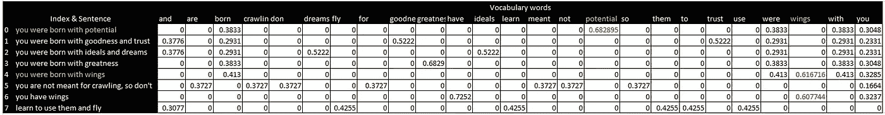

TF-IDF 对鲁米诗歌《作者的形象》的评价

让我们解释一下迄今为止我们收到的数字。你可能已经注意到了，*【你出生了】*这几个词在整首诗中反复出现。因此，我们预计这些词不会得到很高的 TF-IDF 分数。如果你看看这三个词的值，你会发现它们通常在 0.2 到 0.3 之间。

> 我们来看文档 0— *你天生就有潜力*。*字势* ***突出*** 。**如果您查看矩阵第一行中的各种 TF-IDF 值，您会看到单词**潜在**具有最高的 TF-IDF 值**。

让我们看看文件 4(第 5 行): ***你生来就有翅膀*** 。还是那句话，和之前一样，单词“*wings”*在那句话里价值最高。

> 请注意，单词*“wings”*也出现在文档 6 中。文件 6 中单词" *wings"* 的 TF-IDF 值与文件 4 中单词" *wings"* 的 TF-IDF 值不同。在文件 6 中，单词“wings”被认为不如文件 6 中的单词“have”重要。

**本文的目的是研究如何从头开始计算上述 TF-IDF 值**。我们将特别关注对单词 ***【翅膀】*** 和 ***潜能*** 的计算，以得出上面显示的矩阵中以红色突出显示的值。

我们将把各种部件拆开，然后再把它们组装起来。我们将分三步进行:

*   步骤 1:从头开始推导词频值
*   步骤 2:从头开始推导逆文档频率值
*   步骤 3:使用乘法和归一化将上述两个值聚合起来

# 步骤 1:计算词频值

频率这个术语非常简单。它是以单词/术语在文档中出现的次数来计算的。

对于句子，“*你生来就有潜力*”和*“你生来就有翅膀”*，下面是词频值。


字数统计矩阵，作者图片

同样的，对于诗中的所有 8 个句子，我们得到下面的字数统计矩阵。和以前一样，行代表句子，列代表诗中按字母顺序排列的单词。计数矢量器返回一个稀疏矩阵，该矩阵被转换为数据框以便于可视化。

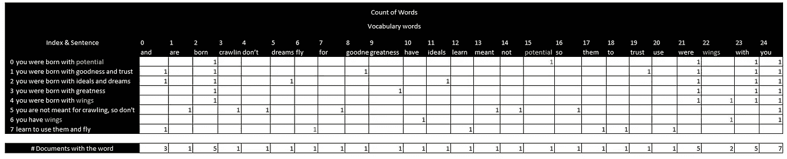

字数统计矩阵，作者图片

以上是通过下面的代码计算的。

```
from sklearn.feature_extraction.text import CountVectorizer
count_vect = CountVectorizer()
X_train_counts = count_vect.fit_transform(corpus)
terms = count_vect.get_feature_names()
```

让我们找出词语*****翅膀的词频。*****

*   **词频为字 ***势*** 在 Doc 0= 1**
*   **文档 4 中的词 ***翼*** 的词频= 1**
*   **文档 6 中 ***翼*** 词的词频= 1**

**然而，如果我们只是把频率这个词作为重要性的衡量标准，我们就会陷入一个主要的陷阱，正如下面来自[可怕地图](https://twitter.com/TerribleMaps)的[推文](https://twitter.com/TerribleMaps/status/1129765180987117569)所代表的，它代表了美国每个州最频繁出现的单词。**

# **步骤 2:反转文档频率**

**我们需要一种机制来降低在所有文档中出现太频繁的单词的相对重要性。进入 ***逆文档频率*** 。直观地说，如果一个单词出现在所有文档中，那么它可能不会在区分文档中发挥如此大的作用。**

***类似于词频，***

***文档频率(术语 t) =具有术语 t 的文档数/文档总数= d(t)/n***

***逆文档频率=* *文档总数/带有术语的文档数 t = n / d(t)***

**如果一个单词出现在所有文档中，我们希望它在 0-1 范围的底部。因此，对数标度在这里直观地使用是有意义的，因为 log 1 是 0。然而，有一些实际的考虑，如避免臭名昭著的[除以 0](https://en.wikipedia.org/wiki/Division_by_zero) 的错误，1 被加到分母。**

**sklearn 中 TF IDF 矢量器默认设置的逆文档频率计算如下*(默认设置有* `*smooth_idf=True*` *，它将“1”加到分子和分母上，就好像看到一个额外的文档恰好包含集合中的每个术语一次，这防止了零除法)。***

**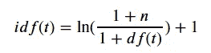**

*   ***n 是文档集中的文档总数。***
*   ***d(t)是文档集中包含术语的文档数。***

**让我们为这些词确定各自的价值— ***潜能*** 和 ***翅膀*** 。**

*   **文件数量= 8**
*   **语料库中包含单词 ***潜在*** 的文档数量= 1**
*   **语料库中包含单词 ***wings*** 的文档数= 2**

**应用逆文档频率的公式，我们得到**

**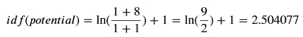****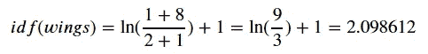**

**可以通过运行以下 Python 代码来获得这首诗的 IDF 值。**

```
**# explore idf
# idf_ attribute can be used to extract IDF values
# transpose the 1D IDF array to convert to a dataframe to make it easy to visualise
df_idf = idf2df(vectorizer.idf_[:,np.newaxis].T ,terms)
display(HTML(df_idf.to_html()))**
```

**我们获得如下所示的值，我们可以交叉检查单词 ***【潜力】*** 和 ***翅膀*** 的计算值。注意，语料库中的一个单词只有一个 IDF 值。**

**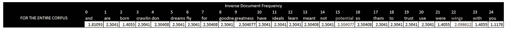**

**逆文献频率论鲁米的诗，由作者意象**

# **第三步:相乘并归一化**

**顾名思义，TF-IDF 是术语频率(TF)和逆文档频率(IDF)的组合，通过将两个值相乘获得。sklearn 实现然后在 TF 和 IDF 之间的乘积上应用规范化。让我们详细看看其中的每一个步骤。**

## **步骤 3 a:将 TF 和 IDF 相乘**

**在将这两个矩阵相乘时，我们对项频率矩阵和逆文档频率进行逐元素相乘。考虑第一句——“你生来就有潜力”。求这句话的 TF 和 IDF 的乘积，计算如下。**

**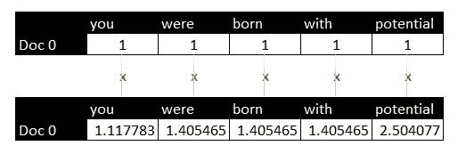**

**这可以通过针对整个数据帧的以下代码来完成:**

```
**df_mul = df_count.mul(df_idf.to_numpy())
display(HTML(df_mul.to_html()))**
```

**将其应用于语料库，我们得到以下矩阵:**

**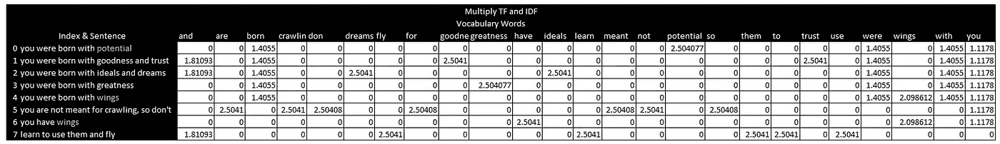**

**你可能会注意到 TF 和 IDF 的乘积可以大于 1。现在，最后一步是归一化这些值，使 TF-IDF 值始终介于 0 和 1 之间。**

## **步骤 3 b:标准化 TF 和 IDF 的乘积**

**在日常生活中，当我们想要将数值标准化以便于比较时，我们使用百分比或比例。因此，我们可以假设计算一个句子中不同单词的 TF-IDF 值的比例。请注意，TF 和 IDF 都是非负值，因为术语频率和逆文档频率的最低可能值是 0。因此，去掉比例就相当于 L1 归一化。在 L1 归一化中，向量中的每个元素(想想一个句子的各种 TF-IDF 值)除以所有元素的绝对值之和。在 sklearn 中有一个 L1 归一化值的选项，但这不是默认设置。**

**在 sklearn 中，应用的默认归一化是 L2 归一化。考虑 L2 归一化最简单的方法是，考虑三角形的一个角在原点的直线长度或毕达哥拉斯定理。**

**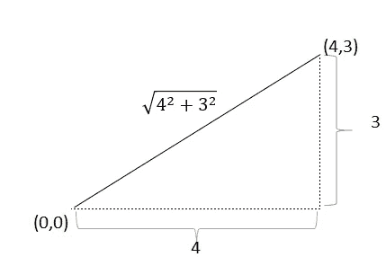**

**作者图片**

**在上图中，线的长度是 5。在这种情况下，直线是一个 1D 矢量。当向量是 n 维时，向量的长度类似于一条线的长度，但扩展到 n 维。因此，如果向量 v 由 n 个元素组成，向量的长度计算如下**

**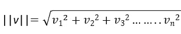**

**在 L2 归一化中，我们实际上是将向量除以向量的长度。关于 L1 和 L2 范数的更多数学解释，请参考[维基百科](https://en.wikipedia.org/wiki/Norm_(mathematics))。**

**为了应用 L2 范数，对于每个句子，我们需要计算 TF 和 IDF 乘积的平方和的平方根。**

**它可以在 Python 中完成，如下所示:**

```
**from sklearn.preprocessing import Normalizer
df_mul.iloc[:,:] = Normalizer(norm='l2').fit_transform(df_mul)
display(HTML(df_mul.to_html()))**
```

**以下是获得的值:**

**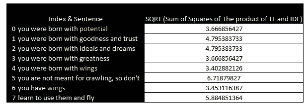**

**最后，我们准备计算最终的 TF-IDF 分数！**

**TF-IDF 为字 ***势*** 在 ***你天生就有势*** (Doc 0): *2.504077 / 3。66856427 = 0.682895***

**TF-IDF 为单词 ***翅膀*** 在 ***中你生来就有翅膀****(*Doc 4)=*2.098612/3。402882126 = 0.616716***

**TF-IDF 为字 ***翼**中的**翼*****(Doc 6)=*2.098612/3。452116387 = 0.607744***

**这可以用下面的代码来计算。**

```
**from sklearn.preprocessing import Normalizer
df_mul.iloc[:,:] = Normalizer(norm=’l2').fit_transform(df_mul)display(HTML(df_mul.to_html()))**
```

**当您运行上面的代码时，您会得到如下的结果，这与上面的展望输出部分中的矩阵相同。**

****

**TF-IDF 对鲁米诗歌《作者的形象》的评价**

**到目前为止，我们已经完成了以下工作**

**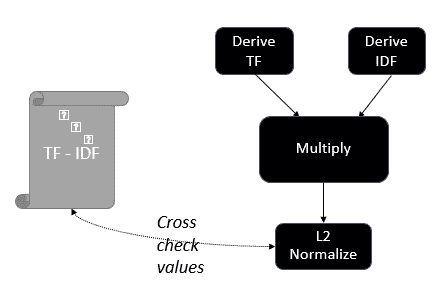**

## **限制**

**TF-IDF 的主要局限是没有考虑词序，而词序是理解句子意义的一个重要部分。**

**此外，文档长度会在 TF IDF 值中引入大量差异。**

## **假设**

**以下是本帖中使用的假设和约定。**

1.  ***四舍五入-为了便于显示，小数四舍五入到小数点后 4 位。我已经注意不四舍五入作为例子的数字。你在不同单元格中发现的任何舍入变化都是因为这个原因。***
2.  ***正如 sklearn 文档中提到的，大多数教科书中的 IDF 公式与 sklearn 中的实现略有不同。***
3.  ***为了简单起见，我使用了 sklearn TF IDF 矢量器的默认设置。有多种方法可以改变这一点，例如 a)使用 L1 归一化代替 L2 归一化& b)设置 smooth_idf=False，这样不会将“1”加到分子和分母上。***
4.  ***上例中没有删除停用词。对于各种用例，可以删除相关的停用词。***
5.  **我使用这么小的语料库只是为了举例说明。在真实的用例中，插图中显示的语料库、词汇表和矩阵要大得多。**

## **Github 参考**

**[GitHub 中有用于计算 TF-IDF 值的 Jupyter 笔记本](https://github.com/annts/tf-id_demystified/blob/master/tf_idf_demo.ipynb)。**

## **参考资料:**

**[1][sci kit-学习文档](https://scikit-learn.org/stable/modules/feature_extraction.html)**

**[2] [文本分类框架](https://developers.google.com/machine-learning/guides/text-classification/step-2-5)，谷歌，2018**

**【3】[如何在介质上写数学](https://medium.com/@tylerneylon/how-to-write-mathematics-on-medium-f89aa45c42a0)**