# 对 HDBSCAN 和基于密度的聚类的简要介绍

> 原文：<https://towardsdatascience.com/a-gentle-introduction-to-hdbscan-and-density-based-clustering-5fd79329c1e8?source=collection_archive---------6----------------------->

## 用大约 5 分钟解释 HDBSCAN

“*带噪声的应用程序的基于层次密度的空间聚类*”(多么拗口…)， **HDBSCAN，是我的首选聚类算法之一。我觉得每个人都应该将这种方法纳入他们的数据科学工具箱。**

我在[的上一篇博客](https://pberba.github.io/stats/2020/01/17/hdbscan/)中写了这方面的内容，我试图尽可能深入地解释 HDBSCAN。这一次我采取了相反的方法:我将尽可能简洁地解释 HDBSCAN 和基于密度的集群的主要思想。

我认为(也希望)这本关于 HDBSCAN 的入门书对数据科学的初学者和新手会更友好。

**为什么选择基于密度的聚类？**

让我们从一个样本数据集[开始。](https://github.com/lmcinnes/hdbscan/blob/master/notebooks/clusterable_data.npy)

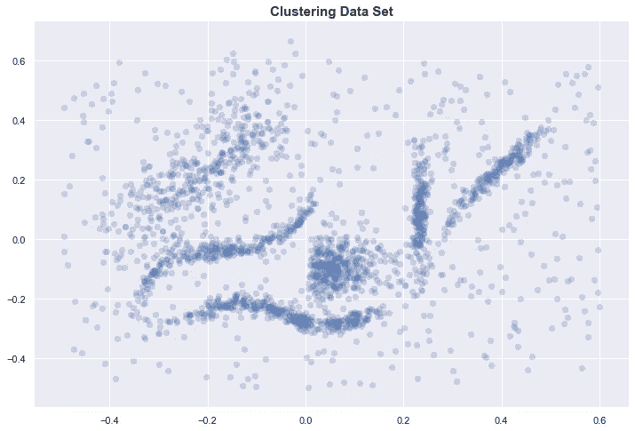

如果你用肉眼试着识别这些集群，你可能会识别出 6 个集群。

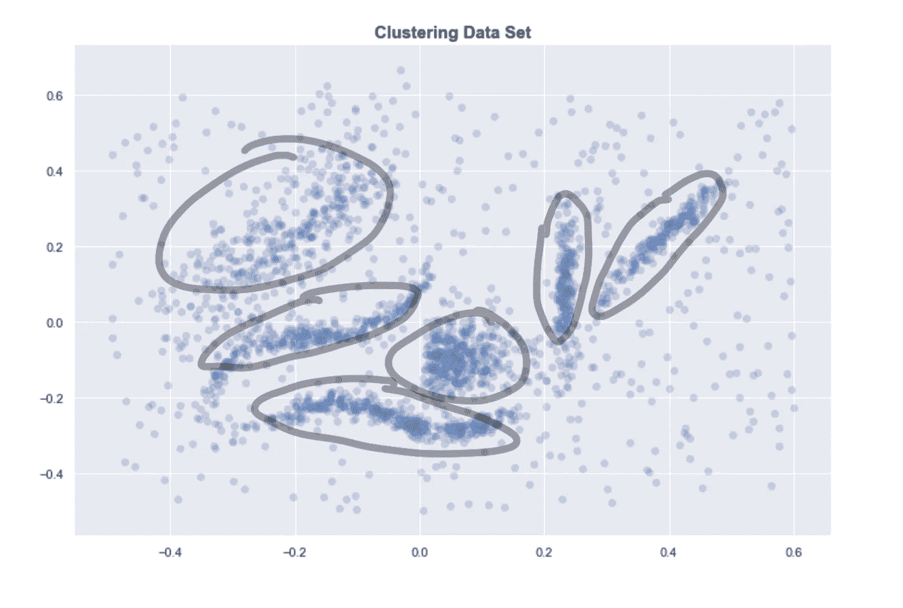

6 个“直观”集群

即使提供了正确数量的聚类，K-means 也明显给出了不好的结果。我们上面确定的一些集群被分成两个或多个集群。另一方面，HDBSCAN 为我们提供了预期的集群。

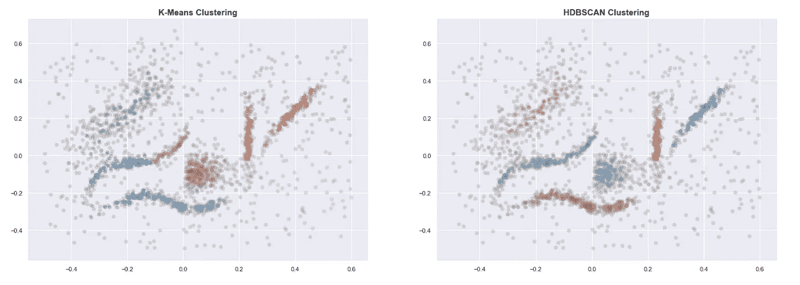

与 K-means 不同，基于密度的方法即使在数据不干净和聚类形状怪异的情况下也能很好地工作。

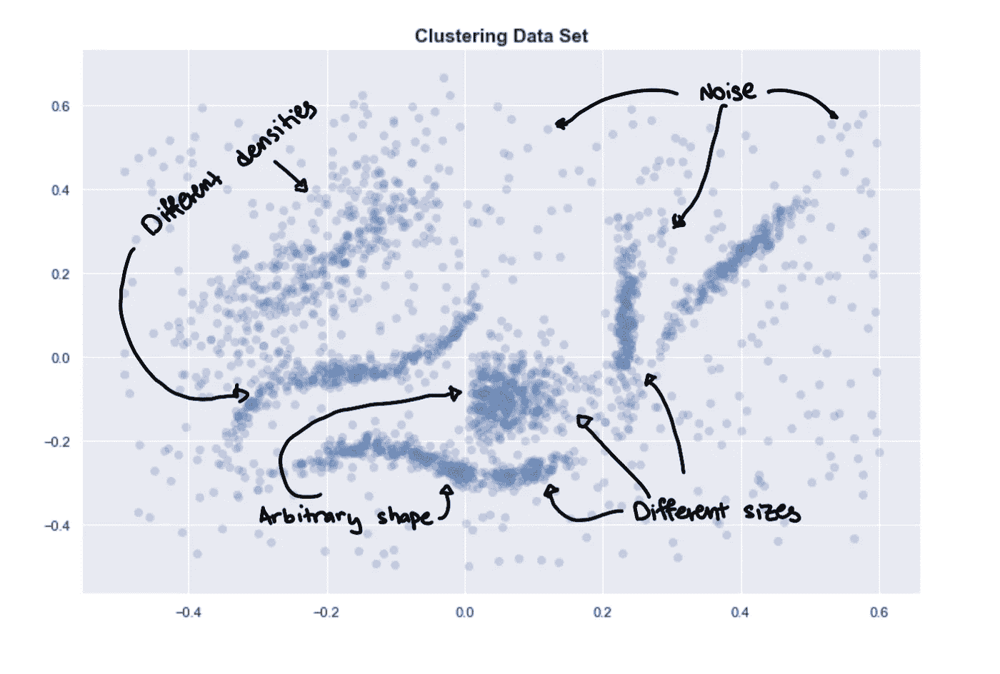

HDBSCAN 如何做到这一点？从高层次来看，我们可以将基于密度的聚类过程简化为以下步骤:

1.  估计密度
2.  选择高密度区域
3.  合并这些选定区域中的点

# 估计密度

我们需要某种方法来估计某些点周围的密度。一种常见的方法是使用**“核心距离”**这是一个点到它的第 K 个最近邻居的距离。

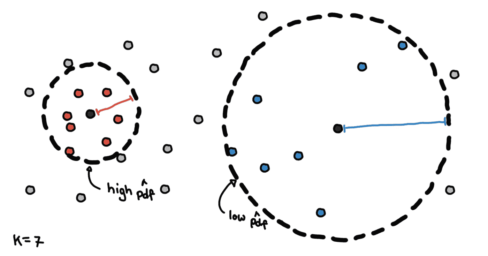

K=7 时的核心距离

较密集区域中的点将具有较小的核心距离，而较稀疏区域中的点将具有较大的核心距离。**核心距离是这些方法“基于密度”的原因。**

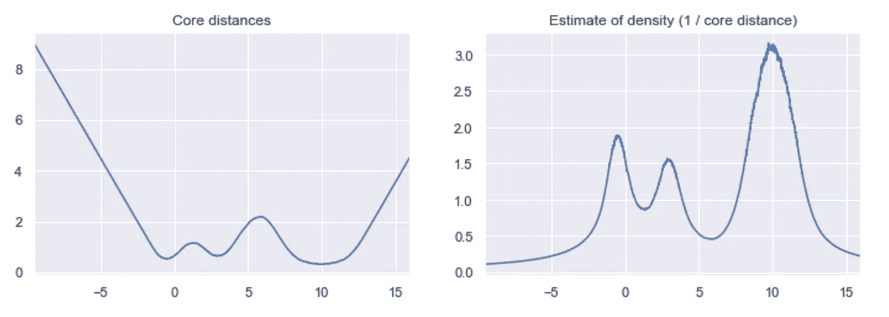

给定地核的距离，我们可以通过求密度的倒数来估计密度。有了这些估计，我们就可以知道**密度景观**是什么样子了。

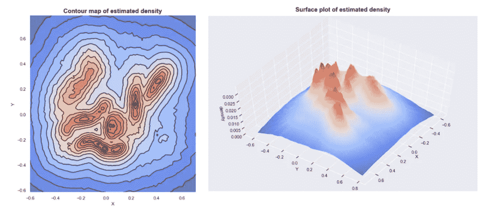

根据我们的样本数据集估计的密度

如果我们画出这些密度，我们可以看到这种密度景观的山脉对应于数据的不同聚类。

# 简单聚类选择

选择聚类的一种方法是选择全局阈值。通过获取密度高于阈值的点，并将这些点分组在一起，我们得到我们的聚类。

将下面的插图视为上面的表面图的横截面。

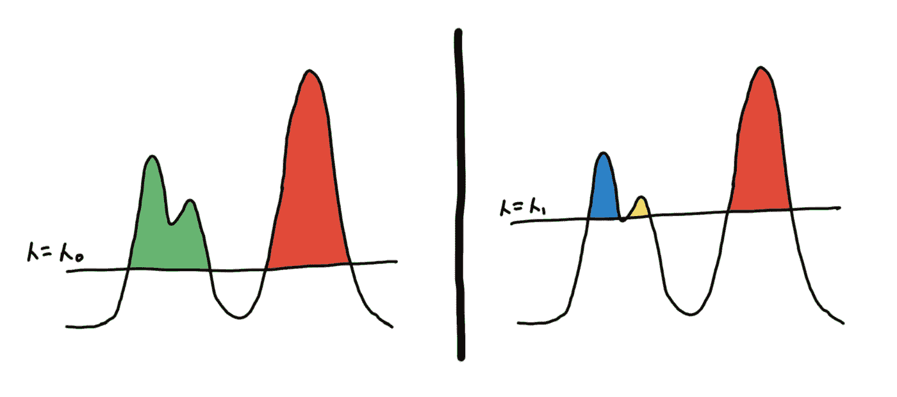

基于不同阈值的两种不同聚类

想象海洋上的岛屿，海平面是门槛，不同的岛屿是你的集群。海平面以下的土地是噪音。随着海平面的下降，新的岛屿出现，一些岛屿结合起来形成更大的岛屿。

这是我们降低海平面时产生的几个集群。

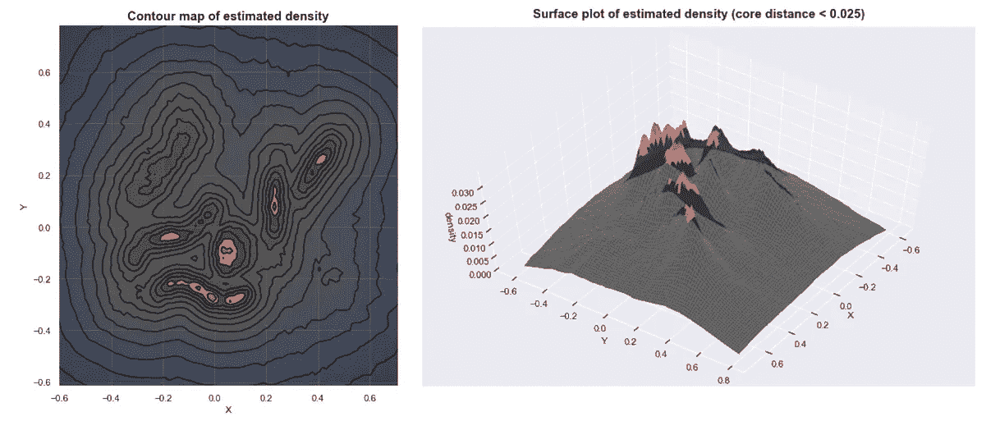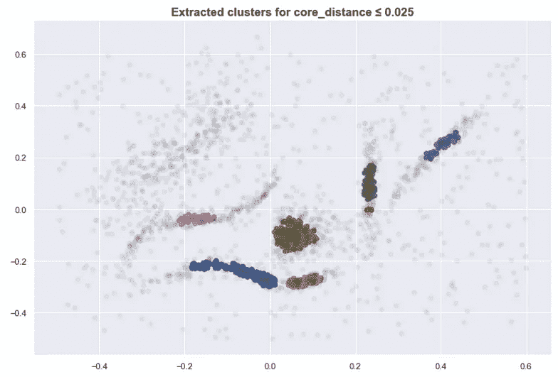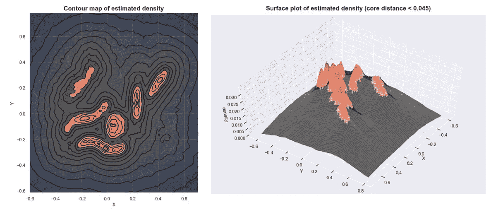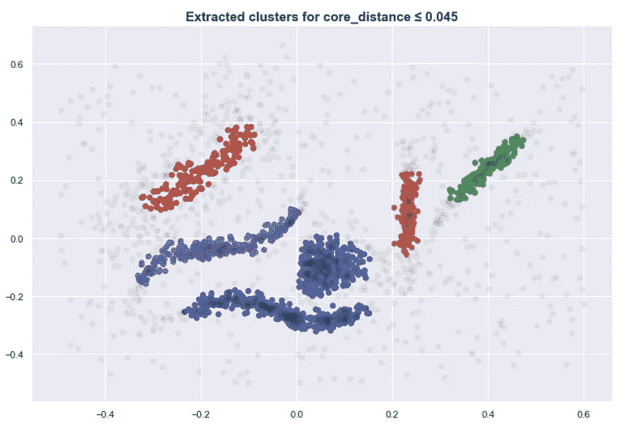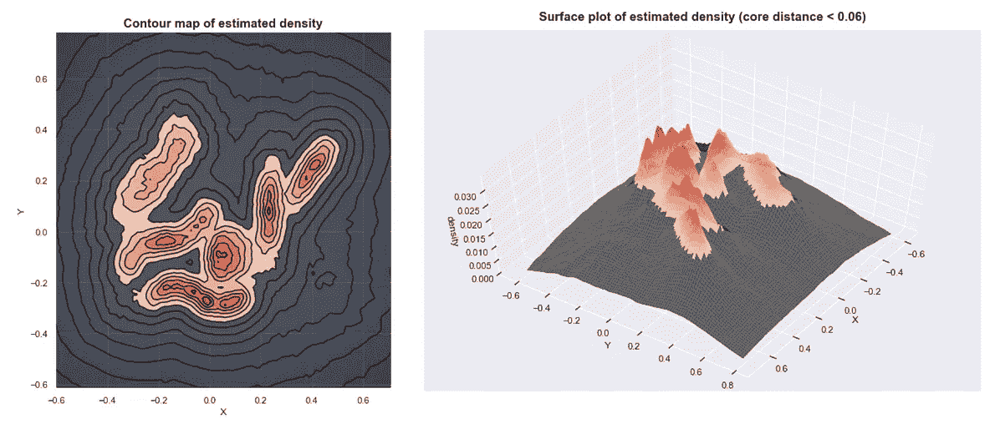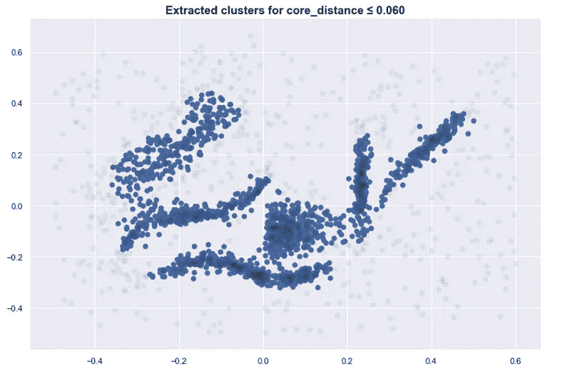

这种方法接近于 DBSCAN 所做的。虽然简单，但这需要我们找到合适的阈值来获得有意义的聚类。

如果您将阈值设置得太高，则太多的点会被认为是噪声，并且您会分组不足。如果设置得太低，可能会使点过度分组，所有的东西都只是一个簇。

# 不同密度的聚类选择

**使用全局阈值方法，当聚类具有不同的密度时，你可能会遇到困难。**如果我们在下面的例子中只使用一个阈值，我们要么过度分组蓝色和黄色集群，要么没有包括整个红色集群。

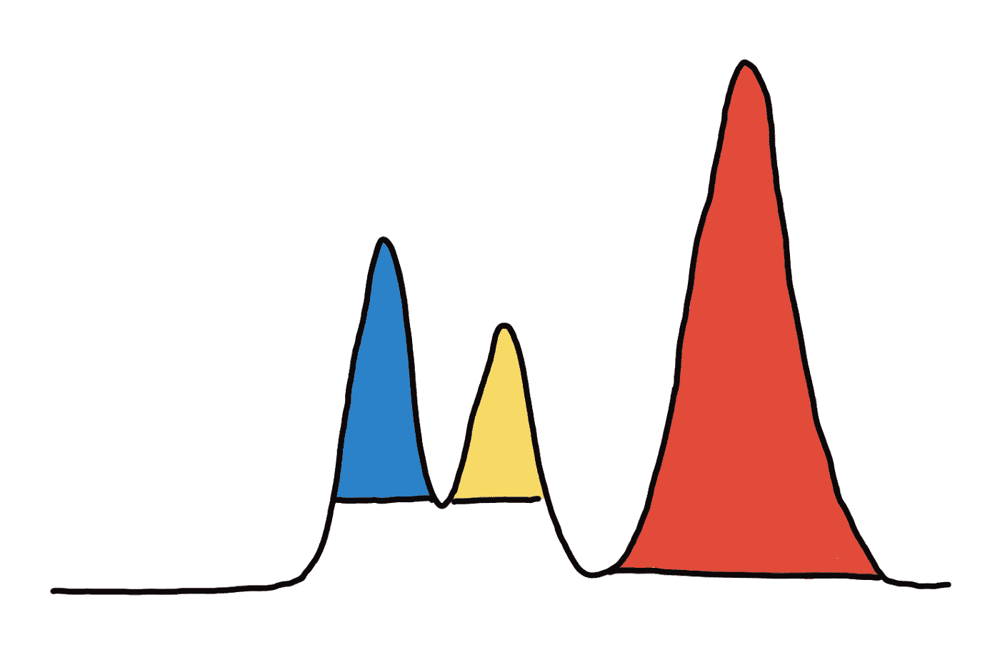

最佳聚类需要不同的阈值

您可能会认为密度中的每个峰值应该是一个集群，但是，这并不总是最佳的。

看下图。左边应该有 3 个集群，右边应该有 2 个集群。

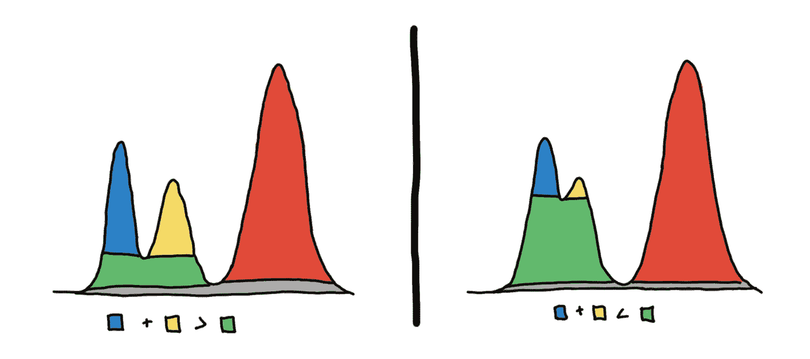

HDBSCAN 首先建立一个层次结构，以确定哪些峰值最终合并在一起以及以什么顺序合并，然后对于每个集群，它会询问，**是保留这个集群还是将其分成其子集群**？在上图中，我们应该选择蓝色和黄色的区域还是绿色的区域呢？

鉴于密度景观，你可以认为每座山是一个集群。我们必须确定两座山峰是否属于同一座山。*是有两座山，还是只有一座山有两座峰？*

以下是说明这一点的例子

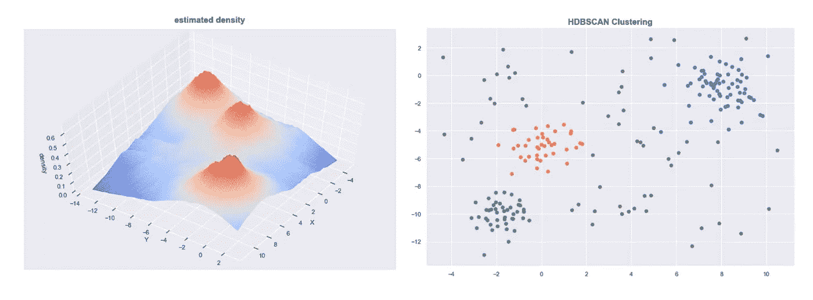

“3 个集群数据集”

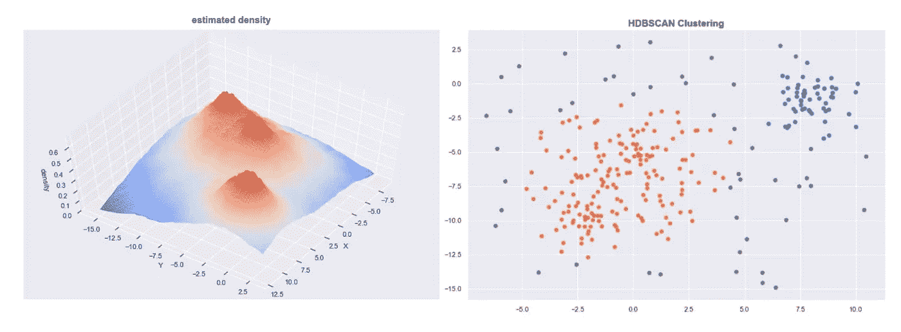

"两个群集数据集"

如果您使用 sklearn 的 HDBSCAN，您可以绘制集群层次结构。

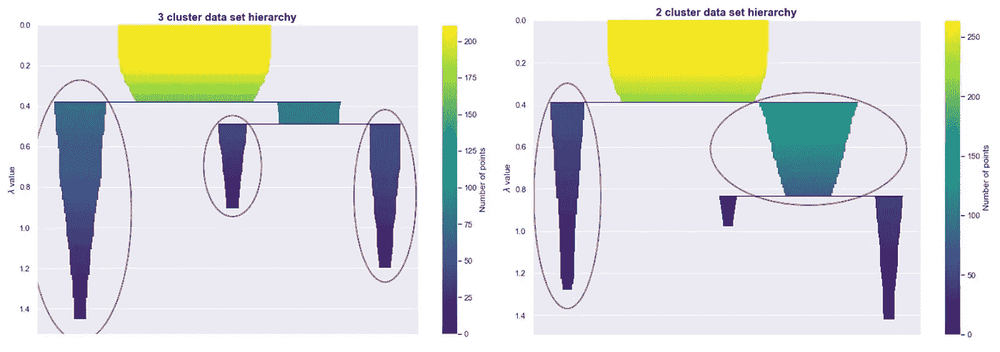

要选择，我们看哪一个更“坚持”。我们看到的山峰更靠近还是分开？聚类稳定性(持久性)由层次图中不同颜色区域的面积表示。我们用集群稳定性来回答我们的山区问题。

当两座山峰实际上是两座山时，两座山峰的体积之和大于其底部的体积。当山峰只是一座山的特征时，那么底部的体积将大于山峰体积的总和。

**使用这种启发式方法，HDBSCAN 能够决定是否将一个集群细分为其子集群**。这样，它会自动选择要提取的聚类。

# 结论和更多资源

1.  我们基于核心距离估计密度，并形成**密度景观**(是什么使这些基于密度)
2.  我们可以使用一个全局阈值来设定海平面并识别岛屿(T2)
3.  我们可以试着决定，**这是几座山还是一山多峰**？(HDBSCAN)

我希望这能让你知道 DBSCAN/HDBSCAN 是如何工作的，以及是什么让这些方法“基于密度”。其他方法，如光学或 DeBaCl，使用类似的概念，但在选择区域的方式上有所不同。

如果你想了解更多关于 HDBSCAN 的统计动机，点如何组合在一起的实现细节，或者 HDBSCAN 如何构建层次结构，你可以[查看我的博客文章](https://pberba.github.io/stats/2020/01/17/hdbscan/)，在那里我会更详细地介绍。

技术提示:这里绘制的估计密度不仅仅是`1 / core_distance`。我必须对数据进行一些转换，使其在视觉上更具吸引力。

 [## 了解 HDBSCAN 和基于密度的聚类

### HDBSCAN 是由 Campello、Moulavi 和 Sander 开发的聚类算法[8]。它代表“等级……

pberba.github.io](https://pberba.github.io/stats/2020/01/17/hdbscan/)  [## HDBSCAN 的工作原理- hdbscan 0.8.1 文档

### HDBSCAN 是由 Campello、Moulavi 和 Sander 开发的聚类算法。它通过将 DBSCAN 转换成一个…

hdbscan.readthedocs.io](https://hdbscan.readthedocs.io/en/latest/how_hdbscan_works.html)  [## 加速分层密度聚类

### 提出了一种基于层次密度聚类的加速算法。我们的新算法改进了…

arxiv.org](https://arxiv.org/abs/1705.07321) 

[马科斯·曼特的照片](https://unsplash.com/photos/sL0xKYbb04w)