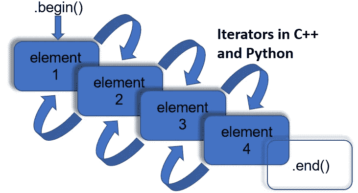

# C++和 Python 中迭代器的简明介绍

> 原文：<https://towardsdatascience.com/a-gentle-introduction-to-iterators-in-c-and-python-4eb8c6e2238f?source=collection_archive---------34----------------------->

## 第 2 部分:使用 itertools 了解 Python 中的迭代器



来源:恰兰·库尼(用 Powerpoint 绘制)。

在我之前的文章中([此处](/a-gentle-introduction-to-iterators-in-c-and-python-dafece4b0f4f))，我对在代码中使用迭代器的优点进行了一般性的讨论，并浏览了一些 C++初学者的例子。在这里，我将扩展迭代器的介绍，看看它们是如何在 Python 中实现的，以及如何使用它们来改进代码。

# Python 迭代的基础

作为一名使用 Python 的数据科学家，您肯定会遇到存储在一系列容器中的各种数据类型，比如列表、元组和字典。在 Python 中，这些容器都是可迭代的对象，这意味着我们可以从它们那里获得一个迭代器(和在 C++中一样，Python 字符串也是可迭代的对象)。在 Python for 循环中对这些可迭代数据容器进行操作需要一个**迭代器方法**和一个 **next 方法**的执行来创建迭代器并前进[1]。这些内置方法如下所示，其中 **iter(name)** 从列表中返回一个迭代器，而 **next(it)** 允许我们遍历迭代器并打印出每个元素。

```
name = ["Ciaran", "Cooney"]
it = iter(name)
print(next(it))
print(next(it))#output
Ciaran
Cooney
```

Python 附带了几个内置函数，如 **zip** 和 **map** ，它们有助于数据容器的迭代。一旦你对何时和如何使用它们有了直觉，这些都是非常有用和省时的工具。zip 函数的有效工作方式是使用 iter()和 next() to 调用并遍历每个输入参数，然后返回一个迭代器，该迭代器可以返回包含具有公共索引的输入数据的元组。

```
a = zip([1,2,3], ['a','b','c'])
print(list(a))#output
[(1, 'a'), (2, 'b'), (3, 'c')]
```

在前进到下一个元素之前，Map 将函数应用于交互变量中的每个元素。这里，对第二个参数调用 iter()，并将输入函数应用于相应的元素。然后调用 Next()，直到遍历完迭代器。

```
b = map(len, ['hello', 'world'])
print(list(b))
```

# **构建自己的迭代器**

在将来的某个时候，您可能希望将自己的类或对象制作成迭代器，也许是为了提高数据处理管道的性能。为此，您需要实现 **__iter__()** 和 **__next__()** 方法。__iter__()方法返回迭代器对象，而 __next__()方法在每次迭代中简化操作(这里只是返回元素)。重要的是要小心不要创建一个将继续无限前进的迭代器，所以我们使用 if-else 语句，并在迭代器用尽时抛出 **StopIteration** 。

```
class MyClass():

    def __init__(self, container):
        self.container = container

    def __iter__(self):
        self.count = 0
        return self

    def __next__(self):
        if self.count < len(self.container):
            x = self.container[self.count]
            self.count += 1
            return x
        else:
            raise StopIterationmyclass = MyClass(["Hello", "my", "name", "is", "Ciaran"])
myiter = iter(myclass)for x in myiter:
    print(x)#output
Hello
my
name 
is 
Ciaran
```

# Itertools

尽管知道幕后发生了什么总是好的，但事实是，您与迭代器的交互通常是通过内置函数和 itertools 包进行的。Itertools 有这么多优秀的迭代器工具，所以花时间翻一翻[文档](https://docs.python.org/2/library/itertools.html)看看有什么吸引你的眼球是很值得的。

我喜欢的一个函数是 **dropwhile()** ，它允许你创建一个迭代器，只要谓词为真，它就从 iterable 中删除元素，之后返回所有元素。 **Groupby()** 是一个常见的迭代器算法，它从 iterable 返回连续的键和组。it itertools 的另一个有用的功能是 **permutations()** 。正如您可能已经猜到的，这个函数返回包含在输入 iterable 中的元素的排列。置换的长度可以由第二个参数约束， *r (* 参见下面的代码*)，*否则置换将是输入 iterable 的长度。我编写了一些使用这些函数的例子:

```
print(list(dropwhile(lambda x: x<=3, [1,2,3,4,5,6,7,8,9,3])))
#output: [4, 5, 6, 7, 8, 9, 3]print(list(list((list(g), k)) for k, g in groupby([1,2,2,2,2,3,4,4,4,4,5,5,2,1,1,1,1])))
#output: [[[1], 1], [[2, 2, 2, 2], 2], [[3], 3], [[4, 4, 4, 4], 4], [[5, 5], 5], [[2], 2], [[1, 1, 1, 1], 1]]print(list(permutations([1,2,3])))
[(1, 2, 3), (1, 3, 2), (2, 1, 3), (2, 3, 1), (3, 1, 2), (3, 2, 1)]print(list(permutations([1,2,3], 2)))
[(1, 2), (1, 3), (2, 1), (2, 3), (3, 1), (3, 2)]
```

# 迭代器代数

术语“迭代器代数”在 itertools 文档中用于描述组合迭代器工具以提高整体代码效率和性能的一般概念[2]。组合 itertools 函数一开始可能需要一点思考，并且可以很快获得相当大的进步，但是在这篇文章中，我将向您展示一个使用 itertools 如何提高处理时间的简单示例。

让我们考虑一个简单的例子，其中我们想要获取两个包含正整数的列表，确定列表中(不在列表中)所有可能的元素组合，并返回每个组合的总和。下面，我用几个 for 循环实现了一个典型的函数来遍历列表并执行求和操作。

```
a = [1,2,3]
b = [4,5,6]
def sum_combinations(a, b):
    combinations, results = [], []
    for i in a:
        for j in b:
            combinations.append(tuple((i,j)))
            results.append(sum((i,j)))
    return combinations, resultscombs, res = sum_combinations(a,b)
print(combs, res)#output
[(1, 4), (1, 5), (1, 6), (2, 4), (2, 5), (2, 6), (3, 4), (3, 5), (3, 6)]
[5, 6, 7, 6, 7, 8, 7, 8, 9]
```

这对于我在这个例子中使用的 3 元素列表来说很好。但是，如果我们将输入扩展为每个包含 10000 个整数，会发生什么呢？为了测试这一点，我导入了**时间**模块，以查看该功能在我公认不太特别的笔记本电脑上会运行多长时间:

```
import time
a = np.random.randint(5, size=10000)
b = np.random.randint(5, size=10000)
start = time.time()
combs, res = sum_combinations(a,b)
stop = time.time()
print(f"time: {stop-start}")#output:
time: 108.07000184059143
```

好吧， **108s** 等待一些基本操作似乎是一段相当长的时间。幸运的是，我们有一个替代方案:迭代器代数！

这里我使用 itertools 函数 **product()** 以及上面提到的 **map** 函数。这个函数为我们提供了输入 iterables 的笛卡尔乘积，有点像使用嵌套的 for 循环。然后，当我们遍历输入时，我们使用 map 来应用 **sum** 函数。

```
start = time.time()
res_1 = list(map(sum,itertools.product(a,b, repeat=1)))
stop = time.time()
print(f"time: {stop-start}")#output: time: 34.44488835334778
```

看这里的时差！当我们实现一个标准的循环函数时需要 108 秒，当我们使用 iterator 代数的 itertools 时需要 34 秒**。如果你没有从这篇文章中得到什么，至少注意到当数据的维度扩展时迭代器可以提供的潜在的时间增益。**

我希望这篇文章对那些为了更有效的数据处理而冒险进入迭代器世界的人有用。

我用过的所有 Python 例子和任何附加函数都可以在这里找到:【https://github.com/cfcooney/medium_posts

# 来源

[1]w3schools.com，《Python 迭代器》，*w3schools.com*，2020 年。【在线】。可用:[https://www.w3schools.com/python/python_iterators.asp.](https://www.w3schools.com/python/python_iterators.asp.)

[2] S. Jaiswal，《Python 迭代器教程》， *DataCamp* ，2018。【在线】。可用:[https://www . data camp . com/community/tutorials/python-iterator-tutorial？UTM _ source = AdWords _ PPC&UTM _ campaignid = 898687156&UTM _ adgroupid = 48947256715&UTM _ device = c&UTM _ keyword =&UTM _ match type = b&UTM _ network = g&UTM _ adpossion =&UTM _ creative = 332602034343【t24](https://www.datacamp.com/community/tutorials/python-iterator-tutorial?utm_source=adwords_ppc&utm_campaignid=898687156&utm_adgroupid=48947256715&utm_device=c&utm_keyword=&utm_matchtype=b&utm_network=g&utm_adpostion=&utm_creative=332602034343&utm_targetid=a.)