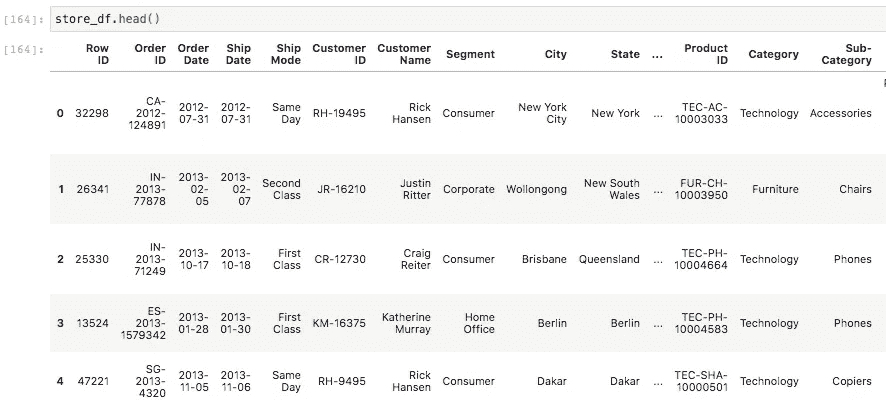
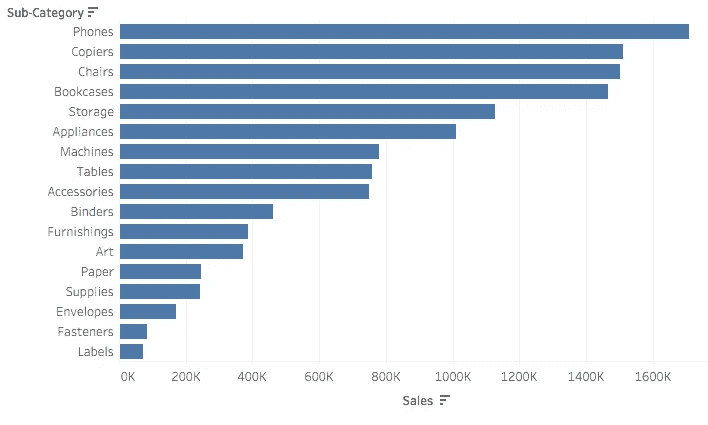
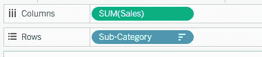
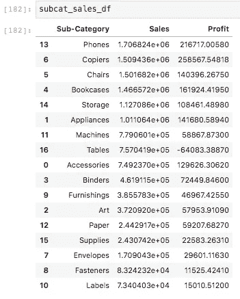
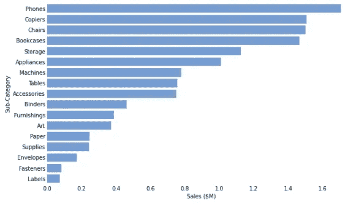

# 面向 Tableau 开发人员的 Python 简介(第 1 部分)

> 原文：<https://towardsdatascience.com/a-gentle-introduction-to-python-for-tableau-developers-part-1-862b9bdd1c85?source=collection_archive---------32----------------------->

## 使用 Python 探索数据

## Tableau 让你迷上了数据，但为什么要止步于此呢？


认识你的数据分析新朋友(照片由 [Unsplash](https://unsplash.com?utm_source=medium&utm_medium=referral) 上的 [Allie](https://unsplash.com/@acreativegangster?utm_source=medium&utm_medium=referral) 拍摄)

像许多其他人一样，我走进数据世界的第一步是穿着 Tableau 开发人员的鞋子。随着 Tableau 技能的提高，我对 SQL 和 Python 等其他东西的接触也增加了。

随着时间的推移，对这些相邻工具的了解增强了我的日常能力。随着我学习更多的 SQL，我更好地理解了如何以最佳方式将数据输入 Tableau。这使我能够在 Tableau 本身之外，对更广泛的数据流拥有更多的所有权。

Python 是自然的下一步。它通过 Tableau Server REST API 提供了对 Tableau 生态系统的灵活控制，并且语法简单明了。

在领略了 Python 在处理数据、构建可视化和创建预测模型方面带来的好处之后，我想鼓励那些精通 Tableau 但还不习惯 Python 的人尝试一下。

## 步骤 1:跳过基础知识，避免教程地狱

我们不打算在这里涵盖 Python 语言的绝对基础。如果你曾经学过另一种口语，这有点像在理解如何问候某人或如何说“是”和“不是”之前学习语法的所有细微差别。

如果你想深入研究 Python 的构建模块，我强烈推荐你阅读一些[这种经典的(免费的)材料](https://learnpythonthehardway.org/book/)，直到你感到自信为止。

我鼓励您从一开始就将 Python 视为一种有价值的工具，而不是一种在使用之前需要掌握的语言。就这样，让我们开始吧！

## 第二步:喂养熊猫

如果您正在处理 Python 和数据，那么熊猫包将是您最好的朋友之一。

对于你与熊猫的第一次约会，我们将重温每个 Tableau 开发者都熟悉的东西:全球超市数据集！只需下载文件并保存在运行 python 笔记本/文件的本地目录中。

把这些数据输入熊猫是多么简单:

```
import pandas as pdstore_df = pd.read_excel('Global Superstore.xls')
```

下面的代码行执行以下操作:

1.  导入 pandas 包，我们将其别名为“pd”。
2.  将 Excel 文件“Global Superstore.xls”加载到名为“store_df”的变量中

不必深入太多细节，值得注意的是，数据世界中一个常见的东西是“数据框架”的概念。如果你想知道为什么我们把数据存放在一个名为“store_df”的变量中，你可以把它想成“store dataframe”。在 Python 世界中,“dataframe”的常见缩写是“df”。

## 第三步:我们刚刚到底给熊猫喂了什么？

使用熊猫套餐的一个好处是它为我们提供了各种便利。例如，让我们看看我们刚刚从“Global Superstore.xls”文件中加载的数据。

```
store_df.head()
```



快速简单地查看我们的数据。

不错！使用任何 Pandas 数据帧都可以访问的“head()”函数，我们查看了加载到“store_df”中的数据。这很像我们在 Tableau 工作簿中单击“数据源”选项卡时看到的底层数据。

## 第四步:选择一个目标，瞄准它

不要抽象地谈论 Python，让我们瞄准一个熟悉的、容易理解的目标。

这是我用 Tableau 的“全球超市”数据整理出来的一张图片:



啊，好熟悉啊！

作为我们在 Python 中的第一个任务，让我们尝试重新创建这个可视化的核心方面。

## 步骤 5:如何将数据与熊猫分组

在上图中，你可以说我们已经按子类别对数据进行了分组，以显示每个子类别的总销售额。

在 Tableau 世界中，我们的做法是将子类别字段拖到行中，将销售字段拖到列中，如下所示:



请注意，Tableau 已经自动指定了“SUM(Sales)”而不仅仅是“Sales”。在 Tableau 中，很多事情都是自动为你做的。

在 Python 世界中，您的指尖拥有强大的功能和灵活性。还记得蜘蛛侠的名言吗？

"巨大的权力(和灵活性)意味着巨大的责任."…撕了本叔叔。

这里的教训是，我们为 Python 的所有灵活性付出的代价是，我们必须使用代码阐明我们试图用数据做什么。在这种情况下，我们希望按“子类别”对数据进行分组，然后对我们的“销售额”值求和。

下面是我们如何向 Python 阐述这一点:

```
subcat_sales_df = store_df\
.groupby(['Sub-Category'])\
.agg({'Sales': 'sum', 'Profit': 'sum'})\
.reset_index()\
.sort_values('Sales', ascending=False)
```

不要介意代码中那些花哨的反斜杠字符，Python 中所做的就是说我们将代码延续到新的一行。我经常这样做是为了让我的代码更易读。拥有可读的代码比最终得到一行你看不懂的失控代码要好。

以下是我们得到的结果:



销售是一个常规数字，不要让显示的格式迷惑你。

所以，让我们一行一行地剖析这段代码。

1.  我们声明一个新变量‘subcat _ sales _ df’
2.  我们按照“子类别”对“商店 _df”进行了分组
3.  合计得出“销售额”和“利润”的总和
4.  然后我们重置索引(现在不要担心这个，这是装饰性的)
5.  最后，我们按照“销售额”对结果进行降序排序

别太疯狂，好吗？您可能已经熟悉了这些概念，但是您不是在 Tableau 中单击和拖动东西，而是显式地编写代码。

## 第六步:锻炼你的航海能力

虽然 Pandas 确实有一些基本的可视化功能，但让我们介绍另一个包:Seaborn，它以较少的开销提供了良好的视觉效果。

让我们尝试使用 Seaborn 包复制我们之前的 Tableau 视觉效果:

```
import seaborn as sns
from matplotlib import pyplot as plt f, ax = plt.subplots(figsize=(10, 6))viz = sns.barplot(
    data=subcat_sales_df,
    x='Sales',
    y='Sub-Category',
    color='cornflowerblue',
    saturation=0.7
)ax.tick_params(axis='both', which='both', length=0)
ax.set_xlabel("Sales ($M)")
sns.despine(left=True, bottom=True)
```

哇哦。代码太多了，对吧？试着这样想。当你在 Tableau 中创建一个视觉效果时，你需要做大量的点击来获得合适的格式，不是吗？

例如，您可以双击坐标轴，将其重命名为“Sales ($M)”，或者右键单击并设置格式，去掉网格线和坐标轴刻度。

编写代码时的权衡是，您可以创建一些可重复和可重用的东西，但您确实要为第一次就把它做好付出前期成本。



让我们仔细分析一下赋予这种视觉效果的代码:

1.  我们导入了 Seaborn 库(一个可视化库),并将其命名为“sns”
2.  我们导入了著名的 matplotlib 库的 pyplot 功能(我们这样做是因为 matplotlib 和 Seaborn 之间有一个有用的交叉——Google 一下可以找到更多！你很快就会比我知道得更多！)
3.  我们基本上划分出一些 10 个单位宽、6 个单位高的可视化不动产；请注意，我们可以通过在后面的代码行中修改“ax”变量来修改这个不动产。
4.  我们定义视觉。在这种情况下，我们调用 Seaborn 包的‘bar plot’函数，它根据我们的规范构造一个条形图。我们可以看到，我们的条形图基于我们创建的 dataframe，它提供了所需的子类别和销售数据。
5.  为了做一些收尾工作，我们修改了在上面(3)中创建的“ax”变量的一些格式。这通过去除刻度线和重新标记轴来清理图表。

## 挑战自我

此时，您可以选择尖叫着逃离 Python。事实是，如果你已经非常擅长 Tableau，那么你最初几次尝试用 Python 构建任何东西都会很困难。

罗马不是一天建成的，对吗？有一部分可能是。但它可能是一些非常基本的东西，就像我们刚刚在这里建立的一样！

我保证如果你有耐心，花一点时间学习 Python，你会从中受益。最终，你可能会像我一样发现，有些事情你可以在 Python 中完成，而在 Tableau 中却做不到。完成工作很大程度上依赖于拥有合适的工具，所以扩大你的工具箱没有坏处。

## 包装它

我们能做的还有很多。我们刚刚为自己建造了一个发射台，在下一篇文章中，我们将比这里更进一步。

在下一期文章中，我们将探索将 Tableau 的计算字段知识转移到 Python 世界有多容易。我们还将看到如何通过盈利能力来渲染我们在这里构建的视觉效果。

希望能在那里见到你！