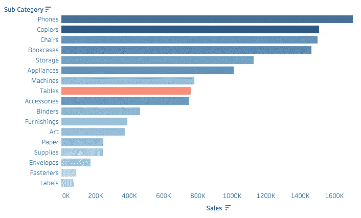
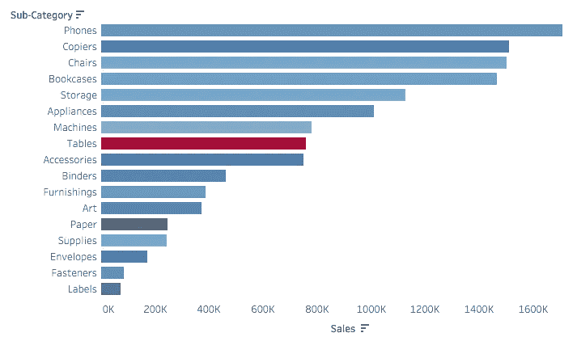
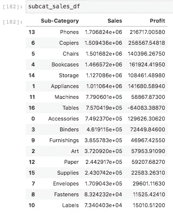
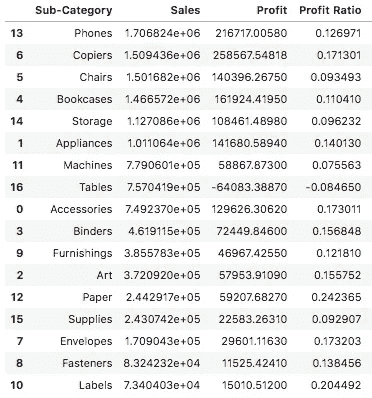
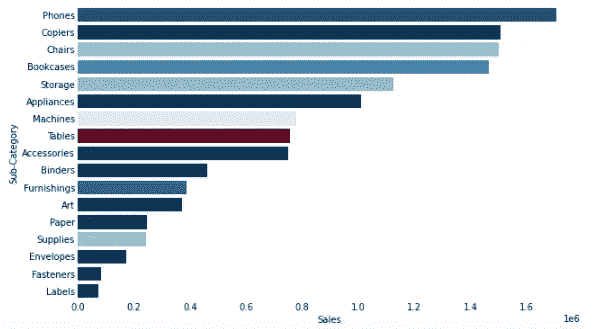

# 面向 Tableau 开发人员的 Python 简介(第 2 部分)

> 原文：<https://towardsdatascience.com/a-gentle-introduction-to-python-for-tableau-developers-part-2-c18095a03e0e?source=collection_archive---------52----------------------->

## 使用 PYTHON 探索数据

## 感受计算和颜色渐变


Joyce McCown 在 [Unsplash](https://unsplash.com?utm_source=medium&utm_medium=referral) 上的照片

我们回来了！让我们从本系列的[第一篇文章中停止的地方开始，使用我们在那里构建的视觉效果作为起点。](/a-gentle-introduction-to-python-for-tableau-developers-part-1-862b9bdd1c85)

在我们开始之前，让我们为我们将在这里实现的目标做好准备:

1.  基于我们对在 Tableau 中创建计算字段的了解，展示如何将其转化为 Python
2.  展示我们如何使用颜色来增加视觉效果的深度

在 Tableau 中，你经常会被一个棘手的情况困扰，这个情况需要你进行各种级别的计算。你们中的一些人可能已经通过谷歌搜索到了这一点，如果你在搜索栏中键入“级别”，它会自动完成“细节级别表”(我感觉到你)。

虽然学习 Python 的所有细微差别需要时间，但使用任何编程语言的一个强大方面是您可以自由地创造性地解决问题。您会发现，在 Tableau 中，可能有几种不同的方法来获得正确的结果，而在 Python(或任何编程语言)中，选项几乎是无限的。

我认为 Tableau 做得很好的一件事是标记卡。在这个区域中，你可以拖动字段来修改视觉效果的各个方面，比如大小、颜色、标签和工具提示中提供的细节。让我们来探索一下如何用 Tableau 中的 marks card 将点击过的东西拿走，并用 Python 重新创建它的输出。

在今天的练习中，我们将使用“利润”和“销售额”值创建一个新列(类似于计算字段)，并将其命名为“利润比率”。然后，我们将应用这个新列来增强我们在第一篇文章中创建的视觉效果，这样，利润率就决定了视觉效果中的颜色。

首先，让我们在 Tableau 中建立一个基线来进行比较。

## 第一步:设定目标，首先在 Tableau 中建立目标

让我们回顾一下上周的内容:


作为一个曾经教授 Tableau 培训的人，这勾起了我的回忆。

好吧，那么除了删除网格线(又名非数据墨水)，还有什么可以让它变得更好呢？

我们可以尝试按盈利能力着色…让我们通过将“盈利”拖到 marks 卡上的“颜色”来尝试一下:



按子类别销售，按利润着色

给视觉效果添加颜色渐变是很有价值的。但是让我们记住，现在我们是根据总利润来着色的。如果你忽略了“表格”，这是一种引人注目的东西，那么这种视觉效果中的颜色传达了一个明显的信息:销量较高的子类别也有较高的利润。

但是如果我们更想知道哪个子类别相对来说更有利可图呢？仅通过数量分析盈利能力并不能提供全部情况，因为你可以以 0.1%的利润率销售 100 万件商品，比以 50%的利润率销售 1000 件商品获得更多利润。如果我们知道这些产品是什么，也许我们的业务可以将重点转移到每销售单位更有利可图的*产品上。*

所以让我们看看，从不同的角度来看这些相同的数据，是否能给我们一些启示。

在 Tableau 中，利润率的计算如下所示:

```
SUM([Profit]) / SUM([Sales])
```

上面的计算将总利润除以总销售额，得到利润率。

当我们用利润率而不是原始利润来着色时，我们的视觉效果是这样的:



按子类别销售，按利润率着色

这里的差别很微妙，但我们可以立即看到颜色不再遵循以前的规则“顶部较暗，底部较亮”。

纸张和标签，这是底部饲料在我们以前的视觉，似乎带来了最高的利润每销售。

当我们按利润率着色时，我们获得了一个更相关的画面，让我们看到每单位销售的*，纸张和标签都做得很好。虽然这些产品带来的销售额较低，但它们带来的收入利润却很高。如果没有这种洞察力，也许我们会忽视这个有利可图的业务领域。*

## 第二步:用 Python 计算利润率

没必要把事情弄得不必要的复杂。首先，就 Python 代码而言，让我们回顾一下上一篇文章中我们离开的地方。

我们有一个名为“subcat_sales_df”的 Pandas 数据框架，它包含“子类别”、“销售额”和“利润”列。

它看起来是这样的:



给定这个数据框架，下面是创建一个新的“利润率”列的步骤:

```
subcat_sales_df['Profit Ratio'] = subcat_sales_df['Profit'] / subcat_sales_df['Sales']
```

用简单的英语来说，我们将“利润率”一栏定义为“利润”除以“销售额”。别太疯狂，好吗？

请记住，我们的“subcat_sales_df”数据框架是根据上一篇文章中的原始数据进行预处理的。这又回到了我们之前说过的关于 Python 中的自由和灵活性:你掌控自己的命运。想重塑你的数据并像我们在这里做的那样存储在不同的变量中吗？你完全可以这样做。

我们的“利润率”看起来是这样的:



## 步骤 3:用 Python 绘制颜色渐变

在我们的上一篇文章中，我们创建了一个条形图，显示每个子类别的销售量。

让我们看看如何实现这一点。下面是我用来为图表添加“利润率”作为颜色渐变的代码:

```
from matplotlib import cmfig, ax = plt.subplots(figsize=(10, 6))ax = sns.barplot(
    data=subcat_sales_df,
    x='Sales',
    y='Sub-Category',
    palette=cm.RdBu(subcat_sales_df['Profit Ratio'] * 7.5)
)ax.tick_params(axis='both', which='both', length=0)
ax.set_xlabel("Sales")
sns.despine(left=True, bottom=True)
```

不要担心这里所有的“ax”和“fig”废话，这主要与格式(轴标签等)有关。随意摆弄这里看到的标量(7.5)；调整它将改变颜色渐变的性质。

这里的关键是“调色板”被设置为 matplotlib 颜色图值。“RdBu”表示该颜色映射从红色到蓝色。颜色映射的值由我们传入的值决定，在本例中是“利润率”数据。

它看起来是这样的:



## 步骤 4:调和差异

您可能已经注意到，Tableau 的颜色和我们在这里构建的颜色并不完全匹配。那也行！在 Tableau 中，很多事情都是为你决定的，这就是为什么它是一个如此伟大的点击拖动工具。在 Python 中，您控制细节。

在下一篇文章中，我们将更仔细地看看这些细节是如何与更高级的计算结合在一起的！接下来，我们将探索如何加入来自其他来源的数据。

那里见！