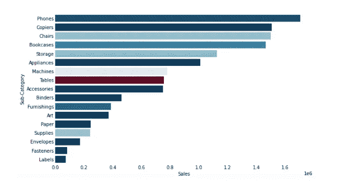
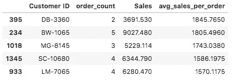
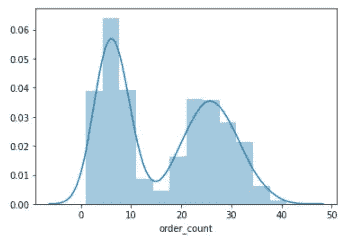
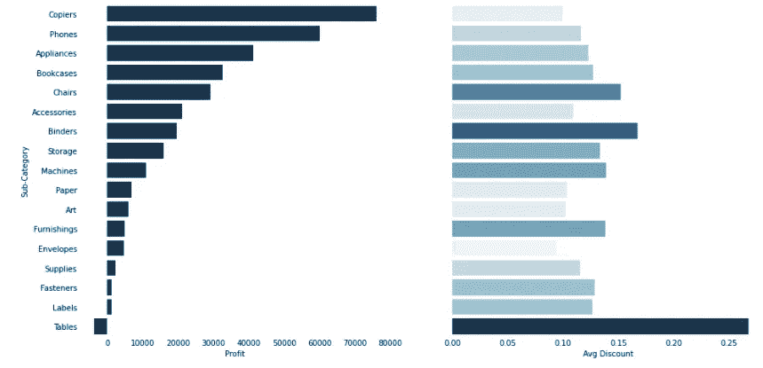

# Tableau 开发人员对 Python 的简明介绍(第 3 部分)

> 原文：<https://towardsdatascience.com/a-gentle-introduction-to-python-for-tableau-developers-part-3-8634fa5b9dec?source=collection_archive---------67----------------------->

## 使用 PYTHON 探索数据

## 将熟悉的数据探索从 Tableau 转换为 Python

Tableau 最大的优势之一是它让你在数据中游来游去。您并不总是需要一个微调的仪表板来找到有意义的见解，因此即使对 Tableau 有相当基本了解的人也可以产生重大影响。

在本文中，我们将探讨这样一个主题，即不需要了解工具的所有信息就可以用它来构建有用的东西。在我们的[上一篇文章](/a-gentle-introduction-to-python-for-tableau-developers-part-2-c18095a03e0e)中，我们谈到了如何在 Python 中创建自定义计算和彩色视觉效果，以获得看起来与我们在 Tableau 中构建的非常相似的视觉效果。

今天，让我们扩展一下到目前为止我们所学的内容。让我们看看如何将我们到目前为止所看到的应用到一个常见的场景:数据探索。

## 搭建舞台

以前，我们采用“销售”和“利润”列，并创建了一个名为“利润比率”的新列。然后，我们修改了第一篇文章中的图表，显示了每个产品子类别的销售额，并使用我们新的“利润率”指标为视觉效果添加了颜色:



按子类别销售，按利润率着色

每当我教 Tableau 的新人如何使用这个软件时，我总是在混合的某个地方插入这个视觉效果。

我认为数据可视化的一个常见错误是，人们经常认为仅仅因为他们*可以*使用他们总是*应该使用的颜色。*如果我们在视觉效果上随机添加颜色，结果通常不会比一个简单的表格更好。一些迷失在调味汁中的视觉效果会让人完全迷惑。

在我们的用例中，颜色是合适的，因为它有助于快速聚焦于期望的“啊哈”启示:更高的销量不一定导致更高的利润。

如果这些数据代表了一个真实的企业，那么随之而来的一个自然的问题可能是:发生了什么，使得我们的一些高销售额项目利润较低(假设这是坏的)，而我们的一些低销售额项目利润很高(假设这是好的)？

为了给这个问题提供任何有意义的答案，我们需要做一些数据探索。

## 第一步:决定关注我们最具影响力的客户

首先，语境很重要。这些数据的背景是，我们是一家销售产品的零售店。顾客只能买我们卖的东西，而且他们是按照我们设定的价格购买的。因此，如果我们有任何负利润，这是我们自己造成的问题。也许我们在某些产品上故意赔钱，降低价格来吸引那些购买其他产品来弥补最初损失的顾客。

我的观点是，不管我们发现了什么，我们都想找到可操作的东西。我们需要能够用我们产生的洞察力*做*一些事情，否则还有什么意义呢？

因此，与其分析我们所有的客户，不如让我们专注于我们的顶级客户。如果你的外联和客户服务预算有限，将这些资源集中在顶级客户身上通常是有意义的。在本练习中，我们将“顶级客户”定义为每份订单花费最多的客户。简单来说，我们有兴趣了解我们前 10%客户的销售和盈利情况。

对于这个超市数据，这意味着我们正在寻找前 159 名客户。

## 步骤 2:为我们的客户获取每份订单的销售额

在 Tableau 中，我们将达到一个计算字段。在 Python 中，我们希望首先在适当的聚合级别创建一个数据帧，然后添加一个新列来存储每个订单的平均销售额。

我们想知道每个客户的每个订单的销售额，所以这里合适的聚合级别是客户级别(客户 ID)。

为了计算每个客户的订单销售额，我们需要计算总销售额并计算每个客户的订单数量。

我们可以使用 Pandas 数据帧(注意,“store_df”是存储所有超市数据的数据帧)来拼凑这些数据:

```
orders_per_customer_df = store_df\
.groupby('Customer ID')\
.agg({
    'Order ID': pd.Series.nunique,
    'Sales': 'sum'
})\
.reset_index()\
.rename(columns={'Order ID': 'order_count'})\
.sort_values('Sales', ascending=False)
```

所以让我们像读一本书一样一行一行地读一遍:

1.  我们的输出将存储在一个名为“orders_per_customer_df”的变量中
2.  我们按照“客户 ID”列对商店数据进行分组
3.  我们聚合了两列；“订单 ID”的唯一计数(由 pd 表示。Series.nunique 函数)和“销售额”之和
4.  我们正在重置结果数据帧的索引；如果您不知道这意味着什么，那么尝试运行没有该语句的代码，看看结果有什么不同！
5.  我们将“订单 ID”列重命名为“order_count ”,这是一个更合适的名称，因为我们不再查看实际的 ID 值
6.  我们按照销售额对结果数据框架进行排序，最高值在顶部

## 步骤 3:计算每个客户的每份订单的总销售额

首先，让我们欣赏一下我们在上一步中创建的数据帧的一个片段:


好的，我们有一个客户的数据框架，这些客户下的订单数量，以及消费总额。

为了计算每份订单的总销售额，我们需要做的就是将“销售额”列除以“订单计数”列。

```
orders_per_customer_df['avg_sales_per_order'] = \
orders_per_customer_df['Sales'] / orders_per_customer_df['order_count']
```

在上面的代码片段中，我们定义了一个新列“avg_sales_per_order ”,并将其设置为“sales”列除以“order_count”列的结果。

下面是它的样子，现在按‘avg _ sales _ per _ order’降序排序。



您可以使用。head()函数来得到这样的预览！

## 步骤 4:查看订单计数分布

让我们做一个快速的侧面探索。比较第 3 步开始时和第 3 步结束时的订单数，我们客户的订单数似乎有很大差异。

为了更好地理解客户行为，让我们来看一下订单数量的分布。

```
sns.distplot(orders_per_customer_df['order_count'])
```

运行上面的代码行给我们带来了这个结果:



所有客户的订单计数分布

啊，看起来顾客自然分成两个阵营。一组平均 5 单左右，另一组平均 25 单左右。

这可能反映了我们的产品组合；一些顾客可能购买少量昂贵的商品，而另一些顾客则更频繁地购买较便宜的商品。

## 步骤 4:过滤我们的数据，只考虑前 10%的客户

在 Tableau 中，一种方法是根据“avg_sales_per_order”的计算字段为“Customer ID”字段创建一个筛选器，并且只包含前 159 个结果。

在 Python 中，一个可能的解决方案是这样的:

```
top_customers_df = \
store_df[store_df['Customer ID']\
.isin(orders_per_customer_df.head(159)['Customer ID'])]
```

我们来剖析一下这个。

首先，我们将结果存储在一个名为“top_customers_df”的变量中。

第二，我们使用 Pandas 数据帧符号，本质上是说“给我们满足*这个*条件的‘store _ df’数据帧的所有行。”在我们的例子中，需要满足的条件是，遇到的任何给定“客户 ID”也必须在“orders_per_customer_df”数据帧的前 159 行的“客户 ID”列中。

换句话说，我们正在过滤我们的商店数据，以便我们只看到包含我们的顶级客户的数据帧的前 159 行中的客户 ID 值的数据。

如果没有点击，请返回查看我们是如何定义“orders_per_customer_df”数据框架的。记住这个*。head(x)* 函数返回调用它的任何数据帧的前 *x* 行数。

## 第五步:为我们的顶级客户预览数据

现在让我们快速看一下结果，我们已经过滤了商店数据，只包括前 159 名客户。让我们按“子类别”进行分组，并汇总数据以查看总销售额、平均折扣百分比、总利润和订单总数。

```
subcat_top_customers_df = top_customers_df\
.groupby('Sub-Category')\
.agg({
    'Sales': 'sum',
    'Discount': 'mean',
    'Profit': 'sum',
    'Order ID': pd.Series.nunique
})\
.rename(columns={
    'Discount': 'Avg Discount',
    'Order ID': 'Num Orders'
})\
.sort_values('Profit', ascending=False)\
.reset_index()
```

你感觉到这些熊猫数据框架是如何工作的了吗？我建议您将代码插入自己的程序中，并对其进行试验。如果将“sum”改为“median”、“min”或“max”，会发生什么？

## 步骤 6:可视化前 10%客户的结果



在查看创建这种视觉效果的代码之前，让我们花点时间深入了解一下。我们在看什么？

在左边，我们看到子类别的总利润。所有利润高于零的柱线都是蓝色的。这里只有一个无利可图的子类别，那就是“桌子”。

还记得上一篇文章中的“表格”吗？这是一个引人注目的子类别。有趣的是，Tables 不仅仅是无利可图，甚至在我们前 10%的客户中也是无利可图。为什么无利可图？

这就是右侧的视觉效果突出显示平均折扣的原因。“桌子”又一次引起了人们的关注，在这里我们可以看到我们的桌子上有一些异常高的折扣。

可能有一个很好的商业理由来大幅打折桌子(也许这是一个亏损的领导者)，但至少现在我们知道为什么桌子是无利可图的:它们的折扣率超过 25%，远远高于任何其他产品子类别。

## 第七步:理解视觉效果是如何组合在一起的

上面的视觉效果是这样的:

```
fig, axs = plt.subplots(1, 2, figsize=(16, 8), sharey=True)sns.barplot(data=subcat_top_customers_df, 
            x='Profit', y='Sub-Category', ax=axs[0],
            palette=cm.RdBu(subcat_top_customers_df['Profit']), ci=False)sns.barplot(data=subcat_top_customers_df, 
            x='Avg Discount', y='Sub-Category', ax=axs[1],
            palette=cm.RdBu(subcat_top_customers_df['Avg Discount'] * 5.5), ci=False)axs[0].tick_params(axis='both', which='both', length=0)
axs[1].tick_params(axis='both', which='both', length=0)
axs[1].set_ylabel('')sns.despine(left=True, bottom=True)
```

第一行是您在使用 Python 绘图库时经常看到的内容。我们正在建立一个图形和一组坐标轴。图形就像画布，视觉效果就在上面，而轴充当我们的数字和分类数据的脊梁。在第一行中，我们定义了一个包含两块不动产的图形:一行包含两块并排的地块。“sharey”参数表示两种视觉效果将共享一个 y 轴，因此没有必要列出两次子类别。

然后，我们调用 Seaborn 库，它在前面以别名‘SNS’导入，来绘制我们的条形图。这里我们定义了提供数据的 dataframe，提供 x 轴和 y 轴的列，以及每个视图的颜色渐变。将“ci”参数设置为“False”以删除额外的行，否则这些行会向我们显示置信区间。继续把它翻转到“真”,看看视觉效果如何变化。

最后几行是修饰性的格式，去掉刻度线之类的。我强烈建议对其进行修改，以适应通过代码而不是通过 Tableau 这样的点击-拖动界面进行格式化的概念。通过代码定义格式的好处在于，您可以构建可重用的函数，这些函数总是应用您喜欢的格式技巧。

**包装完毕**

所以，我们到了。我们的吸引注意力的表格得到了他们一直想要的关注，我们有更多的机会使用熊猫数据框来塑造和控制我们的数据。

这里的数据探索并不是惊天动地的，但是如果您对我们到目前为止编写的 Python 代码感到满意，那么您已经准备好进入我们的下一个会话了！

下次请继续收听，届时我们将探索如何连接不同表中的数据。Pandas 让我们很容易做到这一点，所以对我们来说，将我们的“订单”数据加入到我们的“退货”数据中，并回答这个问题:我们有多少产品被退回了？由于退货，我们的收入减少了多少？

希望在那里见到你！