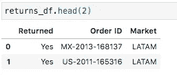
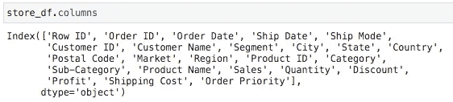
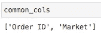
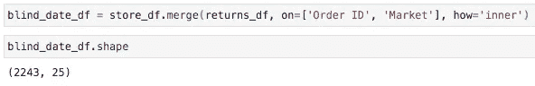
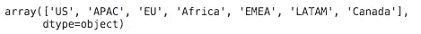
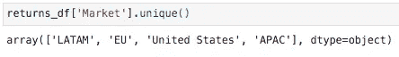
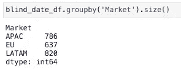
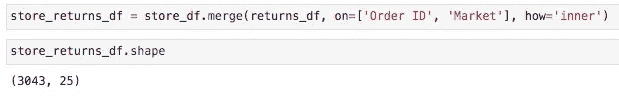
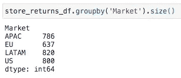
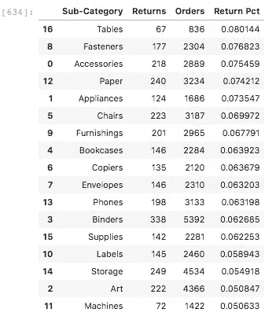

# 面向 Tableau 开发人员的 Python 简介(第 4 部分)

> 原文：<https://towardsdatascience.com/a-gentle-introduction-to-python-for-tableau-developers-part-4-a6fd6b2f46b1?source=collection_archive---------58----------------------->

## 使用 PYTHON 探索数据

## 用连接和熊猫让你的数据更美味


班农·莫里西在 [Unsplash](https://unsplash.com?utm_source=medium&utm_medium=referral) 拍摄的照片

在数据混合、连接和处理 Tableau 中产生的细节层次之间，管理数据之间的关系可能很棘手。

穿上你闪亮的新蟒蛇鞋，世界变得开阔了一些。您可以选择自己的战斗，而不是试图将所有内容都压缩到一个数据源中来统治它们。

在我们以前的文章中，我们已经看到:

1.  [熊猫分组表情和基本可视化](/a-gentle-introduction-to-python-for-tableau-developers-part-1-862b9bdd1c85)
2.  [按盈利能力计算和着色销售额](/a-gentle-introduction-to-python-for-tableau-developers-part-2-c18095a03e0e)
3.  [高级视觉数据探索](/a-gentle-introduction-to-python-for-tableau-developers-part-3-8634fa5b9dec)

## 搭建舞台

在本文中，我们将关注在任何生态系统中使用数据的最重要的方面之一:连接。

幸运的是，我们一直在玩的 Tableau 数据附带电池！在我们一直在分析的虚拟商店的上下文中，我们有一些数据详细说明了被返回的各种商品。

让我们在订单和退货上使用这些数据，以便使用 Pandas 库轻松地在 Python 中连接数据。在这个过程中，我们将看到不同类型的连接如何帮助我们实现不同的目标。

## 步骤 1:快速浏览一下我们想要加入的数据

还记得我们一直在处理的订单数据吗？让我们很快好好看看它。


回想一下 head()函数获取最上面的行，在本例中我们要求获取最上面的 2 行！

啊，很熟悉。现在让我们看看 2 号门后面有什么。但是首先，本着感受熊猫如何工作的精神，让我们强调一下我们是如何得到这些数据的。

在第一篇文章中，我们使用 Pandas *read_excel()* 函数从 excel 文件中获取订单数据。原来这个文件有多张:

1.  命令
2.  返回
3.  人

让我们暂时忽略“People”表(反正没人喜欢它们)，简单地承认这样一个事实:当我们在没有指定表名的情况下使用 *read_excel()* 函数时，该函数获取了 excel 工作簿中可用的第一个表。

下面是我们如何指定要从“Returns”表中获取数据:

```
returns_df = pd.read_excel('Global Superstore.xls', sheet_name='Returns')
```

这些数据是这样的:



没有比这个数据集更简单的了

## 第二步:避免盲目约会你的数据

在数据加入的世界里，包办婚姻比相亲要好。也就是说，我们希望成为专横的家长，检查我们将要加入数据的列，寻找任何可能导致不匹配的不一致之处。仅仅因为我们*假设*列匹配就盲目地将我们的数据连接在一起可能会导致一些不希望的结果。

为了证明这一点，让我们走进一次相亲，看看会发生什么。

首先，让我们观察我们的两个数据集有哪些列是相同的。



这些是我们订单的栏目…


这些是我们返回的列

在我看来，我们有共同的“订单 ID”和“市场”。当然，在许多真实的场景中，相同的信息可能以不同的名称存储，但这不是真实的世界。是个例子！

顺便说一下，这里有一个快捷方式，您可以使用它来查找同时存在于两个列列表中的值:

```
common_cols = [col for col in store_df.columns if col in returns_df.columns]
```



你刚才看到的叫做[列表理解](https://docs.python.org/3/tutorial/datastructures.html#list-comprehensions)。如果你最终爱上了 Python，这些将成为你的第二天性。它们非常有用。在这种情况下，我们的列表理解为我们提供了列表 X 的任何值，它的值也出现在列表 y 中。

既然我们知道我们有两个共同的专栏，我们还在等什么呢！？发起相亲！

## 第三步:好吧，让我们给相亲对象一个机会…

所以我们的订单和退货之间有共同的“订单 ID”和“市场”。让我们加入他们。

在 Pandas 中，您可以使用 *join()* 方法，也可以使用 *merge()* 方法。不同的人用不同的笔画。在几乎任何场景中，我都更喜欢使用 *merge()* 方法，所以这就是我们在这里要使用的方法。团队*合并，*终身。

```
blind_date_df = store_df.merge(returns_df, on=['Order ID', 'Market'], how='left')
```

让我们看看结果是什么样的:


我们左连接的结果

首先我们跑了*。在生成的数据帧上塑造*以获取行数和列数的值(按此顺序)。因此，我们得到的数据帧有 51，290 行和 25 列，而原始订单数据帧有 51，290 行和 24 列。

这个连接有效地为我们的每一行添加了新数据，提供了一个名为“Returned”的附加列，如果订单被返回，该列的值为“Yes”。

注意，在我们的连接中，我们指定了要连接的列以及如何执行连接。这个“左”连接是什么？这仅仅意味着首先出现在那里的表(在本例中是我们的 *store_df* )将保持原样，新表的数据将分散到相关的地方。

让我们将其与内部连接进行比较:



内连接产生的行数比左连接少

这个内部连接的行为不同于我们的左连接，因为它只保留了两个表之间的交集。如果我们只关心分析返回的订单，这种类型的连接会很有用，因为它会过滤掉所有没有返回的订单。

## 第四步:那么相亲有什么不好呢？

有时候你认为你什么都知道，这是你最痛苦的时候。在这个例子中，我们认为我们知道我们有两个匹配的列:“订单 ID”和“市场”。但是，我们的两个数据集在什么是市场上达成一致了吗？

让我们来点刺激的。订单，你如何定义你的市场？

```
store_df['Market'].unique()
```



一份令人尊敬的市场列表…除了你拼写了加拿大，并对其他市场使用了首字母缩略词

这行代码查看整个“Market”列，并输出在其中找到的唯一值。

好吧。回报，你如何定义你的市场？



一份令人尊敬的名单……等等，“美国”被拼出来了？

看起来我们的订单和退货团队都需要在是否使用市场的首字母缩略词或拼写它们方面达成一致。

在订单方面，为了避免将来的问题，我们可能应该将“Canada”转换为类似“CA”的缩写值。

在回报方面，为了避免将来的问题，我们可能应该将“美国”改为“美国”

但是等等，这只能解决未来的问题…现在这会导致什么样的问题呢？

## 步骤 5:盲连接后的清理

要了解我们所处的困境，让我们看看每个市场有多少回报(使用前面的内部连接):



丢了什么吗？

万岁，看起来我们的美国市场是完美的，没有回报！或者等等，是美国市场吗…啊，哎呀。

因为包含订单的数据将市场称为“美国”,而包含退货的数据将市场称为“美国”,所以连接将永远不会匹配这两个市场。

幸运的是，给我们的市场重新命名真的很容易。在这种情况下，有一种快速的方法可以做到这一点，因为只有一个不匹配导致了问题。这引入了 [lambda 函数](https://realpython.com/python-lambda/)的概念，如果它对你没有意义，你可以忽略它。

```
returns_df['Market'] = returns_df['Market'].apply(lambda market: market.replace('United States', 'US'))
```

基本上，这是在运行中创建一个函数，我们可以用它在一行代码中快速执行一个有用的操作。运行上面那行代码的结果是，任何出现的“美国”市场都被重命名为“US”。

现在，如果我们运行 *store_df* 和 *returns_df* 之间的内部连接，结果看起来会有点不同:



如果我们检查每个市场有多少回报，我们得到这个:



## 第六步:对数据上瘾者的一点挑战

现在我们知道了如何连接我们的订单和我们的退货，您能想出如何拼接一个如下所示的表格吗？



看起来“桌子”子类别再次引起了人们的注意！我们无法逃避它。

运用到目前为止我们在这个系列中学到的知识，您能自己重新创建这个表吗？如果你是一个真正的超额完成者，那就继续在 Tableau 中构建它，并比较这个过程。你如何处理 Tableau vs Python 中的市场不匹配？有多种方法可以破解这个案子——去试试吧！

## 包装它

如果您正在大规模处理数据，连接数据绝对是一项至关重要的技能。请记住，理解您要连接的内容与了解如何执行连接的技术细节一样重要！

如果你在一次相亲中发送你的数据以加入另一个表，要意识到风险。在将数据集与其他数据一起发送到约会地点之前，请清理数据集。脏数据往往会留下一堆乱七八糟的东西，而您将是解决这些问题的人。

希望下次在我们深入研究使用函数制作可重用代码时能见到您！