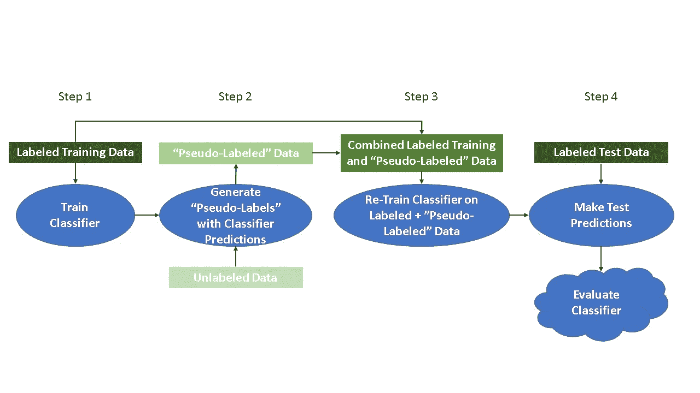
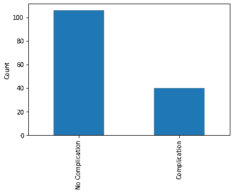
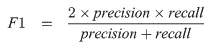
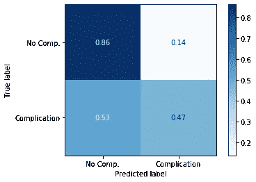
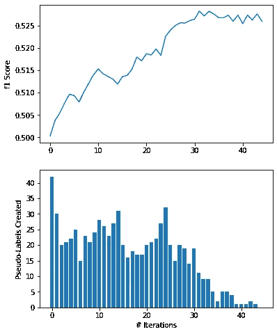
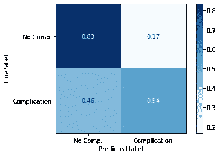

# 自我训练和半监督学习简介

> 原文：<https://towardsdatascience.com/a-gentle-introduction-to-self-training-and-semi-supervised-learning-ceee73178b38?source=collection_archive---------1----------------------->

## 用 Python 编写一个利用未标记数据进行分类的自我训练示例


照片由[珍妮·希尔](https://unsplash.com/@jennyhill?utm_source=medium&utm_medium=referral)在 [Unsplash](https://unsplash.com?utm_source=medium&utm_medium=referral) 拍摄

当涉及到机器学习分类任务时，可用于训练算法的数据越多越好。在监督学习中，这些数据必须根据目标类进行标记，否则，这些算法将无法学习自变量和目标变量之间的关系。但是，在构建用于分类的大型标记数据集时，会出现一些问题:

1.  **标注数据可能非常耗时。**假设我们有 1，000，000 张狗的图像要输入到一个分类算法中，目标是预测每张图像中是否包含一只波士顿梗。如果我们想将所有这些图像用于监督分类任务，我们需要一个人来查看每张图像，并确定是否存在波士顿梗。虽然我有朋友(和妻子)不介意整天浏览狗狗照片，但这可能不是我们大多数人想要的周末。
2.  **标注数据可能会很贵。请看原因 1:为了让某人费力地搜索 100 万张狗的照片，我们可能不得不支付一些现金。**

那么，如果我们只有足够的时间和金钱来标记大型数据集的某些部分，而选择不标记其余部分，会怎么样呢？这种未标记的数据可以用在分类算法中吗？

这就是**半监督学习**的用武之地。在采用半监督方法时，我们可以在少量标记数据上训练分类器，然后使用分类器对未标记数据进行预测。因为这些预测可能比随机猜测更好，所以未标记的数据预测可以在分类器的后续迭代中被用作“伪标记”。虽然半监督学习有很多种风格，但这种特定的技术被称为**自我训练**。

## 自我训练



自我训练

在概念层面上，自我训练是这样的:

**步骤 1:** 将标记的数据实例分割成训练集和测试集。然后，在标记的训练数据上训练分类算法。

**步骤 2:** 使用训练好的分类器来预测所有未标记数据实例的类别标签。在这些预测的类别标签中，正确概率最高的被采用作为'**伪标签'**。

*(步骤 2 的几个变体:* ***a)*** *所有预测的标签可以一次被采用为‘伪标签’，而不考虑概率，或者* ***b)*** *【伪标签】数据可以通过预测的置信度来加权。)*

**步骤 3:** 将“伪标记的”数据与标记的训练数据连接起来。在组合的“伪标记”和标记的训练数据上重新训练分类器。

**步骤 4:** 使用训练好的分类器来预测标记的测试数据实例的类别标签。使用您选择的度量评估分类器性能。

*(可以重复步骤 1 至 4，直到步骤 2 中不再有预测的类别标签满足特定的概率阈值，或者直到不再有未标记的数据剩余。)*

好的，明白了吗？很好！让我们看一个例子。

## 示例:使用自我训练来改进分类器

为了演示自我训练，我使用了 Python 和 **surgical_deepnet** 数据集，可从 Kaggle 上的[这里](https://www.kaggle.com/omnamahshivai/surgical-dataset-binary-classification)获得。该数据集旨在用于二元分类，包含 14.6k+手术的数据。这些属性是 bmi、年龄和各种其他指标，而目标变量**并发症**记录了患者是否因手术而出现并发症。显然，能够准确预测患者是否会遭受手术并发症，将符合医疗保健和保险提供商的最大利益。

**进口**

对于本教程，我导入了 **numpy** 、 **pandas** 和 **matplotlib** 。我还将使用来自 **sklearn** 的 **LogisticRegression** 分类器，以及 **f1_score** 和 **plot_confusion_matrix** 函数进行模型评估。

**加载数据**

```
<class 'pandas.core.frame.DataFrame'>
RangeIndex: 14635 entries, 0 to 14634
Data columns (total 25 columns):
bmi                    14635 non-null float64
Age                    14635 non-null float64
asa_status             14635 non-null int64
baseline_cancer        14635 non-null int64
baseline_charlson      14635 non-null int64
baseline_cvd           14635 non-null int64
baseline_dementia      14635 non-null int64
baseline_diabetes      14635 non-null int64
baseline_digestive     14635 non-null int64
baseline_osteoart      14635 non-null int64
baseline_psych         14635 non-null int64
baseline_pulmonary     14635 non-null int64
ahrq_ccs               14635 non-null int64
ccsComplicationRate    14635 non-null float64
ccsMort30Rate          14635 non-null float64
complication_rsi       14635 non-null float64
dow                    14635 non-null int64
gender                 14635 non-null int64
hour                   14635 non-null float64
month                  14635 non-null int64
moonphase              14635 non-null int64
mort30                 14635 non-null int64
mortality_rsi          14635 non-null float64
race                   14635 non-null int64
complication           14635 non-null int64
dtypes: float64(7), int64(18)
memory usage: 2.8 MB
```

数据集中的属性都是数值型的，没有缺失值。因为我在这里的重点不是数据清理，所以我将继续对数据进行分区。

**数据分割**

为了试验自我训练，我需要将数据分成三部分:一个**训练集**，一个**测试集**，和一个**未标记集**。我将按照以下比例分割数据:

1%列车(贴有标签)

25%测试(贴有标签)

74%未标注

对于未标记的集合，我将简单地删除目标变量**complexity**，并假装它从未存在过。因此，在这种情况下，我们假设 74%的手术病例没有关于并发症的信息。我这样做是为了模拟这样一个事实，即在现实世界的分类问题中，许多可用的数据可能没有类标签。然而，如果我们*确实*有一小部分数据的类别标签(在这种情况下是 1%)，那么半监督学习技术就可以用来从未标签数据中得出结论。

下面，我重组数据，生成索引来划分数据，然后创建测试、训练和未标记的分割。然后我检查裂缝的尺寸，以确保一切按计划进行。

```
X_train dimensions: (146, 24)
y_train dimensions: (146,)

X_test dimensions: (3659, 24)
y_test dimensions: (3659,)

X_unlabeled dimensions: (10830, 24)
```

**班级分布**



多数阶级(不复杂)的实例是少数阶级(复杂)的两倍多。在这种不平衡的分类情况下，我想对我选择的分类评估标准非常挑剔— **准确性**可能不是最好的选择。

我选择 **F1 得分**作为分类度量来判断分类器的有效性。F1 分数对类别不平衡的鲁棒性大于准确性，这在类别大致平衡时更合适。F1 分数可以计算如下:



其中**精度**是被正确预测的*预测*阳性实例的比例，而**召回**是被正确预测的*真*阳性实例的比例。

**初始分类器(监督)**

为了实地验证半监督学习的结果，我首先只使用标记的训练数据训练一个简单的逻辑回归分类器，并在测试数据集上进行预测。

```
Train f1 Score: 0.5846153846153846
Test f1 Score: 0.5002908667830134
```



分类器的测试 F1 值为 0.5。混淆矩阵告诉我们，分类器可以非常准确地预测没有并发症的手术，准确率为 86%。然而，分类器更难正确识别有并发症的手术，准确率只有 47%。

**预测概率**

对于自训练算法，我们想知道逻辑回归分类器做出预测的概率。幸运的是， **sklearn** 提供了**。predict_proba()** 方法，它允许我们查看属于任一类的预测的概率。如下所示，在二元分类问题中，每个预测的总概率总和为 1.0。

```
array([[0.93931367, 0.06068633],
       [0.2327203 , 0.7672797 ],
       [0.93931367, 0.06068633],
       ...,
       [0.61940353, 0.38059647],
       [0.41240068, 0.58759932],
       [0.24306008, 0.75693992]])
```

**自训练分类器(半监督)**

现在我们知道了如何使用 **sklearn** 获得预测概率，我们可以继续编码自我训练分类器。以下是一个简要的概述:

**第一步**:首先，在标注的训练数据上训练一个逻辑回归分类器。

**步骤 2** :接下来，使用分类器预测所有未标记数据的标签，以及这些预测的概率。在这种情况下，我只会对概率大于 99%的预测采用‘伪标签’。

**步骤 3** :将“伪标记”数据与标记训练数据连接，并在连接的数据上重新训练分类器。

**第四步**:使用训练好的分类器对标注的测试数据进行预测，并对分类器进行评估。

重复第 1 步到第 4 步，直到没有任何预测的概率大于 99%，或者没有未标记的数据。

参见下面的代码，我用 Python 实现了这些步骤，使用了一个 while 循环。

```
Iteration 0
Train f1: 0.5846153846153846
Test f1: 0.5002908667830134
Now predicting labels for unlabeled data...
42 high-probability predictions added to training data.
10788 unlabeled instances remaining.

Iteration 1
Train f1: 0.7627118644067796
Test f1: 0.5037463976945246
Now predicting labels for unlabeled data...
30 high-probability predictions added to training data.
10758 unlabeled instances remaining.

Iteration 2
Train f1: 0.8181818181818182
Test f1: 0.505431675242996
Now predicting labels for unlabeled data...
20 high-probability predictions added to training data.
10738 unlabeled instances remaining.

Iteration 3
Train f1: 0.847457627118644
Test f1: 0.5076835515082526
Now predicting labels for unlabeled data...
21 high-probability predictions added to training data.
10717 unlabeled instances remaining.

...Iteration 44
Train f1: 0.9481216457960644
Test f1: 0.5259179265658748
Now predicting labels for unlabeled data...
0 high-probability predictions added to training data.
10079 unlabeled instances remaining.
```

自我训练算法经历了 44 次迭代之后，才能够以> 99%的概率预测到更多的未标记实例。尽管最初有 10，830 个未标记的实例，但其中 10，079 个在自我训练后仍未标记(且未被分类器使用)。



经过 44 次迭代，F1 分数从 0.50 提高到 0.525！虽然这只是一个很小的增加，但看起来自我训练已经提高了分类器在测试数据集上的性能。上图的顶部显示，这种改进大部分发生在算法的早期迭代中。类似地，底部面板显示了添加到训练数据中的大多数“伪标签”出现在最初的 20-30 次迭代中。



最终混淆矩阵显示有并发症的手术*的分类有所改善，但无*并发症的手术*的分类略有下降。在 F1 评分提高的支持下，我认为这是一个可接受的改进——识别将导致并发症的手术病例(真阳性)可能更重要，为了达到这一结果，可能值得增加假阳性率。*

**注意事项**

所以你可能在想:用这么多未标记的数据进行自我训练有风险吗？答案当然是肯定的。请记住，尽管我们将“伪标签”数据与带标签的训练数据包含在一起，但某些“伪标签”数据肯定是不正确的。当足够多的“伪标签”是不正确的时，自训练算法可以加强差的分类决策，并且分类器性能实际上可以变得更差。

然而，这种风险可以通过遵循既定的实践来减轻，如使用分类器在训练期间未见过的测试数据集，或使用“伪标签”预测的概率阈值。