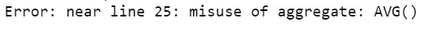
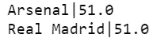

# SQL 子查询简介

> 原文：<https://towardsdatascience.com/a-gentle-introduction-to-sql-sub-queries-ee288174d285?source=collection_archive---------19----------------------->

## SQL 变得简单

## 了解为什么以及何时应该使用它们！


有时候学习 SQL 感觉像是我们在矩阵里面，但是不需要那样！马库斯·斯皮斯克在 [Unsplash](https://unsplash.com?utm_source=medium&utm_medium=referral) 上的照片

SQL 是任何数据科学家为了探索数据库都应该掌握的基本工具之一。它有简单易用的美誉。但是并不是所有的事情都是轻而易举的，对于新手来说，最大的挑战之一就是理解子查询的使用。

在我们开始之前，有代码的笔记本一如既往地在这里等着你。

假设您熟悉 SQL，我们首先要学习的一件事是主语句的顺序必须如下:

```
**1- SELECT** column_name,
**2- FROM** table_name,
**3- WHERE** condition;
```

但是有一点不太明显，那就是这不是处理查询的方式！实际上，几乎是反过来的:

```
**1- FROM the** table_name
**2- WHERE this** condition **is true
3- SELECT the rows of the** column_name;
```

为什么知道这一点很重要？因为如果理解了这个逻辑，以后就更容易可视化子查询的需求了。对于 SQL，理解幕后的工作与知道如何编写查询一样重要。

假设您有下表 *team_data* :

```
| **team** | **country** | **season** | **total_goals** |
|-------------|---------|--------|-------------|
| Real Madrid | Spain   | 2019   | 53          |
| Barcelona   | Spain   | 2019   | 47          |
| Arsenal     | UK      | 2019   | 52          |
| Real Madrid | Spain   | 2018   | 49          |
| Barcelona   | Spain   | 2018   | 45          |
| Arsenal     | UK      | 2018   | 50          |
```

如果我们想按团队检索平均目标，查询将是:

```
**SELECT** team,
    **AVG**(total_goals) AS avg_goals
**FROM** team_data
**GROUP BY** team;
```

这将给出以下结果:


按团队分组的平均目标

到目前为止，没有神秘，对不对？但是如果我们只想过滤平均得分高于 50 的团队呢？通常，我们的第一种方法是这样的:

```
**SELECT** team **AS** team_name,
    **AVG**(total_goals) **AS** avg_goals
**FROM** team_data
**WHERE** avg_goals > 50
**GROUP** BY team;
```



第一次尝试会产生聚合错误。

这给了我们一个聚合错误，但是为什么呢？让我们根据查询的处理方式来执行这些步骤:

*   1: **FROM team_data** —好的，表格存在，我们继续；
*   2:**WHERE avg _ goals>50**—嗯，这里我们有一个错误，**如果计算还没有完成，如何过滤这些值呢？**

这是一个需要使用子查询的完美例子。我们需要做的是首先生成字段 *avg_goals，*，这样当 **WHEN** 语句开始过滤时，计算就已经完成了！根据查询逻辑，这个过程需要在来自语句的**上完成，因为它在**时出现在过滤器**之前。让我们看看这个查询是怎样的:**

```
**SELECT** team_name, avg_goals**FROM** (-- Here we make our sub-query:
    **SELECT** team AS team_name,
    **AVG**(total_goals) AS avg_goals
    **FROM** team_data
    **GROUP BY** team) tp
-- End of the sub-query**WHERE** avg_goals > 50;
```



成功！

你现在能看到发生了什么吗？

*   1:来自语句的**生成了我们需要的分组值；**
*   2: **当**按照我们的规范过滤后；
*   3:最后，**选择**获取我们指定的列。

基本上，**我们需要子查询大多数时候我们需要过滤聚集字段**。写的时候给你一些帮助:

*   不要忘记在子查询之后创建一个别名。在这个例子中，在它的结尾有一个“tp ”,但是它可以是你想要的任何东西。
*   即使 SQL 不区分大小写，将语句大写也是一个好习惯。使用缩进也很好，因为它提高了查询的可读性。即使是很小的查询也很容易迷路。

今天就到这里。我希望现在子查询对你来说更加神秘了！请在评论中告诉我你的想法，并随时添加一些更实际的例子！