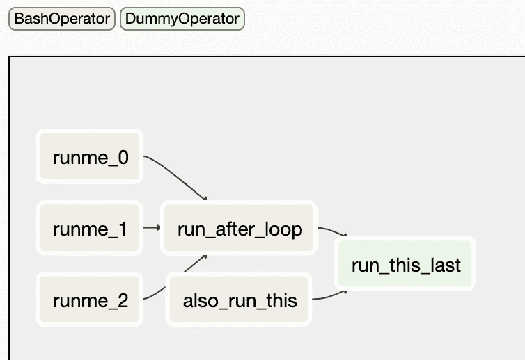
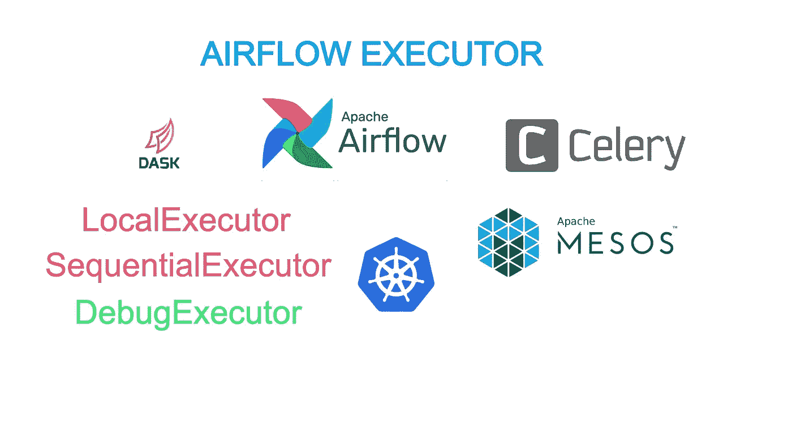

# 理解气流执行器的简单介绍

> 原文：<https://towardsdatascience.com/a-gentle-introduction-to-understand-airflow-executor-b4f2fee211b1?source=collection_archive---------13----------------------->


柯蒂斯·麦克牛顿在 [Unsplash](https://unsplash.com/s/photos/time?utm_source=unsplash&utm_medium=referral&utm_content=creditCopyText) 上的照片

[Apache Airflow](https://airflow.apache.org/) 是一个用于调度任务的著名开源 python 框架。气流生态系统中有很多新概念；其中一个你不能跳过的概念是 [**气流执行器**](https://airflow.apache.org/docs/stable/executor/index.html) ，它是所有预定任务的“工作站”。气流对于最终用户来说通常是用户友好的，并且很好地理解气流执行器对于个人使用以及生产气流环境是至关重要的。在这篇文章中，我们将详细讨论什么是气流执行器，比较不同类型的执行器，以帮助您做出决定。

## 什么是气流执行器

气流执行器有很多种选择，我们先把那些选择放在一边，先把重点放在气流执行器在气流生态系统中做什么。恰当地说，规程“执行者”是一种执行任务的机制。worker 是运行实际任务的节点或处理器。Airflow 调度程序不会运行任何任务，而是将任务移交给执行器。执行者充当中间人，处理资源利用和如何最好地分配工作。


来自 giphy.com[的奴才们的 GIF 图](https://giphy.com/gifs/minions-minions-2-rise-of-gru-cKbLJzS0cOTklEmzto)

虽然 Airflow 作业是在 DAG 级别上组织的，但是作业的执行阶段更加精细，执行器在任务级别上运行。如下图所示，如果 DAG 以六个任务结束，Airflow 调度程序会将每个任务分别分配给执行者。无论这些任务是并行完成还是顺序完成，都是由执行器类型决定的。



DAG 示例(按作者)

## 执行者参与气流生命周期的哪一部分？

就目前而言，Airflow(1 . 10 . 10 版)是一个单调度程序系统。在这种情况下，所有任务只由一个调度程序调度。调度器控制任务何时被发送到执行器，并监控来自执行器的任务状态。

任务从调度器到执行器的生命周期包括以下步骤:

1.  在调度器发出命令让执行器运行哪个任务之前，根据执行器的类型，执行器本身的资源保持空闲或不可用。
2.  一旦预定时间到了，气流调度器就把命令发送给执行器。
3.  收到调度器的信号后，执行器开始分配资源，并将任务放入队列。当工作可用时，它将从队列中选取任务来执行它。同时，调度程序每隔一段时间(称为心跳)探测一次任务，以获取任务的当前状态，然后在后端数据库中更新其状态。
4.  一旦任务完成，并且调度器从执行器接收到**完成**状态，为运行任务分配的资源就被清理掉了。


图片来自[气流生命周期](https://airflow.apache.org/docs/stable/concepts.html)

## 为什么气流有不同类型的执行器？

大多数类型的 Airflow executor 工具任务以分布式方式运行，这些任务运行在多处理或多个工作节点上。气流生产环境通常有数百个 Dag，其中包括数千个要运行的任务。凭借在如此大的规模上并行运行各种任务的能力，Airflow executor 在密集型工作负载上大放异彩。

您拥有各种类型的执行器的原因之一是，您可以根据自己的需求和基础设施进行选择。气流提供了执行者的“工具包”，不同种类的执行者提供了灵活性，让气流与您的环境顺利集成。


由[拍摄的谷仓图片](https://unsplash.com/@barnimages?utm_source=unsplash&utm_medium=referral&utm_content=creditCopyText)上[的 Unsplash](https://unsplash.com/s/photos/toolbox?utm_source=unsplash&utm_medium=referral&utm_content=creditCopyText)

气流是可扩展的，支持各种执行器。最初，Airflow 只有 SequentialExecutor、LocalExecutor、CeleryExecutor 和 MesosExecutor 可用。最近两年，自从气流 1.9.0 以来，气流得到了更多的关注，更多的执行者被贡献给了社区，这些执行者包括 DaskExecutor，KubernetesExecutor，DebugExecutor。

执行器之间的区别在于**上的机制，执行器在**上运行任务。在我看来，并不是所有的遗嘱执行人都被同等对待，有些人你甚至想跳过，除非你有特定的理由必须使用他们。下面是对每个遗嘱执行人的描述，以及当你倾向于选择其中一个时应该考虑的因素。



气流执行器(作者)

*   SequentialExecutor 是现成的默认执行器。顾名思义，任务将按顺序执行。即使你有一个[分支操作符](https://github.com/apache/airflow/blob/master/airflow/example_dags/example_branch_operator.py)，任务仍然会按照`’branch_a’, ‘branch_b’, ‘branch_c’, ‘branch_d’`的顺序一个接一个的执行
*   LocalExecutor 非常适合并行测试多个气流作业，为小规模生产环境执行任务。LocalExecutor 在与气流调度程序相同的节点上运行任务，但在不同的处理器上运行。有其他执行者在分配实际工作时使用这种类型；例如，KubernetesExecutor 将在每个 pod 中使用 LocalExecutor 来运行任务。
*   CeleryExecutor 是最成熟的气流选项，因为大多数早期气流采用的是 CeleryExecutor。它还需要基础设施支持——芹菜和芹菜的后端(Redis 或 RabbitMQ)。然而，你可以从 Airflow 社区获得更好的帮助，因为很多公司都在使用这个选项。
*   MesosExecutor 是早期的社区贡献之一。然而，由于 Kubernetes 比 Mesos 被广泛采用，气流社区也在讨论退役 MesosExecutor。除非您的公司正在运行 Mesos，并且您在未来几年内不会迁移到 Kubernetes，并且您希望使用 Mesos 来管理您的 Airflow executor 资源，否则您可能希望选择此选项。否则，您可能希望避免选择 MesosExecutor。
*   Dask.org 激发了 DaskExecutor。有一些关于[移除 DaskExecutor](https://github.com/dask/dask/issues/5803) 的讨论，也是由于缺乏使用，DaskExecutor 在 Airflow master 上失败了几个月，但没有人注意到。我个人喜欢达斯克；不幸的是，气流和 Dask 的使用较少。不幸的是，由于使用和支持较少，您可能希望避免选择 DaskExecutor。
*   KubernetesExecutor 是在 1.10.0 版本中引入的，由彭博贡献。这一贡献为 Airflow 与 Kubernetes 生态系统的集成树立了一个里程碑。虽然最初的几个次要版本有问题，但最近的版本更稳定了。如果贵公司广泛采用 Kubernetes，KubernetesExecutor 可能是气流执行器的最佳选择。KubernetesExecutor 的另一个优点是你可以为你的任务准备不同的 docker 图像，这给了你更多的灵活性。
*   DebugExecutor 是在 1.10.8 中引入的。它可能不会被归类为遗嘱执行人；这个 DebugExecutor 的目的是与 IDE 一起运行。它类似于 SequentialExecutor，一次运行一个任务，并且支持使用传感器。

总之，CeleryExecutor 和 KubernetesExecutor 将是您的生产环境的绝佳选择。LocalExecutor 也是生产环境中需要考虑的首选项。如果您的工作负载较轻，或者大部分任务都在 AWS 或 Azure service 等云服务中运行，Airflow Executor 充当中间人，在不实际运行不同服务的情况下与它们对话，LocalExecutor 也是可行的选择。SequentialExecutor 和 DebugExecutor 用于本地测试。你可能会在生产中跳过它们。MesosExecutor 和 DaskExecutor 你可能想避开他们，因为对他们在气流生态系统中的未来路线图有矛盾心理。

## 气流执行器怎么设置？

气流执行器上的大部分配置都是由[**air flow . CFG**](https://github.com/apache/airflow/blob/master/airflow/config_templates/default_airflow.cfg)**文件控制的。不同的功能部分在括号中组织文件。对于执行程序的选择，您会在 core 部分看到，SequentialExecutor 被选为缺省值。它允许你在不设置太多依赖的情况下运行 Airflow。SequentialExecutor 可以直接使用 SQLite，SQLite 应该与 Python 一起安装。正如我们上面所讨论的，您可以选择不同类型的执行器，但是每一种都需要在 AirflowAirflow **中进行额外的设置。cfg** 文件。**

```
[core]executor = SequentialExecutor
```

**LocalExecutor 也很容易设置，它要求元数据数据库是 MySQL 或 PostgreSQL，而不是 SQLite。一旦 LocalExecutor 设置好了，气流执行器 90%的功能就展现出来了。执行器的另外 10%功能是以分布式方式运行气流。**

**CeleryExecutor 有其配置部分— `[celery]`。有两个主要组成部分:芹菜和芹菜后端。[芹菜](http://www.celeryproject.org)是异步任务队列。有了芹菜，气流可以将其任务扩展到多个工人，以更快地完成工作。更多设置可在[气流芹菜页面](https://airflow.apache.org/docs/1.10.1/howto/executor/use-celery.html)找到**

**由于 Kubernetes 的流行，KubernetesExecutor 是气流中的宠儿。如果您的环境中有 Kubernetes，在 Airflow 中设置 kubernetexecutor 不会太麻烦，我在以前的文章中已经介绍了基本的设置:[探索 AWS 和 kops 上的 Airflow kubernetexecutor](https://medium.com/@chengzhizhao/explore-airflow-kubernetesexecutor-on-aws-and-kops-1c4dd33e56e0)**

## **最后的想法**

**为气流基础设施设置合适的执行器是关键的一步。如果您希望 Airflow 不仅处理调度部分，还在您的 worker 节点上运行任务，Airflow executor 通过其分布式功能提供了更多额外的潜力。希望这篇文章能给你一些关于气流执行器的基本思路。干杯！**

**希望这个故事对你有帮助。本文是我的工程&数据科学系列的**部分，目前包括以下内容:****

**

[赵承志](https://chengzhizhao.medium.com/?source=post_page-----b4f2fee211b1--------------------------------)** 

## **数据工程和数据科学故事**

**[View list](https://chengzhizhao.medium.com/list/data-engineering-data-science-stories-ddab37f718e7?source=post_page-----b4f2fee211b1--------------------------------)****47 stories**************

**你也可以 [**订阅我的新文章**](https://chengzhizhao.medium.com/subscribe) 或者成为 [**推荐媒介会员**](https://chengzhizhao.medium.com/membership) 可以无限制访问媒介上的所有故事。**

**如果有问题/评论，**请不要犹豫，写下这个故事的评论**或者通过 [Linkedin](https://www.linkedin.com/in/chengzhizhao/) 或 [Twitter](https://twitter.com/ChengzhiZhao) 直接**联系我。****