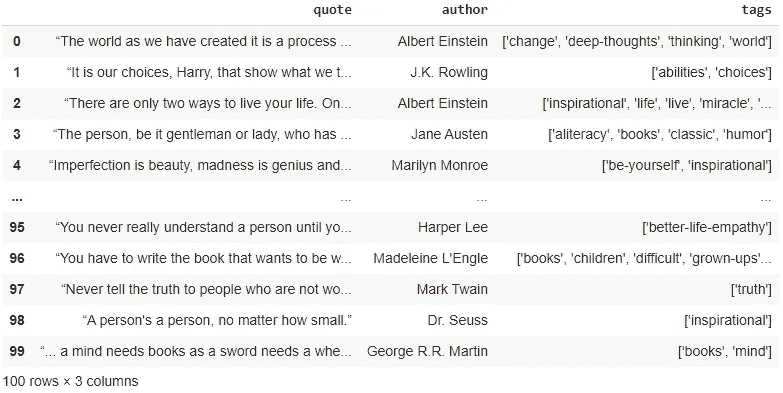

# 用 Python 温和地介绍 Web 抓取

> 原文：<https://towardsdatascience.com/a-gentle-introduction-to-web-scraping-with-python-b914a64b2fb8?source=collection_archive---------20----------------------->

## 如何用几行代码编写你的第一个 scraper


照片由[潘卡杰·帕特尔](https://unsplash.com/@pankajpatel?utm_source=medium&utm_medium=referral)在 [Unsplash](https://unsplash.com?utm_source=medium&utm_medium=referral) 拍摄

数据科学只有在有数据的情况下才有可能，而在现实世界中，数据通常不会在一个*里等着你。csv* 文件。你必须去追求它。这就是为什么网络抓取对你的数据科学工具箱非常重要。

但是如果你是一个完全的初学者，刮擦看起来有点复杂。如果你正在寻找开始抓取，并想知道如何写你的第一个网页抓取工具在一个简单，快速的方式，这篇文章是给你的。

理解这篇文章不需要以前的刮痧知识。我只是假设你知道什么是网络抓取，并且你也知道一些 Python 的基础知识。

在本文中，我们将以 quotes.toscrape.com 网站为例。这个网站包含数百个著名的报价，他们的作者，也有一些标签来描述每一个报价。这是我们要收集的信息。还有，从网站名称可以推断出是为刮痧而做的。但并不是互联网上的每个页面都是如此，所以在你开始抓取之前，确保你抓取的网站允许你这样做。

# 代码

对于我们将在本文中编写的 scraper，我们需要三个库:

*   *熊猫*，用于数据操作。如果你知道一些用于数据分析的 Python，你可能已经熟悉它了；
*   *Urllib* ，打开并阅读页面；
*   *BeautifulSoup* ，解析 HTML，使得提取数据更加容易。

如果你还没有安装，BeautifulSoup 是你唯一需要手动安装的。如果您使用 *pip* ，只需运行以下命令:

```
pip install beautifulsoup4
```

安装好所有东西后，我们可以导入，用 *urllib* 获取 URL，用 *BeautifulSoup* 解析源代码。

```
import pandas as pd
from urllib.request import urlopen
from bs4 import BeautifulSoupurl = 'https://quotes.toscrape.com'
page = urlopen(url)
soup = BeautifulSoup(page, 'html.parser')
```

## 追寻数据

因此，如果你在网站上按下键盘上的 F12 键，你会看到它的源代码。我鼓励你花些时间去理解它。您可以在 Windows 上按下 *Ctrl + shift + C* 来检查页面上的每个元素。

在这样做的时候，注意引号存储在带有名为“quote”的*类*的`div`标签中，就像下面的代码一样。我们需要做的就是抓住这些元素。

选择元素一点也不难。一切都在`soup`里面。例如，如果这里的目标是抓取页面的标题，正如您可能已经看到的那样，它存储在`title` 标签中，我们所要做的就是:

```
print(soup.title)
```

输出将是:

```
<title>Quotes to Scrape</title>
```

为了只检索文本，我们只需要指定这就是我们想要的:

```
print(soup.title.text)
```

然而，由于源代码中有许多`div` 标签，我们不能使用这种方法。相反，我们将使用`find_all` 方法。这个方法检索页面上所有符合我们规范的元素。这里我们使用标记名和类来检索所有的引号:

```
quotes = soup.find_all('div', class_='quote')
```

这一行的另一种写法是:

```
quotes = soup.find_all('div', {'class': 'quote'})
```

使用这种语法，我们甚至可以指定更多要过滤的类:

```
quotes = soup.find_all('div', {'class': {'quote', 'tags'}})
```

我们还可以使用`limit` 参数来限制要检索的元素数量。有很多不同的可能性。确保检查[文档](https://www.crummy.com/software/BeautifulSoup/bs4/doc/#find-all)。

好了，我们现在有了所有的报价。如果您在页面源代码中打开这些元素之一，您将看到以下内容:

这里存储了我们需要的所有信息。我们只要抓住它。我们将抓取引用本身，即在带有类“text”的`span` 标签中；作者，那是在一个`small` 标签中加上“作者”一类的；以及在具有类“tag”的一个`div` 标签内的几个具有类“tag”的`a` 标签中的标签。

然后，我们遍历`quotes` 并获取它们中每一个的信息。首先是文本和作者:

```
for quote in quotes:
    text = quote.find('span', class_='text').text
    author = quote.find('small', class_='author').text
```

现在，仍然在循环内部，我们将使用`find`方法获取类“标签”,然后使用`find_all` 获取内部的`a` 标签。这些方法基本上做同样的工作，除了`find` 只返回下一个符合你的规范的元素。

然后，我们将把每个标签中的文本追加到一个列表中:

```
tags = quote.find('div', class_='tags').find_all('a')

tags_list = []
for tag in tags:
    tags_list.append(tag.text)
```

## 存储数据

抓取工作已经完成，但是我想你并不是只对用`print`在控制台中显示数据感兴趣，而是希望数据存储在一个文件中，以便以后使用。

有几种方法可以做到这一点。最简单的方法是将每个报价的数据放在一个列表中，并将所有这些列表附加到另一个列表中。然后我们可以很容易地将列表转换成数据帧，并导出为*。csv* 文件。

```
 single_quote = [text, author, tags_list]
         all_quotes.append(single_quote)# Outside the loop
df = pd.DataFrame(all_quotes, columns=['quote', 'author', 'tags'])
df.to_csv('quotes.csv', index=False)
```

## 获取更多数据

虽然每一页只包含十个报价，我想你会想刮更多。要获得更多报价，我们需要进入下一页。同样，根据你抓取的网站，有很多方法可以做到这一点。

对于这种情况，我们可以将 URL 改为“https://quotes.toscrape.com/page/1/”，而不是“https://quotes . toscrape . com ”,并在另一个`for`中更改页面的编号。

在这个例子中，我们抓取了前十页。这是该任务的完整代码:

25 行代码！这再简单不过了。易于理解、易于编写、实用且有效。

为了向你证明这是可行的，这里是前一百个引用的数据:



作者图片

# 更多挑战和更多工具

不幸的是，不全是阳光和彩虹。回想一下*quotes.toscrape.com*是一个网站**被刮**。所以从定义上来说刮擦它是容易的。

当你开始抓取真实的、更复杂的网站时，你会遇到新的挑战。你必须让你的代码防错，这样它才不会在抓取的成千上万的页面中崩溃。您必须处理 BeautifulSoup 无法解析的 JavaScript 渲染页面，甚至还要处理根据用户动作改变页面的交互式内容。

幸运的是，您还会遇到处理这些挑战的新工具。熟悉[请求](https://requests.readthedocs.io/)库很重要，这是一个比 *urllib* 更强大的工具； [Selenium](https://selenium-python.readthedocs.io/) 是 JavaScript 渲染页面的一个很好的选择，因为它实际上打开了自动浏览器，可以抓取所有内容并与页面进行交互；你也可以使用代理提供商，比如 [Infatica](https://infatica.io/) ，来保护你和你的连接，避免你的 IP 被屏蔽。

随着你目标的发展，确保你的工具也在发展！

我希望你喜欢这本书，它可能会有用。如果你有问题，有建议，或者只是想保持联系，请随时通过 [Twitter](https://twitter.com/_otavioss) 、 [GitHub](https://github.com/otavio-s-s) ，或者 [Linkedin](https://www.linkedin.com/in/otavioss28/) 联系我。